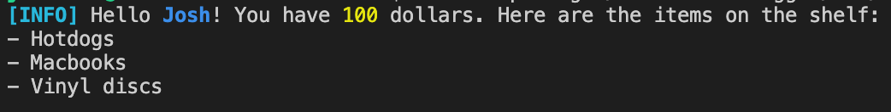

# `@docusaurus/logger`

An encapsulated logger for semantically formatting console messages.

## APIs

It exports a single object as default export: `logger`. `logger` has the following properties:

- Some useful colors.
- Formatters. These functions have the same signature as the formatters of `picocolors`. Note that their implementations are not guaranteed. You should only care about their semantics.
  - `path`: formats a file path or URL.
  - `id`: formats an identifier.
  - `code`: formats a code snippet.
  - `subdue`: subdues the text.
  - `num`: formats a number.
- The `interpolate` function. It is a template literal tag.
- Logging functions. All logging functions can both be used as functions (in which it has the same usage as `console.log`) or template literal tags.
  - `info`: prints information.
  - `warn`: prints a warning that should be payed attention to.
  - `error`: prints an error (not necessarily halting the program) that signals significant problems.
  - `success`: prints a success message.

### Using the template literal tag

The template literal tag evaluates the template and expressions embedded. `interpolate` returns a new string, while other logging functions prints it. Below is a typical usage:

```js
logger.info`Hello name=${name}! You have number=${money} dollars. Here are the ${
  items.length > 1 ? 'items' : 'item'
} on the shelf: ${items}
To buy anything, enter code=${'buy x'} where code=${'x'} is the item's name; to quit, press code=${'Ctrl + C'}.`;
```

An embedded expression is optionally preceded by a flag in the form `%[a-z]+` (a percentage sign followed by a few lowercase letters). If it's not preceded by any flag, it's printed out as-is. Otherwise, it's formatted with one of the formatters:

- `path=`: `path`
- `name=`: `id`
- `code=`: `code`
- `subdue=`: `subdue`
- `number=`: `num`

If the expression is an array, it's formatted by `` `\n- ${array.join('\n- ')}\n` `` (note it automatically gets a leading line end). Each member is formatted by itself and the bullet is not formatted. So you would see the above message printed as:


