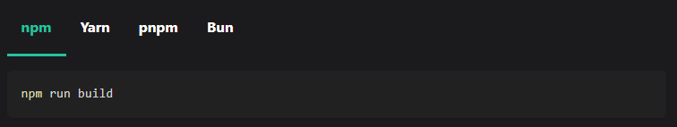

# Remark plugin npm2yarn

## Motivation:

Transforms npm bash command code blocks to Docusaurus tabs:

The following (remove the `//`):

````bash
// ```bash npm2yarn
// npm run build
// ```
````

Becomes:



**Note**: it only works when used with Docusaurus themes that have the `Tabs` and `TabItems` components.

## Install

```bash
npm install @docusaurus/remark-plugin-npm2yarn
```

It is a Remark plugin, **not a Docusaurus plugin**, so you have to install it as a Remark plugin in the config of your Docusaurus plugins.

```js
module.exports = {
  presets: [
    [
      '@docusaurus/preset-classic',
      {
        docs: {
          // ...
          remarkPlugins: [require('@docusaurus/remark-plugin-npm2yarn')],
        },
        blog: {
          // ...
          remarkPlugins: [require('@docusaurus/remark-plugin-npm2yarn')],
        },
        pages: {
          // ...
          remarkPlugins: [require('@docusaurus/remark-plugin-npm2yarn')],
        },
        // ...
      },
    ],
  ],
  // ...
};
```
