# Diagram Examples

## Invalid Diagrams

Those errors should not crash the whole page

### Invalid type

```mermaid
badType
    participant Alice
    participant Bob
```

### Invalid content

```mermaid
sequenceDiagram
    badInstruction Alice
    participant Bob
```

## Sequence Diagram

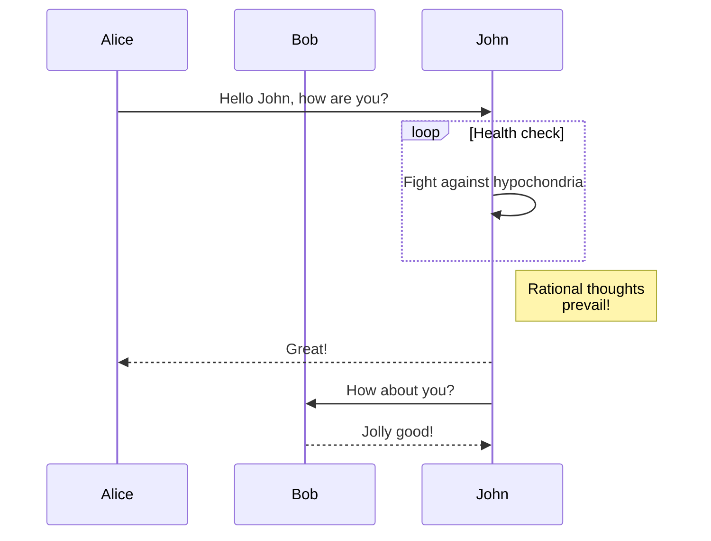

## Sequence Diagram (forest theme directive)

It is possible to override default config locally with Mermaid text directives such as:

```
%%{init: { "theme": "forest" } }%%
```

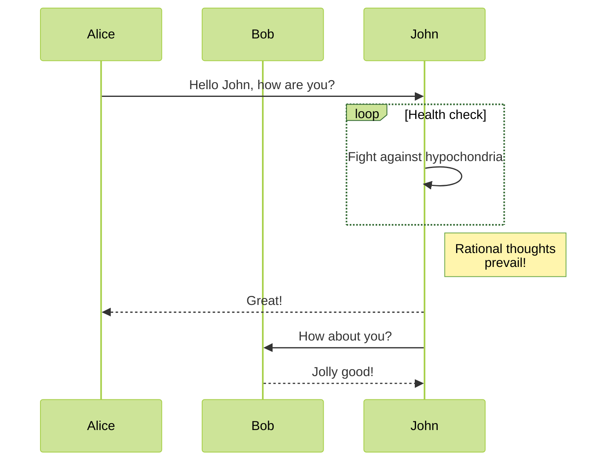

## Gantt Chart

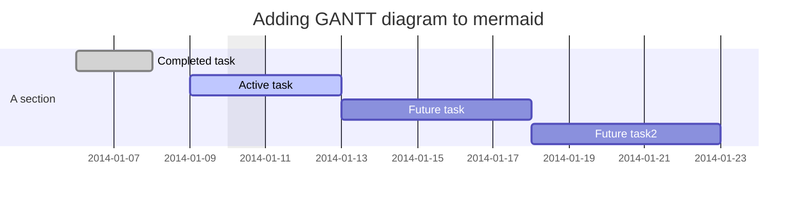

## Flow Chart

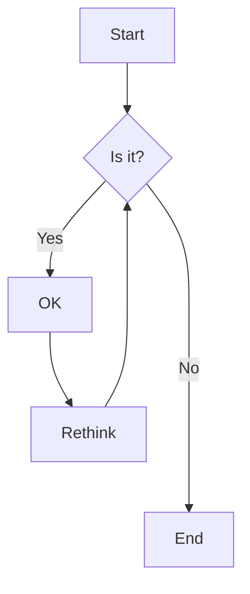

### With Markdown:

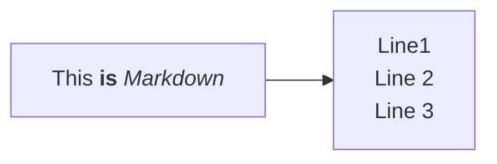

## Class Diagram

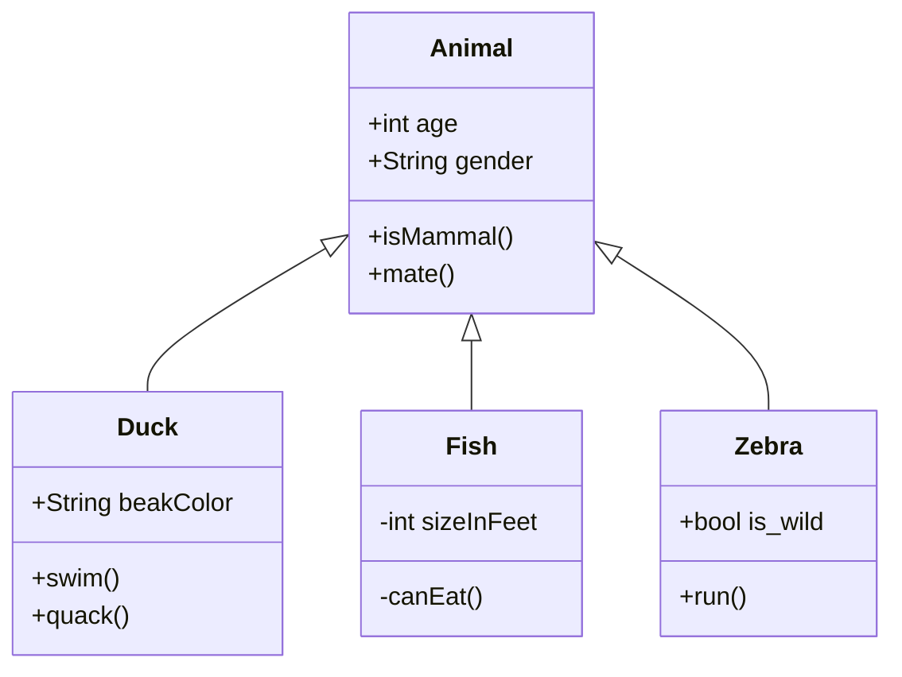

## State Diagram

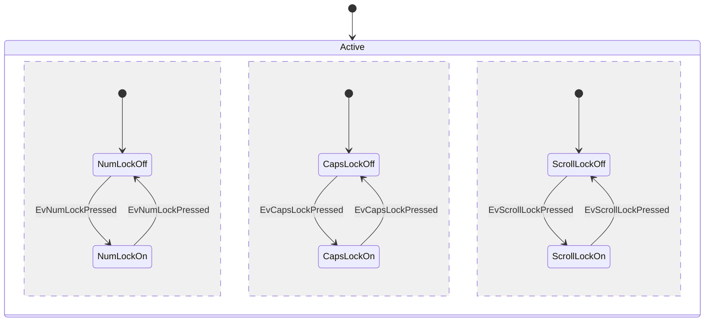

## Entity Relationship Diagram

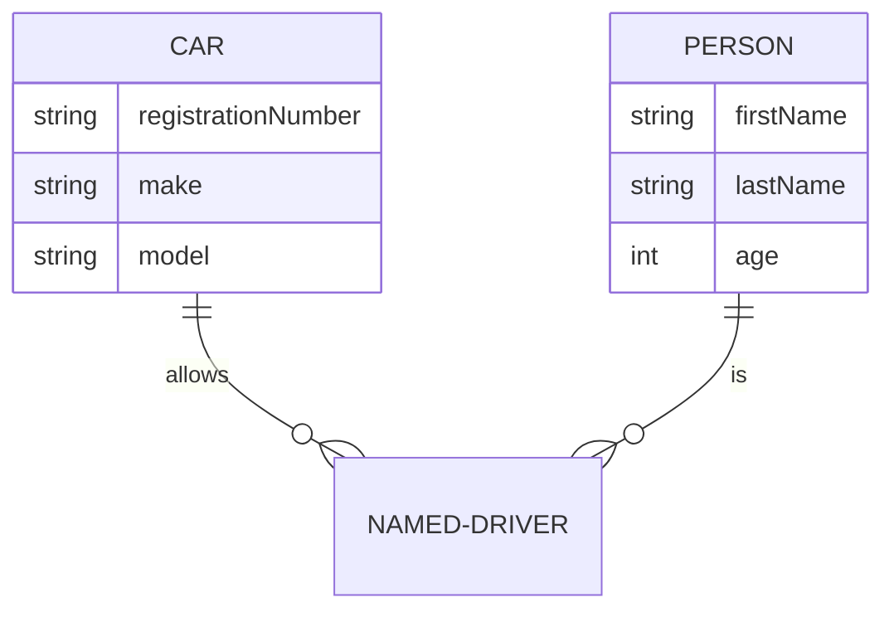

## User Journey

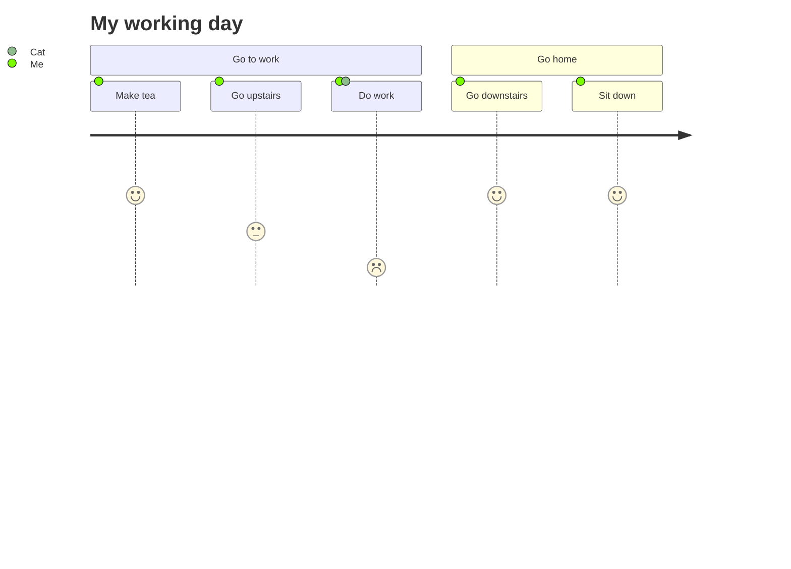

:::note

If there's too much space above it's due to a [Mermaid bug](https://github.com/mermaid-js/mermaid/issues/3501)

:::

## Pie Chart

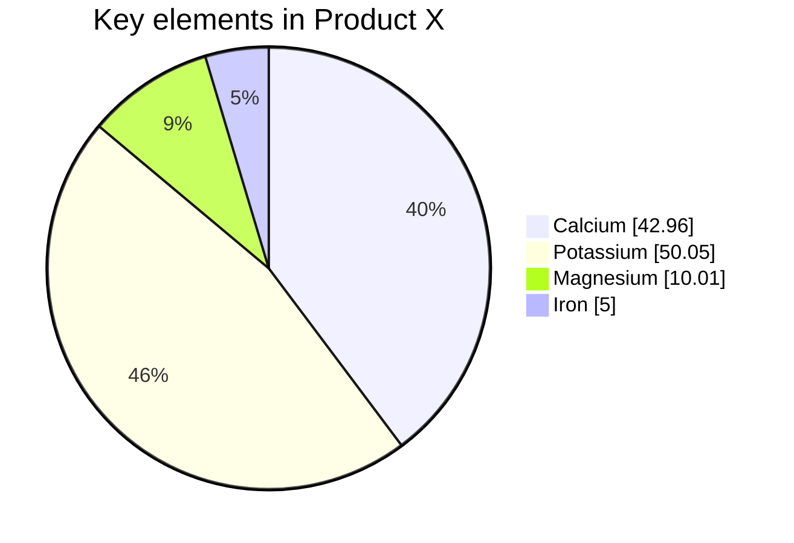

## Requirement Diagram

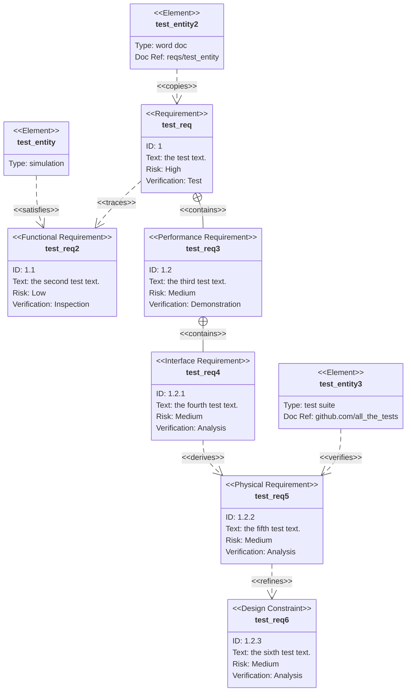

## Gitgraph (Git) Diagram

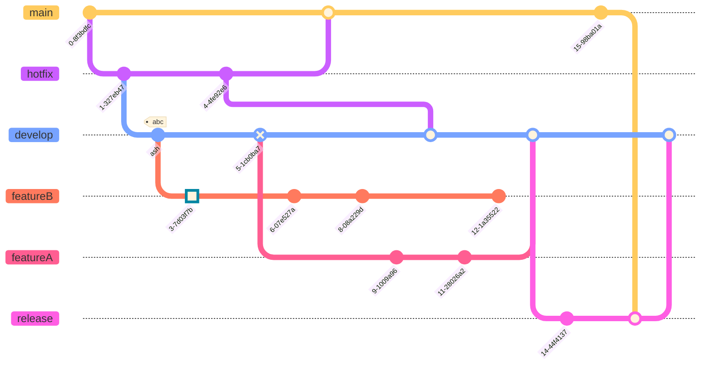

## Mermaid in tabs

````mdx-code-block
import Tabs from '@theme/Tabs';
import TabItem from '@theme/TabItem';

<Tabs>
<TabItem value="tab-a">

The following mermaid diagram is shown:

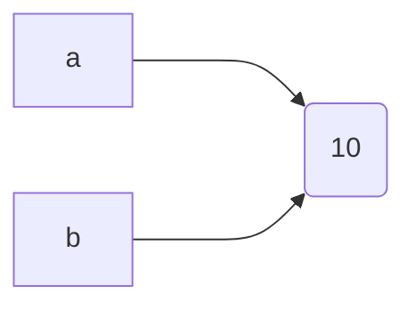

</TabItem>

<TabItem value="tab-b">

This mermaid diagram is not displayed:

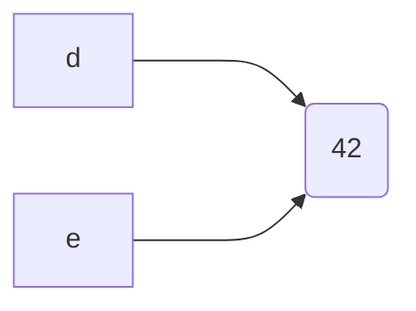

</TabItem>
</Tabs>
````

## Mindmap

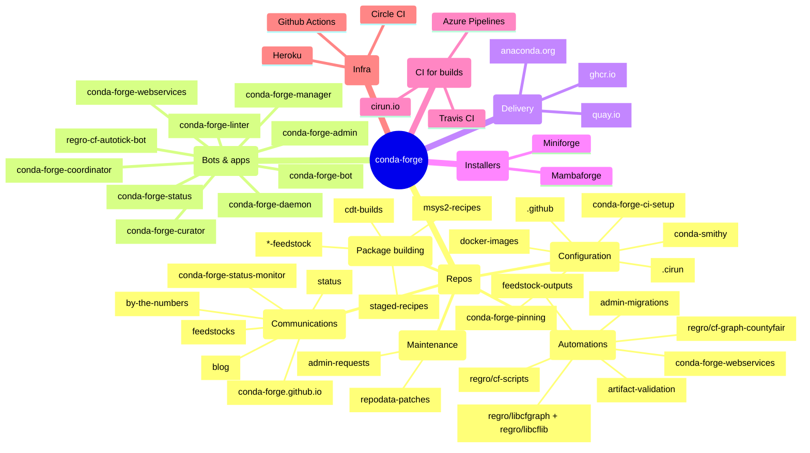

## Quadrant Chart

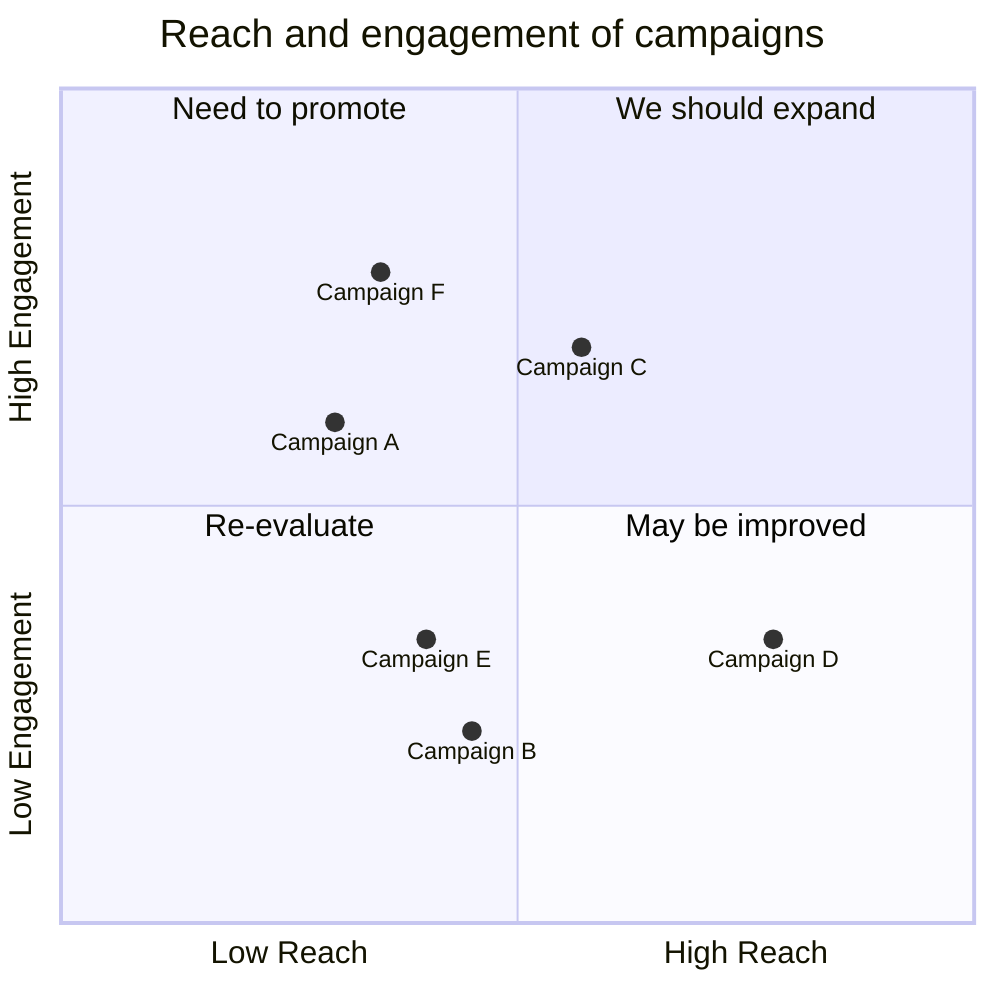

## Architecture Diagram

- See https://mermaid.js.org/syntax/architecture
- See https://github.com/facebook/docusaurus/discussions/10508

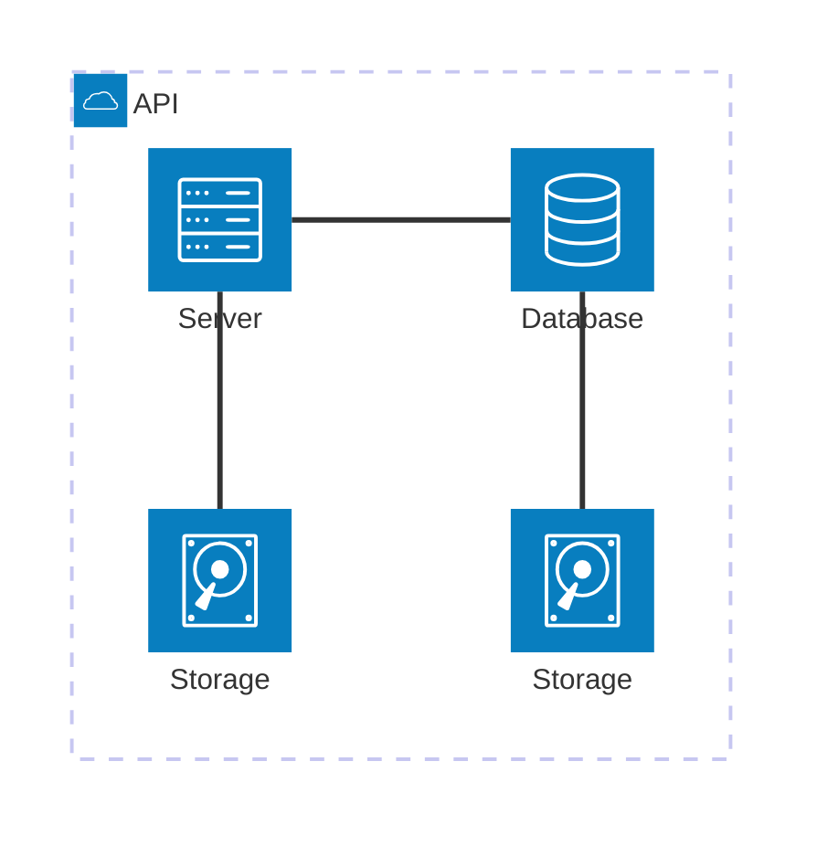

## ELK Styling

Mermaid provides an [ELK layout](https://mermaid.js.org/syntax/entityRelationshipDiagram.html#layout)

### Dagre

This is a "classical" Mermaid diagram, using the default Dagre layout.

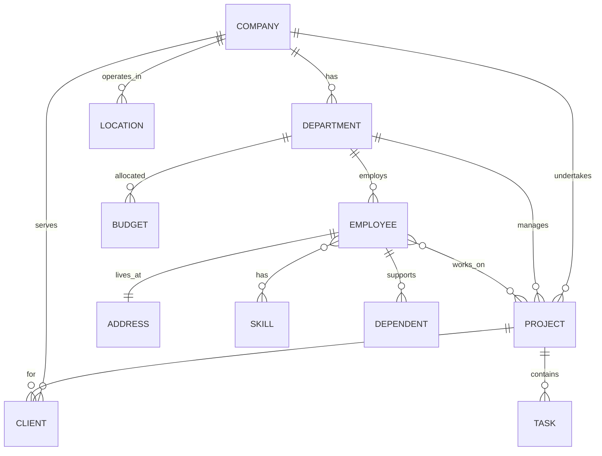

### ELK er diagram layout

This ER diagram should look different, using the ELK layout.

```mermaid
---
config:
  layout: elk
---
erDiagram

  COMPANY ||--o{ DEPARTMENT : has
  COMPANY ||--o{ PROJECT : undertakes
  COMPANY ||--o{ LOCATION : operates_in
  COMPANY ||--o{ CLIENT : serves

  DEPARTMENT ||--o{ EMPLOYEE : employs
  DEPARTMENT ||--o{ PROJECT : manages
  DEPARTMENT ||--o{ BUDGET : allocated

  EMPLOYEE }o--o{ PROJECT : works_on
  EMPLOYEE ||--|| ADDRESS : lives_at
  EMPLOYEE }o--o{ SKILL : has
  EMPLOYEE ||--o{ DEPENDENT : supports

  PROJECT ||--o{ CLIENT : for
  PROJECT ||--o{ TASK : contains

```

Mermaid also provides a way of setting config parameters using a directive `%%{init:{"layout":"elk"}}%%`

```mermaid
%%{init:{"layout":"elk"}}%%
erDiagram

  COMPANY ||--o{ DEPARTMENT : has
  COMPANY ||--o{ PROJECT : undertakes
  COMPANY ||--o{ LOCATION : operates_in
  COMPANY ||--o{ CLIENT : serves

  DEPARTMENT ||--o{ EMPLOYEE : employs
  DEPARTMENT ||--o{ PROJECT : manages
  DEPARTMENT ||--o{ BUDGET : allocated

  EMPLOYEE }o--o{ PROJECT : works_on
  EMPLOYEE ||--|| ADDRESS : lives_at
  EMPLOYEE }o--o{ SKILL : has
  EMPLOYEE ||--o{ DEPENDENT : supports

  PROJECT ||--o{ CLIENT : for
  PROJECT ||--o{ TASK : contains

```
