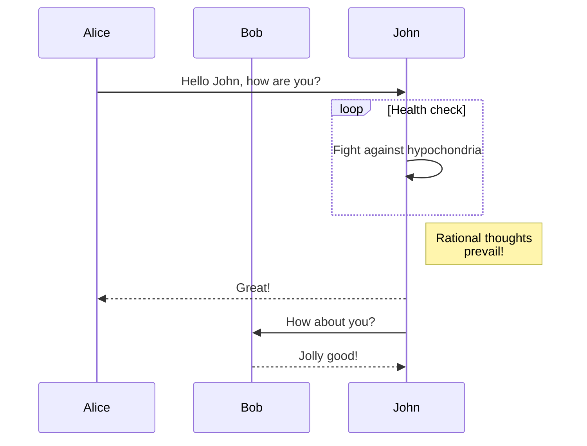

# Markdown .md tests

This file should be interpreted in a more CommonMark compliant way

## SEO

```md
<head>
  <title>HEAD Markdown Page tests title</title>
  <meta name="keywords" content="cooking, blog"/>
</head>
```

<head>
  <title>HEAD Markdown Page tests title</title>
  <meta name="keywords" content="cooking, blog"/>
</head>

:::danger

TODO unsupported (yet), see [issue](https://github.com/facebook/docusaurus/issues/9092)

:::

## Comment

Html comment: <!-- comment -->

Html comment multi-line:

<!--
comment
-->

<!-- prettier-ignore -->
MDX comment: {/* comment */}

MDX comment multi-line:

<!-- prettier-ignore -->
{/*
comment 
*/}

## JSX syntax

import BrowserWindow from '@site/src/components/BrowserWindow';

<BrowserWindow>

BrowserWindow content

</BrowserWindow>

export const answer = 42;

Test {xyz}

## Admonition

Admonitions still work

:::note[title]

note

:::

## Details

<details>
  <summary>MD Summary</summary>

Our custom Details/Summary also works in CommonMark mode

</details>

## Tab

<tabs>
  <tabItem value="apple" label="Apple" default>
    This is an apple 🍎
  </tabItem>
  <tabItem value="orange" label="Orange">
    This is an orange 🍊
  </tabItem>
  <tabItem value="banana" label="Banana">
    This is a banana 🍌
  </tabItem>
</tabs>

:::danger

TODO unsupported (yet), see [issue](https://github.com/facebook/docusaurus/issues/9092)

:::

## Code block test

```js title="Title"
function Clock(props) {
  const [date, setDate] = useState(new Date());
  useEffect(() => {
    var timerID = setInterval(() => tick(), 1000);

    return function cleanup() {
      clearInterval(timerID);
    };
  });

  function tick() {
    setDate(new Date());
  }

  return (
    <div>
      <h2>It is {date.toLocaleTimeString()}.</h2>
      // highlight-start
      {/* prettier-ignore */}
      long long long long long long long long long long long long line
      {/* prettier-ignore */}
      // highlight-end
    </div>
  );
}
```

```jsx live
function Clock(props) {
  const [date, setDate] = useState(new Date());
  useEffect(() => {
    var timerID = setInterval(() => tick(), 1000);

    return function cleanup() {
      clearInterval(timerID);
    };
  });

  function tick() {
    setDate(new Date());
  }

  return (
    <div>
      <h2>It is {date.toLocaleTimeString()}.</h2>
    </div>
  );
}
```

:::danger

TODO unsupported (yet), see [issue](https://github.com/facebook/docusaurus/issues/9092)

:::

## Mermaid



## Heading Id {#custom-heading-id}

Custom heading syntax `{#custom-heading-id}` still works

---

## HTML

### Styling

<span style="color: blue;">blue span</span>

<p style="color: green;">green p</p>

<button style="color: red;">red button</button>

<div style="border: solid; background-color: grey; color: lime; padding: 10px">
  lime <span style="color: red; margin: 10px;">red</span>
</div>

<br/>

### Embeds

#### Closed image tag:


<br/>

#### Unclosed image tag:


<br/>

### Iframe

<iframe src="/" style="width: 100%; height: 300px; border: solid red thick;"></iframe>

<br/>

### Security

```md
<p>
  When pressing this button, no alert should be printed
  <button onClick="alert('unsafe');">Click me</button>
</p>
```

<p>
  When pressing this button, no alert should be printed
  <button onClick="alert('unsafe');">Click me</button>
</p>
