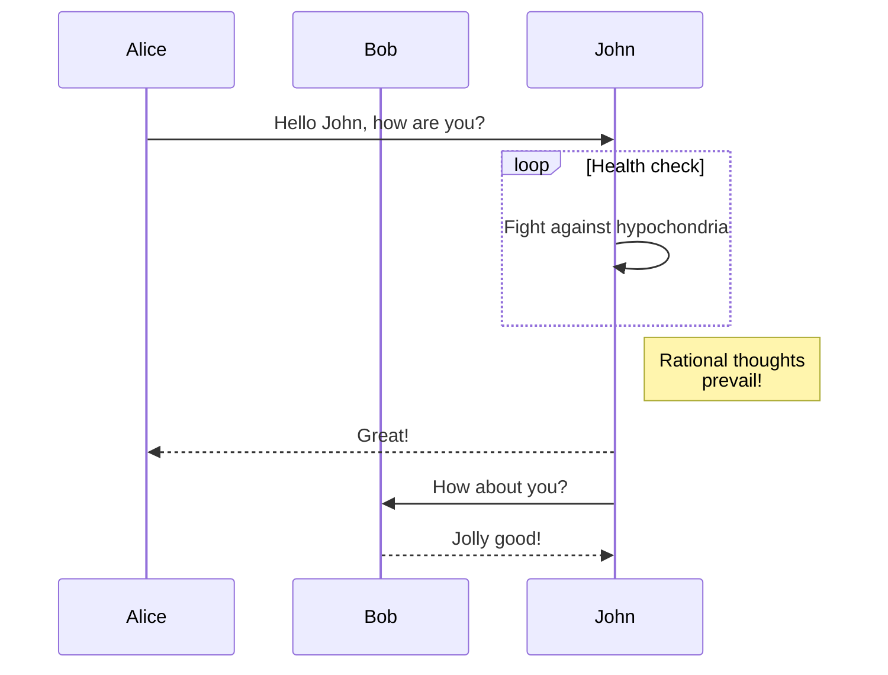

<button onClick={() => alert('unsafe :s')}>Should not alert</button>

# Markdown .mdx tests

This is a page generated from Markdown to illustrate the Markdown page feature and test some edge cases.

:::info

Useful information.

:::

```jsx live
function Button() {
  return (
    <button type="button" onClick={() => alert('hey')}>
      Click me!
    </button>
  );
}
```

### Using absolute path


### Tab

import Tabs from '@theme/Tabs';

import TabItem from '@theme/TabItem';

<Tabs>
  <TabItem value="apple" label="Apple" default>
    This is an apple 🍎
  </TabItem>
  <TabItem value="orange" label="Orange">
    This is an orange 🍊
  </TabItem>
  <TabItem value="banana" label="Banana">
    This is a banana 🍌
  </TabItem>
</Tabs>

## Comments

Html comment: <!-- comment -->

Html comment multi-line:

<!--
comment
-->

<!-- prettier-ignore -->
MDX comment: {/* comment */}

MDX comment multi-line:

<!-- prettier-ignore -->
{/*
comment
*/}

## Import code block from source code file

import MyComponent from '@site/src/pages/examples/_myComponent';

import BrowserWindow from '@site/src/components/BrowserWindow';

Let's say you have a React component.

You can import and use it in MDX:

```jsx title="myMarkdownFile.mdx"
import MyComponent from './myComponent';

<MyComponent />;
```

<BrowserWindow>

<MyComponent />

</BrowserWindow>

But you can also display its source code directly in MDX, thanks to [Webpack raw-loader](https://webpack.js.org/loaders/raw-loader/)

```jsx title="myMarkdownFile.mdx"
import CodeBlock from '@theme/CodeBlock';

import MyComponentSource from '!!raw-loader!./myComponent';

<CodeBlock className="language-jsx">{MyComponentSource}</CodeBlock>;
```

import CodeBlock from '@theme/CodeBlock';

import MyComponentSource from '!!raw-loader!@site/src/pages/examples/_myComponent';

<BrowserWindow>

<CodeBlock className="language-jsx">{MyComponentSource}</CodeBlock>

</BrowserWindow>

## Test

```jsx live
function Demo() {
  useEffect(() => console.log('mount'), []);
  return null;
}
```

## Code block test

```js title="Title"
function Clock(props) {
  const [date, setDate] = useState(new Date());
  useEffect(() => {
    var timerID = setInterval(() => tick(), 1000);

    return function cleanup() {
      clearInterval(timerID);
    };
  });

  function tick() {
    setDate(new Date());
  }

  return (
    <div>
      <h2>It is {date.toLocaleTimeString()}.</h2>
      // highlight-start
      {/* prettier-ignore */}
      long long long long long long long long long long long long line
      {/* prettier-ignore */}
      // highlight-end
    </div>
  );
}
```

```jsx live
function Clock(props) {
  const [date, setDate] = useState(new Date());
  useEffect(() => {
    var timerID = setInterval(() => tick(), 1000);

    return function cleanup() {
      clearInterval(timerID);
    };
  });

  function tick() {
    setDate(new Date());
  }

  return (
    <div>
      <h2>It is {date.toLocaleTimeString()}.</h2>
    </div>
  );
}
```

## Mermaid



## Custom heading ID {#custom}

### Weird heading {#你好}

### Weird heading {#2022.1.1}

### Weird heading {#a#b}

### Weird heading {#a b}

### Weird heading {#a\{b}

## Pipe

Code tag + double pipe: <code>&#124;&#124;</code>

Code tag + double pipe: <code>||</code>

## Images


## Details

<details>

Details without a summary

</details>

import Details from '@theme/Details';

<Details summary={'My Headline'}>Some Text</Details>
<Details>Some Text</Details>

This is a fragment:

<>Hello</>

It should work :)

## Task list

A list:

- [ ] Simple
- [x] Tasks
- [ ] Has simple
- [ ] Styles

Another list:

- Nested
  - [ ] Tasks
  - [ ] Should be well-formatted
- [ ] No matter
- [ ] How weird

Can be arbitrarily nested:

- Level
  - [ ] Task
  - [ ] Task
  - Another level
    - [ ] Task
    - [ ] Task
    - Deeper
      - [ ] Task
      - [ ] Task
    - [ ] Task
    - [ ] Task
- [ ] Task

## Emojis

Emojis in this text will be replaced with [remark-emoji](https://www.npmjs.com/package/remark-emoji): :dog: :+1:

## Admonitions

:::warning Interpolated `title` with a <button style={{color: "red"}} onClick={() => alert("it works")}>button</button> (old syntax)

Admonition body

:::

:::warning[Interpolated `title` with a <button style={{color: "red"}} onClick={() => alert("it works")}>button</button> (directive label syntax)]

Admonition body

:::

:::important

Admonition alias `:::important` should have Important title

:::

:::::note title

Some **content** with _Markdown_ `syntax`.

::::note nested Title

:::tip very nested Title

Some **content** with _Markdown_ `syntax`.

:::

Some **content** with _Markdown_ `syntax`.

::::

hey

:::::

::::tip[Use tabs in admonitions]

:::info[Admonition nested]

test

:::

<Tabs>
  <TabItem value="apple" label="Apple">

:::note[Admonition in tab]

test

:::

  </TabItem>
  <TabItem value="orange" label="Orange">This is an orange 🍊</TabItem>
  <TabItem value="banana" label="Banana">This is a banana 🍌</TabItem>
</Tabs>

::::

```mdx-code-block
import Admonition from '@theme/Admonition';

export function AdmonitionWithoutHeading(props) {
  return (
    <Admonition {...props} type="info" icon={null} title={null}>
      Admonition content without heading
    </Admonition>
  );
}
```

<AdmonitionWithoutHeading />

## Linking

This is a test page to see if Docusaurus Markdown features are working properly

### Linking to assets

See [#3337](https://github.com/facebook/docusaurus/issues/3337)

- [/someFile.pdf](/someFile.pdf)
- [/someFile.xyz](/someFile.xyz)
- [/image with space.png](</image with spaces.png>)
- [@site/\_dogfooding/\_asset-tests/someFile.pdf](@site/_dogfooding/_asset-tests/someFile.pdf)
- [@site/\_dogfooding/\_asset-tests/someFile.xyz](@site/_dogfooding/_asset-tests/someFile.xyz)
- [@site/\_dogfooding/\_asset-tests/image with space.png](<@site/_dogfooding/_asset-tests/image with spaces.png>)

### Linking to non-SPA page hosted within website

See [#3309](https://github.com/facebook/docusaurus/issues/3309)

- [pathname:///dogfooding/javadoc](pathname:///dogfooding/javadoc)
- [pathname:///dogfooding/javadoc/index.html](pathname:///dogfooding/javadoc/index.html)
- [pathname://../dogfooding/javadoc](pathname://../dogfooding/javadoc)
- [pathname://../dogfooding/javadoc/index.html](pathname://../dogfooding/javadoc/index.html)

### Linking to non-SPA paths with custom schemes

- [customScheme://whatever](customScheme://whatever)
- [custom-scheme://whatever](custom-scheme://whatever)
- [custom-sch.eme+-.://whatever](custom-sch.eme+-.://whatever)

### Linking to non-SPA page with Link component

See [#9758](https://github.com/facebook/docusaurus/issues/9758), these external urls should not be reported by the broken links checker:

```mdx-code-block
import Link from '@docusaurus/Link';

export function TestLink({noCheck, ...props}) {
  return (
    <Link {...props} data-noBrokenLinkCheck={noCheck}>
      {(noCheck ? '❌' : '✅') +
        ' ' +
        (props.to ?? props.href) +
        (props.target ? ` (target=${props.target})` : '')}
    </Link>
  );
}
```

- <TestLink to="pathname:///dogfooding/javadoc#goodlink1" />
- <TestLink href="pathname:///dogfooding/javadoc#goodlink2" />
- <TestLink to="/dogfooding/javadoc#goodlink3" target="_blank" />
- <TestLink href="/dogfooding/javadoc#goodlink4" target="_blank" />

These links are broken (try to single click on them) and should be reported. We need to explicitly disable the broken link checker for them:

- <TestLink to="/dogfooding/javadoc#badlink1" noCheck />
- <TestLink href="/dogfooding/javadoc#badlink2" noCheck />
- <TestLink to="/dogfooding/javadoc#badlink3" target="_self" noCheck />
- <TestLink href="/dogfooding/javadoc#badlink4" target="_self" noCheck />

### Linking to JSON

- [./script.js](./_script.js)

- [./data.json](./data.json)
