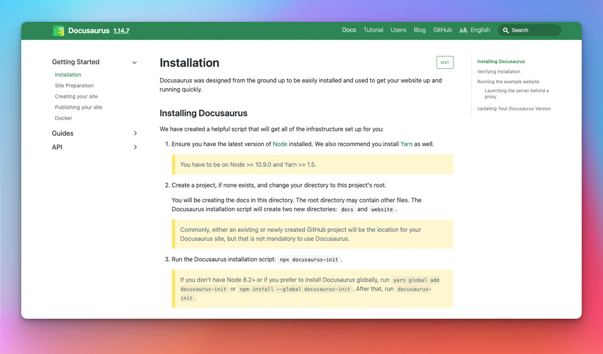

Today we are extremely happy to finally **announce Docusaurus 2.0**!

After **4 years of work, [75 alphas](https://github.com/facebook/docusaurus/releases/tag/v2.0.0-alpha.75) and [22 betas](https://github.com/facebook/docusaurus/releases/tag/v2.0.0-beta.22)**, the next generation of Docusaurus is **ready for prime-time**.

We now plan to **respect [Semantic Versioning](https://semver.org/)**: expect more **frequent major versions** in the future.

At [**Meta Open Source**](https://opensource.fb.com/), we believe Docusaurus will help you build the **best documentation websites** with a **minimal time and effort**, letting you focus on **what really matters: writing the content**.

<!--truncate-->

## What is Docusaurus exactly?

Docusaurus helps you ship **beautiful documentation websites** in **no time**.

Focus on your content: just write **Markdown files**. Docusaurus will generate an **optimized static website** for you, easy to **host anywhere**.

Docusaurus is **full-featured** and very flexible: docs, blog, landing pages, versioning, search, i18n, a11y, theming, plugin system... You can easily **adapt its theme to match your brand** so that it integrates nicely with your main website or documentation portal. Its usage of **React** enables a **modern client-side navigation**, and the ability build an **interactive documentation**.

The Docusaurus philosophy is akin to **Pareto's law**: you can get **80% of the results** for **20% of the effort**. This enables you to compete with top-notch documentations with **minimal effort**.

TODO better quote design

> Unless you're spinning up a documentation team with engineering resources, you probably want Docusaurus!
>
> [Rachel Nabors](https://twitter.com/rachelnabors/status/1452697991039660038)

Technically, Docusaurus is a flexible **static-site generator**. Think of it as a **simpler, opinionated alternative to [Gatsby](https://www.gatsbyjs.com/)**, GraphQL layer removed. We market it as a **documentation tool**, but you can use it for **other use-cases** as well: a blog, a knowledge base, a developer portfolio, a second brain, landing pages...

:::tip

Try Docusaurus now with our [online playgrounds](docs/playground) and [5 minutes tutorial](https://tutorial.docusaurus.io/) ⏱️

:::

## The story behind Docusaurus

Docusaurus was **created at Facebook Open Source in 2016** (now [Meta Open Source](https://opensource.fb.com/)). We had a lot of internal and open-source projects to document. It's **complicated enough to write good documentation**, let alone creating the HTML, CSS and JavaScript for a good-looking website. We wanted project leaders to be able to **focus on the content**, and **Markdown** is great for that.

At that time, our solution was to **copy/paste a Jekyll template** over and over again. This naturally became **hard to maintain**, so we created a tool to **solve our own pain** once for all.

**Docusaurus was born.**

## Who is using Docusaurus?

[Docusaurus v1](http://v1.docusaurus.io/) built momentum at Facebook and in the frontend ecosystem, adopted by many popular projects: [React-Native](https://archive.reactnative.dev/), [Jest](https://archive.jestjs.io/), [Prettier](https://prettier.io/), [Babel](https://babeljs.io/)...

TODO better table + self-hosted images:

<table>
  <tr>
    <td>

</td>
    <td>

</td>
  </tr>
</table>

The work on Docusaurus v2 started in 2018, and the community has been quick to adopt it. It didn't take long for Docusaurus v2 to outgrow Docusaurus v1, despite being in beta.

TODO fix screenshot legend

TODO star history screenshot

TODO best of js screenshot

TODO mention top fb open-source project

Today, Docusaurus v2 is a great success even before its launch:

- We received so many [lovely testimonials](https://twitter.com/sebastienlorber/timelines/1392048416872706049)
- Companies like [1Password](https://blog.1password.com/docusaurus-documentation-framework/) and [Courier](https://www.courier.com/blog/how-we-built-our-documentation/) are writing down their positive experience
- Our [site showcase](/showcase) references hundreds of Docusaurus v2 websites (check our [favorites](/showcase?tags=favorite)).

This is only the tip of the iceberg, and Docusaurus is widely used in so many companies: Microsoft, IBM, SAP, Figma, Snapchat...

TODO present a more exhaustive list of sites by vertical? + some screenshots?

:::tip

Please add your site to our showcase!

:::

## Differences between v1 and v2

[**Docusaurus v1**](http://v1.docusaurus.io/) has been successful, but we **questioned some of our initial architectural choices**:

- React was only used as a **server-side templating language**, and not even used on the client
- The **theming system was pretty limited**, and apart from changing a few colors with CSS, it was difficult to do more advanced customizations
- The **docs versioning system was confusing**, based on a diff algorithm
- The **codebase was monolithic**, not really scalable nor easy to extend

[**Docusaurus v2**](https://docusaurus.io/) was **rebuilt** from the ground up with a **new modular architecture**:

- React is used on the server-side (SSR) and client-side (CSR / hydration), enabling a modern **Single-Page-Application navigation**
- The theming system is more flexible than ever: you can **swap default React components** with your own implementations, or create your own theme from scratch
- The docs versioning is now based on snapshot copies, much easier to understand
- The **plugin system** lets the community contribute useful features as third-party packages
- We kept **everything good from v1** and implemented several new useful features

See also [how to migrate from v1 to v2](https://docusaurus.io/docs/migration)

---

## What's New?

TODO major new v2 features not in v1 (autogenerated sidebars, plugins)

## Design decision

https://extensiblewebmanifesto.org/

low-level first

## Releases and semantic versioning

Why it took so long

major every 3 months

## What's Next?

- CSS-in-JS
- Tailwind theme
- MDX 2.0
- ESM
- CMS integrations
- Performance
- Decouple, Next.js?

## Thank You
