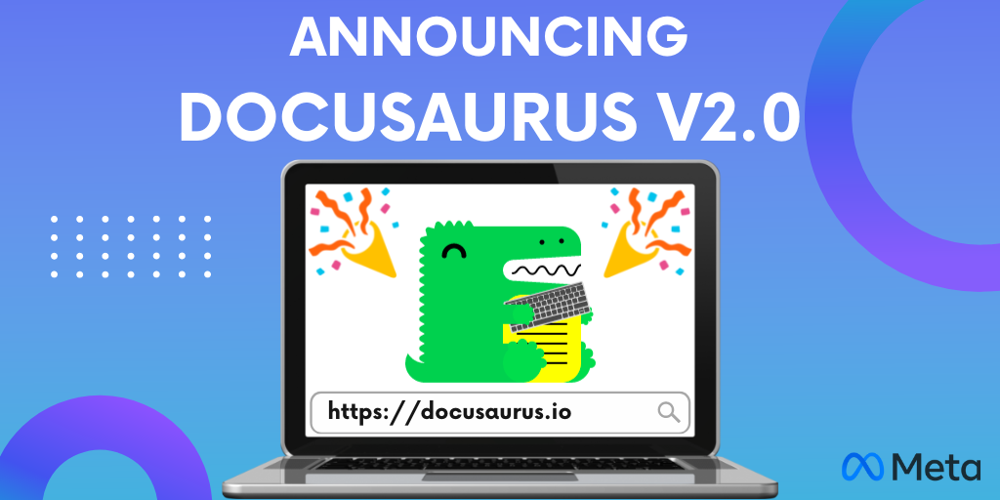
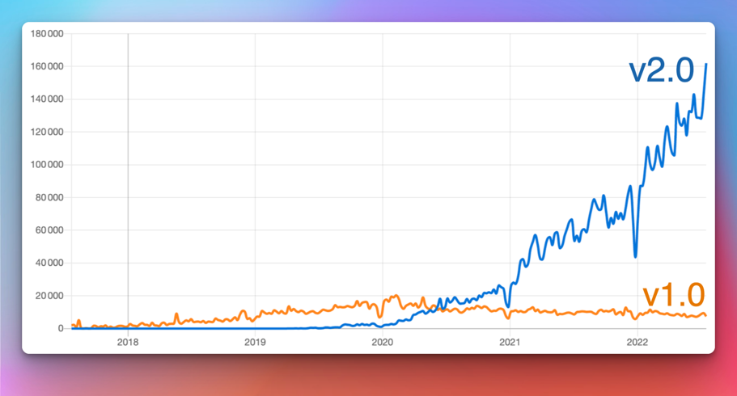
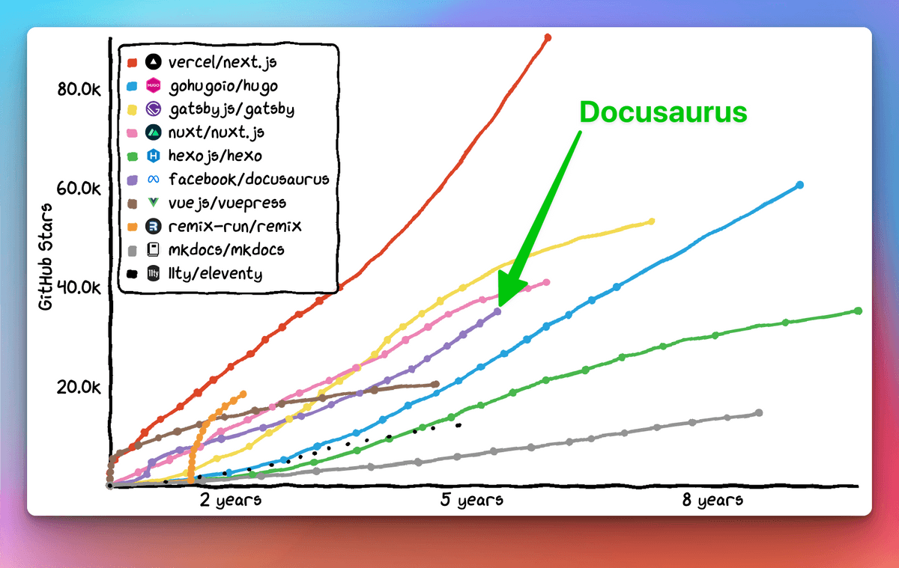

```mdx-code-block
import BrowserWindow from '@site/src/components/BrowserWindow';
import ProductHuntCard from '@site/src/components/ProductHuntCard';
import ColorModeToggle from '@theme/Navbar/ColorModeToggle';
import useBaseUrl from '@docusaurus/useBaseUrl';
import ThemedImage from '@theme/ThemedImage';
import {ShowcaseCarouselV1, ShowcaseCarouselV2} from './ShowcaseCarousel';
```

Today we are extremely happy to finally **announce Docusaurus 2.0**! 🥳️

At [**Meta Open Source**](https://opensource.fb.com/), we believe Docusaurus will help you build the **best documentation websites** with **minimal effort**, letting you **focus on what really matters**: writing the content.

After **4 years of work, [75 alphas](https://github.com/facebook/docusaurus/releases/tag/v2.0.0-alpha.75) and [22 betas](https://github.com/facebook/docusaurus/releases/tag/v2.0.0-beta.22)**, the next generation of Docusaurus is **ready for prime time**. From now on, we now plan to **respect [Semantic Versioning](https://semver.org/)** and will release **major versions more frequently**.

:::info We are on [ProductHunt](https://www.producthunt.com/) today!

**Now** is the best time to show some love for Docusaurus!

<ProductHuntCard />

:::



<!--truncate-->

## What is Docusaurus exactly?


Docusaurus is a **static site generator** that helps you ship **beautiful documentation websites** in **no time**.

Focus on your content: just write **Markdown files**. Docusaurus will generate an optimized **website** for you that's easy to **host anywhere**.

Docusaurus is **full-featured** and very **flexible**: we ship with well-designed docs and blog layout, as well as out-of-the-box versioning, search, and internationalization functionalities, with a call to accessibility and search engine optimizations. Its flexible theming system permits to **adapt the UI to match your branding** so that it integrates nicely with your main website or documentation portal. Its usage of **React** enables a **modern client-side navigation**, and the ability to build an **interactive documentation**.

The Docusaurus philosophy is akin to the **Pareto principle**: you can get **80% of the results** for **20% of the effort**. This enables you to compete with top-notch documentation sites with **minimal effort**.

<TweetQuote
  url="https://twitter.com/rachelnabors/status/1452697991039660038"
  handle="rachelnabors"
  name="Rachel Nabors"
  job="Former ReactJS & React-Native docs manager">
  Unless you're spinning up a documentation team with engineering resources, you
  probably want Docusaurus!
</TweetQuote>

Docusaurus aims to be the **best documentation tool**, but you can use it for **other use-cases** as well: a blog, a knowledge base, a developer portfolio, a second brain, or even to scaffold landing pages!

<TweetQuote
  url="https://twitter.com/johnny_reilly/status/1551861926334025728"
  handle="johnny_reilly"
  name="Johnny Reilly"
  job="Group Principal Engineer at Investec">
  Using Docusaurus for my tech blog has been a fantastic choice. It looks
  tremendous out-of-the-box and the awesome DX means I write way more
</TweetQuote>

:::tip

Try Docusaurus now with our [online playgrounds](docs/playground) and [5 minutes tutorial](https://tutorial.docusaurus.io/) ⏱️

:::

## The story behind Docusaurus

Docusaurus was created at **Facebook Open Source** in **2017** (now [Meta Open Source](https://opensource.fb.com/)). We had a lot of internal and open-source projects to document. It's **complicated enough to write good documentation**, let alone to create the HTML, CSS, and JavaScript for a good-looking website. We wanted project leaders to be able to **focus on the content**, and **Markdown** is great for that.

At that time, our solution was to **copy/paste a Jekyll template** over and over again. This naturally became **hard to maintain**, so we created a tool to **solve our own pain** once for all.

**[Docusaurus v1 was born](/blog/2017/12/14/introducing-docusaurus)!**


It quickly built momentum at Facebook and in the frontend ecosystem, adopted by many popular projects such as [Prettier](https://prettier.io/), [Babel](https://babeljs.io/), [React-Native](https://archive.reactnative.dev/), [KaTeX](https://katex.org/docs/), and of course [Docusaurus v1](http://v1.docusaurus.io/) itself.

<ShowcaseCarouselV1 />

<br />

:::note

Notice that the sample sites above use different colors, but still look quite the same.

:::

## Toward Docusaurus 2.0

[**Docusaurus v1**](http://v1.docusaurus.io/) has been very successful, but we started to **question some architectural choices**:

- React was only used as a **server-side templating language**, and not used on the client
- **Theming system was pretty limited**, and apart from changing a few colors with CSS, it was difficult to do more advanced customizations
- The **docs versioning system was confusing**, since it was based on a diff algorithm
- The codebase was **monolithic**, neither well-tested nor easy to extend

[**Docusaurus v2**](https://docusaurus.io/) was **rebuilt** from the ground up with a new **modular architecture**:

- React is now also used on the client, enabling a **modern Single Page Application navigation**
- **Plugins** empower the community to contribute useful features as third-party packages
- **Theming** is more **flexible** than ever
- Docs versioning is now based on snapshot copies, much easier to understand
- We kept **everything good from v1**: docs, blog, pages, versioning, i18n...
- We implemented **several new features**

More details in the [Docusaurus 2 project announcement](/blog/2018/09/11/Towards-Docusaurus-2) and [v1 to v2 migration guide](https://docusaurus.io/docs/migration)

## Who uses Docusaurus 2.0?

Despite being in pre-release, it didn't take long for **Docusaurus v2 to outgrow Docusaurus v1** in terms of NPM downloads:

[](https://npmtrends.com/docusaurus-vs-@docusaurus/core)

Our GitHub star trend is very positive, competing with major frameworks:

[](https://star-history.com/#facebook/docusaurus&vercel/next.js&gatsbyjs/gatsby&hexojs/hexo&nuxt/nuxt.js&vuejs/vuepress&11ty/eleventy&gohugoio/hugo&remix-run/remix&mkdocs/mkdocs&Timeline)

Today, Docusaurus v2 has already been a great success even before its launch:

- We received so many [lovely testimonials](https://twitter.com/sebastienlorber/timelines/1392048416872706049)
- Companies like [1Password](https://blog.1password.com/docusaurus-documentation-framework/) and [Courier](https://www.courier.com/blog/how-we-built-our-documentation/) are writing down their positive experience
- Our [site showcase](/showcase) references hundreds of Docusaurus v2 websites (check our [favorites](/showcase?tags=favorite)), and this is only the tip of the iceberg.

TODO present a more exhaustive list of sites by vertical? + some screenshots?

:::tip

Please add your site to our [showcase](/showcase)! It only takes a few seconds: just [post a comment here](https://github.com/facebook/docusaurus/discussions/7826).

:::

## What's New in 2.0?

It would be difficult to list every single new feature coming with Docusaurus v2.

Let's focus on the features we believe are the **most impactful**.

### MDX

[MDX](https://github.com/mdx-js/mdx) allows you to **interleave React components** in Markdown. This enables you to build top-notch **interactive documentation experiences** very easily.

A demo is worth a thousand words:

```md title="docs/my-document.mdx"
### Give it a try: press that button!

import ColorModeToggle from '@theme/ColorModeToggle';

<ColorModeToggle/>
```

```mdx-code-block
<BrowserWindow>

<h3>Give it a try: press that button!</h3>

<ColorModeToggle/>

</BrowserWindow>
```

:::info

MDX has its own [plugin system](https://mdxjs.com/docs/extending-mdx/). You to customize your Markdown authoring experience, and even create your own Markdown syntax.

:::

<TweetQuote
  url="https://twitter.com/HamelHusain/status/1551962275250053123"
  handle="HamelHusain"
  name="Hamel Husain"
  job="Head Of Data Science at Outerbounds">
  Docusaurus + MDX is great: we were able to implement a beautiful two-pane
  layout and give the author fine-grained control on the placement of code and
  corresponding prose.
</TweetQuote>

### File system conventions

Our goal is to make Docusaurus very **intuitive** to use. We added file system conventions, and adding a doc page is as easy as creating one Markdown file.


:::note

Markdown front matter and `_category_.json` allow you to customize the behavior, including sidebar items ordering, sidebar labels, and much more.

:::

<TweetQuote
  url="https://twitter.com/paularmstrong/status/1552005085168865281"
  handle="paularmstrong"
  name="Paul Armstrong"
  job="Principal Engineer at Microsoft">
  Using the auto-generated sidebars makes it so simple to just create a page and
  not worry about any other configuration.
</TweetQuote>

### Plugins

Docusaurus now has a **modular architecture** with a plugin system — our **core features** like docs, blog, pages, and search are all powered by individual plugins.

More importantly, it enables our community to **enhance Docusaurus** with additional features.

Let's highlight some examples:

- [Redocusaurus](https://github.com/rohit-gohri/redocusaurus) allows you to seamlessly integrate an OpenAPI Redoc documentation in Docusaurus:


- [MDX-Mermaid](https://github.com/sjwall/mdx-mermaid) allows you to display Mermaid diagrams in your documentation:


- [Docusaurus Plugin Image Zoom](https://github.com/flexanalytics/plugin-image-zoom) allows users to click documentation images to zoom them:


:::tip

We have a curated list of outstanding plugins in our [community resources](/community/resources) page.

:::

<TweetQuote
  url="https://twitter.com/jodyheavener/status/1551974535452311552"
  handle="jodyheavener"
  name="Jody Heavener"
  job="Senior Developer at 1Password">
  The plugin system in Docusaurus v2 has made expanding 1Password's developer
  portal so easy and fun. Super excited to show you what we've got cooking up.
</TweetQuote>

### Theming

Theming is one of the most important features of Docusaurus: we believe a professional documentation site should **respect to your company's branding** and create a consistent experience.

Docusaurus theming gives a lot of **flexibility** on multiple levels:

- Customize CSS variables to adjust colors, fonts, and more
- Provide your own CSS stylesheets
- Implement your own theme from scratch
- **Override any React component** provided by our default theme (we call this [Swizzling](https://docusaurus.io/docs/swizzling)).

This enables users willing to invest a bit more time on **customizations** to build sites that **look different** from others.

<TweetQuote
  url="https://twitter.com/hung_dev/status/1546918275065741312"
  handle="hung_dev"
  name="
Hung Viet Nguyen"
  job="Creator of JestPreview">
  I love Docusaurus Swizzling feature. It’s opinionated and flexible at the same
  time. This is super cool since a framework usually needs to sacrifice one for
  the other.
</TweetQuote>

<ShowcaseCarouselV2 />

<TweetQuote
  url="https://twitter.com/dabit3/status/1382855449813389315"
  handle="dabit3"
  name="Nader Dabit"
  job="Web3 developer, Developer DAO founder">
  So far it’s working out really nicely. It’s been really easy to style up the
  way that we wanted it to look. No blockers at all.
</TweetQuote>

### Other features

Docusaurus 2 comes with many other useful features:

- Theme: dark mode, better UI and UX, flexible `themeConfig` options...
- Docs versioning: flexible plugin options to adapt to your workflow
- Docs sidebar: collapsible category, category index pages...
- Blog: multiple authors, authors map, archive page...
- Markdown: tabs, math equations, live code blocks, linking, flexible front matter...
- Search: use the new Algolia DocSearch 3 experience
- Assets: make it easy to incorporate images and other kinds of files
- Internationalization: config options, default theme translations...
- Accessibility: aria labels, color contrasts, skip-to-content, keyboard navigation, progressive enhancement...
- SEO: sensible defaults, easy to customize, canonical url, social card, no-index, sitemap, microdata, hreflang...
- PWA: add offline support to your site, and make it installable
- Fail-fast: strict config validation, detect broken links, and prevent bad production deployments
- TypeScript support for config files, plugins, custom pages and theme authors
- Playgrounds: assess Docusaurus easily from your browser with [docusaurus.new](https://docusaurus.new)
- Canary releases: use the @canary npm tag to use the upcoming release before anyone else
- Tests: Docusaurus is well-tested, we dogfood features and ensure they keep working

<TweetQuote
  url="https://twitter.com/alexbdebrie/status/1540010328335032320"
  handle="alexbdebrie"
  name="Alex DeBrie"
  job="AWS Data Hero, author of The DynamoDB Book">
  Recently, I was shocked at how good Docusaurus is out of the box. Super solid,
  a good bit of configuration without being overwhelming, and the ability to
  really customize the styling if you're braver than I am.
</TweetQuote>

## Why 2.0 now?

Many enthusiastic followers of ours have been curious **why it took us 4 years to release Docusaurus 2.0**, considering the beta is already successful and **widely used in production**.

The reason is that we aim to **respect [Semantic Versioning](https://semver.org/)**, which means we will be incrementing the major version number whenever we release a **breaking change**.

It is important for multiple reasons:

- It **guarantees simple minor version upgrades**, as long as you only use the [public API](/community/release-process#public-api-surface)
- It follows front-end ecosystem conventions
- A new major version is an opportunity to thoroughly document breaking changes
- A new major/minor version is an opportunity to communicate new features through a blog post

The problem is that our flexible theming system inherently creates a very **implicit API surface** on which it is **hard to know what is a breaking change** in the first place. Highly customized Docusaurus sites sometimes have a hard time upgrading Docusaurus because they achieve customizations using internal APIs. We dedicated time to extensive theme refactors and clearly defining our [public API](/community/release-process#public-api-surface), so that future code changes can be made more safely. We will continue to expand this public theming API so that the most common site customizations do not need to use any internal API.

:::info

From now on, Docusaurus will **release new major versions more regularly**. In practice, you can expect a **new major version every 2–4 months**.

[Major version numbers are not sacred](https://tom.preston-werner.com/2022/05/23/major-version-numbers-are-not-sacred.html), but we still group breaking changes together and avoid releasing major versions too often.

Check our [release process](/community/release-process) documentation for details.

:::

## What's Next?


The work on Docusaurus 3.0 has started, and this next version will be released only in a few months. We will backport retro-compatible changes in Docusaurus `2.x` minor versions to make them available as soon as possible to the community on a stable channel.

A sample of the features on our roadmap for the upcoming major versions of Docusaurus:

- [Upgrade to MDX 2.0](https://github.com/facebook/docusaurus/issues/4029)
- [Improve Markdown infrastructure](https://github.com/facebook/docusaurus/issues/4625)
- [Improve theming and swizzle](https://github.com/facebook/docusaurus/issues/6114)
- [TailwindCSS theme](https://github.com/facebook/docusaurus/issues/2961)
- [Theme; support custom item types for navbar, doc sidebar, blog sidebar, footer](https://github.com/facebook/docusaurus/issues/7227)
- [Dynamic navbar: navbar item activation strategies](https://github.com/facebook/docusaurus/issues/4389)
- [Custom Social Cards](https://github.com/facebook/docusaurus/issues/2968)
- [CSS-in-JS support](https://github.com/facebook/docusaurus/issues/3236)
- [Use Node.js ES Modules](https://github.com/facebook/docusaurus/issues/6520)
- [Improve build time performance](https://github.com/facebook/docusaurus/issues/4765)
- [Extend Docusaurus plugins, CMS integration](https://github.com/facebook/docusaurus/issues/4138)

## Thank You

We'd like to express our gratitude to [all our contributors](https://github.com/facebook/docusaurus/graphs/contributors), including:

- The Docusaurus core team: [Alexey Pyltsyn](https://github.com/lex111), [Joshua Chen](https://github.com/Josh-Cena), [Sébastien Lorber](https://github.com/slorber), [Yangshun Tay](https://github.com/yangshun) and all our [former team members](https://docusaurus.io/community/team)
- [Joel Marcey](https://github.com/JoelMarcey) for creating Docusaurus 1.0 and supporting the Docusaurus 2.0 project at Meta Open source
- [Paul O’Shannessy](https://github.com/zpao) for supporting the development of all the next versions of Docusaurus at Meta Open source
- [Eric Nakagawa](https://github.com/ericnakagawa) for creating our cutest mascot Slash
- [Endilie Yacop Sucipto](https://github.com/endiliey) for his significant [initial work on Docusaurus v2](/blog/2020/01/07/tribute-to-endi)
- [Clément Vannicatte](https://github.com/shortcuts), [Kevin Granger](https://github.com/Shipow) and the whole Algolia team for their support
- All the community members for making valuable code contributions, improving our documentation, and answering questions on [Discord](https://discordapp.com/invite/docusaurus)

We'd like to thank in particular all our **Docusaurus 2.0 early adopters** for assessing its alpha, beta and canary releases, providing a ton of **invaluable feedback**. We sincerely hope you had a great experience using it, and that you will continue to provide feedback on the upcoming releases of Docusaurus 3.0.

At [Meta Open Source](https://opensource.fb.com/), Docusaurus is one of our **most successful projects**. We can't wait to see all the outstanding documentation websites that you will create! Don't forget to submit them to our [site showcase](/showcase).

**Now, let your imagination run wild 🤪!**

:::info We are on [ProductHunt](https://www.producthunt.com/) today!

🙏 Share your experience using Docusaurus right now!

<ProductHuntCard />

:::
