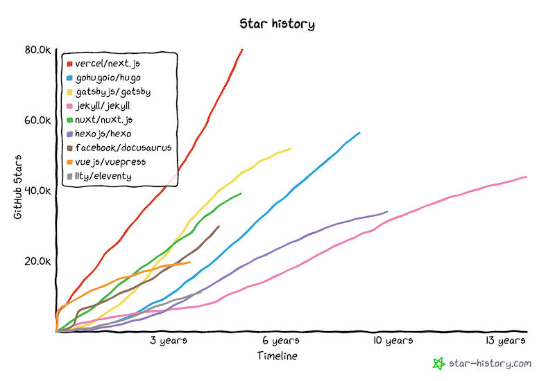

Docusaurus has made great progress in 2021! We've seen a lot of traction and just crossed **30k stars on GitHub**!

We've **reached full feature parity** with v1 after [the release of internationalization](/blog/2021/03-09-releasing-docusaurus-i18n.mdx), [announced our **first beta**](/blog/2021/05-12-announcing-docusaurus-two-beta/index.mdx), and welcomed **significantly more users** this year.

The **official v2 release** is just around the corner! Follow the [roadmap issue](https://github.com/facebook/docusaurus/issues/6113) for any latest news.

<!--truncate-->

## Highlights

Let's begin by going over a few highlights this year. Remember the [todo-list](/blog/2021/05-12-announcing-docusaurus-two-beta/index.mdx#whats-next) from half a year ago? Time to take it out again and see how far we've come!

- **Internationalization**: officially released four months after its initial landing in late 2020. Seen great success in [many projects](/showcase?tags=i18n)
- **Autogenerated sidebars**: no need to maintain a big `sidebars.js` anymore
- **Webpack 5**: significantly improved build performance
- **Trailing slash config**: seamless integration with any content hosting provider
- **Redesigned mobile navigation**: mobile users now enjoy all navigation features as on desktop
- **UI improvements**: more accessible quotes, better admonitions, back-to-top button...
- **Blog multi-authors**: credit all the amazing contributors that collaborated on one blog post!
- **More blog features**: archive page, structured data for SEO, full post content in feeds – empowering you to ship a fully-featured blog in no time
- **Asset collocation**: no need for a bloated static folder anymore: colocate your images with Markdown files
- **Sidebar category index pages**: category labels can now be associated with pages, enabling better doc organization

Our codebase has been polished over time as well. We have improved test coverage, migrated all packages to TypeScript, and reduced our published bundle size by a maximum of 60%!

## Trends

### npm

Docusaurus v2 continues to grow steadily. V2 installation is now 8 times more than v1. In terms of weekly downloads, we have witnessed another three-fold increase (+209.4%), growing from 28,066 in early January to a peak of 86,846 in mid-December.

(Ah, the classic Christmas dip...)

We released 18 versions, going from `2.0.0-alpha.71` to `2.0.0-beta.14`. That's one release every 20 days!

### GitHub

- **Stars**: 20,460 → 29,679 (+45.1% y/y). And, just before this blog post is published, we have reached 30k stars!
- **Total contributors**: 512 → 773 (+51.0% y/y)
- **Dependents**: 5,039 → 14,579 (+189.3% y/y) for v2, and 6,311 → 7,581 (+20.1% y/y) for v1
- **Commits**: 1,187 commits in the past year, averaging 23 commits every week
- **Issues**: 619 issues opened, 505 of them eventually resolved
- A [**new core team member**](https://github.com/Josh-Cena) (yep, that's me 😝)

Our star trend is also very positive. Compared to similar projects, we are **growing at a faster rate**:

With an 8.4k increase in stars, we are ranked number 3 in this year's [JavaScript rising stars of static site generators](https://risingstars.js.org/2021/en#section-ssg), preceded only by Next.js and Astro.

## Featured adoptions

Our showcase has welcomed a few new ["favorite" sites](/showcase?tags=favorite) that showcase the true potential of Docusaurus 2's pluggable architecture.

- [**IOTA-wiki**](https://wiki.iota.org/)

- [**Dyte**](https://docs.dyte.io/docs/home/introduction/)

- [**Ionic**](https://ionicframework.com/docs)

- [**Courier**](https://www.courier.com/docs/)

The creativity of Docusaurus users is beyond our imagination 🤩 We look forward to more and more adopters leveraging the content features of Docusaurus while exploring original theme designs! If your site uses Docusaurus, we would love to [have it in our showcase](https://github.com/facebook/docusaurus/edit/main/website/src/data/users.tsx).

## Community

As an active moderator on [Discord](https://discord.gg/docusaurus), I can clearly see the community thriving. Many frequently asked questions are now integrated into our documentation, and some feature requests have been implemented as well. The project and the community reciprocally benefit each other – case in point, I was formerly a community contributor before becoming a maintainer.

We are constantly mentioned on X with inspirational feedback:

> **@docusaurus** is amazing! cant believe it's THAT simple to use.

> No extra plugins, tooling or compilation steps. It just works out of the box.

> I love **@docusaurus**. I couldn't have built the APIs, tutorials, and blogs contained in my site efficiently and beautifully in my workflow without Docusaurus.

And we keep every one of them in [our little box](https://x.com/sebastienlorber/timelines/1392048416872706049) 😄 If you enjoy Docusaurus yourself, keep tagging us with your comments!

As we approach the official release, we are interested in knowing more about what people are doing out there: [plugin authors](https://github.com/facebook/docusaurus/discussions/4025), [creators of customized sites](https://github.com/facebook/docusaurus/discussions/5468), and [all new users](https://github.com/facebook/docusaurus/discussions/4610) – please keep us posted about your achievements so we can steer our development to better serve your needs.

## Going forward

In the past few months, we have been constantly speaking about the release-candidate phase of Docusaurus, and yes, it's almost there. We have created a dedicated [milestone](https://github.com/facebook/docusaurus/milestone/15) to keep track of all issues to solve before we can confidently progress to the next stage. In short, we want to build a **more robust theming workflow**, empowering creative site creators to customize our default theme without fearing breaking changes as they upgrade. This will include:

- Guidelines on **component organization**. We want the theme components to have the right granularity so when you want to customize a part of your site, there's always a component doing just what you need.
- Improvements to the **swizzle CLI**. We want users to use it with delight and let it aid you through all possible swizzling scenarios.
- Refactoring our **theme APIs**. We want all swizzlable components to be actually appropriate for swizzling, so non-UI components will be re-located.
- **Docs**. We want our docs to be maximally accessible to everyone – from first-time coders to experienced web developers. We will organize it as a more progressive tutorial that can be beneficial for every skill level.

Read more about plans for Docusaurus 2.0 in this [roadmap issue](https://github.com/facebook/docusaurus/issues/6113). 2.0 will be a greater release with the help from the community, so please share your opinions and suggestions under any of the milestone issues!

As the core team is working hard to ship the general availability release, we plan to release other useful features as minor versions after 2.0. We have even made further plans for [architectural changes in 3.0](https://github.com/facebook/docusaurus/milestone/16)!

With the official release of Docusaurus 2.0, we are confident to see much more new adoptions and migrations from v1.

We'd like to express our gratitude to [all the contributors in 2021](https://github.com/facebook/docusaurus/graphs/contributors?from=2021-01-01&to=2022-01-01&type=c), including:

- The core team: [Alexey Pyltsyn](https://github.com/lex111), [Sébastien Lorber](https://github.com/slorber), [Joshua Chen](https://github.com/Josh-Cena), and [Yangshun Tay](https://github.com/yangshun) for moderating the community, publicizing Docusaurus, triaging issues, and implementing new features
- [Joel Marcey](https://github.com/JoelMarcey) for creating Docusaurus and supporting its development all along
- The Algolia team for helping Docusaurus users [migrate to the new DocSearch](/blog/2021/11-21-algolia-docsearch-migration/index.mdx) and answering search-related questions
- All the active community members for making valuable code contributions, improving our documentation, and answering questions on Discord

So long, 2021, and let's greet a great 2022!
