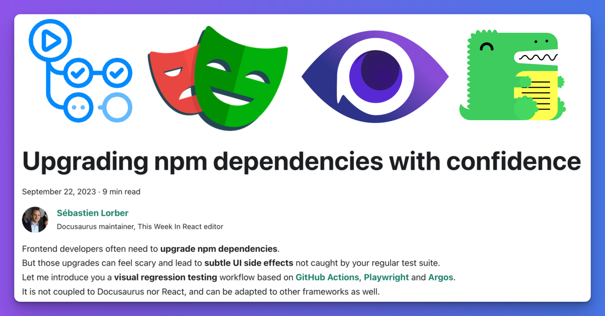
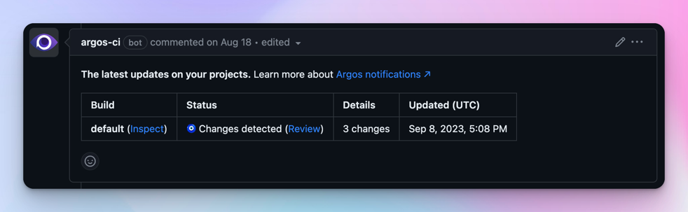

---
authors:
  - slorber
tags: [release]
slug: /upgrading-frontend-dependencies-with-confidence-using-visual-regression-testing
description: Upgrade npm dependencies with confidence thanks to a visual regression testing workflow using GitHub Actions, Playwright and Argos.
image: ./img/social-card.png
---

# Upgrading frontend dependencies with confidence

Frontend developers often need to **upgrade npm dependencies**, but those upgrades can feel scary and lead to **subtle UI side effects** not caught by your regular test suite.

Upgrading Docusaurus is a good example: without reviewing all the pages one by one, it's hard to be sure there's no visual regression. **Docusaurus v3 is around the corner** (currently in [beta](https://github.com/facebook/docusaurus/discussions/9312)), and we would like to help you do this upgrade with confidence.

This article introduces a **visual regression testing** workflow based on [**GitHub Actions**](https://github.com/features/actions), [**Playwright**](https://playwright.dev/), and [**Argos**](https://argos-ci.com/). It is not directly coupled to Docusaurus or React, and can be adapted to work with other frontend applications and frameworks.



<!--truncate-->

This workflow has been tested while upgrading Docusaurus v2 to v3, and already helped catch a few visual regressions on sites such as [React Native](https://reactnative.dev/), [Jest](https://jestjs.io/), and the [Docusaurus](https://docusaurus.io/) site itself.

Docusaurus v3 comes with infrastructure changes and major dependency upgrades such as [MDX v3](https://mdxjs.com/blog/v3/) and [React 18](https://react.dev/blog/2022/03/29/react-v18), which can produce unexpected side effects. It would have been difficult to notice all the visual regressions without such a workflow. That's why we encourage site owners to consider adopting visual regression testing, especially for highly customized sites.

## Workflow overview

The general idea is pretty simple:

- Build your site in CI with [GitHub Actions](https://github.com/features/actions)
- Take screenshots of all `sitemap.xml` pages with [Playwright](https://playwright.dev/)
- Upload them to [Argos](https://argos-ci.com/)
- Do this for both Git branches `main` and `pr-branch`
- Compare the screenshots side-by-side in [Argos](https://argos-ci.com/)

Argos will then **report visual differences** found between `main` and `pr-branch` as a GitHub commit status and pull-request comment. This can help you detect visual regressions ahead of time in an automated way.




Argos creates a report referencing all the visual differences found while comparing the 2 Git branches sites side-by-side, and provides a convenient UX to easily spot the difference.

Check the [Docusaurus Argos page](https://app.argos-ci.com/meta-open-source/docusaurus) to explore our own website reports.

Here is a more concrete example of Argos [reporting a visual regression](https://app.argos-ci.com/slorber/rnw-visual-tests/builds/32/56012838) found while upgrading the React-Native website:

[](https://app.argos-ci.com/slorber/rnw-visual-tests/builds/32/56012838)

## Workflow implementation

This section will describe the implementation details of each step of the workflow.

You will need to [sign up to Argos](https://app.argos-ci.com/signup) and [connect Argos to your GitHub repository](https://argos-ci.com/docs/github)

### Dependencies

This workflow requires the following dev dependencies, in addition to the usual Docusaurus ones:

```bash
yarn add -D @argos-ci/cli @argos-ci/playwright @playwright/test cheerio
```

### GitHub Action

The GitHub action is responsible for executing the workflow for each Git branch.

A minimal workflow could look like:

```yaml title=".github/workflows/argos.yml"
name: Argos CI Screenshots

on:
  push:
    branches: [main]
  pull_request:
    branches: [main]

jobs:
  take-screenshots:
    runs-on: ubuntu-latest
    steps:
      - name: Check out repository code
        uses: actions/checkout@v4

      - name: Use Node.js
        uses: actions/setup-node@v3
        with:
          node-version: current

      - name: Install dependencies
        run: yarn install --frozen-lockfile

      - name: Install Playwright browsers
        run: yarn playwright install --with-deps chromium

      - name: Build the website
        run: yarn docusaurus build

      - name: Take screenshots with Playwright
        run: yarn playwright test

      - name: Upload screenshots to Argos
        run: yarn argos upload ./screenshots
```

### Playwright config

Playwright is responsible for taking screenshots of the website previously built locally by the GitHub action.

A minimal [Playwright config](https://playwright.dev/docs/test-configuration) could look like:

```ts title="playwright.config.ts"
import {devices} from '@playwright/test';
import type {PlaywrightTestConfig} from '@playwright/test';

const config: PlaywrightTestConfig = {
  webServer: {
    port: 3000,
    command: 'yarn docusaurus serve',
  },
  projects: [
    {
      name: 'chromium',
      use: {
        ...devices['Desktop Chrome'],
      },
    },
  ],
};

export default config;
```

### Playwright test

A Playwright config is not enough: we also need to write a Playwright test file to generate the site screenshots.

```ts title="screenshot.spec.ts"
import * as fs from 'fs';
import {test} from '@playwright/test';
import {argosScreenshot} from '@argos-ci/playwright';
import {extractSitemapPathnames, pathnameToArgosName} from './utils';

// Constants
const siteUrl = 'http://localhost:3000';
const sitemapPath = './build/sitemap.xml';
const stylesheetPath = './screenshot.css';
const stylesheet = fs.readFileSync(stylesheetPath).toString();

// Wait for hydration, requires Docusaurus v2.4.3+
// Docusaurus adds a <html data-has-hydrated="true"> once hydrated
// See https://github.com/facebook/docusaurus/pull/9256
function waitForDocusaurusHydration() {
  return document.documentElement.dataset.hasHydrated === 'true';
}

function screenshotPathname(pathname: string) {
  test(`pathname ${pathname}`, async ({page}) => {
    const url = siteUrl + pathname;
    await page.goto(url);
    await page.waitForFunction(waitForDocusaurusHydration);
    await page.addStyleTag({content: stylesheet});
    await argosScreenshot(page, pathnameToArgosName(pathname));
  });
}

test.describe('Docusaurus site screenshots', () => {
  const pathnames = extractSitemapPathnames(sitemapPath);
  console.log('Pathnames to screenshot:', pathnames);
  pathnames.forEach(screenshotPathname);
});
```

<details>
  <summary>Why do we take screenshots with Argos instead of Playwright?</summary>

Argos has a [Playwright integration](https://argos-ci.com/docs/playwright) that wraps the original Playwright screenshot API and provides better defaults to make screenshots more deterministic.

</details>

<details>
<summary>What's inside <code>utils.ts</code>?</summary>

This module contains implementation details that we choose to hide for clarity.

```ts
import * as cheerio from 'cheerio';
import * as fs from 'fs';

// Extract a list of pathnames, given a fs path to a sitemap.xml file
// Docusaurus generates a build/sitemap.xml file for you!
export function extractSitemapPathnames(sitemapPath: string): string[] {
  const sitemap = fs.readFileSync(sitemapPath).toString();
  const $ = cheerio.load(sitemap, {xmlMode: true});
  const urls: string[] = [];
  $('loc').each(function handleLoc() {
    urls.push($(this).text());
  });
  return urls.map((url) => new URL(url).pathname);
}

// Converts a pathname to a decent screenshot name
export function pathnameToArgosName(pathname: string): string {
  return pathname.replace(/^\/|\/$/g, '') || 'index';
}
```

</details>

### Stylesheet

Screenshots are not always deterministic, and taking a screenshot of a page twice can lead to subtle variations that will be reported by Argos as **false positive** visual regressions.

For this reason, we recommend injecting an extra stylesheet to hide the problematic elements. You will probably need to add new CSS rules to this base stylesheet, according to flaky elements found on your own site. Read [Argos - About flaky tests docs](https://argos-ci.com/docs/about-flaky) for details.

```css title="screenshot.css"
/* Iframes can load lazily */
iframe,
/* Avatars can be flaky due to using external sources: GitHub/Unavatar */
.avatar__photo,
/* Gifs load lazily and are animated */
img[src$='.gif'],
/* Algolia keyboard shortcuts appear with a little delay */
.DocSearch-Button-Keys > kbd,
/* The live playground preview can often display dates/counters */
[class*='playgroundPreview'] {
  visibility: hidden;
}

/* Different docs last-update dates can alter layout */
.theme-last-updated,
/* Mermaid diagrams are rendered client-side and produce layout shifts */
.docusaurus-mermaid-container {
  display: none;
}
```

:::tip prevent layout shifts

We recommend hiding flaky UI elements affecting layout with `display: none;`.

For example, the docs "Last Updated on" might render on more than 1 line, eventually "pushing" the rest of your content further down, leading to Argos detecting many different pixels.

:::

## Example repository

The [slorber/docusaurus-argos-example](https://github.com/slorber/docusaurus-argos-example) repo shows a complete example of implementing this workflow on a newly initialized Docusaurus v2 site, using a Yarn monorepo.

[](https://github.com/slorber/docusaurus-argos-example)

Relevant pull-requests:

- [PR - Set up GitHub Action + Playwright + Argos](https://github.com/slorber/docusaurus-argos-example/pull/1): implements the minimal workflow described above
- [PR - Upgrading Docusaurus from v2 to v3](https://github.com/slorber/docusaurus-argos-example/pull/2): shows how Argos caught 3 visual regressions while upgrading

:::tip More advanced example?

Browse the Docusaurus repository for a more advanced integration:

- [GitHub Action](https://github.com/facebook/docusaurus/blob/main/.github/workflows/argos.yml)
- [Playwright + Argos tests](https://github.com/facebook/docusaurus/tree/main/argos)

:::

## Make it cheap

The tools we choose are implementation details of this visual regression testing workflow.

For Docusaurus, we choose [Argos](https://argos-ci.com/): it works well for us, and offers [free](https://argos-ci.com/pricing) and [open source](https://argos-ci.com/docs/open-source) plans. However, you are free to adopt alternative tools.

In case you don't mind storing large screenshots in Git, you can also try the free, self-hosted [Playwright Visual Comparisons](https://playwright.dev/docs/test-snapshots) and browse visual differences with `npx playwright show-report`. However, we found using a dedicated external tool is more convenient.

External tools can be expensive, but generally offer free plans with an ample quota of screenshots. You can reduce your screenshot consumption by implementing a few tricks below.

### Limit the number of pathnames

The base setup involves taking a screenshot of every single pathname found in `sitemap.xml`. For large sites, that can lead to a lot of screenshots.

You can decide to filter the pathnames to only take screenshots of the most critical pages.

For the Docusaurus website, do not take screenshots for versioned docs pages:

```ts title="screenshot.spec.ts"
// highlight-start
function isVersionedDocsPathname(pathname: string): boolean {
  return pathname.match(/^\/docs\/((\d\.\d\.\d)|(next))\//);
}
// highlight-end

test.describe('Docusaurus site screenshots', () => {
  const pathnames = extractSitemapPathnames(sitemapPath)
    // highlight-next-line
    .filter(isVersionedDocsPathname);

  pathnames.forEach(screenshotPathname);
});
```

### Limit the workflow concurrency

Implementing [GitHub Actions concurrency groups](https://docs.github.com/en/actions/using-jobs/using-concurrency) will prevent successive commits to trigger multiple useless workflow runs. The workflow will only be executed for the last commit, and previous commits will be canceled automatically.

```yaml title=".github/workflows/argos.yml"
concurrency:
  group: ${{ github.workflow }}-${{ github.head_ref || github.run_id }}
  cancel-in-progress: true
```

### Run your workflow conditionally

It's not worth running this workflow for every single commit and pull-request.

For example, if someone corrects a typo in your documentation, you probably don't want to take hundreds of screenshots and have Argos to point out that only the modified page has a visual difference: duh, that's a bit expected!

For the Docusaurus website, we only run the workflow for pull-request having the `Argos` label:

```yaml title=".github/workflows/argos.yml"
name: Argos CI Screenshots

on:
  push:
    branches: [main]
  pull_request:
    branches: [main]
    # highlight-start
    types:
      - opened
      - synchronize
      - reopened
      - labeled
    # highlight-end

jobs:
  take-screenshots:
    # highlight-start
    if: ${{ github.ref_name == 'main' || (github.event_name == 'pull_request' && contains(github.event.pull_request.labels.*.name, 'Argos')) }}
    # highlight-end
    runs-on: ubuntu-latest
    steps:
      # Your job steps here ...
```

There are many options to explore, such as [triggering the workflow manually](https://docs.github.com/en/actions/using-workflows/manually-running-a-workflow) or [only when files matching a specific pattern are modified](https://docs.github.com/en/actions/using-workflows/triggering-a-workflow#example-including-paths).

## Conclusion

I believe **visual regression testing is underused** in the frontend ecosystem.

Taking full-page screenshots is a **low-hanging fruit** that is easy to set up and can help you **catch a new class of bugs** that your regular test suite would miss. This technique shines not only for npm package upgrades, but also for **any kind of refactoring** that shouldn't change the user interface.

So why not give it a try?

Happy hacking!

## See also

Useful documentation links:

- [Playwright - Installation](https://playwright.dev/docs/intro)
- [Playwright - Test config guide](https://playwright.dev/docs/test-configuration)
- [Playwright - Test config API](https://playwright.dev/docs/api/class-testconfig)
- [Argos - Installation](https://argos-ci.com/docs/installation)
- [Argos - Use with GitHub Actions](https://argos-ci.com/docs/github-actions)
- [Argos - Use with Playwright](https://argos-ci.com/docs/playwright)
- [Argos - About flaky tests](https://argos-ci.com/docs/about-flaky)
