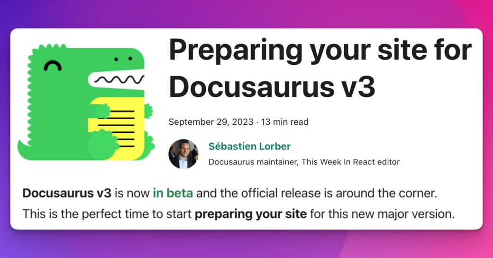

:::warning

This blog post was written when Docusaurus v3 was in beta. There are some changes in dependency versions and upgrade steps you should be aware of if upgrading to Docusaurus v3 current stable releases. Use the [upgrade guide](https://docusaurus.io/docs/next/migration/v3) for the most up-to-date migration steps.

:::

**Docusaurus v3** is now [**in beta**](https://github.com/facebook/docusaurus/discussions/9312) and the official release is around the corner. This is the perfect time to start **preparing your site** for this new major version.

Docusaurus v3 comes with a few **breaking changes**, many of which can be **handled today under Docusaurus v2**. Preparing your site ahead of time can be done incrementally, and will make it easier to upgrade to v3.

The main breaking change is the upgrade from MDX v1 to MDX v3. Read the [**MDX v2**](https://mdxjs.com/blog/v2/) and [**MDX v3**](https://mdxjs.com/blog/v3/) release notes for details. MDX will now compile your Markdown content **more strictly** and with **subtle differences**.

This article will mostly focus on how to prepare your content for this new MDX version, and will also list a few other breaking changes that you can handle today.



<!--truncate-->

:::warning

This article mentions most Docusaurus v3 breaking changes, but is not exhaustive. Read the [v3.0.0-beta.0 release notes](https://github.com/facebook/docusaurus/discussions/9312) for an exhaustive list.

:::

:::tip Don't be afraid

There's a lot of content in this blog post, but many Docusaurus v2 sites can upgrade with very few changes.

If your site is relatively small, with only a few customizations, you can probably [upgrade to Docusaurus v3](#try-docusaurus-v3-today) immediately.

:::

## Preparatory work

Before preparing for the Docusaurus v3 upgrade, we recommend upgrading to the latest [Docusaurus v2 version](/versions).

Depending on the complexity of your site, it may be a good idea to adopt the [visual regression testing workflow](/blog/upgrading-frontend-dependencies-with-confidence-using-visual-regression-testing) that we recently presented. It could help you catch unexpected visual side effects occurring during the Docusaurus v3 upgrade.

We also recommend using the `.mdx` extension whenever you use JSX, `import`, or `export` (i.e. MDX features) inside a Markdown file. It is semantically more correct and improves compatibility with external tools (IDEs, formatters, linters, etc.). In future versions of Docusaurus, `.md` files will be parsed as standard [CommonMark](https://commonmark.org/), which does not support these features. In Docusaurus v3, `.md` files keep being compiled as MDX files, but it will be possible to [opt-in for CommonMark](https://github.com/facebook/docusaurus/issues/3018).

## Preparing content for MDX v3

MDX is a major dependency of Docusaurus responsible for compiling your `.md` and `.mdx` files to React components.

MDX v3 is much better, but also comes with changes that probably require you to refactor your content a bit. MDX v3 is stricter, and some components that compiled fine under v1 might now fail to compile under v3, most likely because of `{` and `<` characters.

Upgrading MDX comes with all the breaking changes documented on the [MDX v2](https://mdxjs.com/blog/v2/) and [MDX v3](https://mdxjs.com/blog/v3/) release blog posts. Most breaking changes come from MDX v2. The [MDX v2 migration guide](https://mdxjs.com/migrating/v2/) has a section on how to [update MDX files](https://mdxjs.com/migrating/v2/#update-mdx-files) that will be particularly relevant to us. Also make sure to read the [Troubleshooting MDX](https://mdxjs.com/docs/troubleshooting-mdx/) page that can help you interpret common MDX error messages.

Make sure to also read our updated [**MDX and React**](/docs/markdown-features/react) documentation page.

:::tip Ask for help

We have a dedicated [MDX v3 - Upgrade Support](https://github.com/facebook/docusaurus/discussions/9053) discussion.

:::

### Using the MDX playground

The MDX playground is your new best friend. It permits to understand how your content is **compiled to React components**, and troubleshoot compilation or rendering issues in isolation.

Each MDX version comes with its own playground:

- [MDX playground - current version](https://mdxjs.com/playground/)
- [MDX playground - v1](https://mdx-git-renovate-babel-monorepo-mdx.vercel.app/playground/)

<details>
  <summary>Configuring the MDX playground options for Docusaurus</summary>

To obtain a compilation behavior similar to what Docusaurus v2 uses, please turn on these options on the [MDX playground](https://mdxjs.com/playground/):

- Use `MDX`
- Use `remark-gfm`
- Use `remark-directive`


</details>

Using the two MDX playgrounds side-by-side, you will soon notice that some content is compiled differently or fails to compile in v3.

:::tip Making your content future-proof

The goal will be to refactor your problematic content so that it **works fine with both versions of MDX**. This way, when you upgrade to Docusaurus v3, this content will already work out-of-the-box.

:::

### Using the MDX checker CLI

We provide a [docusaurus-mdx-checker](https://github.com/slorber/docusaurus-mdx-checker) CLI that permits to easily spot problematic content. Run this command today on your Docusaurus v2 site to obtain a list of files that will fail to compile under MDX v3.

```bash
npx docusaurus-mdx-checker
```

For each compilation issue, the CLI will log the file path and a line number to look at.


:::tip

Use this CLI to estimate of how much work will be required to make your content compatible with MDX v3.

:::

:::warning

This CLI is a best effort, and will only report compilation errors.

It will not report subtle compilation changes that do not produce errors but can affect how your content is displayed. To catch these problems, we recommend using [visual regression tests](/blog/upgrading-frontend-dependencies-with-confidence-using-visual-regression-testing).

:::

### Common MDX problems

We upgraded a few Docusaurus sites to Docusaurus v3 and MDX v3:

- [Docusaurus PR](https://github.com/facebook/docusaurus/pull/8288)
- [React-Native PR](https://github.com/facebook/react-native-website/pull/3780)
- [Jest PR](https://github.com/jestjs/jest/pull/14463)

These upgrades permitted us to aggregate the most common content problems, and document how to best handle them.

#### Bad usage of `{`

The `{` character is used for opening [JavaScript expressions](https://mdxjs.com/docs/what-is-mdx/#expressions). MDX will now fail if what you put inside `{expression}` is not a valid expression.

```md title="example.md"
The object shape looks like {username: string, age: number}
```

:::danger Error message

> Could not parse expression with acorn: Unexpected content after expression

:::

:::tip How to prepare

Available options to fix this error:

- Use inline code: `{username: string, age: number}`
- Use the HTML code: `&#123;`
- Escape it: `\{`

:::

#### Bad usage of `<`

The `<` character is used for opening [JSX tags](https://mdxjs.com/docs/what-is-mdx/#jsx). MDX will now fail if it thinks your JSX is invalid.

```md title="example.md"
Use Android version <5

You can use a generic type like Array<T>

Follow the template "Road to <YOUR_MINOR_VERSION>"
```

:::danger Error messages

> Unexpected character `5` (U+0035) before name, expected a character that can start a name, such as a letter, `$`, or `_`

> Expected a closing tag for `<T>` (1:6-1:9) before the end of `paragraph` end-tag-mismatch mdast-util-mdx-jsx

> Expected a closing tag for `<YOUR_MINOR_VERSION>` (134:19-134:39) before the end of `paragraph`

:::

:::tip How to prepare

Available options to fix this error:

- Use inline code: `Array<T>`
- Use the HTML code: `&lt;` or `&#60;`
- Escape it: `\<` (unfortunately the `\` will be displayed under MDX v1)

:::

#### Bad usage of GFM Autolink

Docusaurus supports [GitHub Flavored Markdown (GFM)](https://github.github.com/gfm/), but [autolink](https://github.github.com/gfm/#autolinks) using the `<link>` syntax is not supported anymore by MDX.

```md title="example.md"
<sebastien@thisweekinreact.com>

<http://localhost:3000>
```

:::danger Error messages

> Unexpected character `@` (U+0040) in name, expected a name character such as letters, digits, `$`, or `_`; whitespace before attributes; or the end of the tag (note: to create a link in MDX, use `[text](url)`)

> Unexpected character `/` (U+002F) before local name, expected a character that can start a name, such as a letter, `$`, or `_` (note: to create a link in MDX, use `[text](url)`)

:::

:::tip How to prepare

Use regular Markdown links, or remove the `<` and `>`. MDX and GFM are able to autolink literals already.

{/* prettier-ignore */}
```md title="example.md"
sebastien@thisweekinreact.com
[sebastien@thisweekinreact.com](mailto:sebastien@thisweekinreact.com)

http://localhost:3000
[http://localhost:3000](http://localhost:3000)
```

:::

#### Lower-case MDXComponent mapping

For users providing a [custom `MDXComponent`mapping](/docs/markdown-features/react#mdx-component-scope), components are now "sandboxed":

- a `MDXComponent` mapping for `h1` only gets used for `# hi` but not for `<h1>hi</h1>`
- a **lower-cased** custom element name will not be substituted by its respective `MDXComponent` component anymore

:::danger visual difference

Your [`MDXComponent` component mapping](/docs/markdown-features/react#mdx-component-scope) might not be applied as before, and your custom components might no longer be used.

:::

:::tip How to prepare

For native Markdown elements, you can keep using **lower-case**: `p`, `h1`, `img`, `a`...

For any other element, **use upper-case names**.

```diff title="src/theme/MDXComponents.js"
 import MDXComponents from '@theme-original/MDXComponents';

 export default {
   ...MDXComponents,
   p: (props) => <p {...props} className="my-paragraph"/>
-  myElement: (props) => <div {...props} className="my-class" />,
+  MyElement: (props) => <div {...props} className="my-class" />,
 };
```

:::

#### Unintended extra paragraphs

In MDX, it is now possible to interleave JSX and Markdown more easily without requiring extra line breaks. Writing content on multiple lines can also produce new expected `<p>` tags.

:::danger visual difference

See how this content is rendered differently by MDX v1 and v3.

```md title="example.md"
<div>Some **Markdown** content</div>
<div>
  Some **Markdown** content
</div>
```

{/* prettier-ignore */}
```html title="MDX v1 output"
<div>Some **Markdown** content</div>
<div>Some **Markdown** content</div>
```

{/* prettier-ignore */}
```html title="MDX v3 output"
<div>Some <strong>Markdown</strong> content</div>
<div><p>Some <strong>Markdown</strong> content</p></div>
```

:::

:::tip How to prepare

If you don't want an extra `<p>` tag, refactor content on a case by case basis to use a single-line JSX tag.

```diff
 <figure>
   
-  <figcaption>
-    My image caption
-  </figcaption>
+  <figcaption>My image caption</figcaption>
 </figure>
```

If your content contains "Markdown inlines" (`**`, `*`, `_`, `[link](/path)`), you might not be able to refactor it ahead of time, and will have to do it alongside the Docusaurus v3 upgrade.

:::

#### Unintended usage of directives

Docusaurus v3 now uses [Markdown Directives](https://talk.commonmark.org/t/generic-directives-plugins-syntax/444) (implemented with [remark-directive](https://github.com/remarkjs/remark-directive)) as a generic way to provide support for admonitions, and other upcoming Docusaurus features.

```md title="example.md"
This is a :textDirective

::leafDirective

:::containerDirective

Container directive content

:::
```

:::danger Visual change

Directives are parsed with the purpose of being handled by other Remark plugins. Unhandled directives will be ignored, and won't be rendered back in their original form.

```md title="example.md"
The AWS re:Invent conf is great
```

Due to `:Invent` being parsed as a text directive, this will now be rendered as:

```
The AWS re
conf is great
```

:::

:::tip How to prepare

- Use the HTML code: `&#58;`
- Add a space after `:` (if it makes sense): `: text`
- Escape it: `\:` (unfortunately the `\` will be displayed under MDX v1)

:::

#### Unsupported indented code blocks

MDX does not transform indented text as code blocks anymore.

```md title="example.md"
    console.log("hello");
```

:::danger Visual change

The upgrade does not generally produce new MDX compilation errors, but can lead to content being rendered in an unexpected way because there isn't a code block anymore.

:::

:::tip How to prepare

Use the regular code block syntax instead of indentation:

````md title="example.md"
```js
console.log('hello');
```
````

:::

### MDX plugins

All the official packages (Unified, Remark, Rehype...) in the MDX ecosystem are now [**ES Modules only**](https://gist.github.com/sindresorhus/a39789f98801d908bbc7ff3ecc99d99c) and do not support [CommonJS](https://nodejs.org/api/modules.html#modules-commonjs-modules) anymore.

In practice this means that you can't do `require("remark-plugin")` anymore.

:::tip How to prepare

Docusaurus v3 now supports [**ES Modules**](https://flaviocopes.com/es-modules/) configuration files. We recommend that you migrate your config file to ES module, that enables you to import the Remark plugins easily:

```js title="docusaurus.config.js"
import remarkPlugin from 'remark-plugin';

export default {
  title: 'Docusaurus',
  /* site config using remark plugins here */
};
```

If you want to keep using CommonJS modules, you can use dynamic imports as a workaround that enables you to import ES modules inside a CommonJS module. Fortunately, the [Docusaurus config supports the usage of an async function](/docs/configuration#syntax-to-declare-docusaurus-config) to let you do so.

```js title="docusaurus.config.js"
module.exports = async function () {
  const myPlugin = (await import('remark-plugin')).default;
  return {
    // site config...
  };
};
```

:::

:::info For plugin authors

If you created custom Remark or Rehype plugins, you may need to refactor those, or eventually rewrite them completely, due to how the new AST is structured. We have created a [dedicated support discussion](https://github.com/facebook/docusaurus/discussions/9337) to help plugin authors upgrade their code.

:::

## Other breaking changes

Apart from MDX, there are other breaking changes that you can already prepare your site for, notably major version upgrades of important dependencies.

### Node.js 18.0

Node.js 16 [reached End-of-Life](https://nodejs.org/en/blog/announcements/nodejs16-eol), and Docusaurus v3 now requires **Node.js >= 18.0**.

:::tip How to prepare

Upgrade your Docusaurus v2 site to Node.js 18 before upgrading to Docusaurus v3.

:::

### React 18.0

Docusaurus v3 now requires **React >= 18.0**.

React 18 comes with its own breaking changes that should be relatively easy to handle, depending on the amount of custom React code you created for your site.

Simple Docusaurus sites that only use our official theme code without swizzling do not have anything to do.

:::tip How to prepare

Read the official [React v18.0](https://react.dev/blog/2022/03/29/react-v18) and [How to Upgrade to React 18](https://react.dev/blog/2022/03/08/react-18-upgrade-guide), and look at your first-party React code to figure out which components might be affected this React 18 upgrade.

We recommend to particularly look for:

- Automatic batching for stateful components
- New React hydration errors reported to the console

:::

### TypeScript 5.0

Docusaurus v3 now requires **TypeScript >= 5.0**.

:::tip How to prepare

Upgrade your Docusaurus v2 site to TypeScript 5 before upgrading to Docusaurus v3.

:::

### TypeScript base config

The official Docusaurus TypeScript config has been re-internalized from the external package [`@tsconfig/docusaurus`](https://www.npmjs.com/package/@tsconfig/docusaurus) to our new monorepo package [`@docusaurus/tsconfig`](https://www.npmjs.com/package/@docusaurus/tsconfig).

This new package is versioned alongside all the other Docusaurus core packages, and will be used to ensure TypeScript retro-compatibility and breaking changes on major version upgrades.

:::tip How to prepare

The new Docusaurus v3 TypeScript config is sensibly the same as the former Docusaurus v2 TypeScript config. If you upgraded to TypeScript 5, using the Docusaurus v3 config on a v2 site is already possible:

```diff title="package.json"
 {
   "devDependencies": {
-    "@tsconfig/docusaurus": "^1.0.7",
+    "@docusaurus/tsconfig": "^3.0.0-beta.0",
   }
 }
```

```diff title="tsconfig.json"
 {
-  "extends": "@tsconfig/docusaurus/tsconfig.json",
+  "extends": "@docusaurus/tsconfig",
   "compilerOptions": {
     "baseUrl": "."
   }
 }
```

:::

### Admonition warning

For historical reasons, we support an undocumented admonition `:::warning` that renders with a red color.

:::danger Warning

This is a Docusaurus v2 `:::warning` admonition.

:::

However, the color and icon is historically wrong. Docusaurus v3 re-introduces `:::warning` admonition officially, documents it, and fix the color and icon.

:::warning

This is a Docusaurus v3 `:::warning` admonition.

:::

:::tip How to prepare

If you previously used the undocumented `:::warning` admonition, make sure to verify for each usage if yellow is now an appropriate color. If you want to keep the red color, use `:::danger` instead.

Docusaurus v3 also [deprecated the `:::caution`](https://github.com/facebook/docusaurus/pull/9308) admonition. Please refactor `:::caution` (yellow) to either `:::warning` (yellow) or `:::danger` (red).

:::

### Versioned sidebars

This breaking change will only affect **Docusaurus v2 early adopters** who versioned their docs before `v2.0.0-beta.10` (December 2021).

When creating version `v1.0.0`, the sidebar file contained a prefix `version-v1.0.0/` that [Docusaurus v3 does not support anymore](https://github.com/facebook/docusaurus/pull/9310).

```json title="versioned_sidebars/version-v1.0.0-sidebars.json"
{
  "version-v1.0.0/docs": [
    "version-v1.0.0/introduction",
    "version-v1.0.0/prerequisites"
  ]
}
```

:::tip How to prepare

Your Docusaurus v2 site is able to handle the 2 sidebar formats similarly.

You can remove the useless versioned prefix from your versioned sidebars.

```json title="versioned_sidebars/version-v1.0.0-sidebars.json"
{
  "docs": ["introduction", "prerequisites"]
}
```

:::

## Try Docusaurus v3 today {#try-docusaurus-v3-today}

Docusaurus v3 is now [in beta](https://github.com/facebook/docusaurus/discussions/9312), and already used in production by [React-Native](https://reactnative.dev), [Jest](https://jestjs.io), and [our own website](https://docusaurus.io/).

We think this new Docusaurus version is **robust and ready to be deployed in production**. It should be released officially soon, after receiving a positive feedback from early adopters of our community.

We would really appreciate it if you try upgrading and report issues on the [3.0.0-beta.0 release discussion thread](https://github.com/facebook/docusaurus/discussions/9312).

For most sites, the upgrade should be easy. If you prepared your site ahead of time as documented here, upgrading the following dependencies should be enough:

```diff title="package.json"
 {
   "dependencies": {
-    "@docusaurus/core": "2.4.3",
-    "@docusaurus/preset-classic": "2.4.3",
-    "@mdx-js/react": "^1.6.22",
+    "@docusaurus/core": "3.0.0-beta.0",
+    "@docusaurus/preset-classic": "3.0.0-beta.0",
+    "@mdx-js/react": "^3.0.0",
     "clsx": "^2.0.0",
     "prism-react-renderer": "^1.3.5",
-    "react": "^17.0.2",
-    "react-dom": "^17.0.2"
+    "react": "^18.2.0",
+    "react-dom": "^18.2.0"
   },
   "devDependencies": {
-    "@docusaurus/module-type-aliases": "2.4.3"
+    "@docusaurus/module-type-aliases": "3.0.0-beta.0"
   }
 }
```

## Ask for help

We will be there to help you upgrade through the following support channels:

- [Docusaurus v3 - Upgrade Support](https://github.com/facebook/docusaurus/discussions/9336)
- [Docusaurus v3 - Discord channel #migration-v2-to-v3](https://discord.com/channels/398180168688074762/1154771869094912090)
- [MDX v3 - Upgrade Support](https://github.com/facebook/docusaurus/discussions/9053)
- [MDX v3 - Remark/Rehype Plugins Support](https://github.com/facebook/docusaurus/discussions/9337)
- [MDX v3 - Discord channel #migration-mdx-v3](https://discord.com/channels/398180168688074762/1116724556976111616)

Alternatively, you can look for a paid [Docusaurus Service Provider](https://github.com/facebook/docusaurus/discussions/9281) to execute this upgrade for you. If your site is open source, you can also ask our community for [free, benevolent help](https://github.com/facebook/docusaurus/discussions/9283).

## Conclusion

Docusaurus v3 is ready to try, and will be released soon. This article already gives you a good idea of all the major changes required to upgrade.

The initial 3.0 release is focusing on dependency and infrastructure upgrades that will permit us to implement new exciting features. It also comes with a few useful features that we will detail in the final release notes.
