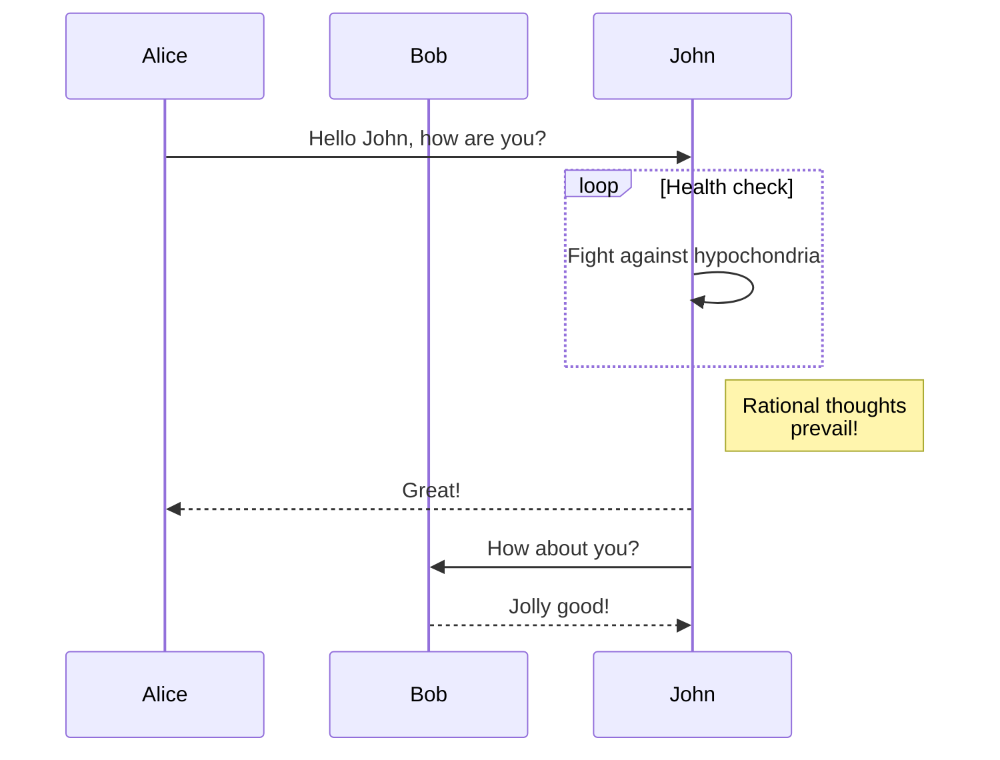

We are happy to announce **Docusaurus 2.2**.

The upgrade should be easy: as explained in our [release process documentation](/community/release-process), minor versions respect [Semantic Versioning](https://semver.org/).


{/* truncate */}

## Highlights

### Mermaid diagrams

In [#7490](https://github.com/facebook/docusaurus/pull/7490), we added support for Mermaid diagrams. This fills the gap between GitHub Flavored Markdown which also [added support recently](https://github.blog/2022-02-14-include-diagrams-markdown-files-mermaid/). You can create Mermaid diagrams using Markdown code blocks:

````md

````

````mdx-code-block
import BrowserWindow from '@site/src/components/BrowserWindow';

<BrowserWindow>


</BrowserWindow>

````

Make sure to check the [documentation](/docs/markdown-features/diagrams), and the [more advanced examples](/tests/pages/diagrams)

### Config `headTags`

In [#8151](https://github.com/facebook/docusaurus/pull/8151), we added the ability to apply arbitrary HTML `<head>` tags to all pages of your site.

```js title="docusaurus.config.js"
module.exports = {
  headTags: [
    {
      tagName: 'link',
      attributes: {
        rel: 'icon',
        href: '/img/docusaurus.png',
      },
    },
  ],
};
```

### Accessibility

We did several accessibility improvements:

- [#8207](https://github.com/facebook/docusaurus/pull/8207): improves keyboard navigation for mobile drawer hamburger button
- [#8161](https://github.com/facebook/docusaurus/pull/8161): improves keyboard navigation for tabs
- [#8204](https://github.com/facebook/docusaurus/pull/8204): makes the skip to content button support progressive enhancement
- [#8174](https://github.com/facebook/docusaurus/pull/8174): improves screen reader announcement when toggling between light/dark mode

### Developer Experience

We made validation stricter and improved error messages:

- [#8234](https://github.com/facebook/docusaurus/pull/8234): in case of doc processing failure, prints the problematic markdown file path in the error message
- [#8192](https://github.com/facebook/docusaurus/pull/8192) and [#8159](https://github.com/facebook/docusaurus/pull/8159): validates `siteConfig.url` more strictly and with better error message
- [#8066](https://github.com/facebook/docusaurus/pull/8066): makes config `url` and `baseUrl` fail-safe and less sensitive to the presence or absence of a leading or trailing slash

### Translations

We completed the default theme translation support for multiple languages:

- 🇹🇷 [#8105](https://github.com/facebook/docusaurus/pull/8105): completes Turkish translations
- 🇷🇺 [#8253](https://github.com/facebook/docusaurus/pull/8253): completes Russian translations
- 🇫🇷 [#8243](https://github.com/facebook/docusaurus/pull/8243): completes French translations
- 🇯🇵 [#8075](https://github.com/facebook/docusaurus/pull/8075): completes Japanese translations

:::tip

Completing theme translations is an [ongoing effort](https://github.com/facebook/docusaurus/issues/3526) and an easy way to contribute to Docusaurus. We add new theme features regularly, for which we often [need new translations](https://github.com/facebook/docusaurus/issues/3526).

:::

## Other changes

Other notable changes include:

- [#8210](https://github.com/facebook/docusaurus/pull/8210): the `docusaurus swizzle` CLI has a new `--config` option
- [#8109](https://github.com/facebook/docusaurus/pull/8109): mobile navigation performance optimizations, prefetch resources earlier
- [#8059](https://github.com/facebook/docusaurus/pull/8059): versions/locales navbar dropdowns preserve hash and querystring on navigation
- [#8227](https://github.com/facebook/docusaurus/pull/8227): the client redirect plugin preserves hash and querystring on redirect

Check the **[2.2.0 changelog entry](/changelog/2.2.0)** for an exhaustive list of changes.
