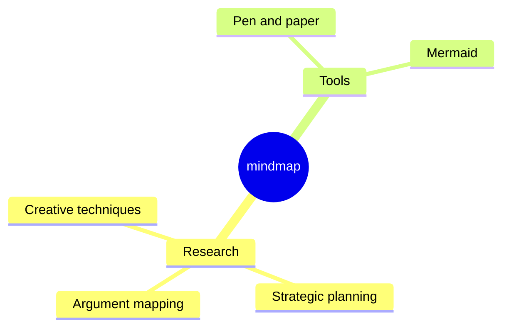

Today, we are happy to **announce Docusaurus 3.0**! 🥳

At [**Meta Open Source**](https://opensource.fb.com/), we believe Docusaurus will help you build the **best documentation websites** with **minimal effort**, letting you **focus on what really matters**: writing the content.

This is a new **major version** of Docusaurus, coming with **new exciting features** and upgraded dependencies.

In line with the [**Semantic Versioning**](https://semver.org/) principles, this release includes **breaking changes** we documented thoroughly in the [**v3 upgrade guide**](/docs/migration/v3/). Breaking changes can be bothersome, but they are necessary to set the ground for a **new wave of Docusaurus features** we plan to implement.


{/* truncate */}

We initially planned to release more frequent major versions, but Docusaurus v3 has taken longer than expected. Among the breaking changes that we accrued, **upgrading to MDX v3** is probably the main challenge to the adoption of this new version. We went the extra mile to make this upgrade as easy as possible, notably by adding [compatibility options for MDX v1](/docs/api/docusaurus-config#markdown).

The simplest sites will only need to upgrade a few npm dependencies. For more complex sites, we came up with a few strategies that can help you upgrade more confidently:

- [Prepare your site](/blog/preparing-your-site-for-docusaurus-v3) ahead of time, incrementally, while staying on Docusaurus v2
- [Set up visual regression tests](/blog/upgrading-frontend-dependencies-with-confidence-using-visual-regression-testing) to catch unexpected visual changes happening during the upgrade

:::info About Docusaurus v2

According to our [release process](/community/release-process#stable-version), Docusaurus v2 has now entered **maintenance mode**. It will only receive support for major security issues for 3 months, until 31 January 2024. It is recommended to upgrade within that time frame to v3.

:::

import IframeWindow from '@site/src/components/BrowserWindow/IframeWindow';

## Breaking changes

This section only gives you a quick glance. All the breaking changes are thoroughly documented in the [**v3 upgrade guide**](/docs/migration/v3).

Docusaurus v3 upgraded a few dependencies to new major versions, each coming with its own breaking changes:

- Node.js v16 ➡️ v18
- React v17 ➡️ v18
- MDX v1 ➡️ v3
- TypeScript v4 ➡️ v5
- prism-react-renderer v1 ➡️ v2
- react-live v2 ➡️ v4
- Mermaid v9 ➡️ v10
- import-fresh v3 ➡️ jiti v1
- remark-emoji v2 ➡️ v4

A typical `package.json` dependency upgrade looks like:

```diff title="package.json"
 {
   "dependencies": {
     // upgrade to Docusaurus v3
-    "@docusaurus/core": "2.4.3",
-    "@docusaurus/preset-classic": "2.4.3",
+    "@docusaurus/core": "3.0.0",
+    "@docusaurus/preset-classic": "3.0.0",
     // upgrade to MDX v3
-    "@mdx-js/react": "^1.6.22",
+    "@mdx-js/react": "^3.0.0",
     // upgrade to prism-react-renderer v2.0+
-    "prism-react-renderer": "^1.3.5",
+    "prism-react-renderer": "^2.1.0",
     // upgrade to React v18.0+
-    "react": "^17.0.2",
-    "react-dom": "^17.0.2"
+    "react": "^18.2.0",
+    "react-dom": "^18.2.0"
   },
   "devDependencies": {
     // upgrade Docusaurus dev dependencies to v3
-    "@docusaurus/module-type-aliases": "2.4.3",
-    "@docusaurus/types": "2.4.3"
+    "@docusaurus/module-type-aliases": "3.0.0",
+    "@docusaurus/types": "3.0.0"
   }
   "engines": {
     // require Node.js 18.0+
-    "node": ">=16.14"
+    "node": ">=18.0"
   }
 }
```

Apart from MDX v3, most breaking changes coming with those upgraded dependencies have been handled internally for you: most of the time, you shouldn't have to do anything. Outside of dependencies, the only functional breaking changes coming explicitly from the Docusaurus codebase are:

- [#9189](https://github.com/facebook/docusaurus/pull/9189): new default blog RSS feed limit of 20 entries
- [#9308](https://github.com/facebook/docusaurus/pull/9308): fix and re-introduce the `:::warning` admonition, deprecate `:::caution`
- [#9310](https://github.com/facebook/docusaurus/pull/9310): remove the legacy versioned sidebar id prefix, used for sites versioned before `v2.0.0-beta.10` (December 2021)
- [#7966](https://github.com/facebook/docusaurus/pull/7966): refactor docs theme components, eventually requiring to you re-swizzle them

## Highlights

Below is a non-exhaustive list of new useful features coming with this new version. All the features are listed in the [**Docusaurus v3.0.0 release notes**](https://github.com/facebook/docusaurus/releases/tag/v3.0.0).

### Markdown

Docusaurus v3 upgraded from MDX v1 to MDX v3:

- in [#8288](https://github.com/facebook/docusaurus/pull/8288), we upgraded to [**MDX v2**](https://mdxjs.com/blog/v2/) ([migration guide](https://mdxjs.com/migrating/v2/))
- in [#9451](https://github.com/facebook/docusaurus/pull/9451), we upgraded to [**MDX v3**](https://mdxjs.com/blog/v3/) ([migration guide](https://mdxjs.com/migrating/v3/))

This new MDX version is **much better for content writers and plugin authors**, and lays the ground for implementing new exciting Markdown features.

:::warning MDX v3 - the main challenge

The transition from MDX v1 to MDX v3 is the **main challenge** to the adoption of Docusaurus v3.

Some documents that compiled successfully under Docusaurus v2 might now **fail to compile** under Docusaurus v3, while others might **render differently**.

Most breaking changes come from [MDX v2](https://mdxjs.com/blog/v2/), and [MDX v3](https://mdxjs.com/blog/v3/) is a relatively small release. The [MDX v2 migration guide](https://mdxjs.com/migrating/v2/) has a section on how to [update MDX files](https://mdxjs.com/migrating/v2/#update-mdx-files) that will be particularly relevant to us. Also make sure to read the [Troubleshooting MDX](https://mdxjs.com/docs/troubleshooting-mdx/) page that can help you interpret common MDX error messages.

**Don't be intimidated**. Most problems are **easy to fix** and often related to `{` and `<` characters that you now need to escape. However, depending on the size of your site, you might need to edit many files and feel overwhelmed. For this reason, we provide a command [`npx docusaurus-mdx-checker`](https://github.com/slorber/docusaurus-mdx-checker) to help you get an estimate of the work to be done, and we recommend to [prepare your site in advance](/blog/preparing-your-site-for-docusaurus-v3).

If you created custom [MDX plugins](/docs/markdown-features/plugins) (Remark/Rehype), the AST is slightly different, and you might need to refactor them.

:::

This notably enables us to add a [CommonMark mode](/docs/markdown-features#mdx-vs-commonmark) that should make it easier for existing documentations to adopt Docusaurus. It is currently opt-in and **experimental** and limited ([some Docusaurus features will not work](https://github.com/facebook/docusaurus/issues/9092)). In Docusaurus v3, all files are still interpreted as MDX, but we plan to interpret `.md` files as CommonMark in an upcoming major version, and recommend to use the `.mdx` extension for any file using JSX or ES modules.

We also introduced a new way to [configure Markdown globally for your site](/docs/api/docusaurus-config#markdown), and plan to add more flexible options later.

```js title="docusaurus.config.js"
export default {
  markdown: {
    format: 'mdx',
    mermaid: true,
    preprocessor: ({filePath, fileContent}) => {
      return fileContent.replaceAll('{{MY_VAR}}', 'MY_VALUE');
    },
    mdx1Compat: {
      comments: true,
      admonitions: true,
      headingIds: true,
    },
  },
};
```

Docusaurus now uses the [remark-directive](https://github.com/remarkjs/remark-directive) plugin to support admonitions. This also offers you the ability to create your own Remark plugins to extend Markdown with your own [custom directives](https://talk.commonmark.org/t/generic-directives-plugins-syntax/444) such as `:textDirective`, `::leafDirective` or `:::containerDirective`.

### ESM and TypeScript configs {#esm-ts-configs}

In [#9317](https://github.com/facebook/docusaurus/pull/9317), we added support for ES Modules and TypeScript config files, including site config, docs sidebars, plugins and presets.

Here are 2 TypeScript examples, giving you a modern experience with IDE autocompletion:

```ts title="docusaurus.config.ts"
import type {Config} from '@docusaurus/types';
import type * as Preset from '@docusaurus/preset-classic';

const config: Config = {
  title: 'My Site',
  favicon: 'img/favicon.ico',
  // your site config ...
  presets: [
    [
      'classic',
      {
        // your preset config ...
      } satisfies Preset.Options,
    ],
  ],
  themeConfig: {
    // your theme config ...
  } satisfies Preset.ThemeConfig,
};

export default config;
```

```ts title="sidebars.ts"
import type {SidebarsConfig} from '@docusaurus/plugin-content-docs';

const sidebars: SidebarsConfig = {
  docs: ['introduction'],
};

export default sidebars;
```

### Unlisted content

Docusaurus already supported a `draft: true` front matter option in our 3 content plugins (docs, blog, pages), which allows you to remove some pages from your production builds.

In [#8004](https://github.com/facebook/docusaurus/pull/8004), we introduced a new `unlisted: true` front matter option, which will keep your pages available in production builds, while "hiding" them and making them impossible to discover unless you have the url. This enables convenient workflows where you can easily ask for feedback on a piece of content before the final publication.

Unlisted content will:

- be excluded from `sitemap.xml`
- be excluded from SEO results thanks to `<meta name="robots" content="noindex, nofollow" />`
- be excluded from blog RSS feeds
- be excluded from Algolia DocSearch results
- be filtered from site navbar items, docs sidebars, blog sidebar, blog archives, tags pages...

Unlisted content will also display a banner so that you don't forget to turn it off once your content is ready for prime time. Here's an example of an [unlisted blog post](/tests/blog/unlisted-post):

<IframeWindow url="/tests/blog/unlisted-post" />

### React 18

In [#8961](https://github.com/facebook/docusaurus/pull/8961), we upgraded to React 18. This is important, notably for the [gradual adoption of Concurrent React features](https://react.dev/blog/2022/03/29/react-v18#gradually-adopting-concurrent-features), as well as upcoming exciting features such as [build-time React Server Components](https://github.com/facebook/docusaurus/issues/9089).

This new version of React should be a drop-in replacement for most Docusaurus sites. It comes with breaking changes that we handled internally in the Docusaurus codebase. If your site is using a lot of custom React code, we recommend you to take a look at the official article on [How to Upgrade to React 18](https://react.dev/blog/2022/03/08/react-18-upgrade-guide), notably the new [automatic batching](https://react.dev/blog/2022/03/08/react-18-upgrade-guide#automatic-batching) behavior.

:::danger Experimental support for React 18 features

React 18 comes with new features:

- `<Suspense>`
- `React.lazy()`
- `startTransition()`

Their Docusaurus support is considered as **experimental**. We might have to adjust the integration in the future, leading to a different runtime behavior.

:::

### Automatic JSX runtime

Docusaurus now uses the ["automatic" JSX runtime](https://legacy.reactjs.org/blog/2020/09/22/introducing-the-new-jsx-transform.html).

It is not needed anymore to import React in JSX files that do not use any React API.

```diff title="src/components/MyComponent.js"
- import React from 'react';

  export default function MyComponent() {
    return <div>Hello</div>;
  }
```

### Debug builds

It is now possible to build your static site in dev mode.

```bash
docusaurus build --dev
```

:::tip Debug React-related problems

Docusaurus will log more errors to the console, notably React 18 hydration errors through the new [`onRecoverableError` callback](https://react.dev/reference/react-dom/client/hydrateRoot#parameters).

This new build mode is particularly helpful for **troubleshooting React problems**. Docusaurus will use the development build of React, thus producing detailed and readable error messages instead of minified ones linking to the [React Error Decoder page](https://reactjs.org/docs/error-decoder.html/).

:::

### TypeScript

Docusaurus v3 now requires a minimum version of TypeScript 5.0.

We re-internalized the base recommended TypeScript config to a new official package:

```diff title="tsconfig.json"
 {
-  "extends": "@tsconfig/docusaurus/tsconfig.json",
+  "extends": "@docusaurus/tsconfig",
   "compilerOptions": {
     "baseUrl": "."
   }
 }
```

We also have cleaner, normalized exports for Docusaurus core type, plugin, and preset options, which you can use within the brand-new [TypeScript config files](#esm-ts-configs):

```ts title="docusaurus.config.ts"
import type {Config} from '@docusaurus/types';
import type {Options, ThemeConfig} from '@docusaurus/preset-classic';
import type {SidebarsConfig} from '@docusaurus/plugin-content-docs';
```

### Code blocks

In [#9316](https://github.com/facebook/docusaurus/pull/9316), we improved on syntax highlighting thanks to the [prism-react-renderer](https://github.com/FormidableLabs/prism-react-renderer) v2 upgrade. For example, a bash param `--save` is now colored:

```bash
npm install --save some-package
```

The [interactive code editor](/docs/markdown-features/code-blocks#interactive-code-editor) also upgrades to [react-live](https://github.com/FormidableLabs/react-live) v4, coming with a new [sucrase](https://github.com/alangpierce/sucrase) compiler. It is faster, lighter, and supports modern features, notably TypeScript type annotations.

```js live
function Hello() {
  const name: string = 'World';
  return <div>Hello {name}</div>;
}
```

In [#8982](https://github.com/facebook/docusaurus/pull/8982) and [#8870](https://github.com/facebook/docusaurus/pull/8870), we also added [magic comments](/docs/markdown-features/code-blocks#custom-magic-comments) support for TeX-like, Haskell-like, and WebAssembly comment syntax.

```haskell title="haskell.hs"
stringLength :: String -> Int
-- highlight-next-line
stringLength [] = 0
stringLength (x:xs) = 1 + stringLength xs
```

```matlab title="matlab.m"
% highlight-start
function result = times2(n)
  result = n * 2;
end
% highlight-end
x = 10;
% highlight-next-line
y = times2(x);
```

### Mermaid diagrams

In [#9305](https://github.com/facebook/docusaurus/pull/9305), we upgraded to Mermaid v10.4 and added support for async diagram rendering. Docusaurus is now able to render new types of diagrams.

<details>
  <summary>Mindmap</summary>



</details>

<details>
  <summary>Quadrant chart</summary>


</details>

### Query-string data attributes

In [#9028](https://github.com/facebook/docusaurus/pull/9028), we made it possible to set custom HTML [data attributes](https://developer.mozilla.org/en-US/docs/Web/HTML/Global_attributes/data-*) though `docusaurus-data-x` query-string parameters. This makes it easier to embed a Docusaurus iframe on another site, and lets you customize the appearance of the embedded version with CSS.

```css title="/src/css/custom.css"
html[data-navbar='false'] .navbar {
  display: none;
}

html[data-red-border] div#__docusaurus {
  border: red solid thick;
}
```

<IframeWindow url="/docs/?docusaurus-data-navbar=false&docusaurus-data-red-border" />

### Other features

Other new features worth mentioning:

- [#9189](https://github.com/facebook/docusaurus/pull/9189): new blog `feedOptions.limit` option
- [#9071](https://github.com/facebook/docusaurus/pull/9071): add normalized SEO front matter support for the pages plugin
- [#9171](https://github.com/facebook/docusaurus/pull/9028): the client-redirects plugin now supports fully qualified urls and query-string/hash in destination url
- [#9171](https://github.com/facebook/docusaurus/pull/9171): new ESLint rule [`no-html-links`](/docs/api/misc/@docusaurus/eslint-plugin/no-html-links)
- [#8384](https://github.com/facebook/docusaurus/pull/8384): new ESLint rule [`prefer-docusaurus-heading`](/docs/api/misc/@docusaurus/eslint-plugin/prefer-docusaurus-heading)

Read [**Docusaurus v3.0.0 release notes**](https://github.com/facebook/docusaurus/releases/tag/v3.0.0) for an exhaustive list of changes.

## Conclusion

This release comes with a few features, but more importantly **upgrades many pieces of the Docusaurus infrastructure**.

The **MDX upgrade** consumed a lot of our time this year, and we worked hard to make this important upgrade less difficult for all of you.

Now that we've caught up with our infrastructure, we'll be back **delivering useful documentation features** very soon, in upcoming minor versions.

We would like to thank you for using Docusaurus over the years. The documentation framework space is becoming more competitive lately, and we will do our best to ensure that Docusaurus remains a **competitive solution** that stands out for its great **flexibility**.
