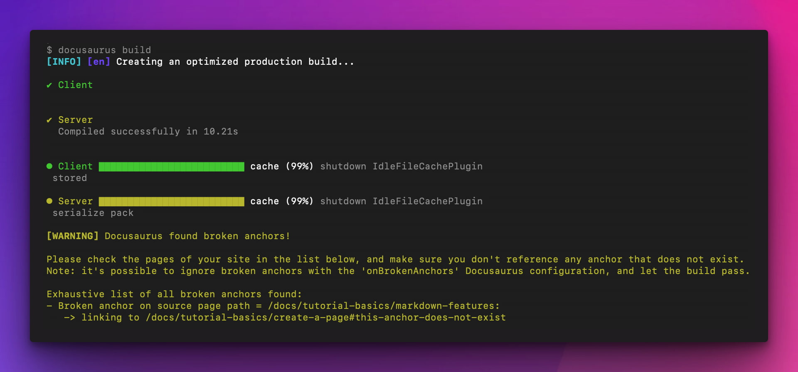

We are happy to announce **Docusaurus 3.1**.

The upgrade should be easy: as explained in our [release process documentation](/community/release-process), minor versions respect [Semantic Versioning](https://semver.org/).


<!--truncate-->

import BrowserWindow from '@site/src/components/BrowserWindow';
import IframeWindow from '@site/src/components/BrowserWindow/IframeWindow';
import ErrorBoundaryTestButton from '@site/src/components/ErrorBoundaryTestButton';

## Highlights

### Broken anchors checker

In [#9528](https://github.com/facebook/docusaurus/pull/9528), we improved the built-in broken links checker to also detect broken anchors.



:::tip[Make it fail fast]

The new [`onBrokenAnchors`](/docs/api/docusaurus-config#onBrokenAnchors) option has value `warn` by default, for retro-compatibility reasons.

We recommend to turn it to `throw` and fail your CI builds instead of deploying broken anchors to productions.

:::

:::note

For users and plugin authors implementing custom `<Heading>` and `<Link>` components, we provide a new [`useBrokenLinks`](/docs/docusaurus-core#useBrokenLinks) React hook API.

**Most Docusaurus users don't need to care about it**, built-in components (`docusaurus/Link` and `@theme/Heading`) already use it internally.

:::

### `parseFrontMatter` hook

In [#9624](https://github.com/facebook/docusaurus/pull/9624), we added a new [`siteConfig.markdown.parseFrontMatter` function hook](/docs/api/docusaurus-config#markdown).

This makes it possible to implement convenient front matter transformations, shortcuts, or to integrate with external systems using front matter that Docusaurus plugins do not support.

```js title="docusaurus.config.js"
export default {
  markdown: {
    // highlight-start
    parseFrontMatter: async (params) => {
      // Reuse the default parser
      const result = await params.defaultParseFrontMatter(params);

      // Process front matter description placeholders
      result.frontMatter.description =
        result.frontMatter.description?.replaceAll('{{MY_VAR}}', 'MY_VALUE');

      // Create your own front matter shortcut
      if (result.frontMatter.i_do_not_want_docs_pagination) {
        result.frontMatter.pagination_prev = null;
        result.frontMatter.pagination_next = null;
      }

      // Rename an unsupported front matter coming from another system
      if (result.frontMatter.cms_seo_summary) {
        result.frontMatter.description = result.frontMatter.cms_seo_summary;
        delete result.frontMatter.cms_seo_summary;
      }

      return result;
    },
    // highlight-end
  },
};
```

Read the [front matter guide](/docs/markdown-features#front-matter) and the [`parseFrontMatter` API ref](/docs/api/docusaurus-config#markdown) for details.

## Other changes

Other notable changes include:

- [#9674](https://github.com/facebook/docusaurus/pull/9674): add `siteConfig.markdown.remarkRehypeOptions` to pass options to `remark-rehype`, letting you customize things such as MDX footnote label
- [#9671](https://github.com/facebook/docusaurus/pull/9671): add code block MagicComments support for (Visual) Basic/Batch/Fortran/COBOL/ML
- [#9610](https://github.com/facebook/docusaurus/pull/9610): enable CLI port configuration via `PORT` environment variable
- [#9477](https://github.com/facebook/docusaurus/pull/9477): complete Brazilian Portuguese (pt-BR) translations

Check the **[3.1.0 changelog entry](/changelog/3.1.0)** for an exhaustive list of changes.
