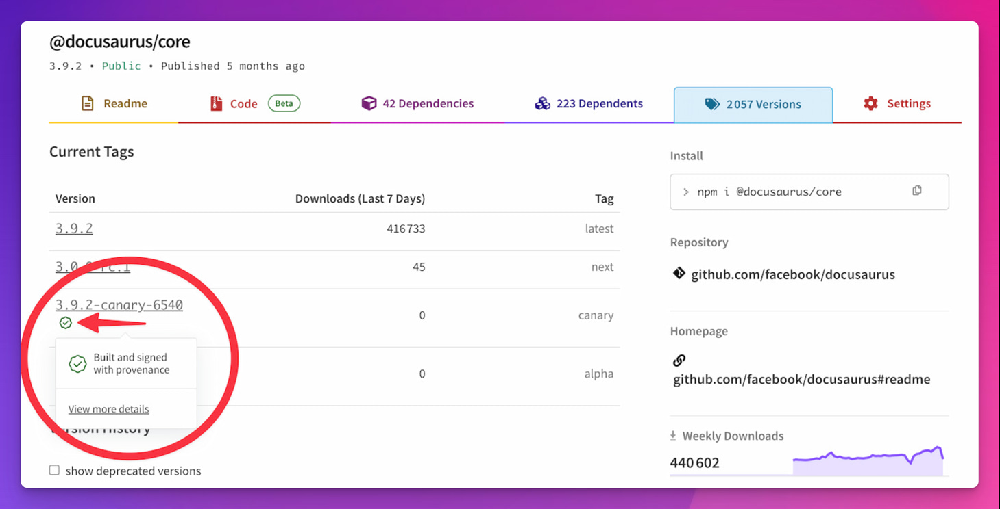
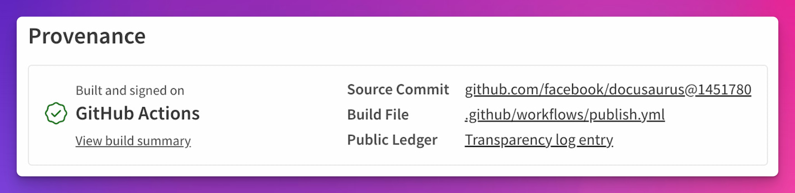

We are happy to announce **Docusaurus 3.10**.

Upgrading is easy. We follow [Semantic Versioning](https://semver.org/), and minor version updates have **no breaking changes**, accordingly to our [release process](/community/release-process).

However, if you opted in for future breaking changes with our global `v4: true` future flag to prepare for Docusaurus v4, make sure to review the [v4 future flags](#v4-future-flags) section.


{/* truncate */}

```mdx-code-block
import BrowserWindow from '@site/src/components/BrowserWindow';
```

## v4 future flags {/* #v4-future-flags */}

The [Docusaurus v4 Future Flags](/api/docusaurus-config#future) let you **opt-in for upcoming Docusaurus v4 breaking changes** incrementally and let you prepare for Docusaurus v4 ahead of time. You can enable them all at once with `future.v4: true`.

This release introduces new flags that might break your site if you use `future.v4: true`:

- [`future.v4.siteStorageNamespacing`](https://github.com/facebook/docusaurus/pull/11797): In Docusaurus v4, `localStorage` keys will be automatically namespaced by default (`theme` => `theme-<hash>`) to prevent key conflicts. This is likely to reset your site's visitor storage unless you migrate it to new key names. See the dedicated [Site Storage](#site-storage) section.
- [`future.v4.fasterByDefault`](https://github.com/facebook/docusaurus/pull/11802): Docusaurus Faster is now stable and will be enabled by default in Docusaurus v4, see the dedicated [Docusaurus Faster section](#docusaurus-faster).
- [`mdx1CompatDisabledByDefault`](https://github.com/facebook/docusaurus/pull/11896): In Docusaurus v4, MDX v1 compatibility options will be disabled by default, and you might have to adjust your docs accordingly. See the dedicated [Strict MDX section](#strict-mdx).

## Changelog TODO temp

`yarn changelog --from v3.9.2`

generated on Mar 20, 2026 from this commit: https://github.com/facebook/docusaurus/commit/6192b6a97925a8ea36e6dfa9c6082dabc0ac89ea

TODO new additions:

- mdx1compat: https://github.com/facebook/docusaurus/pull/11896
- init template mdx https://github.com/facebook/docusaurus/pull/11897
- TS 6 https://github.com/facebook/docusaurus/pull/11843

## Security {/* #security */}

There has been a **[surge in npm supply chain attacks](https://github.blog/security/supply-chain-security/our-plan-for-a-more-secure-npm-supply-chain/)**. A single compromised maintainer or npm package can ripple through the ecosystem and affect thousands of downstream users, as seen recently with the [axios compromise](https://socket.dev/blog/hidden-blast-radius-of-the-axios-compromise).

We’ve taken steps to strengthen our supply chain, and recommend securing your own site with additional measures as well.

### Trusted Publishing {/* #trusted-publishing */}

We adopted **[npm Trusted Publishing](https://docs.npmjs.com/trusted-publishers)** for [stable](https://github.com/facebook/docusaurus/pull/11819) and [canary](https://github.com/facebook/docusaurus/pull/11712) releases.

Releases are now published through a single `publish.yml` GitHub Actions workflow using short-lived OIDC tokens. Each release now has verifiable provenance, with a transparency log showing how and when it was published.





### Security Workflow {/* #security-workflow */}

In [#11874](https://github.com/facebook/docusaurus/pull/11874), we introduced a new security workflow that scans for suspicious dependency updates published on npm that affect our official packages and their transitive dependencies. It runs daily and on every pull request.

:::danger Security Limitations

This security workflow **does not protect your site**. It is designed to detect serious vulnerabilities affecting the Docusaurus ecosystem as early as possible, so we can react quickly and notify you.

Using semver dependency ranges, it's impossible to guarantee a 100% secure supply chain, since any new npm publish in our dependency graph can introduce a vulnerability. Ultimately, securing your site is your responsibility. At a minimum, you should rely on a lockfile and upgrade dependencies deliberately and cautiously.

:::

The security workflow runs the following checks:

- Install the Docusaurus site template through the [Socket Firewall](https://socket.dev/blog/introducing-socket-firewall) to detect known malware in our dependency graph
- Check for unexpected and newly introduced `preinstall` and `postinstall` lifecycle scripts, using [pnpm `strictDepBuilds`](https://pnpm.io/settings#strictdepbuilds)
- Check for usage of GitHub repository and tarball url dependencies, using [pnpm `blockExoticSubdeps`](https://pnpm.io/settings#blockexoticsubdeps)
- Check for packages that downgrade their trust level, using [pnpm `trustPolicy: no-downgrade`](https://pnpm.io/settings#trustpolicy)
- Do similar checks on our own monorepo, to protect Docusaurus maintainers and contributors

### Secure your site {/* #secure-your-site */}

Read the [npm security best practices](https://github.com/lirantal/npm-security-best-practices) guide to learn how to secure your site — and npm applications in general — from compromised dependencies.

Each package manager offers different security options that you can leverage. In our experience, [pnpm](https://pnpm.io/blog/2025/12/05/newsroom-npm-supply-chain-security) offers the best security options. We won't document all the possibilities, but here's a pnpm config example that should work well with Docusaurus:

```yaml title="pnpm-workspace.yaml"
minimumReleaseAge: 1440

blockExoticSubdeps: true

strictDepBuilds: true
allowBuilds:
  '@swc/core': true
  core-js-pure: true
  core-js: true

trustPolicy: no-downgrade
trustPolicyExclude:
  - 'detect-port@1.6.1'
  - 'semver@6.3.1'
```

:::tip Use release cooldowns

When a popular npm dependency gets compromised, the community usually notice rapidly.

When a popular npm package gets compromised, the community usually notices quickly. [Using a release cooldown](https://daniakash.com/posts/simplest-supply-chain-defense/) is an effective way to reduce risk during that time.

Modern package managers now offer a way to delay npm updates, giving time for security scanners to report vulnerabilities.

```yaml
# npm v11.10+ - .npmrc
min-release-age=7

# pnpm v10.16+ - pnpm-workspace.yaml
minimumReleaseAge: 10080

# Yarn v4.10+ - .yarnrc.yml
npmMinimalAgeGate: "7d"

# Bun v1.3+ - bunfig.toml
[install]
minimumReleaseAge = 604800
```

:::

## Docusaurus Faster stable {/* #docusaurus-faster */}

**[Docusaurus Faster](https://github.com/facebook/docusaurus/issues/10556)** lets you opting in for our modernized build infrastructure. This includes Rspack, SWC, LightningCSS, and other optimizations.

This release improves Docusaurus faster with a new [`gitEagerVcs`](gitEagerVcs) flag (explained below in [VCS](#vcs) section below) and [full support for Yarn PnP](https://github.com/facebook/docusaurus/pull/11817).

In [#11802](https://github.com/facebook/docusaurus/pull/11802), we marked **Docusaurus Faster as stable**. You now need to update your config accordingly:

```diff
const config = {
  future: {
-   experimental_faster: true,
+   faster: true,
  },
};
```

:::info Faster By Default in v4

Docusaurus Faster will be **enabled by default in Docusaurus v4**, and is already used for all newly initialized v3 sites. It is now part of our v4 future flags (`future.v4.fasterByDefault: true`) to help our community prepare for Docusaurus v4.

:::

## Site Storage stable {/* #site-storage */}

In [#11797](https://github.com/facebook/docusaurus/pull/11797), we marked the `config.storage` API as stable. You now need to update your config accordingly:

```diff
 const config = {
+  storage: {
+    type: 'localStorage',
+    namespace: true,
+  },
-  future: {
-    experimental_storage: {
-      type: 'localStorage',
-      namespace: true,
-    },
-  },
 };
```

:::info Automatic namespacing in v4

Docusaurus v4 will automatically namespace your storage keys to avoid `localStorage` key conflicts by default, and is now part of our v4 future flags (`future.v4.siteStorageNamespacing: true`). Instead of using a `theme` key, it will use `theme-<hash>`.

These storage key conflicts usually happen when running multiple `http://localhost:3000` apps, or when running multiple apps under the same domain (`https://example.com/app` and `https://example.com/docs`).

:::

## Strict MDX {/* #strict-mdx */}

This release introduces new MDX options to encourage you to use MDX in a stricter way, using native MDX syntax instead of inventing our own proprietary Docusaurus syntax on top of MDX.

Historically, Docusaurus compiled your files with MDX v1, which was quite forgiving. It allowed HTML comments `<!-- -->` and our proprietary admonitions `:::note Title` and heading ids syntax `{#headingId}`. Since then, the whole ecosystem has widely moved to MDX v3, which is stricter. Docusaurus v3 introduced `markdown.mdx1Compat` flags to help make this transition smoother.

In Docusaurus v4, we plan to turn the `markdown.mdx1Compat` options off by default. This upcoming change is now part of our [v4 future flags](#v4-future-flags) (`future.v4.mdx1CompatDisabledByDefault: true`).

We'd like to encourage the community to adopt a stricter, native MDX syntax for a few reasons:

- This makes your docs more portable, other external tools can understand them: Prettier, ESLint, TypeScript, VSCode, GitHub, and more.
- Docusaurus doesn't need to pre-process your document with RegExp before the MDX compilation

### Strict Extensions {/* #strict-extensions */}

Historically, Docusaurus has always compiled your `.md` files with MDX, parsing `<element>` as JSX instead of HTML. We now consider this a lie:

- `.md` should be parsed as CommonMark, allow `<span style="color: red;">` and reject `<span style={{color: 'red'}}>`
- `.mdx` should be parsed as MDX, allow `<span style={{color: 'red'}}>` and reject `<span style="color: red;">`

In reality, Docusaurus has only ever supported MDX, and we should have accounted for that by always using the `.mdx` extension. From now on, newly initialized Docusaurus sites will use the `.mdx` extension ([#11897](https://github.com/facebook/docusaurus/pull/11897)). We encourage you to consider moving all your files to the `.mdx` extension as well, so that external tools understand the content is MDX.

:::info About CommonMark support

Although we also have experimental support for CommonMark, it still doesn't have the feature parity of MDX ([issue](https://github.com/facebook/docusaurus/issues/9092)). Once we reach full feature parity, we'll use `markdown.format: 'detect'` to ensure that `.md` files are parsed as CommonMark instead of MDX.

:::

### Strict Admonitions {/* #strict-admonitions */}

We historically support admonitions with titles using the following syntax: `:::type My Title`. Although it is convenient, it remains a proprietary Docusaurus syntax.

Although not standardized yet, the [Markdown Directive](https://talk.commonmark.org/t/generic-directives-plugins-syntax/444) syntax is more generic and reusable. It is widely used and implemented in various ecosystems, including through the [remark-directive](https://github.com/remarkjs/remark-directive) package. For that reason, we encourage you to migrate your admonitions to the `:::type[My Title]` syntax:

```diff
-:::warning Pay Attention
+:::warning[Pay Attention]

 Content

 :::
```

### Strict Comments {/* #strict-comments */}

MDX v3 does not support HTML comments `<!-- comment -->`, but support JSX comment expressions `{/* comment */}`.

If you use HTML comments, we encourage you to consider JSX comments instead. For example, you can truncate blog posts with a JSX comment:

```diff title="blog/my-post.mdx"
 # My Blog Post

-<!-- truncate -->
+{/* truncate */}

 blog post content
```

### Strict Heading IDs {/* #strict-heading-ids */}

### MDX Heading Ids {/* #heading-ids */}

- [#11777](https://github.com/facebook/docusaurus/pull/11777) feat(cli): `write-heading-ids` CLI now supports the `--syntax` option
- [#11755](https://github.com/facebook/docusaurus/pull/11755) feat(mdx-loader): add support for explicit `headingId` based on MD/MDX comments
- [#11779](https://github.com/facebook/docusaurus/pull/11779) chore(website): migrate MDX heading ids to comment syntax + upgrade Crowdin parser version ([@slorber](https://github.com/slorber))

## Experimental VCS API {/* #vcs */}

- [#11512](https://github.com/facebook/docusaurus/pull/11512) feat(core): New siteConfig `future.experimental_vcs` API + `future.experimental_faster.gitEagerVcs` flag ([@slorber](https://github.com/slorber))
- [#11804](https://github.com/facebook/docusaurus/pull/11804) fix(utils): Git Eager VSC should have better DX ([@slorber](https://github.com/slorber))

## Translations {/* #translations */}

- 🇵🇰 [#11632](https://github.com/facebook/docusaurus/pull/11632) Add new Urdu `ur` theme translations.
- 🇧🇷 [#11533](https://github.com/facebook/docusaurus/pull/11533): Complete missing Brazilian Portuguese `pt-BR` theme translations.

## Other changes {/* #other-changes */}

Other notable changes include:

- In [#11571](https://github.com/facebook/docusaurus/pull/11571), the `siteConfig.headTags` API now accepts custom HTML elements.
- In [#11675](https://github.com/facebook/docusaurus/pull/11675), the live code block theme now has a button to reset the playground
- In [#11734](https://github.com/facebook/docusaurus/pull/11734), we split the `<DocCard>` component to make it easier to extend/swizzle. It's now easier to use assign custom emojis for the docs generated index page.
- In [#11733](https://github.com/facebook/docusaurus/pull/11733), the `<Tabs>` component now uses React context instead of props, making it possible to create custom `<TabItem>` components.
- In [#11696](https://github.com/facebook/docusaurus/pull/11696), all newly initialized TypeScript sites will have `"strict: true"` by default.
- In [#11611](https://github.com/facebook/docusaurus/pull/11611), we made it possible to create a new Docusaurus site in `.`, the current directory.
- In [#11666](https://github.com/facebook/docusaurus/pull/11666), the pages plugin can now use Markdown file path links (`[text](./other-page.md`), as the docs and blog plugin already support it.
- In [#11642](https://github.com/facebook/docusaurus/pull/11642), admonitions now class/id shortcuts, such as `:::note{.my-class #my-id}`.
- In [#11541](https://github.com/facebook/docusaurus/pull/11541) and [#11683](https://github.com/facebook/docusaurus/pull/11683), we made sure Docusaurus is compatible with the latest version of Algolia DocSearch 4.x, unlocking new features such as AskAI Suggested Questions.
- In [#11684](https://github.com/facebook/docusaurus/pull/11684) and [#11653](https://github.com/facebook/docusaurus/pull/11653), we removed
- In [#11794](https://github.com/facebook/docusaurus/pull/11794), we fixed a long-standing bug that prevented the translation of category index page titles in pagination links. many third-party dependencies from our `create-docusaurus` CLI, making it faster to create a new site.
- In [#11784](https://github.com/facebook/docusaurus/pull/11784), we changed the syntax we recommend for math equations, preferring regular Markdown code blocks over `$$` to improve docs portability.
- In [#11753](https://github.com/facebook/docusaurus/pull/11753), we added a basic `AGENTS.md` file. Let's remind that any AI usage on Docusaurus contribution must be disclosed.
- In [#11698](https://github.com/facebook/docusaurus/pull/11698), we upgraded our monorepo to React 19. We'll drop support for React 18 in Docusaurus v4.

TODO + edit changelog link!

Check the **[3.10.0 changelog entry](/changelog/3.9.0)** for an exhaustive list of changes.

```

```
