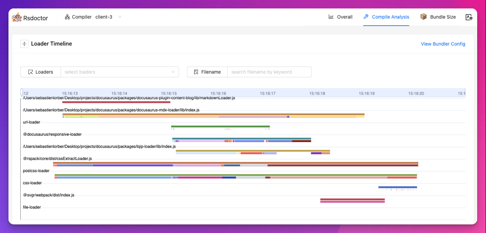
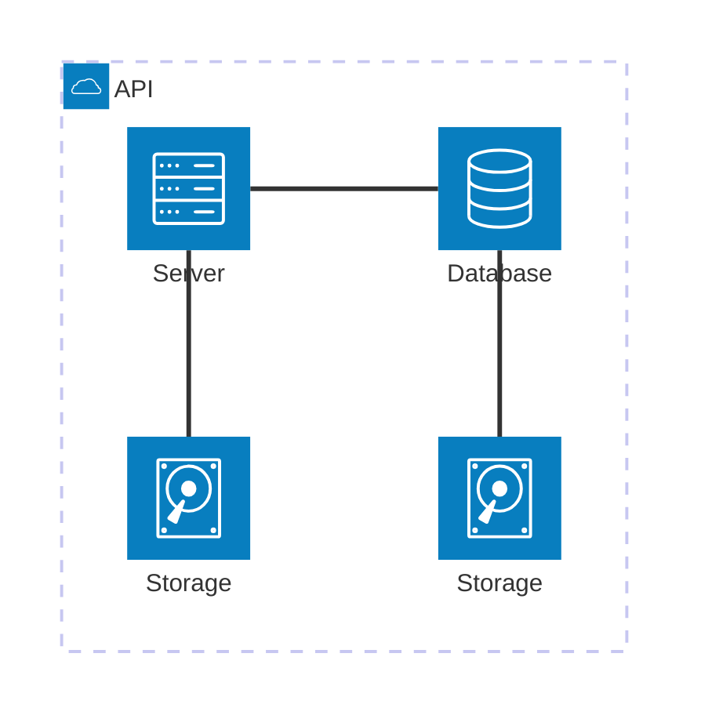

We are happy to announce **Docusaurus 3.6**.

Docusaurus is now ⚡️⚡️⚡️ **much faster** to build your site.

Upgrading should be easy. Our [release process](/community/release-process) respects [Semantic Versioning](https://semver.org/). Minor versions do not include any breaking changes.


{/* truncate */}

## Highlights

This release has been mostly focused on build performance through the [Docusaurus Faster](https://github.com/facebook/docusaurus/issues/10556) project.

## Docusaurus Faster

The [Docusaurus Faster](https://github.com/facebook/docusaurus/issues/10556) project's goal is to reduce the build times and memory consumption.

We have worked on multiple optimizations and modernized our infrastructure to use faster Rust-based tools, notably:

- 🦀 [Rspack](https://rspack.dev/): Fast Rust-based web bundler, almost drop-in replacement for [webpack](https://webpack.js.org/)
- 🦀 [SWC](https://swc.rs/): Speedy Web Compiler, Rust-based platform for the Web (HTML, CSS, JS)
- 🦀 [Lightning CSS](https://lightningcss.dev/): An extremely fast CSS parser, transformer, bundler, and minifier

### Impacts

Adopting a new infrastructure can have various impacts. It's impossible to list them all exhaustively, so let's focus on the major ones.

To help you adopt it easily, we have been fairly conservative in terms of expected static site output and [browser support](/docs/browser-support).

#### Build Time

Benchmarks on community site show that you can expect your production site to build ⚡️**2 to 4 times faster**! 🔥:

- [React Native website](https://github.com/facebook/react-native-website/pull/4268): 3.04x faster 🔥
- [Babel website](https://github.com/babel/website/pull/2997): 3.27x faster 🔥
- [Lexical website](https://github.com/facebook/lexical/pull/6761): 2x faster 🔥

[How to benchmark](https://github.com/facebook/docusaurus/issues/10556#issuecomment-2407671873)

:::note About rebuilds

[Rspack doesn't support persistent caching yet](https://rspack.dev/misc/planning/roadmap#persistent-cache), but it's on the roadmap and should be implemented soon. We think it's not a problem for the adoption of Rspack considering a cold Rspack build is usually as fast as a warm Webpack build using persistent caching.

:::

#### Memory Consumption

You should also notice an improvement in memory consumption:

- The new infrastructure consumes less memory overall
- We fixed an important [memory leak](https://github.com/facebook/docusaurus/pull/10599) that affects in particular i18n sites
- We added [CI checks](https://github.com/facebook/docusaurus/pull/10601) to ensure that we don't regress, and that our site and init template can both build in a memory-constrained environments
- We added [internal tooling](https://github.com/facebook/docusaurus/pull/10590) to better understand which step of a build consumes memory
- We [removed a `process.exit(0)`](https://github.com/facebook/docusaurus/pull/10410) that can hide memory leaks in your own code and third-party plugins

#### Other Impacts

- The HTML minifier now [emits warnings in case of invalid HTML markup](https://github.com/facebook/docusaurus/discussions/10580)
- The static HTML output is [~5% smaller](https://github.com/facebook/docusaurus/pull/10554)
- Some bugs are automatically fixed by the new infrastructure

### Adoption Strategy

This new infrastructure is a breaking change, but it is opt-in and does not require a new major version of Docusaurus.

Before using Docusaurus Faster, add this new package:

```bash npm2yarn
npm install @docusaurus/faster
```

To help you **adopt it incrementally under Docusaurus v3**, we're introducing a set of feature flags that you can activate progressively.

We recommend turning them on all at once with this simple boolean shortcut:

```js
const config = {
  future: {
    experimental_faster: true,
  },
};
```

In case one of the flags does not work for your site, it's possible to turn feature flags on independently:

```ts
const config = {
  future: {
    experimental_faster: {
      swcJsLoader: true,
      swcJsMinimizer: true,
      swcHtmlMinimizer: true,
      lightningCssMinimizer: true,
      rspackBundler: true,
      mdxCrossCompilerCache: true,
    },
  },
};
```

- [`swcJsLoader`](https://github.com/facebook/docusaurus/pull/10435): Use [SWC](https://swc.rs/) to transpile JS (instead of [Babel](https://babeljs.io/))
- [`swcJsMinimizer`](https://github.com/facebook/docusaurus/pull/10441): Use [SWC](https://swc.rs/) to minify JS (instead of [Terser](https://github.com/terser/terser))
- [`swcHtmlMinimizer `](https://github.com/facebook/docusaurus/pull/10554): Use [SWC](https://swc.rs/) to minify HTML and inlined JS/CSS (instead of [html-minifier-terser](https://github.com/terser/html-minifier-terser))
- [`lightningCssMinimizer`](https://github.com/facebook/docusaurus/pull/10522): Use [Lightning CSS](https://lightningcss.dev/) to minify CSS (instead of [cssnano](https://github.com/cssnano/cssnano) and [clean-css](https://github.com/clean-css/clean-css))
- [`rspackBundler`](https://github.com/facebook/docusaurus/pull/10402): Use [Rspack](https://rspack.dev/) to bundle your app (instead of [webpack](https://webpack.js.org/))
- [`mdxCrossCompilerCache`](https://github.com/facebook/docusaurus/pull/10479): Compile MDX files once for both browser/Node.js environments instead of twice

:::tip Experimental but safe

Don't be afraid to turn this feature on. What's experimental is the config options.

The new infrastructure is robust and well-tested by our CI pipeline. The [Docusaurus site](https://docusaurus.io/) already uses it in production, and we plan to use it on other Meta docs sites as well.

:::

#### Plugins

The new infrastructure uses [Rspack](https://rspack.dev/). By chance, Rspack is almost 100% compatible with [webpack](https://webpack.js.org/), and Rspack shouldn't break our plugin ecosystem.

Most Docusaurus plugins should work out of the box with Rspack, even those implementing [`configureWebpack`](/docs/api/plugin-methods/lifecycle-apis#configureWebpack).

However, some of them will require small modifications to make them compatible with Rspack. The general idea is to avoid importing `webpack` directly, and use the "dynamically provided" webpack instance instead:

```diff
-import webpack from 'webpack';

export default function (context, options) {
  return {
    name: 'custom-docusaurus-plugin',
-   configureWebpack(config, isServer) {
+   configureWebpack(config, isServer, {currentBundler}) {
      return {
        plugins: [
-         new webpack.DefinePlugin({}),
+         new currentBundler.instance.DefinePlugin({}),
        ]
      };
    },
  };
}
```

:::tip For plugins authors

Check the [dedicated issue](https://github.com/facebook/docusaurus/issues/10572) for guidelines and support.

:::

### Next Steps

It's only the beginning: we will continue working on the [Docusaurus Faster](https://github.com/facebook/docusaurus/issues/10556) project and already have a few more performance improvements planned.

Depending on [your feedback](https://github.com/facebook/docusaurus/issues/10556), we plan to make this new infrastructure the default in an upcoming major version of Docusaurus.

🙏 We'd like to thank the authors of all these great tools that already helped us make Docusaurus much faster than before. In particular the [Rspack team](https://rspack.dev/misc/team/core-team) that supported us along the way, handled our feedback very quickly and implemented all the missing features we needed to make it happen. 👏

## Rsdoctor plugin

In [#10588](https://github.com/facebook/docusaurus/pull/10588), we created a Docusaurus plugin for [Rsdoctor](https://rsdoctor.dev/). It analyzes the bundling phase of Docusaurus and helps you figure out what slows down the bundler in terms of loaders, plugins and minimizers. It works for both webpack and Rspack.



To use it, install the new [`@docusaurus/plugin-rsdoctor`](/docs/api/plugins/@docusaurus/plugin-rsdoctor) package, and then use the plugin in your config:

```ts title="docusaurus.config.js"
export default {
  plugins: [
    [
      'rsdoctor',
      {
        /* options */
      },
    ],
  ],
};
```

:::tip

Turn it on conditionally, based on an environment variable:

```ts title="docusaurus.config.js"
export default {
  plugins: [
    process.env.RSDOCTOR === 'true' && [
      'rsdoctor',
      {
        /* options */
      },
    ],
  ],
};
```

```bash
# Build without Rsdoctor
npm run build

# Build with Rsdoctor
RSDOCTOR=true npm run build
```

:::

## Mermaid

In [#10510](https://github.com/facebook/docusaurus/pull/10510), we relaxed our [Mermaid diagrams](https://mermaid.js.org/) dependency range to allow newer major versions of Mermaid. We now support both Mermaid 10/11, and expect upcoming versions to be compatible, letting you upgrade on your own terms.

This unlocks new types of diagrams, such as [Architecture Diagrams](https://mermaid.js.org/syntax/architecture):



## Translations

- 🇸🇮 [#10551](https://github.com/facebook/docusaurus/pull/10551): Improve Slovenian theme translations.
- 🇻🇳 [#10507](https://github.com/facebook/docusaurus/pull/10507): Improve Vietnamese theme translations.
- 🇪🇸 [#10413](https://github.com/facebook/docusaurus/pull/10413): Improve Spanish theme translations.

## Other changes

Other notable changes include:

- [#10586](https://github.com/facebook/docusaurus/pull/10586): Blog support for `frontMatter.title_meta` to override `frontMatter.title` for SEO reason.
- [#10600](https://github.com/facebook/docusaurus/pull/10600): `docusaurus build` and `docusaurus deploy` now support multiple `--locale` CLI args.
- [#10454](https://github.com/facebook/docusaurus/pull/10454): `docusaurus-remark-plugin-npm2yarn` upgrades to [`npm-to-yarn` v3](https://github.com/nebrelbug/npm-to-yarn/releases/tag/v3.0.0) and can convert `npx` commands.
- [#10612](https://github.com/facebook/docusaurus/pull/10612): Canary releases will use `3.5.2-canary-<number>` instead of `0.0.0-canary-<number>` to respect plugins `peerDependency` constraints.
- [#10547](https://github.com/facebook/docusaurus/pull/10547): `@docusaurus/tsconfig` upgrades to `target: 'es2022'`.
- [#10514](https://github.com/facebook/docusaurus/pull/10514): Remove `babel.config.js` from Docusaurus init templates to discourage customizing Babel.

Check the **[3.6.0 changelog entry](/changelog/3.6.0)** for an exhaustive list of changes.
