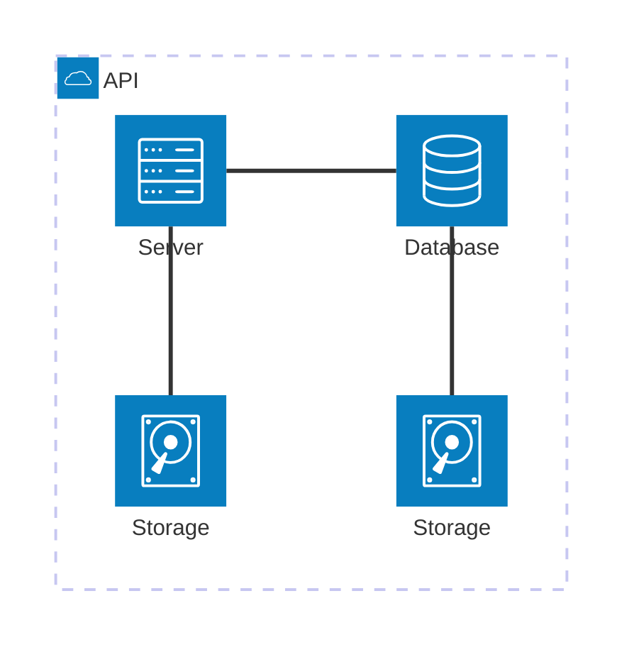

We are happy to announce **Docusaurus 3.6**.

Docusaurus is now ⚡️⚡️⚡️ **much faster** to build your site.

Upgrading should be easy. Our [release process](/community/release-process) respects [Semantic Versioning](https://semver.org/). Minor versions do not include any breaking changes.


{/* truncate */}

## Highlights

This release has been mostly focused on build performance through the [Docusaurus Faster](https://github.com/facebook/docusaurus/issues/10556) project.

## Docusaurus Faster

- [#10590](https://github.com/facebook/docusaurus/pull/10590) feat(core): add Node.js memory perf logging ([@slorber](https://github.com/slorber))
- [#10601](https://github.com/facebook/docusaurus/pull/10601) perf(ci): Add CI checks to prevent memory, build-time and build-size regressions ([@slorber](https://github.com/slorber))
- [#10410](https://github.com/facebook/docusaurus/pull/10410) refactor(core): remove useless build forceTerminate exit ([@slorber](https://github.com/slorber))
- [#10590](https://github.com/facebook/docusaurus/pull/10590) feat(core): add Node.js memory perf logging ([@slorber](https://github.com/slorber))
- [#10581](https://github.com/facebook/docusaurus/pull/10581) fix(core): fix handling of Swc html minifier warnings ([@slorber](https://github.com/slorber))
- [#10599](https://github.com/facebook/docusaurus/pull/10599) fix(core): fix i18n sites SSG memory leak - require.cache ([@slorber](https://github.com/slorber))

## Rsdoctor plugin

In [#10588](https://github.com/facebook/docusaurus/pull/10588), we created a Docusaurus plugin for [Rsdoctor](https://rsdoctor.dev/). It permits to analyze the bundling phase of Docusaurus and can help you figure out what slows down the bundler in terms of loaders, plugins and minimizers. It works for both webpack and Rspack.


To use it, install the new [`@docusaurus/plugin-rsdoctor`](/docs/api/plugins/@docusaurus/plugin-rsdoctor) package, and then use the plugin in your config:

```ts title="docusaurus.config.js"
export default {
  plugins: [
    [
      'rsdoctor',
      {
        /* options */
      },
    ],
  ],
};
```

:::tip

Turn it on conditionally, based on an environment variable:

```ts title="docusaurus.config.js"
export default {
  plugins: [
    process.env.RSDOCTOR === 'true' && [
      'rsdoctor',
      {
        /* options */
      },
    ],
  ],
};
```

```bash
# Build without Rsdoctor
npm run build

# Build with Rsdoctor
RSDOCTOR=true npm run build
```

:::

## Mermaid

In [#10510](https://github.com/facebook/docusaurus/pull/10510), we relaxed our [Mermaid diagrams](https://mermaid.js.org/) dependency range to allow newer major versions of Mermaid. We now support both Mermaid 10/11, and expect upcoming versions to be compatible, letting you upgrade on your own terms.

This unlocks new types of diagrams, such as [Architecture Diagrams](https://mermaid.js.org/syntax/architecture):



## Translations

- 🇸🇮 [#10551](https://github.com/facebook/docusaurus/pull/10551): Improve Slovenian theme translations.
- 🇻🇳 [#10507](https://github.com/facebook/docusaurus/pull/10507): Improve Vietnamese theme translations.
- 🇪🇸 [#10413](https://github.com/facebook/docusaurus/pull/10413): Improve Spanish theme translations.

## Other changes

Other notable changes include:

- [#10586](https://github.com/facebook/docusaurus/pull/10586): Blog support for `frontMatter.title_meta` to override `frontMatter.title` for SEO reason.
- [#10600](https://github.com/facebook/docusaurus/pull/10600): `docusaurus build` and `docusaurus deploy` now support multiple `--locale` CLI args.
- [#10454](https://github.com/facebook/docusaurus/pull/10454): `docusaurus-remark-plugin-npm2yarn` upgrades to [`npm-to-yarn` v3](https://github.com/nebrelbug/npm-to-yarn/releases/tag/v3.0.0) and can convert `npx` commands.
- [#10612](https://github.com/facebook/docusaurus/pull/10612): Canary releases will use `3.5.2-canary-<number>` instead of `0.0.0-canary-<number>` to respect plugins `peerDependency` constraints.
- [#10547](https://github.com/facebook/docusaurus/pull/10547): `@docusaurus/tsconfig` upgrades to `target: 'es2022'`.
- [#10514](https://github.com/facebook/docusaurus/pull/10514): Remove `babel.config.js` from Docusaurus init templates to discourage customizing Babel.

Check the **[3.6.0 changelog entry](/changelog/3.6.0)** for an exhaustive list of changes.
