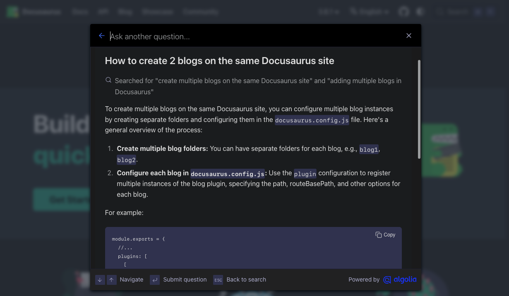
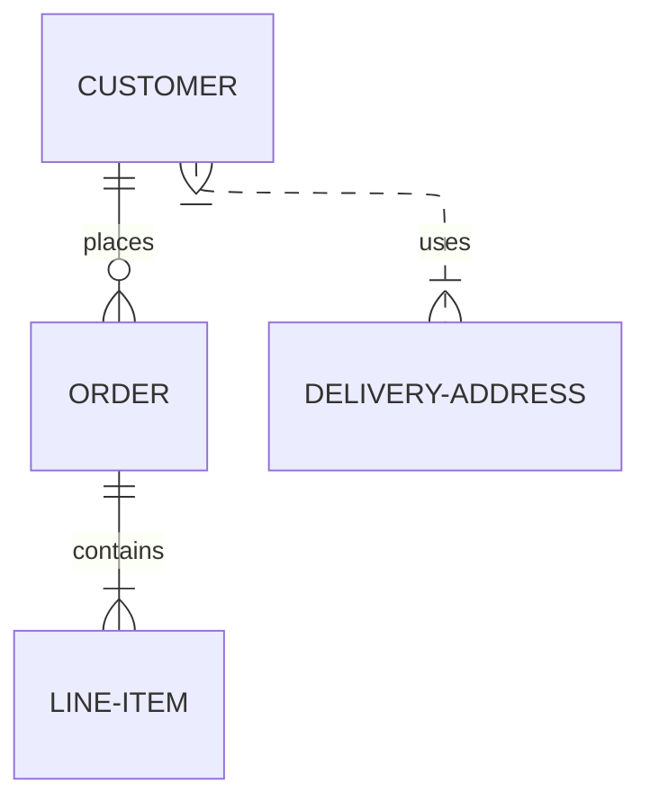

We are happy to announce **Docusaurus 3.9**.

This release drops support for Node.js 18, adds support for Algolia DocSearch v4 with AskAI, improves i18n support, adds Mermaid ELK layout support, and comes with various other improvements and bug fixes.

Upgrading is easy. We follow [Semantic Versioning](https://semver.org/), and minor version updates have **no breaking changes**, accordingly to our [release process](/community/release-process). Note that **we consider dropping End-of-Life Node.js versions as non-breaking changes**.


{/* truncate */}

```mdx-code-block
import BrowserWindow from '@site/src/components/BrowserWindow';
```

## Dropping Node.js 18

In [#11408](https://github.com/facebook/docusaurus/pull/11408), we have dropped support for Node.js 18, and the new minimum required Node.js version is now v20.0.

Although it may look like a runtime requirement breaking change, Node.js 18 reached [End-of-Life](https://nodejs.org/en/about/releases/). It [won't receive security updates](https://nodejs.org/en/blog/announcements/node-18-eol-support), and you shouldn't use it anymore. Dropping End-of-Life versions of Node.js on minor version releases is a common practice in the Node.js ecosystem (see for examples [Astro 5.8](https://astro.build/blog/astro-580/)), that we now officially endorse and document on our [release process](/community/release-process#nodejs-support).

This upgrade is further motivated by our dependencies:

- Some of our dependencies now only receive security patches on newer versions that do not support Node.js 18 anymore. See, for example, this [`webpack-dev-server@4` security warning](https://github.com/facebook/docusaurus/pull/11410). To keep the Docusaurus v3 release line secure for our users, for both the runtime and third-party dependencies, the upgrade is necessary.
- Some of our dependencies are also dropping support for Node.js 18 in minor releases, transitively impacting Docusaurus runtime requirements. For example, [Rspack 1.5 now requires Node.js 18.12](https://rspack.rs/blog/announcing-1-5), while Docusaurus v3 initially supported Node.js 18.0.

## DocSearch v4

In [#11327](https://github.com/facebook/docusaurus/pull/11327), we added support for Algolia DocSearch 4.0. This new version comes with [AskAI](https://docsearch.algolia.com/docs/v4/askai) support, letting you add an AI-powered search assistant to your Docusaurus site that can answer questions based on what's in your documentation with a conversational experience.

```mdx-code-block
<BrowserWindow
  url="http://localhost:3000/"
  bodyStyle={{padding: 0, fontSize: 0}}>
  <></>
</BrowserWindow>
```

:::caution DocSearch v4 is opt-in

Docusaurus v3 still uses DocSearch v3 by default, but now supports DocSearch v4 at runtime. Due to the **[increased bundle size and temporary code-splitting issue](https://github.com/facebook/docusaurus/pull/11327#pullrequestreview-3244560142)**, we recommend using DocSearch v4 only if you intend to use the new AskAI feature, using your package manager's resolution options:

```json title="package.json"
{
  "overrides": {
    "@docsearch/react": "^4.0.0"
  }
}
```

If you don't need AskAI, it's better to stay on DocSearch v3 for now.

:::

## i18n improvements

In [#11316](https://github.com/facebook/docusaurus/pull/11316), we added new `i18n.localeConfigs[locale].{url,baseUrl}` config options to better support complex and multi-domain i18n deployments. Previously, Docusaurus relied on hard-coded heuristics that made sense for most i18n projects, but weren't flexible enough to accommodate all use cases, leading UX and SEO issues. It is now possible to configure each locale's deployment URL and base URL independently, overriding the default values inferred by Docusaurus:

```ts title="docusaurus.config.js"
export default {
  i18n: {
    defaultLocale: 'en',
    locales: ['en', 'fr'],
    localeConfigs: {
      en: {
        // highlight-start
        url: 'https://en.docusaurus.io',
        baseUrl: '/',
        // highlight-end
      },
      fr: {
        // highlight-start
        url: 'https://fr.docusaurus.io',
        baseUrl: '/',
        // highlight-end
      },
    },
  },
};
```

In [#11304](https://github.com/facebook/docusaurus/pull/11304), we optimized our i18n infrastructure with a new `i18n.localeConfigs[locale].translate` flag that is now `false` by default for sites that do not use any translations. This leads to an improved dev experience and faster builds for non-i18n sites by avoiding unnecessary file system read attempts of the `i18n` directory.

In [#11228](https://github.com/facebook/docusaurus/pull/11228), we added a new `key` attribute to the docs sidebar items, allowing to assign explicit translation keys to each sidebar item that use the same label and would otherwise lead to translation key conflicts:

```ts title="sidebars.js"
export default {
  sidebar: [
    {
      type: 'category',
      label: 'API',
      // highlight-next-line
      key: 'api-for-feature-1',
      items: [],
    },
    {
      type: 'category',
      label: 'API',
      // highlight-next-line
      key: 'api-for-feature-2',
      items: [],
    },
  ],
};
```

## Mermaid ELK layouts

In [#11357](https://github.com/facebook/docusaurus/pull/11357), we added support for [Mermaid ELK layout algorithm](https://mermaid.js.org/intro/syntax-reference.html#supported-layout-algorithms), based on the [Eclipse Layout Kernel (ELK)](https://www.eclipse.org/elk/). Compared to the default Dagre layout, it provides more sophisticated layout capabilities and configuration options, especially useful when working with large or intricate diagrams.

You can enable it by adding the extra `@mermaid-js/layout-elk` npm dependency, making it possible to use the `layout: elk` Mermaid diagram metadata:

````md

````


## Translations

- 🇧🇷 [#11315](https://github.com/facebook/docusaurus/pull/11315): Add missing Brazilian Portuguese theme translations.
- 🇺🇦 [#11305](https://github.com/facebook/docusaurus/pull/11305): Add missing Ukrainian theme translations.

## Other changes

Other notable changes include:

- In [#11283](https://github.com/facebook/docusaurus/pull/11283), we added `siteConfig.markdown.hooks.{onBrokenMarkdownLinks,onBrokenMarkdownLinks}` and deprecated `siteConfig.onBrokenMarkdownLinks`. The new callback hooks also let you recover from broken links/images by returning a fallback URL.
- In [#11282](https://github.com/facebook/docusaurus/pull/11282), we added the `siteConfig.markdown.emoji` config option to disable the previously hard-coded `remark-emoji` behavior.
- In [#11397](https://github.com/facebook/docusaurus/pull/11397), we can now resolve site-aliased Markdown links starting with `@site/*`, that we already supported for ES imports.
- In [#11294](https://github.com/facebook/docusaurus/pull/11294) and [#11415](https://github.com/facebook/docusaurus/pull/11415), we upgraded to Rspack 1.5 and leveraging new Rspack config options to make Docusaurus build faster.
- In [#11356](https://github.com/facebook/docusaurus/pull/11356), we improved the display of docs sidebar items with long labels.
- In [#11405](https://github.com/facebook/docusaurus/pull/11405), we improved visual glitches caused by the `useColorMode()` hook when switching color modes, glitches that also affected your site's logo in the navbar.
- In [#11383](https://github.com/facebook/docusaurus/pull/11383), we disabled a Docusaurus Faster HTML minifier optimization that prevents your site's social card from displaying properly on some social platforms (e.g., LinkedIn).

Check the **[3.9.0 changelog entry](/changelog/3.9.0)** for an exhaustive list of changes.
