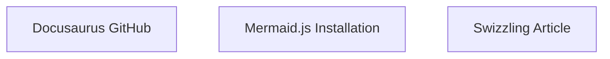
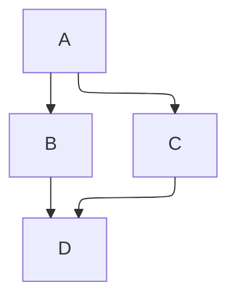

# Diagrams

Diagrams can be rendered using [Mermaid](https://mermaid-js.github.io/mermaid/) in a code block.

## Installation {#installation}

```bash npm2yarn
npm install --save @docusaurus/theme-mermaid
```

Enable Mermaid functionality by adding plugin `@docusaurus/theme-mermaid` and setting `markdown.mermaid` to `true` in your `docusaurus.config.js`.

```js title="docusaurus.config.js"
export default {
  markdown: {
    mermaid: true,
  },
  themes: ['@docusaurus/theme-mermaid'],
};
```

## Usage {#usage}

Add a code block with language `mermaid`:

````md title="Example Mermaid diagram"

````


See the [Mermaid syntax documentation](https://mermaid-js.github.io/mermaid/#/./n00b-syntaxReference) for more information on the Mermaid syntax.

## Theming {#theming}

The diagram dark and light themes can be changed by setting `mermaid.theme` values in the `themeConfig` in your `docusaurus.config.js`. You can set themes for both light and dark mode.

```js title="docusaurus.config.js"
export default {
  themeConfig: {
    mermaid: {
      theme: {light: 'neutral', dark: 'forest'},
    },
  },
};
```

See the [Mermaid theme documentation](https://mermaid-js.github.io/mermaid/#/theming) for more information on theming Mermaid diagrams.

### Styling tooltips {#styling-tooltips}

Mermaid charts support [Interactions](https://docs.mermaidchart.com/mermaid-oss/syntax/flowchart.html#interaction), which allow you to add hyperlinks to your diagrams. These hyperlinks can include tooltips that appear when hovering over elements in the diagram. Tooltips do not appear by default, but you can enable them by adding a custom `.mermaidTooltip` CSS class to your [site's stylesheet](../../styling-layout.mdx) (customize as you see fit).

```css title="src/css/custom.css"
.mermaidTooltip {
  position: absolute;
  text-align: center;
  max-width: 200px;
  padding: 2px;
  background: var(--ifm-background-color);
  border: 1px solid var(--ifm-color-primary);
  border-radius: 2px;
  pointer-events: none;
  z-index: 100;
}
```

When a `.mermaidTooltip` class is defined, tooltips will appear on hover over any diagram elements that include a `click` directive. For example,

````md title="Example Mermaid diagram with clickable elements and tooltips"

````

Will yield clickable elements with tooltips:


## Mermaid Config {#configuration}

Options in `mermaid.options` will be passed directly to `mermaid.initialize`:

```js title="docusaurus.config.js"
export default {
  themeConfig: {
    mermaid: {
      options: {
        maxTextSize: 50,
      },
    },
  },
};
```

See the [Mermaid config documentation](https://mermaid-js.github.io/mermaid/#/./Setup?id=configuration) and the [Mermaid config types](https://github.com/mermaid-js/mermaid/blob/master/packages/mermaid/src/config.type.ts) for the available config options.

## Dynamic Mermaid Component {#component}

To generate dynamic diagrams, you can use the `Mermaid` component:

```mdx title="Example of dynamic Mermaid component"
import Mermaid from '@theme/Mermaid';

<Mermaid
  value={`graph TD;
    A-->B;
    A-->C;
    B-->D;
    C-->D;`}
/>
```

## Layouts

Mermaid supports different [layout engines](https://mermaid.js.org/intro/syntax-reference.html#layout-and-look):

- The `dagre` layout engine is supported by default in Docusaurus.
- The `elk` layout engine is heavier and can be enabled by installing the optional `@mermaid-js/layout-elk` dependency.

````md

````


