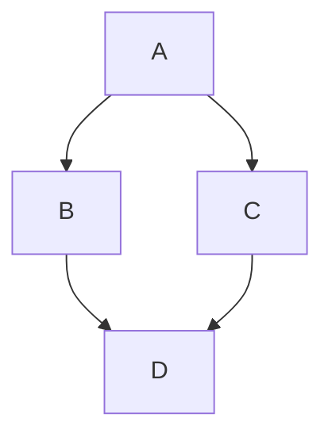
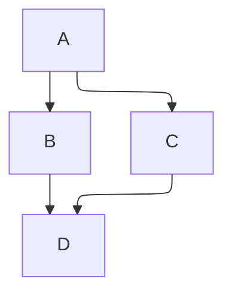

import BrowserWindow from '@site/src/components/BrowserWindow';

# Diagrams

Diagrams can be rendered using [Mermaid](https://mermaid-js.github.io/mermaid/) in a code block.

## Installation {/* #installation */}

```bash npm2yarn
npm install --save @docusaurus/theme-mermaid
```

Enable Mermaid functionality by adding plugin `@docusaurus/theme-mermaid` and setting `markdown.mermaid` to `true` in your `docusaurus.config.js`.

```js title="docusaurus.config.js"
export default {
  markdown: {
    mermaid: true,
  },
  themes: ['@docusaurus/theme-mermaid'],
};
```

## Usage {/* #usage */}

Add a code block with language `mermaid`:

````md title="Example Mermaid diagram"

```mermaid
graph TD;
    A-->B;
    A-->C;
    B-->D;
    C-->D;
```
````

<BrowserWindow>


```mermaid
graph TD;
    A-->B;
    A-->C;
    B-->D;
    C-->D;
```

</BrowserWindow>

See the [Mermaid syntax documentation](https://mermaid-js.github.io/mermaid/#/./n00b-syntaxReference) for more information on the Mermaid syntax.

## Theming {/* #theming */}

The diagram dark and light themes can be changed by setting `mermaid.theme` values in the `themeConfig` in your `docusaurus.config.js`. You can set themes for both light and dark mode.

```js title="docusaurus.config.js"
export default {
  themeConfig: {
    mermaid: {
      theme: {light: 'neutral', dark: 'forest'},
    },
  },
};
```

See the [Mermaid theme documentation](https://mermaid-js.github.io/mermaid/#/theming) for more information on theming Mermaid diagrams.

## Mermaid Config {/* #configuration */}

Options in `mermaid.options` will be passed directly to `mermaid.initialize`:

```js title="docusaurus.config.js"
export default {
  themeConfig: {
    mermaid: {
      options: {
        maxTextSize: 50,
      },
    },
  },
};
```

See the [Mermaid config documentation](https://mermaid-js.github.io/mermaid/#/./Setup?id=configuration) and the [Mermaid config types](https://github.com/mermaid-js/mermaid/blob/master/packages/mermaid/src/config.type.ts) for the available config options.

## Dynamic Mermaid Component {/* #component */}

To generate dynamic diagrams, you can use the `Mermaid` component:

```mdx title="Example of dynamic Mermaid component"
import Mermaid from '@theme/Mermaid';

<Mermaid
  value={`graph TD;
    A-->B;
    A-->C;
    B-->D;
    C-->D;`}
/>
```

## Layouts {/* #layouts */}

Mermaid supports different [layout engines](https://mermaid.js.org/intro/syntax-reference.html#layout-and-look):

- The `elk` layout engine is bundled and used by default for supported diagram types.
- The `dagre` layout engine is also bundled and can be selected explicitly.

### Site-wide layout {/* #site-wide-layout */}

To use Dagre across your site, set `themeConfig.mermaid.options.layout`:

```js title="docusaurus.config.js"
export default {
  themeConfig: {
    mermaid: {
      options: {
        layout: 'dagre',
      },
    },
  },
};
```

### Per-diagram layout {/* #per-diagram-layout */}

To use Dagre for a single diagram, set `layout: dagre` in its Mermaid front matter. This overrides the site-wide layout. Use `layout: elk` to select ELK explicitly.

````md

```mermaid
---
config:
  layout: dagre
---
graph TD;
    A-->B;
    A-->C;
    B-->D;
    C-->D;
```
````

The same diagram rendered with each layout:

<div className="row">
<div className="col col--6">

**ELK (default)**

<BrowserWindow>


```mermaid
---
config:
  layout: elk
---
graph TD;
    A-->B;
    A-->C;
    B-->D;
    C-->D;
```

</BrowserWindow>

</div>
<div className="col col--6">

**Dagre**

<BrowserWindow>


```mermaid
---
config:
  layout: dagre
---
graph TD;
    A-->B;
    A-->C;
    B-->D;
    C-->D;
```

</BrowserWindow>

</div>
</div>
