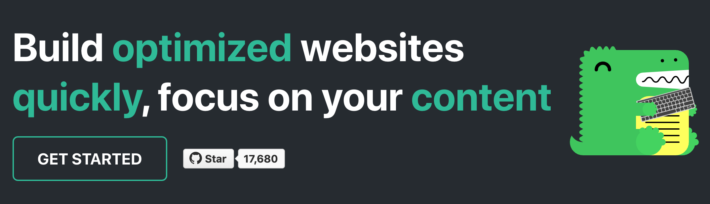

import Tabs from '@theme/Tabs';
import TabItem from '@theme/TabItem';

In general, every website needs assets: images, stylesheets, favicons and etc. In such cases, you can create a directory named `static` at the root of your project. Every file you put into that directory will be copied into the the root of the generated `build` folder with the directory hierarchy preserved. E.g. if you add a file named `sun.jpg` to the static folder, it’ll be copied to `build/sun.jpg`.

This means that if the site's `baseUrl` is `/`, an image in `/static/img/docusaurus_keytar.svg` is available at `/img/docusaurus_keytar.svg`.

## Referencing assets with respect to `baseUrl`

You can reference assets from the `static` folder in your code. You could use hardcoded absolute paths, i.e. starting with a slash /, but remember to include the `baseUrl` if it is not `/`. However, this will break if you change your `baseUrl` in the config.

A better way would be to use the `useBaseUrl` utility function which appends the `baseUrl` to paths for you.

### JSX example

```jsx title="MyComponent.js"
import useBaseUrl from '@docusaurus/useBaseUrl';

;
```

You can also import SVG images, which will be transformed into React components.

```jsx title="MyComponent.js"
import DocusaurusLogoWithKeytar from '@site/static/img/docusaurus_keytar.svg';

<DocusaurusLogoWithKeytar title="Docusaurus Logo" className="logo" />;
```

### Markdown example

Thanks to MDX, you can also use `useBaseUrl` utility function in Markdown files! You'd have to use `` tags instead of the Markdown image syntax though. The syntax is exactly the same as in JSX.

```jsx title="my-doc.mdx"
---
id: my-doc
title: My Doc
---

// Add to the top of the file below the front matter.
import useBaseUrl from '@docusaurus/useBaseUrl';

...


```

You could also just use Markdown image syntax, but you would have to manually maintain the image paths yourself and isn't recommended.

```md title="my-doc.md"

```

## Referencing assets using relative path

Sometimes, it is more convenient to co-locate the asset next to the markdown/javascript file that uses it.

We have setup Webpack loaders to handle most common file types, so that when you import a file, you get its url, and the asset is automatically copied to the output folder.

We'll take a look at how we can reference various file types using relative path for both MDX and JSX. Let's imagine we have the following file structure:

<Tabs
  groupId="file-type"
  defaultValue="mdx"
  values={[
    {label: 'MDX', value: 'mdx'},
    {label: 'JSX', value: 'jsx'},
  ]
}>
<TabItem value="mdx">

```
# Your markdown file - you want to use some assets here
/website/docs/my-doc.mdx

# Some assets you want to use
/website/docs/assets/docusaurus-asset-example-banner.png
/website/docs/assets/docusaurus-asset-example-pdf.pdf
/website/docs/assets/docusaurus-asset-example.xyz
```
</TabItem>
<TabItem value="jsx">

```
# Your JS file - you want to use some assets here
/website/src/pages/myComponent.js

# Some assets you want to use
/website/src/pages/assets/docusaurus-asset-example-banner.png
/website/src/pages/assets/docusaurus-asset-example-pdf.pdf
/website/src/pages/assets/docusaurus-asset-example.xyz
```
</TabItem>
</Tabs>

### Image assets

You can use images by requiring them and using an image tag through MDX or JSX.

<Tabs
  groupId="file-type"
  defaultValue="mdx"
  values={[
    {label: 'MDX', value: 'mdx'},
    {label: 'JSX', value: 'jsx'},
  ]
}>
<TabItem value="mdx">

```mdx title="my-doc.mdx"


or


```

The ES imports syntax also works:

```mdx title="my-doc.mdx"
import myImageUrl from './assets/docusaurus-asset-example-banner.png';


```


</TabItem>
<TabItem value="jsx">

```js title="myComponent.js"

```

The ES imports syntax also works:

```js title="myComponent.js"
import myImageUrl from './assets/docusaurus-asset-example-banner.png';


```

</TabItem>
</Tabs>

This displays the following image:


:::note

If you are using [@docusaurus/plugin-ideal-image](./using-plugins.md#docusaurusplugin-ideal-image), you need to use the dedicated image component, as documented.

:::

### Common assets

In the same way, you can link to existing assets by requiring them and using the returned url in videos, links etc.

<Tabs
  groupId="file-type"
  defaultValue="mdx"
  values={[
    {label: 'MDX', value: 'mdx'},
    {label: 'JSX', value: 'jsx'},
  ]
}>
<TabItem value="mdx">

```mdx title="my-doc.mdx"
<a
  target="_blank"
  href={require('./assets/docusaurus-asset-example-pdf.pdf').default}>
  Download this PDF !!!
</a>

or 

[Download this PDF using Markdown !!!](./assets/docusaurus-asset-example-pdf.pdf)
```

This results in the following links:

<a
  target="_blank"
  href={require('./assets/docusaurus-asset-example-pdf.pdf').default}>
  Download this PDF !!!
</a>


[Download this PDF using Markdown !!!](./assets/docusaurus-asset-example-pdf.pdf)
</TabItem>
<TabItem value="jsx">

```js title="myComponent.js"
<a
  target="_blank"
  href={require('./assets/docusaurus-asset-example-pdf.pdf').default}>
  Download this PDF !!!
</a>
```

This results in the following links:

<a
  target="_blank"
  href={require('./assets/docusaurus-asset-example-pdf.pdf').default}>
  Download this PDF !!!
</a>
</TabItem>
</Tabs>

### Unknown assets

This `require` method is not supported for all file extensions, but as an escape hatch you can use the special Webpack syntax to force the `file-loader` to kick-in.

<Tabs
  groupId="file-type"
  defaultValue="mdx"
  values={[
    {label: 'MDX', value: 'mdx'},
    {label: 'JSX', value: 'jsx'},
  ]
}>
<TabItem value="mdx">

```mdx title="my-doc.mdx"
<a
  target="_blank"
  href={require('!file-loader!./assets/docusaurus-asset-example.xyz').default}>
  Download this unknown file !!!
</a>

or

[Download this unknown file using Markdown](!file-loader!./assets/docusaurus-asset-example.xyz)
```

This results in the following links:

<a
  target="_blank"
  href={require('!file-loader!./assets/docusaurus-asset-example.xyz').default}>
  Download this unknown file !!!
</a>

[Download this unknown file using Markdown !!!](!file-loader!./assets/docusaurus-asset-example.xyz)

</TabItem>
<TabItem value="jsx">

```js title="myComponent.js"
<a
  target="_blank"
  href={require('!file-loader!./assets/docusaurus-asset-example.xyz').default}>
  Download this unknown file !!!
</a>
```

This results in the following links:

<a
  target="_blank"
  href={require('!file-loader!./assets/docusaurus-asset-example.xyz').default}>
  Download this unknown file !!!
</a>

</TabItem>
</Tabs>

#### Extra: Image links

You can even use images as links. For example, you can download a pdf file (using markdown) by clicking on the following image.

```mdx title="my-doc.mdx"
[](./assets/docusaurus-asset-example-pdf.pdf)
```

[](./assets/docusaurus-asset-example-pdf.pdf)


## Caveats

Keep in mind that:

- By default, none of the files in `static` folder will be post-processed or minified.
- Missing files references via hardcoded absolute paths will not be detected at compilation time, and will result in a 404 error.
- By default, GitHub Pages runs published files through [Jekyll](https://jekyllrb.com/). Since Jekyll will discard any files that begin with `_`, it is recommended that you disable Jekyll by adding an empty file named `.nojekyll` file to your `static` directory if you are using GitHub pages for hosting.
