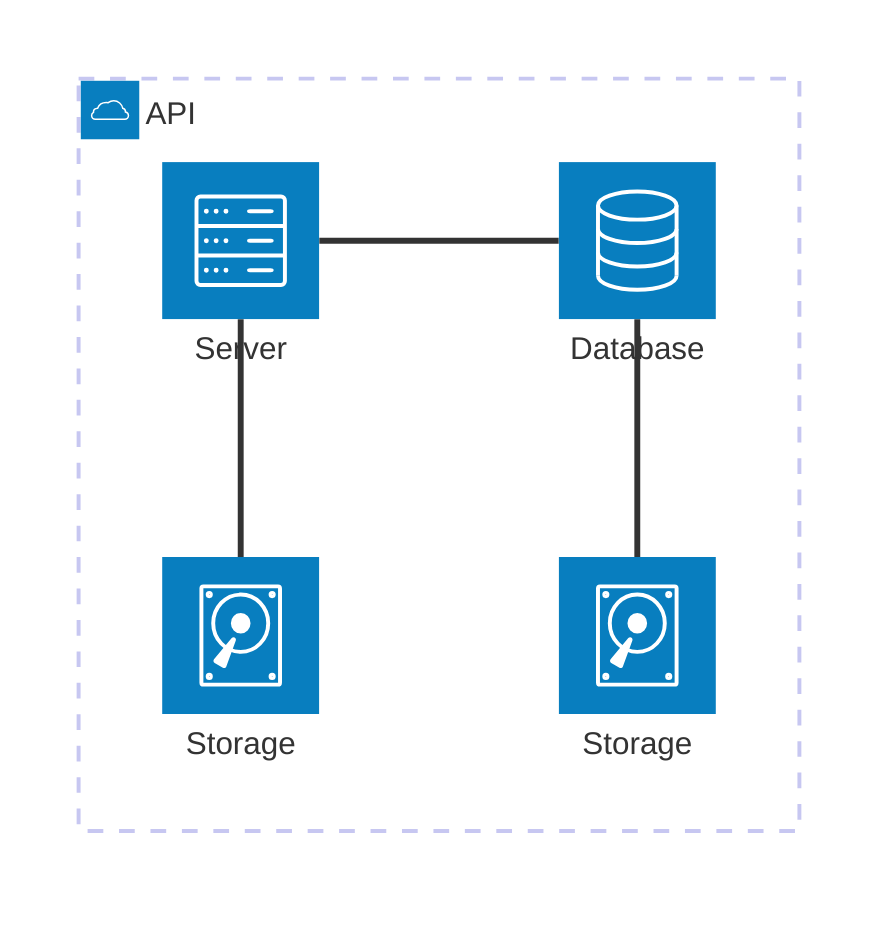

我们很高兴地宣布 **Docusaurus 3.6** 现已发布。

Docusaurus 现在可以⚡️⚡️⚡️: **更快的** 构建你的网站。

Upgrading should be easy. Our [release process](/community/release-process) respects [Semantic Versioning](https://semver.org/). Minor versions do not include any breaking changes.


{/_ truncate _/}

## 精彩内容

该版本主要专注于通过 [Docusaurus Faster](https://github.com/facebook/docusaurus/issues/10556) 项目构建性能。

## Docusaurus Faster

[Docusaurus Faster](https://github.com/facebook/docusaurus/issues/10556)项目的目标是减少构建时间和内存消耗。

我们致力于多个优化和使我们的基础设施现代化，以便更快地使用基于Rus的工具，特别是：

- 🦀 [Rspack](https://rspack.dev/): 基于Rust的快速网页打包工具, 几乎是可以作为 [webpack](https://webpack.js.org/)的完全替代品
- 🦀 [SWC](https://swc.rs/): 快速的网页编辑器，基于Rust的网页平台(HTML, CS, JS)
- 🦀 [Lightning CSS](https://lightningcss.dev/): 一个极为快速的 CSS 解析器、翻译器、打包工具和压缩器。

### 影响

采用新的基础设施可能会产生各种影响。 由于不可能将所有问题全部列举出来，因此我们将重点关注主要的几个。

为了帮助您轻松地使用它，我们在预期的静态站点输出和[浏览器支持](/docs/browser-support) 方面相当保守。

#### 构建时间

社区网站上的基准测试显示，您可以期待您的生产网站构建速度 ⚡️ 提高 2 到 4 倍！ 🔥:

- [React Native website](https://github.com/facebook/react-native-website/pull/4268): 速度提升了 3.04x 倍 🔥
- [Babel website](https://github.com/babel/website/pull/2997): 速度提升了 3.27x 倍 🔥
- [Lexical website](https://github.com/facebook/lexical/pull/6761): 速度提升了 2x 倍 🔥

[如何进行基准测试](https://github.com/facebook/docusaurus/issues/10556#issuecomment-2407671873)

:::note 关于重建

[Rspack 目前尚不支持持久缓存](https://rspack.dev/misc/planning/rowmap#persistent-cache)，但它在开发路线图上，预计很快会实现。 我们认为，这对 Rspack 的采用并不是一个问题，因为冷启动的 Rspack 构建通常与使用持久缓存的热 Webpack 构建一样快。

:::

#### 内存消耗

您还应该注意到内存消耗的改进：

- 新基础设施消耗总内存减少
- 我们修复了一个重要的[内存泄漏](https://github.com/facebook/docusaurus/pull/10599)，它特别影响到i18n 站点
- 我们添加了[CI检查](https://github.com/facebook/docusaurus/pull/10601)，以确保我们不会出现回归问题，并且我们的站点和初始化模版都能在内存受限的环境中构建。
- 我们添加了[内部工具](https://github.com/facebook/docusaurus/pull/10590)以更好地理解构建的哪一步消耗内存
- 我们[移除了一个 `process.exit(0)`](https://github.com/facebook/docusaurus/pull/10410)，该代码可能会掩盖您自己代码和第三方插件中的内存泄漏问题。

#### 其他影响

- HTML 压缩器现在可以[在出现无效的 HTML markup时发出警告](https://github.com/facebook/docusaurus/discussions/10580)
- 静态 HTML 输出 [减少了~5%的大小](https://github.com/facebook/docusaurus/pull/10554)
- 一些错误被新的基础结构自动修复

### 采用策略

这种新的基础设施是一种突破性的变化，但它是选择性的，不需要新版本的Docusaurus。

在使用 Docusaurus 更快之前，添加这个新包：

```bash npm2yarn
npm install @docusaurus/faster
```

为了帮助您在 **在Docusaurus v3**中逐步采用它，我们引入了一组可以逐步激活的功能标志。

我们建议通过这个简单的布尔快捷方式一次性启用它们：

```js
const config = {
  future: {
    experimental_faster: true,
  },
};
```

如果其中一个功能标志不适用于您的网站，可以独立启用功能标志：

```ts
const config = {
  future: {
    experimental_faster: {
      swcJsLoader: true,
      swcJsMinimizer: true,
      swcHtmlMinimizer: true,
      lightningCssMinimizer: true,
      rspackBundler: true,
      mdxCrossCompilerCache: true,
    },
  },
};
```

- [`swcJsLoader`](https://github.com/facebook/docusaurus/pull/10435): 使用 [SWC](https://swc.rs/) 转换JS(而不是 [Babel](https://babeljs.io/))
- [`swcJsLoader`](https://github.com/facebook/docusaurus/pull/10441): 使用 [SWC](https://swc.rs/) 转换JS(而不是 [Babel](https://github.com/terser/terser))
- [`swcHtmlMinimizer `](https://github.com/facebook/docusaurus/pull/10554): 使用 [SWC](https://swc.rs/) 来挖掘HTML和嵌入式JS/CSS(而不是 [html-minifier-terser](https://github.com/terser/html-minifier-terser))
- [`lightningCssMinimizer`](https://github.com/facebook/docusaurus/pull/10522)：使用 [Lightning CSSS](https://lightningcss.dev/) 来缩小CSS (而不是 [cssnano](https://github.com/cssnano/cssnano) 和 [clean-css](https://github.com/clean-css/clean-css))
- [`rspackBundler`](https://github.com/facebook/docusaurus/pull/10402)：使用 [Rspack](https://rspack.dev/) 打包您的应用程序(而不是 [webpack](https://webpack.js.org/))
- [`mdxCrossCompilerCache`](https://github.com/facebook/docusaurus/pull/10479)：一次同时为浏览器/Node.js环境编译MDX文件，而不是两次。

:::tip 实验功能但安全

不要害怕打开此功能。 配置选项是实验性的。

新的基础设施是牢固的，我们的综合基础设施管道对其进行了很好的考验。 [Docusaurus网站](https://docusaurus.io/)已经在生产中使用了它，我们也计划在其他Meta文档网站上使用它。

:::

#### 插件

新的基础设施使用 [Rspack](https://rspack.dev/)。 碰巧的是，Rspack 与 [webpack](https://webpack.js.org/) 几乎 100% 兼容，并且 Rspack 不会破坏我们的插件生态系统。

大多数Docusaurus插件都应该可以与Rspack开箱即用，即使是那些实现了[`configureWebpack`](/docs/api/plugin-methods/lifecycle-apis#configureWebpack) 的插件。

然而，其中有些需要做小的修改，以使其与Rspack兼容。 一般的想法是避免直接导入 `webpack` ，而是使用 "动态提供" webpack 实例：

```diff
-import webpack from 'webpack';

export default function (context, options) {
  return {
    name: 'custom-docusaurus-plugin',
-   configureWebpack(config, isServer) {
+   configureWebpack(config, isServer, {currentBundler}) {
      return {
        plugins: [
-         new webpack.DefinePlugin({}),
+         new currentBundler.instance.DefinePlugin({}),
        ]
      };
    },
  };
}
```

:::tip 插件作者

查看[专用问题](https://github.com/facebook/docusaurus/issues/10572)获取指南和支持。

:::

### 后续步骤

这是一个开端：我们将继续开发[Docusaurus Faster](https://github.com/facebook/docusaurus/issues/10556)项目，并且已经计划了一些更多的性能改进。

取决于[您的反馈](https://github.com/facebook/docusaurus/issues/10556), 我们计划在即将到来的主要版本Docusaurus中将此新基础设施设置为默认。

🙏 我们感谢所有这些伟大工具的作者，这些工具已经帮助我们使Docusaurus比以前快得多。 特别感谢 [Rspack 团队](https://rspack.dev/misc/team/core-team) 在整个过程中对我们的支持，他们迅速处理了我们的反馈，并现了我们所需的所有缺失功能，使这一切得以顺利进行。 👏

## Rsdoctor 插件

在 [#10588](https://github.com/facebook/docusaurus/pull/10588)中, 我们创建了一个 [Rsdoctor](https://rsdoctor.dev/)的Docusaurus插件. 它分析了 Docusaurus 的打包阶段，帮助你找出在加载器、插件和压缩器方面导致打包速度变慢的原因。 它同时适用于webpack 和 Rspack。


要使用它，请安装新的 [`@docusaurus/plugin-rsdoctor`](/docs/api/plugins/@docusaurus/plugin-rsdoctor) 包，然后在你的配置中使用插件：

```ts title="docusaurus.config.js"
export default {
  plugins: [
    [
      'rsdoctor',
      {
        /* options */
      },
    ],
  ],
};
```

:::tip

基于环境变量有条件地启用它：

```ts title="docusaurus.config.js"
export default {
  plugins: [
    process.env.RSDOCTOR === 'true' && [
      'rsdoctor',
      {
        /* options */
      },
    ],
  ],
};
```

```bash
# Build without Rsdoctor
npm run build

# Build with Rsdoctor
RSDOCTOR=true npm run build
```

:::

## Mermaid

在 [#10510](https://github.com/facebook/docusaurus/pull/10510) 中，我们放宽了我们的 [Mermaid diagrams](https://mermaid.js.org/) 依赖范围以允许较新的主要版本的Mermaid。 我们现在支持 Mermaid 10 和 11，并预计即将发布的版本也将兼容，让您可以根据自己的需求进行升级。

解锁了新的图表类型，例如 [架构图](https://mermaid.js.org/syntax/structure)：



## Translations

- 🇸🇮 [#10551](https://github.com/facebook/docusaurus/pull/10551): 改进斯洛文尼亚语翻译。
- :越南：[#10507](https://github.com/facebook/docusaurus/pull/10507)：改进越南主题翻译。
- 🇪🇸 [#10413](https://github.com/facebook/docusaurus/pull/10413): 改进西班牙语主题的翻译。

## 其他改变：

Other notable changes include:

- [#10586](https://github.com/facebook/docusaurus/pull/10586): 博客支持 `frontMatter.title_meta` 以基于SEO 的理由覆盖 `frontMatter.title` 。
- [#10600](https://github.com/facebook/docusaurus/pull/10600): `docusaurus build` and `docusaurus depl` 现在支持多个`--locale` CLI args.
- [#10454](https://github.com/facebook/docusaurus/pull/10454): `docusaurus-mot-plugin-npm2yarn` 升级到 [`npmto-yarn` v3](https://github.com/nebrelbug/npm-to yarn/releases/tag/v3.0.0.0) 并可以转换 `npx` 命令。
- [#10612](https://github.com/facebook/docusaurus/pull/10612)：Canary releases will used `3.5.2-canary-<number>` 而不是`0.0.0-canary-<number>` for respect plugins `peerDependency`。
- [#10547](https://github.com/facebook/docusaurus/pull/10547): `@docusaurus/tsconfig` 升级到 \`target: 'es2022'
- [#10514](https://github.com/facebook/docusaurus/pull/10514)：从Docusaurus init 模板中删除`babel.config.js`，以阻止定制Babel。

查看 **[3.6.0 changelog entry](/changelog/3.6.0)** 以获取更详细的变更列表
