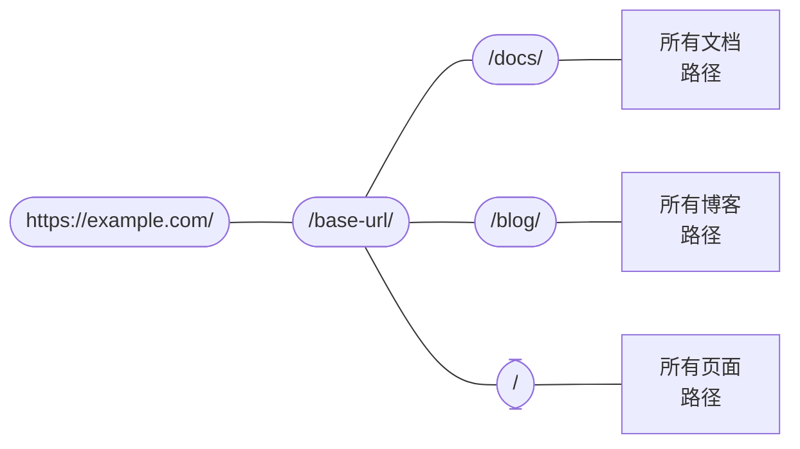

# 路由

```mdx-code-block
import Link from '@docusaurus/Link';
import {useLatestVersion, useActiveDocContext} from '@docusaurus/plugin-content-docs/client';
import {useLocation} from '@docusaurus/router';
import BrowserWindow from '@site/src/components/BrowserWindow';
```

Docusaurus 的路由系统遵循单页应用的传统：一个路由对应一个组件。 在本节中，我们会首先讨论三个内容插件（文档、博客和页面）所创建的路由，然后再讨论底层的路由系统。

## 内容插件创建的路由 {#routing-in-content-plugins}

每个内容插件都提供 一个 `routeBasePath` 选项。 它定义了插件创造的路径的公共前缀。 默认情况下，文档插件的路径会以 `/docs` 开头；博客插件以 `/blog` 开头；页面插件则以 `/` 开头。 你可以想象这样的路由结构：



所有路径都会与这个嵌套路由配置匹配，直到找到一个恰当的匹配。 比如，给定路径 `/docs/configuration`，Docusaurus 会进入 `/docs` 分支，然后在文档插件创建的子路径中搜索。

更改 `routeBasePath` 可以有效改变网站的路由结构。 比如，在[仅文档模式](../guides/docs/docs-introduction.mdx#docs-only-mode)中，我们提到，为文档配置 `routeBasePath： '/'` 意味着文档插件创建的所有路由都没有 `/docs` 前缀，然而它并不会阻止其他插件创建更多的子路由，比如 `/blog`。

接下来，让我们看看这三个插件是如何构建它们自己的「子路由盒子」的。

### 页面路由 {#pages-routing}

页面路由非常简单：文件路径直接映射到 URL，没有其他方法自定义。 更多信息请参阅[页面文档](../guides/creating-pages.mdx#routing)。

Markdown 页面使用的组件是 `@theme/MDXPage`。 React 页面会被直接用作路由组件。

### 博客路由 {#blog-routing}

博客会创建以下路径：

- **帖子列表页面**：`/`、`/page/2`、`/page/3`……
  - 路径可以通过 `pageBasePath` 选项自定义。
  - 组件是 `@theme/BlogListPage`。
- **帖子页面**：`/2021/11/21/algolia-docsearch-migration`、`/2021/05/12/announcing-docusaurus-two-beta`……
  - 通过每个 Markdown 文件生成。
  - 路径可以通过 `slug` 前言完全自定义。
  - 组件是 `@theme/BlogPostPage`。
- **标签列表页**：`/tags`
  - 路径可以通过 `tagsBasePath` 选项自定义。
  - 组件是 `@theme/BlogTagsListPage `。
- **标签页**：`/tags/adoption`、`/tags/beta`……
  - 通过每个帖子的 `tags` 前言定义的标签生成。
  - 路径的前缀通过 `tagsBasePath` 定义，但子路径可以通过标签的 `permalink` 字段自定义。
  - 组件是 `@theme/BlogTagsPostsPage`。
- **总览页**：`/archive`
  - 路径可以通过 `archiveBasePath` 选项自定义。
  - 组件是 `@theme/BlogArchivePage`。

### 文档路由 {#docs-routing}

文档插件是唯一一个会创建**嵌套路由**的插件。 它会在顶部注册[**版本路径**](../guides/docs/versioning.mdx)：`/`、`/next`、`/2.0.0-beta.13`……这些路径提供了版本的语境，包括布局和侧边栏等。 这确保了在切换文档时，侧边栏的状态能够保持，并且你可以通过导航栏下拉菜单切换版本，同时保持在同一篇文档上。 使用的组件是 `@theme/DocPage`。

```mdx-code-block
export const URLPath = () => <code>{useLocation().pathname}</code>;

export const FilePath = () => {
  const currentVersion = useActiveDocContext('default').activeVersion.name;
  return <code>{currentVersion === 'current' ? './docs/' : `./versioned_docs/version-${currentVersion}/`}advanced/routing.md</code>;
}
```

`Docpage` 组件提供了导航栏、页脚、侧边栏等布局，而单个文档会在它们剩下的空间中渲染。 比如这个页面，<URLPath />，就是通过位于 <FilePath /> 的文件生成的。 这一部分使用的组件是 `@theme/DocItem`。

文档的 `slug` 前言可以自定义路由的最后一部分， 但路径前缀总是由插件的 `routeBasePath` 和版本的 `path` 决定的。

### 文件路径和 URL 路径 {#file-paths-and-url-paths}

在所有文档中，我们一直在试图明确当前讨论的是文件路径还是 URL 路径。 内容插件通常会直接把文件路径映射到 URL 路径。比如 `./docs/advanced/routing.md` 文件就会变成 `/docs/advanced/routing`。 然而，通过 `slug` 前言，你可以让 URL 和文件结构完全脱钩。

在 Markdown 中书写链接时，你既可能指_文件路径_， 也可能指 _URL 路径_，Docusaurus 会通过几个原则来确定你指的是哪个。

- 如果路径包含 `@site` 前缀，它_永远_是文件资源路径。
- 如果路径包含 `http(s)://` 前缀，它_永远_是 URL 路径。
- 如果路径没有扩展名，它会被当做 URL 路径。 比如一个页面的 URL 是`/docs/advanced/routing`，它包含一个 `[page](../plugins)` 的链接，那么链接会指向 `/docs/plugins`。 Docusaurus 只会在构建网站时做无效链接检测（因为这时候它知道所有的路由架构），但它不会假设有对应文件的存在。 这和在 JSX 文件中写 `<a href="../plugins"> page</a>` 完全等价。
- 如果路径包含 `.md(x)` 扩展名，Docusaurus 会尝试把这个 Markdown 文件路径解析到一个 URL，并将文件路径替换为 URL 路径。
- 如果路径有任何其它扩展名，Docusaurus 会将它视为[资源文件](../guides/markdown-features/markdown-features-assets.mdx)并把它打包。

下面这个文件目录可能能帮你可视化这种文件 → URL 的映射。 假设所有页面都没有自定义的 Slug。

<details>

<summary>网站结构示例</summary>

```bash
.
├── blog                            # blog plugin has routeBasePath: '/blog'
│   ├── 2019-05-28-first-blog-post.md       # -> /blog/2019/05/28/first-blog-post
│   ├── 2019-05-29-long-blog-post.md        # -> /blog/2019/05/29/long-blog-post
│   ├── 2021-08-01-mdx-blog-post.mdx        # -> /blog/2021/08/01/mdx-blog-post
│   └── 2021-08-26-welcome
│       ├── docusaurus-plushie-banner.jpeg
│       └── index.md                        # -> /blog/2021/08/26/welcome
├── docs                            # docs plugin has routeBasePath: '/docs'; current version has base path '/'
│   ├── intro.md                            # -> /docs/intro
│   ├── tutorial-basics
│   │   ├── _category_.json
│   │   ├── congratulations.md              # -> /docs/tutorial-basics/congratulations
│   │   └── markdown-features.mdx           # -> /docs/tutorial-basics/markdown-features
│   └── tutorial-extras
│       ├── _category_.json
│       ├── manage-docs-versions.md         # -> /docs/tutorial-extras/manage-docs-versions
│       └── translate-your-site.md          # -> /docs/tutorial-extras/translate-your-site
├── src
│   └── pages                       # pages plugin has routeBasePath: '/'
│       ├── index.module.css
│       ├── index.tsx                       # -> /
│       └── markdown-page.md                # -> /markdown-page
└── versioned_docs
    └── version-1.0.0               # version has base path '/1.0.0'
        ├── intro.md                        # -> /docs/1.0.0/intro
        ├── tutorial-basics
        │   ├── _category_.json
        │   ├── congratulations.md          # -> /docs/1.0.0/tutorial-basics/congratulations
        │   └── markdown-features.mdx       # -> /docs/1.0.0/tutorial-basics/markdown-features
        └── tutorial-extras
            ├── _category_.json
            ├── manage-docs-versions.md     # -> /docs/1.0.0/tutorial-extras/manage-docs-versions
            └── translate-your-site.md      # -> /docs/1.0.0/tutorial-extras/translate-your-site
```

</details>

关于内容插件，就讲这么多。 让我们后退一步，总地谈谈 Docusaurus 应用中路由是怎么工作的。

## 路径会变成 HTML 文件 {#routes-become-html-files}

因为 Docusaurus 是一个服务端渲染的框架，所以生成的所有路由都将被渲染为静态 HTML 文件。 如果你熟悉 HTTP 服务器的行为，比如 [Apache2](https://httpd.apache.org/docs/trunk/getting-started.html)， 你就能理解这是怎么工作的：当浏览器向 `/docs/advanced/routing` 这个路径发送请求时，服务器会把这个路径解释为对 `/docs/advanced/routing/index.html` 这个 HTML 文件的请求，并返回此文件。

`/docs/advanced/routing` 路径可能对应 `/docs/advanced/routing/index.html` 或者 `/docs/advanced/routing.html` 两个文件。 有些网站托管服务会通过 URL 是否在末尾有一个斜杠对它们加以区分，然后既可能接受另一种 URL，也可能不接受。 你可以在[末尾斜杠指南](https://github.com/slorber/trailing-slash-guide)中阅读更多。

比如，上面的文件目录的会有以下构建输出（略去其他资源和 JS 文件）：

<details>

<summary>上述项目的输出</summary>

```bash
build
├── 404.html                      # /404/
├── blog
│   ├── archive
│   │   └── index.html            # /blog/archive/
│   ├── first-blog-post
│   │   └── index.html            # /blog/first-blog-post/
│   ├── index.html                # /blog/
│   ├── long-blog-post
│   │   └── index.html            # /blog/long-blog-post/
│   ├── mdx-blog-post
│   │   └── index.html            # /blog/mdx-blog-post/
│   ├── tags
│   │   ├── docusaurus
│   │   │   └── index.html        # /blog/tags/docusaurus/
│   │   ├── hola
│   │   │   └── index.html        # /blog/tags/hola/
│   │   └── index.html            # /blog/tags/
│   └── welcome
│       └── index.html            # /blog/welcome/
├── docs
│   ├── 1.0.0
│   │   ├── intro
│   │   │   └── index.html        # /docs/1.0.0/intro/
│   │   ├── tutorial-basics
│   │   │   ├── congratulations
│   │   │   │   └── index.html    # /docs/1.0.0/tutorial-basics/congratulations/
│   │   │   └── markdown-features
│   │   │       └── index.html    # /docs/1.0.0/tutorial-basics/markdown-features/
│   │   └── tutorial-extras
│   │       ├── manage-docs-versions
│   │       │   └── index.html    # /docs/1.0.0/tutorial-extras/manage-docs-versions/
│   │       └── translate-your-site
│   │           └── index.html    # /docs/1.0.0/tutorial-extras/translate-your-site/
│   ├── intro
│   │   └── index.html            # /docs/1.0.0/intro/
│   ├── tutorial-basics
│   │   ├── congratulations
│   │   │   └── index.html        # /docs/tutorial-basics/congratulations/
│   │   └── markdown-features
│   │       └── index.html        # /docs/tutorial-basics/markdown-features/
│   └── tutorial-extras
│       ├── manage-docs-versions
│       │   └── index.html        # /docs/tutorial-extras/manage-docs-versions/
│       └── translate-your-site
│           └── index.html        # /docs/tutorial-extras/translate-your-site/
├── index.html                    # /
└── markdown-page
    └── index.html                # /markdown-page/
```

</details>

如果 `trailingSlash` 被设置为 `false`，构建将会输出 `intro.html` 而不是 `intro/index.html`。

所有 HTML 文件都会用绝对 URL 引用它对应的 JS 资源，所以，为了能够正确地找到 JS 资源，你必须配置 `baseUrl` 字段。 请注意，`baseUrl` 不影响构建输出的文件结构：base URL 是比 Docusaurus 路由系统更加顶层的存在。 你可以把 `url` 和 `baseUrl` 合在一起，当作你的 Docusaurus 网站的实际位置。

举个例子，输出的 HTML 文件会包含类似 `<link rel="preload" href="/assets/js/runtime~main.7ed5108a.js" as="script">` 这样的链接。 因为绝对路径是从主机地址解析的，所以如果构建输出被放在路径 `https://example.com/base/`下，链接就会指向 `https://example.com/assets/js/runtime~main.7ed5108a.js`，然而这个地址并不存在。 如果指定 base URL 为 `/base/`，链接就会正确地指向 `/base/assets/js/runtime~main.7ed5108a.js`。

本地化的网站会将语言名作为 base URL 的一部分。 比如 `https://docusaurus.io/zh-CN/docs/advanced/routing/` 的 base URL 是 `/zh-CN/`。

## 生成和访问路由 {#generating-and-accessing-routes}

生成路由使用的是 `addRoute` 生命周期操作。 它会在路由树上注册一条路由，其中包含一个路径、一个组件，以及组件所需要的 props。 Props 和组件都是作为文件路径提供的，以便打包器 `require`，因为就像[架构概述](architecture.mdx)当中提到的那样，服务端和客户端只能通过临时文件进行通信。

所有路由最终会汇总到 `.docusaurus/routes.js` 文件中，你可以在调试插件的[路由面板](/__docusaurus/debug/routes)中浏览。

在客户端，我们提供了 `@docusaurus/router` 来访问页面的路由。 `@docusaurus/router` 重新导出了 [`react-router-dom`](https://www.npmjs.com/package/react-router-dom/v/5.3.0) 的一些 API。 比如，你可以用 `useLocation` 获取当前页面的 [location](https://developer.mozilla.org/en-US/docs/Web/API/Location)，或者用 `useHistory` 访问 [history 对象](https://developer.mozilla.org/en-US/docs/Web/API/History)。 （它们与浏览器的 API 不大一样，虽然功能类似。 要了解特定的 API，请参考 React Router 的文档。）

不像浏览器专有的 `window.location`，这个 API 是 **SSR 兼容**的。

```jsx title="myComponent.js"
import React from 'react';
import {useLocation} from '@docusaurus/router';

export function PageRoute() {
  // React router 会提供当前组件的路径，即使在 SSR 中也有效
  const location = useLocation();
  return (
    <span>
      我们正在 <code>{location.pathname}</code> 页面上
    </span>
  );
}
```

```mdx-code-block
export function PageRoute() {
  const location = useLocation();
  return (
    <span>
      我们正在 <code>{location.pathname}</code> 页面上
    </span>
  );
}

<BrowserWindow>

<PageRoute />

</BrowserWindow>
```

## 脱离 SPA 式跳转 {#escaping-from-spa-redirects}

Docusaurus 构建的是一个[单页应用程序 (SPA)](https://developer.mozilla.org/en-US/docs/Glossary/SPA)，路由转换是通过 React router 的 `history.push()` 方法实现的。 这个操作在客户端进行。 然而，这种路由转换能发生的前提条件是我们的路由器知道目标 URL 的存在。 否则，路由器会捕捉这个路径，然后显示 404。

如果你在 `static` 文件夹里放了一些 HTML 页面，它们会被复制到构建的输出文件夹里，从而可以作为你网站的一部分被访问到， 但它并不是 Docusaurus 路由系统的一部分。 我们提供了一个 `pathname://` 协议，允许你以非 SPA 的方式跳转到你的网站的另一部分，就好像这个路径是一个外部链接一样。

```md
- [pathname:///pure-html](pathname:///pure-html)
```

<BrowserWindow>

- [`pathname:///pure-html`](pathname:///pure-html)

</BrowserWindow>

`pathname://` 协议可以用来引用 static 文件夹中的任何内容。 比如，Docusaurus 会把 [Markdown 中的所有静态资源转换为 require() 形式的调用](../guides/markdown-features/markdown-features-assets.mdx#static-assets)。 `pathname://` 会使得这个链接继续保持原来的样子，而不会被 Webpack 散列化。

```md title="my-doc.md"


[static 文件夹里的其他资源](pathname:///files/asset.pdf)
```

Docusaurus 只会擦除 `pathname://` 前缀，而不会处理链接的内容。
