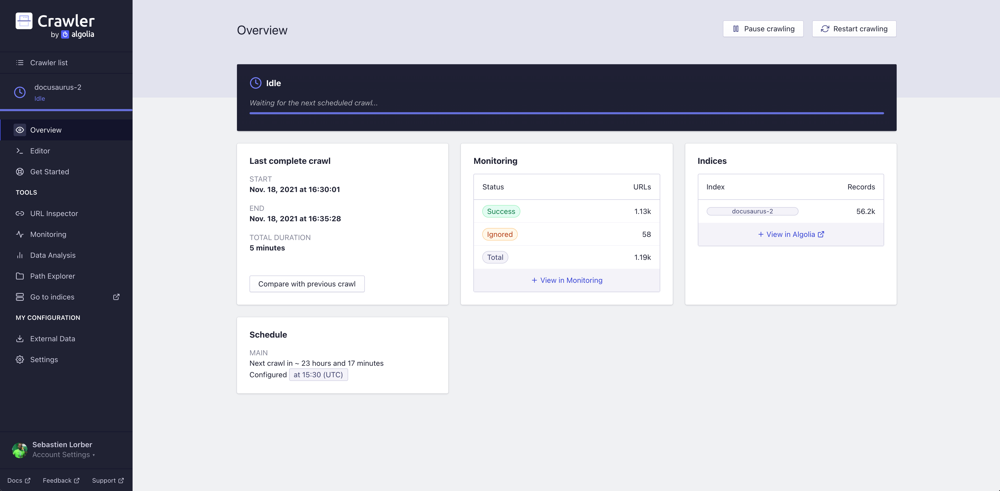

[DocSearch](https://docsearch.algolia.com/) is migrating to a new, more powerful system, which gives users their own Algolia application and new credentials.

Docusaurus site owners should upgrade their configuration with their new credentials **by February 1, 2022**, existing search indexes will be frozen and become read-only after this date.

<!--truncate-->

## Mise à jour de votre site Docusaurus

Dans les prochaines semaines, les propriétaires de sites Docusaurus recevront un courriel les invitant à rejoindre leur application personnelle Algolia.

This email will include a new `appId` and `apiKey` to use in your Docusaurus configuration.

Les seules choses que vous avez à faire :

- Rejoignez l'application Algolia (éventuellement en créant un nouveau compte Algolia)
- Mettez à jour la configuration de votre site.

```js title="docusaurus.config.js"
const config = {
  themeConfig: {
    algolia: {
      // highlight-start
      appId: '<NEW_APP_ID>',
      apiKey: '<NEW_SEARCH_API_KEY>',
      // highlight-end
    },
  },
};

module.exports = config;
```

:::info

`appId` is now **required**.

Ces clés ne sont pas des secrets et peuvent être ajoutées à votre dépôt Git.

:::

## DocSearch a une nouvelle maison !

### Qu'est-ce que DocSearch ?

[DocSearch](https://docsearch.algolia.com/) is a program created by [Algolia](http://algolia.com/), which offers search to technical documentation of Open Source projects and technical blogs **for free**.

You can [read more here](https://docsearch.algolia.com/docs/what-is-docsearch/), and [apply](https://docsearch.algolia.com/apply) if you'd like to give it a try!

## De quoi traite cette migration ?

### Motivation

With the upcoming stable release of [DocSearch UI](https://docsearch.algolia.com/docs/DocSearch-v3), we wanted to go further and provide better tooling for our users to improve their search, but also leverage the full potential of Algolia.

### Quoi de neuf ?

DocSearch now leverages the [Algolia Crawler](https://www.algolia.com/products/search-and-discovery/crawler/), which includes a web interface that will allow you to:

- Lancer, planifier et surveiller vos recherches de contenu
- Modifier votre fichier de configuration à partir d'un éditeur en ligne
- Tester vos résultats avec DocSearch v3




But also, more Algolia features in **your own Algolia app**:

- Gestion d'équipe
- Explorer et voir comment vos documents sont indexés dans Algolia
- Essayez d'autres fonctionnalités d'Algolia avec des évaluations gratuites


And of course, **a lot more, for free**.

## FAQ

### J'utilise Docusaurus et DocSearch, puis-je migrer ? {#im-using-docusaurus-and-docsearch-can-i-migrate}

Au moment où nous écrivons ceci, nous sommes encore à un stade précoce de la migration. Nous faisons de petits lots chaque semaine mais nous allons augmenter la charge sous peu, alors soyez patient et gardez un œil sur votre boîte aux lettres, vous serez contacté dès que votre application Algolia sera prête !

### Où puis-je en savoir plus à ce sujet ?

We wrote a small [migration guide](https://docsearch.algolia.com/docs/migrating-from-legacy) but you'll have more detailed information in the migration email.

### J'ai reçu l'email de migration mais l'invitation a expiré

Please contact us via either [email](mailto:docsearch@algolia.com) or [DocSearch's Discord](https://discord.gg/bRTacwYrfX) or on [Docusaurus's Discord #algolia channel](https://discordapp.com/invite/docusaurus)

### J'ai un retour d'expérience !

For any feedback regarding our documentation or the DocSearch UI component, you can open an issue [on our GitHub repository](https://github.com/algolia/docsearch/issues), but also contact us via the methods above.

### Puis-je quand même exécuter ma propre instance DocSearch ?

In favor of the new infrastructure and DocSearch v3, we will no longer maintain our beloved [DocSearch scraper](https://github.com/algolia/docsearch-scraper) and [DocSearch v2](https://github.com/algolia/docsearch/tree/master), but the repositories will still be available and open to pull requests.

The previous documentation (now called `legacy`) remains available as well as our [`run your own`](https://docsearch.algolia.com/docs/legacy/run-your-own) guide.
