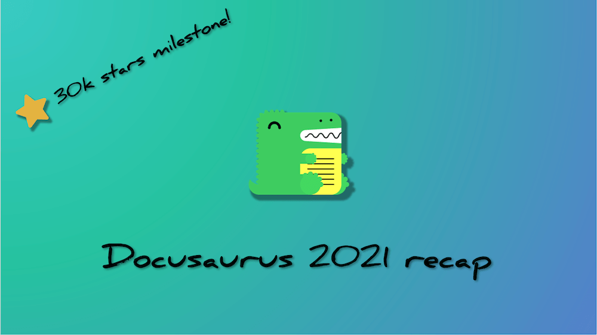
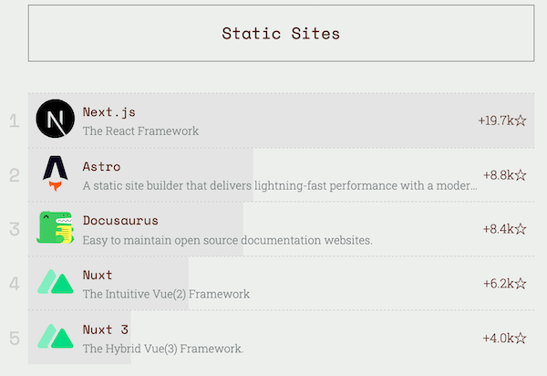

Docusaurus a fait de grands progrès en 2021 ! We've seen a lot of traction and just crossed **30k stars on GitHub**!

We've **reached full feature parity** with v1 after [the release of internationalization](/blog/2021/03-09-releasing-docusaurus-i18n.mdx), [announced our **first beta**](/blog/2021/05-12-announcing-docusaurus-two-beta/index.mdx), and welcomed **significantly more users** this year.

The **official v2 release** is just around the corner! Follow the [roadmap issue](https://github.com/facebook/docusaurus/issues/6113) for any latest news.

<!--truncate-->

## Points importants

Commençons par passer en revue quelques faits marquants de cette année. Remember the [todo-list](/blog/2021/05-12-announcing-docusaurus-two-beta/index.mdx#whats-next) from half a year ago? Il est temps de la sortir à nouveau et de voir jusqu'où nous sommes arrivés !

- **Internationalization**: officially released four months after its initial landing in late 2020. Seen great success in [many projects](/showcase?tags=i18n)
- **Autogenerated sidebars**: no need to maintain a big `sidebars.js` anymore
- **Webpack 5**: significantly improved build performance
- **Trailing slash config**: seamless integration with any content hosting provider
- **Redesigned mobile navigation**: mobile users now enjoy all navigation features as on desktop
- **UI improvements**: more accessible quotes, better admonitions, back-to-top button...
- **Blog multi-authors**: credit all the amazing contributors that collaborated on one blog post!
- **More blog features**: archive page, structured data for SEO, full post content in feeds – empowering you to ship a fully-featured blog in no time
- **Asset collocation**: no need for a bloated static folder anymore: colocate your images with Markdown files
- **Sidebar category index pages**: category labels can now be associated with pages, enabling better doc organization

Notre base de code a également été perfectionnée au fil du temps. Nous avons amélioré la couverture des tests, migré tous les paquets vers TypeScript et réduit la taille de nos paquets publiés d'un maximum de 60 % !

## Tendances

### npm

Docusaurus v2 continue de croître régulièrement. L'installation de la v2 est maintenant 8 fois plus importante que la v1. En ce qui concerne les téléchargements hebdomadaires, nous avons assisté à une triple augmentation (+209,4 %), passant de 28 066 début janvier à un sommet de 86 846 à la mi-décembre.

(Ah, le classique repas de Noël...)

We released 18 versions, going from `2.0.0-alpha.71` to `2.0.0-beta.14`. C'est une version tous les 20 jours !

### GitHub

- **Stars**: 20,460 → 29,679 (+45.1% y/y). Et, juste avant que cet article du blog soit publié, nous avons atteint 30k stars !
- **Total contributors**: 512 → 773 (+51.0% y/y)
- **Dependents**: 5,039 → 14,579 (+189.3% y/y) for v2, and 6,311 → 7,581 (+20.1% y/y) for v1
- **Commits**: 1,187 commits in the past year, averaging 23 commits every week
- **Issues**: 619 issues opened, 505 of them eventually resolved
- A [**new core team member**](https://github.com/Josh-Cena) (yep, that's me 😝)

Notre tendance de star est également très positive. Compared to similar projects, we are **growing at a faster rate**:

With an 8.4k increase in stars, we are ranked number 3 in this year's [JavaScript rising stars of static site generators](https://risingstars.js.org/2021/en#section-ssg), preceded only by Next.js and Astro.

## Adoptions en vedette

Our showcase has welcomed a few new ["favorite" sites](/showcase?tags=favorite) that showcase the true potential of Docusaurus 2's pluggable architecture.

- [**IOTA-wiki**](https://wiki.iota.org/)

- [**Dyte**](https://docs.dyte.io/docs/home/introduction/)

- [**Ionic**](https://ionicframework.com/docs)

- [**Courier**](https://www.courier.com/docs/)

La créativité des utilisateurs de Docusaurus dépasse notre imagination 🤩 Nous sommes impatients de voir de plus en plus d'adoptants tirer parti des fonctionnalités de contenu de Docusaurus tout en explorant des designs de thèmes originaux ! If your site uses Docusaurus, we would love to [have it in our showcase](https://github.com/facebook/docusaurus/edit/main/website/src/data/users.tsx).

## Communauté

As an active moderator on [Discord](https://discord.gg/docusaurus), I can clearly see the community thriving. De nombreuses questions fréquemment posées sont désormais intégrées dans notre documentation, et certaines demandes de fonctionnalités ont également été mises en œuvre. Le projet et la communauté s'enrichissent mutuellement - à titre d'exemple, j'étais auparavant un contributeur de la communauté avant de devenir un mainteneur.

We are constantly mentioned on X with inspirational feedback:

> **@docusaurus** is amazing! je n'arrive pas à croire que c'est si simple à utiliser.
>
> Aucun plugin, outil ou étape de compilation supplémentaire. Cela fonctionne dès le départ.
>
> I love **@docusaurus**. Sans Docusaurus, je n'aurais pas pu construire les API, les didacticiels et les blogs contenus dans mon site de manière efficace et belle dans le cadre de mon flux de travail.

And we keep every one of them in [our little box](https://x.com/sebastienlorber/timelines/1392048416872706049) 😄 If you enjoy Docusaurus yourself, keep tagging us with your comments!

As we approach the official release, we are interested in knowing more about what people are doing out there: [plugin authors](https://github.com/facebook/docusaurus/discussions/4025), [creators of customized sites](https://github.com/facebook/docusaurus/discussions/5468), and [all new users](https://github.com/facebook/docusaurus/discussions/4610) – please keep us posted about your achievements so we can steer our development to better serve your needs.

## Aller de l'avant

Au cours des derniers mois, nous n'avons cessé de parler de la phase release-candidate de Docusaurus, et oui, elle est presque arrivée. We have created a dedicated [milestone](https://github.com/facebook/docusaurus/milestone/15) to keep track of all issues to solve before we can confidently progress to the next stage. In short, we want to build a **more robust theming workflow**, empowering creative site creators to customize our default theme without fearing breaking changes as they upgrade. Cela comprendra :

- Guidelines on **component organization**. Nous voulons que les composants du thème aient la bonne modularité, de sorte que lorsque vous souhaitez personnaliser une partie de votre site, il y a toujours un composant qui fait exactement ce dont vous avez besoin.
- Improvements to the **swizzle CLI**. Nous voulons que les utilisateurs l’utilisent avec plaisir, et qu’il vous aide à travers tous les scénarios de swizzling possibles.
- Refactoring our **theme APIs**. Nous voulons que tous les composants swizzlables soient réellement appropriés pour le swizzling, donc les composants non-UI seront relocalisés.
- **Docs**. Nous voulons que nos documents soient le plus accessibles possible à tout le monde, des codeurs débutants aux développeurs web expérimentés. Nous l'organiserons comme un tutoriel plus évolutif qui peut être bénéfique pour tous les niveaux de compétence.

Read more about plans for Docusaurus 2.0 in this [roadmap issue](https://github.com/facebook/docusaurus/issues/6113). La version 2.0 sera une plus meilleure version avec l'aide de la communauté, alors n'hésitez pas à partager vos opinions et vos suggestions sous l'une des rubriques des jalons !

Comme l'équipe centrale travaille d'arrache-pied pour livrer la version de distribution générale, nous prévoyons de publier d'autres fonctionnalités utiles sous forme de versions mineures après la 2.0. We have even made further plans for [architectural changes in 3.0](https://github.com/facebook/docusaurus/milestone/16)!

Avec la sortie officielle de Docusaurus 2.0, nous sommes certains de voir beaucoup plus de nouvelles adoptions et de migrations depuis la v1.

We'd like to express our gratitude to [all the contributors in 2021](https://github.com/facebook/docusaurus/graphs/contributors?from=2021-01-01&to=2022-01-01&type=c), including:

- The core team: [Alexey Pyltsyn](https://github.com/lex111), [Sébastien Lorber](https://github.com/slorber), [Joshua Chen](https://github.com/Josh-Cena), and [Yangshun Tay](https://github.com/yangshun) for moderating the community, publicizing Docusaurus, triaging issues, and implementing new features
- [Joel Marcey](https://github.com/JoelMarcey) for creating Docusaurus and supporting its development all along
- The Algolia team for helping Docusaurus users [migrate to the new DocSearch](/blog/2021/11-21-algolia-docsearch-migration/index.mdx) and answering search-related questions
- Tous les membres actifs de la communauté pour apporter de précieuses contributions de code, améliorer notre documentation et répondre aux questions sur Discord

À bientôt, 2021, et faisons un beau 2022 !
