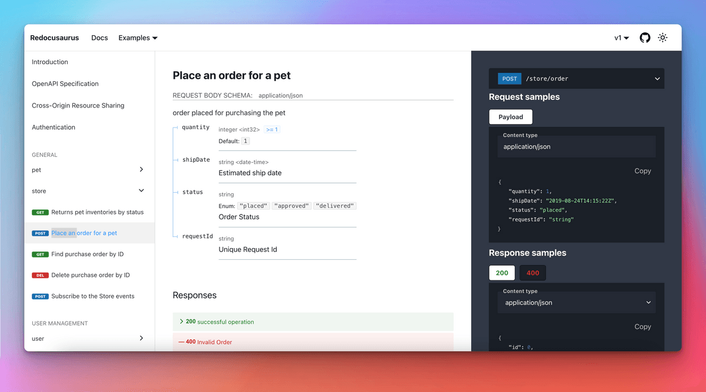
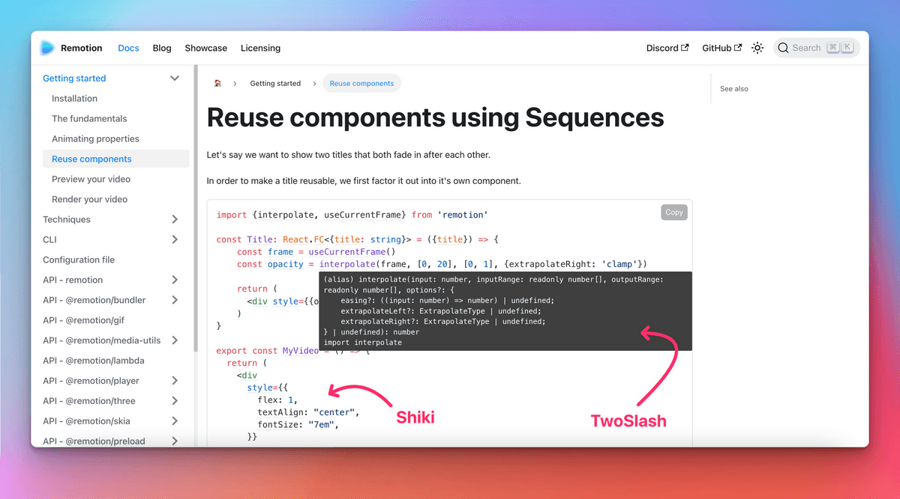

```mdx-code-block
import LiteYouTubeEmbed from 'react-lite-youtube-embed';
import 'react-lite-youtube-embed/dist/LiteYouTubeEmbed.css';
import BrowserWindow from '@site/src/components/BrowserWindow';
import ProductHuntCard from '@site/src/components/ProductHuntCard';
import HackerNewsIcon from '@site/src/components/HackerNewsIcon';
import ColorModeToggle from '@theme/Navbar/ColorModeToggle';
import useBaseUrl from '@docusaurus/useBaseUrl';
import ThemedImage from '@theme/ThemedImage';
import {ShowcaseCarouselV1, ShowcaseCarouselV2, ShowcaseCarouselV2Theming} from './ShowcaseCarousel';
```

Today we are extremely happy to finally **announce Docusaurus 2.0**! 🥳️

Chez [**Meta Open Source**](https://opensource.fb.com/), nous pensons que Docusaurus vous aidera à construire les **meilleurs sites web de documentation** avec **un minimum d'effort**, vous permettant de **vous concentrer sur ce qui compte vraiment** : l'écriture du contenu.

After **4 years of work, [75 alphas](https://github.com/facebook/docusaurus/releases/tag/v2.0.0-alpha.75) and [22 betas](https://github.com/facebook/docusaurus/releases/tag/v2.0.0-beta.22)**, the next generation of Docusaurus is **ready for prime time**. From now on, we now plan to **respect [Semantic Versioning](https://semver.org/)** and will release **major versions more frequently**.


{/_ truncate _/}

:::info We are on [ProductHunt](https://www.producthunt.com/posts/docusaurus-2-0) and [Hacker News](https://news.ycombinator.com/item?id=32303052)!

**Now** is the best time to show your love for Docusaurus!

<div style={{display: 'flex'}}>
  <ProductHuntCard />
  <HackerNewsIcon />
</div>

:::

:::tip

Pas beaucoup de temps ? Check [what's new in Docusaurus 2.0](#whats-new-in-20)!

:::

## Qu'est-ce que Docusaurus exactement ?

Docusaurus is a **static site generator** that helps you ship **beautiful documentation websites** in **no time**.

Focus on your content: just write **Markdown files**. Docusaurus will generate an optimized **website** for you that's easy to **host anywhere**.

Docusaurus is **full-featured** and very **flexible**: we ship with well-designed docs and blog layout, as well as out-of-the-box versioning, search, and internationalization functionalities, with a call to accessibility and search engine optimizations. Its flexible theming system permits to **adapt the UI to match your branding** so that it integrates nicely with your main website or documentation portal. Its usage of **React** enables a **modern client-side navigation**, and the ability to build an **interactive documentation**.


The Docusaurus philosophy is akin to the **Pareto principle**: you can get **80% of the results** for **20% of the effort**. This enables you to compete with top-notch documentation sites with **minimal effort**.

<TweetQuote
  url="https://x.com/rachelnabors/status/1452697991039660038"
  handle="rachelnabors"
  name="Rachel Nabors"
  job="Former ReactJS & React-Native docs manager">
  Unless you're spinning up a documentation team with engineering resources, you
  probably want Docusaurus!
</TweetQuote>

Docusaurus aims to be the **best documentation tool**, but you can use it for **other use-cases** as well: a blog, a knowledge base, a developer portfolio, a second brain, or even to scaffold landing pages!

<TweetQuote
  url="https://x.com/johnny_reilly/status/1551861926334025728"
  handle="johnny_reilly"
  name="Johnny Reilly"
  job="Group Principal Engineer at Investec">
  Using Docusaurus for my tech blog has been a fantastic choice. It looks
  tremendous out-of-the-box and the awesome DX means I write way more
</TweetQuote>

:::tip

Try Docusaurus now with our [online playgrounds](/docs/playground) and [5 minutes tutorial](https://tutorial.docusaurus.io/) ⏱️

:::

## L'histoire de Docusaurus

Docusaurus was created at **Facebook Open Source** in **2017** (now [Meta Open Source](https://opensource.fb.com/)). Nous avions beaucoup de projets internes et open source à documenter. It's **complicated enough to write good documentation**, let alone to create the HTML, CSS, and JavaScript for a good-looking website. We wanted project leaders to be able to **focus on the content**, and **Markdown** is great for that.

At that time, our solution was to **copy/paste a Jekyll template** over and over again. This naturally became **hard to maintain**, so we created a tool to **solve our own pain** once for all.

**[Docusaurus v1 was born](/blog/2017/12-14-introducing-docusaurus.mdx)!**


It quickly built momentum at Facebook and in the frontend ecosystem, adopted by many popular projects such as [Prettier](https://prettier.io/), [Babel](https://babeljs.io/), [React-Native](https://archive.reactnative.dev/), [KaTeX](https://katex.org/docs/), and of course [Docusaurus v1](http://v1.docusaurus.io/) itself.

<ShowcaseCarouselV1 />

<br />

:::note

Remarquez que les différents sites ci-dessus utilisent des couleurs différentes, mais ils se ressemblent beaucoup.

:::

## En route vers Docusaurus 2.0

[**Docusaurus v1**](http://v1.docusaurus.io/) has been very successful, but we started to **question some architectural choices**:

- React was only used as a **server-side templating language**, and not used on the client
- **Theming system was pretty limited**, and apart from changing a few colors with CSS, it was difficult to do more advanced customizations
- The **docs versioning system was confusing**, since it was based on a diff algorithm
- The codebase was **monolithic**, neither well-tested nor easy to extend

[**Docusaurus v2**](https://docusaurus.io/) was **rebuilt** from the ground up with a new **modular architecture**:

- React is now also used on the client, enabling a **modern Single Page Application navigation**
- **Plugins** empower the community to contribute useful features as third-party packages
- **Theming** is more **flexible** than ever
- Le versionnage des documents est désormais basé sur des copies instantanées, ce qui est beaucoup plus facile à comprendre
- We kept **everything good from v1**: docs, blog, pages, versioning, i18n...
- We implemented **several new features**

More details in the [Docusaurus 2 project announcement](/blog/2018/09-11-Towards-Docusaurus-2.mdx) and [v1 to v2 migration guide](https://docusaurus.io/docs/migration)

## Qui utilise Docusaurus 2.0 ?

Despite being in pre-release, it didn't take long for **Docusaurus v2 to outgrow Docusaurus v1** in terms of NPM downloads:

[](https://npmtrends.com/docusaurus-vs-@docusaurus/core)

La tendance de nos étoiles GitHub est très positive, en concurrence avec les principaux frameworks :

[](https://star-history.com/#facebook/docusaurus&vercel/next.js&gatsbyjs/gatsby&hexojs/hexo&nuxt/nuxt.js&vuejs/vuepress&11ty/eleventy&gohugoio/hugo&remix-run/remix&mkdocs/mkdocs&Timeline)

Actuellement, Docusaurus v2 est déjà un grand succès avant même son lancement :

- We received so many [lovely testimonials](https://x.com/sebastienlorber/timelines/1392048416872706049)
- Companies like [1Password](https://blog.1password.com/docusaurus-documentation-framework/) and [Courier](https://www.courier.com/blog/how-we-built-our-documentation/) are writing down their positive experience
- Our [site showcase](/showcase) references hundreds of sites, and this is only the tip of the iceberg.

<ShowcaseCarouselV2 />

<br />

:::tip

Please add your site to our [site showcase](/showcase)! It only takes a few seconds: just [post a comment here](https://github.com/facebook/docusaurus/discussions/7826).

:::

<TweetQuote
  url="https://x.com/maxlynch/status/1549415692704825346"
  handle="maxlynch"
  name="Max Lynch"
  job="Ionic co-founder and CEO">
  We use Docusaurus everywhere now and love it
</TweetQuote>

<TweetQuote
  url="https://x.com/supabase/status/1328960757149671425"
  handle="supabase"
  name="Supabase"
  job="Open Source Firebase alternative">
  We've been using V2 since January and it has been great
</TweetQuote>

<TweetQuote
  url="https://x.com/gabrielcsapo/status/1415061312917233665"
  handle="gabrielcsapo"
  name="Gabriel Csapo"
  job="Staff Software Engineer at LinkedIn">
  Docusaurus is next level easy for literally everything you would need for
  documentation in your project.
</TweetQuote>

<TweetQuote
  url="https://x.com/ItWasMattGregg/status/1526682295075102721"
  handle="ItWasMattGregg"
  name="Matt Gregg"
  job="Senior Front End Developer at Shopify">
  Docusaurus is awesome. We use it
</TweetQuote>

## Quoi de neuf dans la 2.0 ?

Il serait difficile de décrire toutes les nouvelles fonctionnalités de Docusaurus v2. Let's focus on the features we believe are the **most impactful**.

### MDX

[MDX](https://github.com/mdx-js/mdx) allows you to **interleave React components** in Markdown. This enables you to build top-notch **interactive documentation experiences** very easily.

Une démo vaut mieux qu'un long discours :

```md title="docs/my-document.mdx"
### Give it a try: press that button!

import ColorModeToggle from '@theme/ColorModeToggle';

<ColorModeToggle/>
```

```mdx-code-block
<BrowserWindow>

<h3>Give it a try: press that button!</h3>

<ColorModeToggle/>

</BrowserWindow>
```

:::info

MDX has its own [plugin system](https://mdxjs.com/docs/extending-mdx/). Vous pouvez personnaliser votre expérience de création de Markdown et même créer votre propre syntaxe Markdown.

:::

<TweetQuote
  url="https://x.com/HamelHusain/status/1551962275250053123"
  handle="HamelHusain"
  name="Hamel Husain"
  job="Head Of Data Science at Outerbounds">
  Docusaurus + MDX is great: we were able to implement a beautiful two-pane
  layout and give the author fine-grained control on the placement of code and
  corresponding prose.
</TweetQuote>

### Conventions du système de fichiers

Our goal is to make Docusaurus very **intuitive** to use. Nous avons ajouté des conventions de système de fichiers et l'ajout d'une page de doc est aussi simple que la création d'un fichier Markdown.

<LiteYouTubeEmbed
  id="T3S8GyFIXjo"
  params="autoplay=1&autohide=1&showinfo=0&rel=0"
  title="Explain Like I'm 5: Docusaurus"
  poster="maxresdefault"
  webp
/>

<br />

<TweetQuote
  url="https://x.com/paularmstrong/status/1552005085168865281"
  handle="paularmstrong"
  name="Paul Armstrong"
  job="Principal Engineer at Microsoft">
  Using the auto-generated sidebars makes it so simple to just create a page and
  not worry about any other configuration.
</TweetQuote>

### Plugins

Docusaurus now has a **modular architecture** with a plugin system — our **core features** like docs, blog, pages, and search are all powered by individual plugins.

More importantly, it enables our community to **enhance Docusaurus** with additional features.

Soulignons quelques exemples :

- [redocusaurus](https://github.com/rohit-gohri/redocusaurus): seamless integration with [OpenAPI](https://www.openapis.org/) and [Redoc](https://github.com/Redocly/redoc)



- [docusaurus-preset-shiki-twoslash](https://www.npmjs.com/package/docusaurus-preset-shiki-twoslash): use [Shiki](https://github.com/shikijs/shiki) code block syntax highlighting with [TwoSlash](https://shikijs.github.io/twoslash/) TypeScript compiler hints



<TweetQuote
  url="https://x.com/orta"
  handle="orta"
  name="Orta Therox"
  job="Former TypeScript core team at Microsoft">
  The plugin API was a breeze to use, and powerful enough that I could port the
  code sample renderer from the TypeScript website site in a couple of hours.
</TweetQuote>

- [docusaurus-search-local](https://github.com/easyops-cn/docusaurus-search-local): one of the various local search alternatives to the built-in Algolia plugin


:::tip

We have a curated list of outstanding plugins in our [community resources](/community/resources) page.

:::

<TweetQuote
  url="https://x.com/jodyheavener/status/1551974535452311552"
  handle="jodyheavener"
  name="Jody Heavener"
  job="Senior Developer at 1Password">
  The plugin system in Docusaurus v2 has made expanding 1Password's developer
  portal so easy and fun. Nous sommes très heureux de vous montrer ce que nous avons conçu.
</TweetQuote>

### Thème

Theming is one of the most important features of Docusaurus: we believe a professional documentation site should **respect your company's branding** and create a consistent experience.

Docusaurus theming gives a lot of **flexibility** on multiple levels:

- Personnalisez les variables CSS pour ajuster les couleurs, les polices et plus encore
- Fournissez vos propres feuilles de style CSS
- Implémentez votre propre thème à partir de zéro
- **Override any React component** provided by our default theme: we call this [swizzling](https://docusaurus.io/docs/swizzling)

<TweetQuote
  url="https://x.com/hung_dev/status/1546918275065741312"
  handle="hung_dev"
  name="
Hung Viet Nguyen"
  job="Creator of JestPreview">
  I love Docusaurus Swizzling feature. Elle est à la fois opiniâtre et flexible. C'est super cool car un framework doit généralement sacrifier l'un au profit de l'autre.
</TweetQuote>

This enables users willing to invest a bit more time on **customizations** to build sites that **look different** from others.

<ShowcaseCarouselV2Theming />

<TweetQuote
  url="https://x.com/dabit3/status/1382855449813389315"
  handle="dabit3"
  name="Nader Dabit"
  job="Web3 developer, Developer DAO founder">
  So far it’s working out really nicely. Il a été très facile de le styliser comme nous le voulions. Aucun blocage.
</TweetQuote>

### Autres fonctionnalités

Docusaurus 2 est doté d'une très longue liste de fonctions utiles :

- Theme: dark mode, better UI and UX, flexible `themeConfig` options...
- Versionnage des docs : options du plugin flexibles pour s'adapter à votre flux de travail
- Barre latérale des docs : catégorie repliable, pages d'index des catégories...
- Blog : auteurs multiples, carte des auteurs, page d'archives...
- Markdown : onglets, équations mathématiques, blocs de code en direct, liens, frontmatter flexible...
- Recherche : utilisez la nouvelle expérience Algolia DocSearch 3
- Ressources : facilitez l'incorporation d'images et d'autres types de fichiers
- Internationalisation : options de configuration, traductions du thème par défaut...
- Accessibilité : étiquettes aria, contrastes des couleurs, saut vers le contenu, navigation par le clavier, amélioration progressive...
- Référencement : valeurs par défaut judicieuses, facile à personnaliser, url canonique, carte sociale, no-index, sitemap, microdata, hreflang...
- PWA : ajoute la prise en charge hors ligne à votre site et le rend installable
- Echec rapide : validation stricte de la configuration, détection des liens erronés et prévention des mauvais déploiements en production
- Prise en charge de TypeScript pour les fichiers de configuration, les plugins, les pages personnalisées et les auteurs de thèmes
- Playgrounds: assess Docusaurus easily from your browser with [docusaurus.new](https://docusaurus.new)
- Versions canary : utilisez la balise @canary avec npm pour utiliser la prochaine version avant tout le monde
- Des tests : Docusaurus est bien testé, nous testons les fonctionnalités et nous nous assurons qu'elles fonctionnent toujours

<TweetQuote
  url="https://x.com/alexbdebrie/status/1540010328335032320"
  handle="alexbdebrie"
  name="Alex DeBrie"
  job="AWS Data Hero, author of The DynamoDB Book">
  Recently, I was shocked at how good Docusaurus is out of the box. Super solide, une bonne dose de configuration sans être excessive, et la possibilité de vraiment personnaliser le style si vous êtes plus courageux que moi.
</TweetQuote>

## Pourquoi la 2.0 maintenant ?

Many enthusiastic followers of ours have been curious **why it took us 4 years to release Docusaurus 2.0**, considering the beta is already successful and **widely used in production**.

The reason is that we aim to **respect [Semantic Versioning](https://semver.org/)**, which means we will be incrementing the major version number whenever we release a **breaking change**.

C'est important pour plusieurs raisons :

- It **guarantees simple minor version upgrades**, as long as you only use the [public API](/community/release-process#public-api-surface)
- Il respecte les conventions de l'écosystème front-end
- Une nouvelle version majeure est l'occasion de documenter minutieusement les changements de rupture
- Une nouvelle version majeure ou mineure est l'occasion de communiquer les nouvelles fonctionnalités par le biais d'un article du blog

The problem is that our flexible theming system inherently creates a very **implicit API surface** on which it is **hard to know what is a breaking change** in the first place. Les sites Docusaurus hautement personnalisés ont parfois du mal à mettre à jour Docusaurus parce qu'ils réalisent des personnalisations en utilisant des API internes. We dedicated time to extensive theme refactors and clearly defining our [public API](/community/release-process#public-api-surface), so that future code changes can be made more safely. Nous continuerons à développer cette API publique de thématisation afin que les personnalisations de site les plus courantes n'aient pas besoin d'utiliser d'API interne.

:::info

From now on, Docusaurus will **release new major versions more frequently**. In practice, you can expect a **new major version every 2 to 4 months**.

[Major version numbers are not sacred](https://tom.preston-werner.com/2022/05/23/major-version-numbers-are-not-sacred.html), but we still group breaking changes together and avoid releasing major versions too often.

Check our [release process](/community/release-process) documentation for details.

:::

## Quelle est la prochaine étape ?


Le travail sur Docusaurus 3.0 a commencé, et cette prochaine version ne sortira que dans quelques mois. We will **backport retro-compatible changes in Docusaurus 2.x** minor versions to make them available as soon as possible to the community on a stable channel.

Un échantillon des fonctionnalités figurant sur notre feuille de route pour les prochaines versions majeures de Docusaurus :

- [Upgrade to MDX 2.0](https://github.com/facebook/docusaurus/issues/4029)
- [Improve Markdown infrastructure](https://github.com/facebook/docusaurus/issues/4625)
- [Improve theming and swizzle](https://github.com/facebook/docusaurus/issues/6114)
- [TailwindCSS theme](https://github.com/facebook/docusaurus/issues/2961)
- [Theme; support custom item types for navbar, doc sidebar, blog sidebar, footer](https://github.com/facebook/docusaurus/issues/7227)
- [Dynamic navbar: navbar item activation strategies](https://github.com/facebook/docusaurus/issues/4389)
- [Custom Social Cards](https://github.com/facebook/docusaurus/issues/2968)
- [CSS-in-JS support](https://github.com/facebook/docusaurus/issues/3236)
- [Use Node.js ES Modules](https://github.com/facebook/docusaurus/issues/6520)
- [Improve build time performance](https://github.com/facebook/docusaurus/issues/4765)
- [Extend Docusaurus plugins, CMS integration](https://github.com/facebook/docusaurus/issues/4138)

## Merci

We'd like to express our gratitude to [all our contributors](https://github.com/facebook/docusaurus/graphs/contributors), including:

- The Docusaurus core team: [Alexey Pyltsyn](https://github.com/lex111), [Joshua Chen](https://github.com/Josh-Cena), [Sébastien Lorber](https://github.com/slorber), [Yangshun Tay](https://github.com/yangshun) and all our [former team members](https://docusaurus.io/community/team)
- [Joel Marcey](https://github.com/JoelMarcey) for creating Docusaurus 1.0 and supporting the Docusaurus 2.0 project at Meta Open Source
- [Paul O’Shannessy](https://github.com/zpao) for supporting the development of all the next versions of Docusaurus at Meta Open Source
- [Eric Nakagawa](https://github.com/ericnakagawa) for creating our cutest mascot Slash
- [Endilie Yacop Sucipto](https://github.com/endiliey) for his significant [initial work on Docusaurus v2](/blog/2020/01-07-tribute-to-endi.mdx)
- [Clément Vannicatte](https://github.com/shortcuts), [Kevin Granger](https://github.com/Shipow) and the whole Algolia team for their support
- All the community members for making valuable code contributions, improving our documentation, and answering questions on [Discord](https://discordapp.com/invite/docusaurus)

We'd like to thank in particular all our **Docusaurus 2.0 early adopters** for assessing its alpha, beta and canary releases, providing a ton of **invaluable feedback**. Nous espérons sincèrement que vous avez eu une agréable expérience en l'utilisant, et que vous continuerez à nous faire part de vos commentaires sur les prochaines préversions de Docusaurus 3.0.

At [Meta Open Source](https://opensource.fb.com/), Docusaurus is one of our **most successful projects**. Nous sommes impatients de voir tous les sites de documentation exceptionnels que vous allez créer ! Don't forget to **submit them to our [site showcase](/showcase)**!

**Now, let your imagination run wild 🤪!**

— Slash

:::info We are on [ProductHunt](https://www.producthunt.com/posts/docusaurus-2-0) and [Hacker News](https://news.ycombinator.com/item?id=32303052)!

🙏 Partagez votre expérience d'utilisation de Docusaurus avec la communauté !

<div style={{display: 'flex'}}>
  <ProductHuntCard />
  <HackerNewsIcon />
</div>

:::


