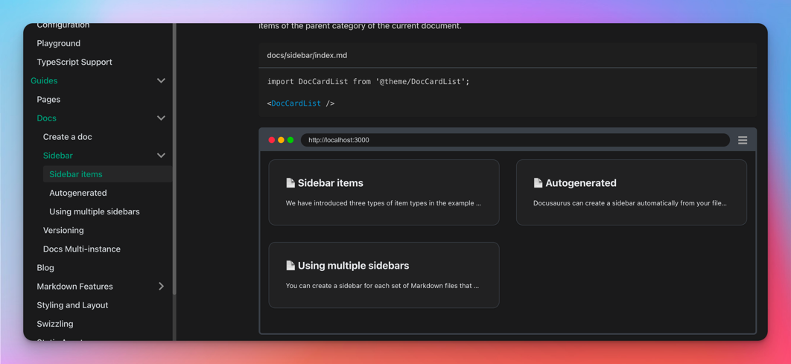

We are happy to announce **Docusaurus 2.1**, our very first minor version release.

La mise à jour devrait être facile : comme expliqué dans notre [documentation du processus de publication](/community/release-process), les versions mineures respectent [le versionnage sémantique](https://semver.org/).


<!--truncate-->

## Points importants

### Améliorations de DocCardList

In [#8008](https://github.com/facebook/docusaurus/pull/8008), we simplified the usage of the`<DocCardList>` component, that is notably used on sidebar category generated index pages.

The `items` prop is now optional, and will be automatically inferred from the content of the parent sidebar category:

```diff
import DocCardList from '@theme/DocCardList';
- import {useCurrentSidebarCategory} from '@docusaurus/theme-common';

- <DocCardList items={useCurrentSidebarCategory().items}/>
+ <DocCardList/>
```

De plus, nous avons fait en sorte qu'il soit possible de l'utiliser sur n'importe quel document, y compris les documents ordinaires non liés à une catégorie de la barre latérale.



### `noindex` improvements

We improved the support of the [`noindex` meta `robots` directive](https://developers.google.com/search/docs/advanced/crawling/block-indexing), a way to signal search engines you don't want a specific page to be indexed.

In [#7963](https://github.com/facebook/docusaurus/pull/7963), we allow `noindex` to be configured on a per-docs-version basis.

Use the following plugin options to tell crawlers you don't want the `1.0.0` version to be indexed:

```jsx
const options = {
  versions: {
    '1.0.0': {
      noIndex: true,
    },
  },
};
```

En pratique, Docusaurus ajoutera la méta suivante à chaque page de cette version :

```html
<meta name="robots" content="noindex, nofollow" />
```

In [#7964](https://github.com/facebook/docusaurus/pull/7964), we also fixed a bug where the sitemap plugin would still contain pages that have a `noindex` directive. Now the sitemap plugin will reliably filter out all the pages containing `noindex` directives.

### Remplacement des balises méta par défaut

In [#7952](https://github.com/facebook/docusaurus/pull/7952), it becomes possible to override default html meta tags you couldn't before:

```jsx
<>
  {siteConfig.noIndex && <meta name="robots" content="nofollow, noindex" />}
  <meta name="viewport" content="width=device-width, initial-scale=1.0" />
</>
```

It is now possible to use `<Head>` or `themeConfig.metadata`:

- to override the `viewport` meta
- to override the `robots` meta: you could mark your site as `noIndex`, but except for specific pages that should be indexed

### Traductions ukrainiennes

In [#7953](https://github.com/facebook/docusaurus/pull/7953), we added default classic theme translations for the Ukrainian language.

## Autres modifications

Check the [2.1.0 changelog entry](/changelog/2.1.0) for an exhaustive list of changes.
