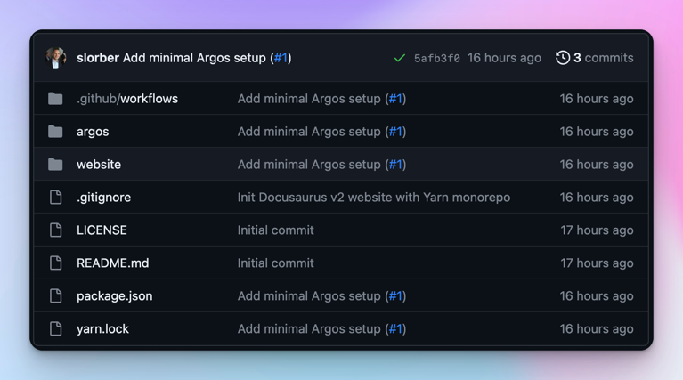

---
authors:
  - slorber
tags:
  - version
slug: /upgrading-frontend-dependencies-with-confidence-using-visual-regression-testing
description: Mettez à jour les dépendances npm en toute confiance grâce à un flux de travail de test sur la régression visuelle en utilisant GitHub Actions, Playwright et Argos.
image: ./img/social-card.png
---

# Mettre à jour les dépendances du frontend en toute confiance

Les développeurs frontend ont souvent besoin de **mettre à jour les dépendances npm**, mais ces mises à jour peuvent être angoissantes et entraîner des **effets secondaires subtils sur l'interface utilisateur** qui ne sont pas détectés par votre suite de tests habituelle.

La mise à jour de Docusaurus est un bon exemple : à moins de revoir toutes les pages une à une, il est difficile de s'assurer qu'il n'y a pas de régression visuelle. **Docusaurus v3 est sur le point de sortir** (actuellement en [beta](https://github.com/facebook/docusaurus/discussions/9312)), et nous aimerions vous aider à effectuer cette mise à jour en toute confiance.

Cet article présente un flux de travail de **test sur la régression visuelle** basé sur [**GitHub Actions**](https://github.com/features/actions), [**Playwright**](https://playwright.dev/) et [**Argos**](https://argos-ci.com/). Il n'est pas directement lié à Docusaurus ou React, et peut être adapté pour fonctionner avec d'autres applications frontend et d'autres frameworks.


<!--truncate-->

Ce flux de travail a été testé lors de la montée de version de Docusaurus v2 vers v3, et a déjà permis de corriger quelques régressions visuelles sur des sites tels que [React Native](https://reactnative.dev/), [Jest](https://jestjs.io/), et le site [Docusaurus](https://docusaurus.io/) lui-même.

Docusaurus v3 s'accompagne de changements d'infrastructure et de mises à niveau de dépendances majeures telles que [MDX v3](https://mdxjs.com/blog/v3/) et [React 18](https://react.dev/blog/2022/03/29/react-v18), qui peuvent produire des effets secondaires inattendus. Il aurait été difficile de constater toutes les régressions visuelles en l'absence d'un tel flux de travail. C'est pourquoi nous encourageons les propriétaires de sites à adopter des tests de régression visuels, en particulier pour les sites hautement personnalisés.

## Vue d'ensemble du flux de travail

L'idée générale est assez simple :

- Construire votre site dans une CI avec [GitHub Actions](https://github.com/features/actions)
- Faire des captures d'écran de toutes les pages de `sitemap.xml` avec [Playwright](https://playwright.dev/)
- Les télécharger sur [Argos](https://argos-ci.com/)
- Faire cela pour les deux branches Git : `main` et `pr-branch`.
- Comparez les captures d'écran les unes aux autres dans [Argos](https://argos-ci.com/)

Argos va alors **signaler les différences visuelles** trouvées entre `main` et `pr-branch` sous forme d'un statut de commit GitHub et d'un commentaire de pull-request. Cela peut vous aider à détecter les régressions visuelles en amont de manière automatisée.


Argos crée un rapport référençant toutes les différences visuelles trouvées en comparant l'un à l'autre les sites des 2 branches Git, et fournit une interface utilisateur pratique pour repérer facilement la différence.

Consultez la [page Argos de Docusaurus](https://app.argos-ci.com/meta-open-source/docusaurus) pour explorer les rapports de notre propre site web.

Voici un exemple plus concret d'Argos [signalant une régression visuelle](https://app.argos-ci.com/slorber/rnw-visual-tests/builds/32/56012838) trouvé lors de la mise à jour du site web React-Native :

[](https://app.argos-ci.com/slorber/rnw-visual-tests/builds/32/56012838)

## Implémentation du flux de travail

Cette section décrit les modalités de mise en place de chaque étape du flux de travail.

Vous devrez [vous inscrire à Argos](https://app.argos-ci.com/signup) et [connecter Argos à votre dépôt GitHub](https://argos-ci.com/docs/github)

### Dépendances

Ce flux de travail nécessite les dépendances suivantes, en plus des dépendances habituelles de Docusaurus :

```bash
yarn add -D @argos-ci/cli @argos-ci/playwright @playwright/test cheerio
```

### GitHub Action

GitHub action se charge de l'exécution du flux de travail pour chaque branche Git.

Un flux de travail minimal pourrait ressembler à ce qui suit :

```yaml title=".github/workflows/argos.yml"
name: Argos CI Screenshots

on:
  push:
    branches: [main]
  pull_request:
    branches: [main]

jobs:
  take-screenshots:
    runs-on: ubuntu-latest
    steps:
      - name: Check out repository code
        uses: actions/checkout@v4

      - name: Use Node.js
        uses: actions/setup-node@v3
        with:
          node-version: current

      - name: Install dependencies
        run: yarn install --frozen-lockfile

      - name: Install Playwright browsers
        run: yarn playwright install --with-deps chromium

      - name: Build the website
        run: yarn docusaurus build

      - name: Take screenshots with Playwright
        run: yarn playwright test

      - name: Upload screenshots to Argos
        run: yarn argos upload ./screenshots
```

### Config de Playwright

Playwright se charge des captures d'écran du site web précédemment construit localement par Github action.

Une [config de Playwright](https://playwright.dev/docs/test-configuration) minimale pourrait ressembler à ce qui suit :

```ts title="playwright.config.ts"
import {devices} from '@playwright/test';
import type {PlaywrightTestConfig} from '@playwright/test';

const config: PlaywrightTestConfig = {
  webServer: {
    port: 3000,
    command: 'yarn docusaurus serve',
  },
  projects: [
    {
      name: 'chromium',
      use: {
        ...devices['Desktop Chrome'],
      },
    },
  ],
};

export default config;
```

### Test de Playwright

Une config de Playwright ne suffit pas : nous devons également écrire un fichier de test Playwright pour générer les captures d'écran du site.

```ts title="screenshot.spec.ts"
import * as fs from 'fs';
import {test} from '@playwright/test';
import {argosScreenshot} from '@argos-ci/playwright';
import {extractSitemapPathnames, pathnameToArgosName} from './utils';

// Constantes
const siteUrl = 'http://localhost:3000';
const sitemapPath = './build/sitemap.xml';
const stylesheetPath = './screenshot.css';
const stylesheet = fs.readFileSync(stylesheetPath).toString();

// Attends l'hydratation, nécessite Docusaurus v2.4.3+
// Docusaurus ajoute un <html data-has-hydrated="true"> une fois l'hydratation terminée
// Consultez https://github.com/facebook/docusaurus/pull/9256
function waitForDocusaurusHydration() {
  return document.documentElement.dataset.hasHydrated === 'true';
}

function screenshotPathname(pathname: string) {
  test(`pathname ${pathname}`, async ({page}) => {
    const url = siteUrl + pathname;
    await page.goto(url);
    await page.waitForFunction(waitForDocusaurusHydration);
    await page.addStyleTag({content: stylesheet});
    await argosScreenshot(page, pathnameToArgosName(pathname));
  });
}

test.describe('Docusaurus site screenshots', () => {
  const pathnames = extractSitemapPathnames(sitemapPath);
  console.log('Pathnames to screenshot:', pathnames);
  pathnames.forEach(screenshotPathname);
});
```

<details>
  <summary>Pourquoi prenons-nous des captures d'écran avec Argos au lieu de Playwright ?</summary>

Argos dispose d'une [intégration Playwright](https://argos-ci.com/docs/playwright) qui reprend l'API originale de capture d'écran Playwright et fournit de meilleures valeurs par défaut pour rendre les captures d'écran suffisamment détaillées.

</details>

<details>
<summary>Que contient le fichier <code>utils.ts</code> ?</summary>

Ce module contient des détails d'implémentation que nous avons choisi de masquer par souci de clarté.

```ts
import * as cheerio from 'cheerio';
import * as fs from 'fs';

// Extrait une liste de noms de chemin, à partir d'un chemin fs vers un fichier sitemap.xml
// Docusaurus génère un fichier build/sitemap.xml pour vous !
export function extractSitemapPathnames(sitemapPath: string): string[] {
  const sitemap = fs.readFileSync(sitemapPath).toString();
  const $ = cheerio.load(sitemap, {xmlMode: true});
  const urls: string[] = [];
  $('loc').each(function handleLoc() {
    urls.push($(this).text());
  });
  return urls.map((url) => new URL(url).pathname);
}

// Convertit un nom de chemin en un nom de capture d'écran convenable
export function pathnameToArgosName(pathname: string): string {
  return pathname.replace(/^\/|\/$/g, '') || 'index';
}
```

</details>

### Feuille de style

Les captures d'écran ne sont pas toujours suffisamment détaillées, et le fait de prendre deux fois une capture d'écran d'une page peut entraîner des variations subtiles qui seront signalées de manière incorrecte par Argos comme des régressions visuelles.

C'est pourquoi nous recommandons d'injecter une feuille de style supplémentaire pour masquer les éléments problématiques. Vous devrez probablement ajouter de nouvelles règles CSS à cette feuille de style de base, en fonction des éléments instables trouvés sur votre propre site. Consultez [Argos - Docs à propos des tests instables](https://argos-ci.com/docs/about-flaky) pour plus d'informations.

```css title="screenshot.css"
/* Les iframes peuvent se charger de manière différée */
iframe,
/* Les avatars peuvent être instables en raison de l'utilisation de sources externes : GitHub/Unavatar */
.avatar__photo,
/* Les Gif se chargent de manière différée et sont animés */
img[src$='.gif'],
/* Les raccourcis clavier d'Algolia apparaissent avec un peu de retard */
.DocSearch-Button-Keys > kbd,
/* L'aperçu de l'aire de jeu en direct peut souvent afficher des dates/compteurs */
[class*='playgroundPreview'] {
  visibility: hidden;
}

/* Différentes dates de dernière mise à jour des documents peuvent modifier la mise en page */
.theme-last-updated,
/* Les diagrammes Mermaid sont rendus côté client et produisent des changements de mise en page */
.docusaurus-mermaid-container {
  display: none;
}
```

:::tip éviter les changements de mise en page

Nous recommandons de masquer les éléments instables de l'interface utilisateur qui affectent la mise en page avec `display : none;`.

Par exemple, la documentation « Dernière mise à jour le » peut être affichée sur plus d'une ligne, ce qui « pousse » le reste du contenu vers le bas et conduit Argos à détecter de nombreux pixels différents.

:::

## Exemple de dépôt

Le dépôt [slorber/docusaurus-argos-example](https://github.com/slorber/docusaurus-argos-example) montre un exemple complet de mise en place de ce flux de travail sur un site Docusaurus v2 nouvellement initialisé, en utilisant un monorepo Yarn.

[](https://github.com/slorber/docusaurus-argos-example)

Pull-requests significatives :

- [PR - Mise en place de GitHub Action + Playwright + Argos](https://github.com/slorber/docusaurus-argos-example/pull/1) : implémente le flux de travail minimal décrit ci-dessus
- [PR - Mise à jour du Docusaurus de la v2 à la v3](https://github.com/slorber/docusaurus-argos-example/pull/2) : montre comment Argos a détecté 3 régressions visuelles lors de la montée de version

:::tip Exemple plus avancé ?

Consultez le dépôt de Docusaurus pour une intégration plus avancée :

- [GitHub Action](https://github.com/facebook/docusaurus/blob/main/.github/workflows/argos.yml)
- [Tests avec Playwright + Argos](https://github.com/facebook/docusaurus/tree/main/argos)

:::

## Réduire les coûts

Les outils que nous choisissons sont des éléments importants de la mise en place de ce flux de travail de test de régression visuel.

Pour Docusaurus, nous avons choisi [Argos](https://argos-ci.com/) : il fonctionne bien chez nous et propose des plans [gratuits](https://argos-ci.com/pricing) et [open source](https://argos-ci.com/docs/open-source). Toutefois, vous êtes libre d'adopter d'autres outils.

Si cela ne vous dérange pas de stocker de grandes captures d'écran dans Git, vous pouvez également essayer le logiciel gratuit et auto-hébergé [Playwright Visual Comparisons](https://playwright.dev/docs/test-snapshots) et parcourir les différences visuelles avec `npx playwright show-report`. Cependant, nous avons constaté que l'utilisation d'un outil externe dédié est plus pratique.

Les outils externes peuvent être coûteux, mais ils offrent généralement des plans gratuits avec un quota important de captures d'écran. Vous pouvez réduire votre consommation de captures d'écran en appliquant les quelques astuces ci-dessous.

### Limiter le nombre de noms de chemin

La configuration de base consiste à faire une capture d'écran de chaque chemin trouvé dans `sitemap.xml`. Pour les sites de grande taille, cela peut se traduire par un grand nombre de captures d'écran.

Vous pouvez décider de filtrer les noms de chemin pour ne prendre que les captures d'écran des pages les plus critiques.

Pour le site web Docusaurus, ne faites pas de captures d'écran pour les pages de docs versionnés :

```ts title="screenshot.spec.ts"
// highlight-start
function isVersionedDocsPathname(pathname: string): boolean {
  return pathname.match(/^\/docs\/((\d\.\d\.\d)|(next))\//);
}
// highlight-end

test.describe('Docusaurus site screenshots', () => {
  const pathnames = extractSitemapPathnames(sitemapPath)
    // highlight-next-line
    .filter(isVersionedDocsPathname);

  pathnames.forEach(screenshotPathname);
});
```

### Limiter la simultanéité des flux de travail

La mise en place de [groupes de simultanéité pour les GitHub Actions](https://docs.github.com/en/actions/using-jobs/using-concurrency) permet d'éviter que des commits successifs ne déclenchent de multiples exécutions inutiles de flux de travail. Le flux de travail ne sera exécuté que pour le dernier commit, et pour les commits précédents, ils seront automatiquement annulés.

```yaml title=".github/workflows/argos.yml"
concurrency:
  group: ${{ github.workflow }}-${{ github.head_ref || github.run_id }}
  cancel-in-progress: true
```

### Exécuter votre flux de travail de manière conditionnelle

Il n'est pas utile d'exécuter ce flux de travail pour chaque commit et chaque pull-request.

Par exemple, si quelqu'un corrige une coquille dans votre documentation, vous ne voudrez probablement pas prendre des centaines de captures d'écran et demander à Argos de signaler que seule la page modifiée présente une différence visuelle : bien sûr, c'est un peu attendu !

Pour le site web de Docusaurus, nous n'exécutons le flux de travail que pour les pull-request ayant le label `Argos` :

```yaml title=".github/workflows/argos.yml"
name: Argos CI Screenshots

on:
  push:
    branches: [main]
  pull_request:
    branches: [main]
    # highlight-start
    types:
      - opened
      - synchronize
      - reopened
      - labeled
    # highlight-end

jobs:
  take-screenshots:
    # highlight-start
    if: ${{ github.ref_name == 'main' || (github.event_name == 'pull_request' && contains(github.event.pull_request.labels.*.name, 'Argos')) }}
    # highlight-end
    runs-on: ubuntu-latest
    steps:
      # Vos étapes de travail ici ...
```

Il existe de nombreuses options à explorer, telles que [déclencher le flux de travail manuellement](https://docs.github.com/en/actions/using-workflows/manually-running-a-workflow) ou [uniquement lorsque les fichiers correspondant à un pattern spécifique sont modifiés](https://docs.github.com/en/actions/using-workflows/triggering-a-workflow#example-including-paths).

## Conclusion

Je pense que les **tests de régression visuels sont sous-utilisés** dans l'écosystème frontend.

La réalisation de captures d'écran pleine page est **à portée de main**, elle est facile à mettre en place et peut vous aider **à intercepter une nouvelle classe de bogues** que votre suite de tests habituelle n'aurait pas détectée. Cette technique n'est pas seulement utile pour les mises à jour de paquets npm, mais aussi pour **tout type de refactorisation** qui ne doit pas changer l'interface utilisateur.

Alors pourquoi ne pas essayer ?

Bon codage !

## Voir aussi

Liens utiles de documentation :

- [Playwright - Installation](https://playwright.dev/docs/intro)
- [Playwright - Guide de config de test](https://playwright.dev/docs/test-configuration)
- [Playwright - API de config de test](https://playwright.dev/docs/api/class-testconfig)
- [Argos - Installation](https://argos-ci.com/docs/installation)
- [Argos - Utilisation avec GitHub Actions](https://argos-ci.com/docs/github-actions)
- [Argos - Utilisation avec Playwright](https://argos-ci.com/docs/playwright)
- [Argos - A propos des tests instables](https://argos-ci.com/docs/about-flaky)
