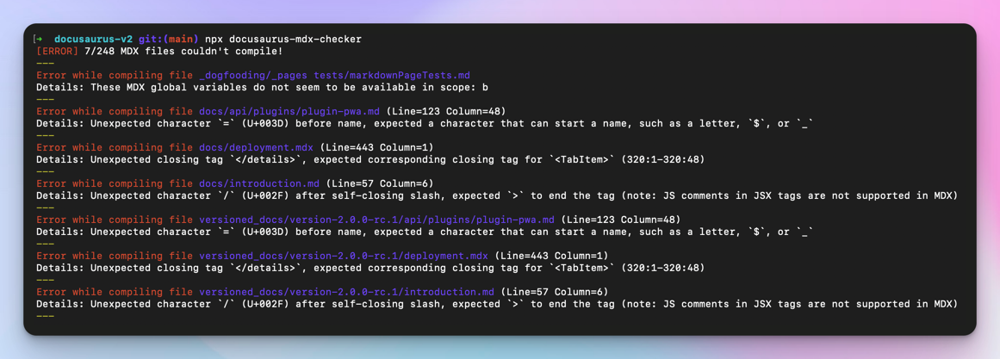

:::warning

This blog post was written when Docusaurus v3 was in beta. There are some changes in dependency versions and upgrade steps you should be aware of if upgrading to Docusaurus v3 current stable releases. Use the [upgrade guide](https://docusaurus.io/docs/next/migration/v3) for the most up-to-date migration steps.

:::

**Docusaurus v3** est maintenant [**en beta**](https://github.com/facebook/docusaurus/discussions/9312) et la sortie officielle est imminente. C'est le moment idéal pour commencer à **préparer votre site** pour cette nouvelle version majeure.

Docusaurus v3 comporte quelques **changements de rupture**, dont beaucoup peuvent être **traités aujourd'hui avec Docusaurus v2**. La préparation de votre site en amont peut se faire de manière progressive et facilitera la mise à niveau vers la v3.

Le principal changement de rupture est la mise à jour de MDX v1 vers MDX v3. Lisez les notes de version pour [**MDX v2**](https://mdxjs.com/blog/v2/) et [**MDX v3**](https://mdxjs.com/blog/v3/) pour plus de détails. MDX compile maintenant votre contenu Markdown **plus strictement** et avec des **différences subtiles**.

Cet article se concentrera principalement sur la façon de préparer votre contenu pour cette nouvelle version de MDX, et énumérera également quelques autres changements de rupture que vous pouvez traiter dès aujourd'hui.


<!--truncate-->

:::warning

Cet article mentionne la plupart des changements de rupture de Docusaurus v3, mais ce n'est pas exhaustif. Lisez la [v3.0.0-beta.0 release notes](https://github.com/facebook/docusaurus/discussions/9312) pour une liste exhaustive.

:::

:::tip N'ayez pas peur

Il y a beaucoup de contenu dans cet article du blog, mais de nombreux sites Docusaurus v2 peuvent être mis à jour avec très peu de changements.

Si votre site est relativement petit, avec seulement quelques personnalisations, vous pouvez probablement [passer à Docusaurus v3](#try-docusaurus-v3-today) immédiatement.

:::

## Travaux préparatoires

Avant de préparer la mise à niveau de Docusaurus v3, nous vous recommandons d'effectuer une mise à niveau vers la dernière [version de Docusaurus v2](/versions).

En fonction de la complexité de votre site, il peut être judicieux d'adopter le [flux de travail des tests de régression visuels](/blog/upgrading-frontend-dependencies-with-confidence-using-visual-regression-testing) que nous avons récemment présenté. Cela pourrait vous aider à détecter des effets secondaires visuels inattendus survenant lors de la mise à jour de Docusaurus v3.

Nous recommandons également d'utiliser l'extension `.mdx` chaque fois que vous utilisez JSX, `import`, ou `export` (par exemple les fonctionnalités MDX) dans un fichier Markdown. Elle est plus correcte sémantiquement et améliore la compatibilité avec les outils externes (IDE, formateurs, linters, etc.). Dans les versions futures de Docusaurus, les fichiers `.md` seront analysés comme du [CommonMark](https://commonmark.org/) standard, qui ne prend pas en charge ces fonctionnalités. Dans Docusaurus v3, les fichiers `.md` continuent d'être compilés comme des fichiers MDX, mais il sera possible d'[opter pour CommonMark](https://github.com/facebook/docusaurus/issues/3018).

## Préparation du contenu pour MDX v3

MDX est une dépendance majeure de Docusaurus responsable de la compilation de vos fichiers `.md` et `.mdx` en composants React.

MDX v3 est bien meilleur, mais s'accompagne également de changements qui vous obligeront probablement à remanier quelque peu votre contenu. MDX v3 est plus strict, et certains composants qui se compilaient bien sous v1 peuvent maintenant ne pas se compiler sous v2, très probablement à cause des caractères `{` et `<`.

La mise à jour de MDX s'accompagne de toutes les changements de rupture documentés dans les articles du blog sur les versions [MDX v2](https://mdxjs.com/blog/v2/) et [MDX v3](https://mdxjs.com/blog/v3/). Les changements de rupture les plus importants proviennent de MDX v2. Le [guide de migration MDX v2](https://mdxjs.com/migrating/v2/) contient une section sur la façon de [mettre à jour les fichiers MDX](https://mdxjs.com/migrating/v2/#update-mdx-files) qui sera particulièrement pertinente pour nous. Assurez-vous également de lire la page [Troubleshooting MDX](https://mdxjs.com/docs/troubleshooting-mdx/) qui peut vous aider à interpréter les messages d'erreur MDX les plus courants.

Veillez également à lire notre page de documentation actualisée de [**MDX et React**](/docs/markdown-features/react).

:::tip Demander de l’aide

Nous avons une discussion dédiée à [MDX v3 - Support de mise à jour](https://github.com/facebook/docusaurus/discussions/9053).

:::

### Utilisation du terrain de jeu MDX

Le terrain de jeu du MDX est votre nouveau meilleur ami. Il permet de comprendre comment votre contenu est **compilé en composants React**, et de résoudre les problèmes de compilation ou de rendu de manière isolée.

Chaque version MDX est livrée avec son propre terrain de jeu :

- [Terrain de jeu MDX - version actuelle](https://mdxjs.com/playground/)
- [Terrain de jeu MDX - v1](https://mdx-git-renovate-babel-monorepo-mdx.vercel.app/playground/)

<details>
  <summary>Configuration des options du terrain de jeu MDX pour Docusaurus</summary>

Pour obtenir un comportement de compilation similaire à celui de Docusaurus v2, activez ces options sur le [terrain de jeu MDX](https://mdxjs.com/playground/) :

- Use `MDX`
- Use `remark-gfm`
- Use `remark-directive`


</details>

En utilisant les deux terrains de jeu MDX côte à côte, vous remarquerez rapidement que certains contenus sont compilés différemment ou ne se compilent pas dans la v3.

:::tip Faire en sorte que votre contenu soit prêt pour l'avenir

L'objectif est de remanier votre contenu problématique afin qu'il **fonctionne correctement avec les deux versions du MDX**. Ainsi, lorsque vous passerez à Docusaurus v3, ce contenu sera déjà prêt à l'emploi.

:::

### Utilisation du CLI de vérification du MDX

Nous fournissons un CLI [docusaurus-mdx-checker](https://github.com/slorber/docusaurus-mdx-checker) qui permet de repérer facilement les contenus problématiques. Exécutez cette commande aujourd'hui sur votre site Docusaurus v2 pour obtenir la liste des fichiers qui ne pourront pas être compilés sous MDX v3.

```bash
npx docusaurus-mdx-checker
```

Pour chaque problème de compilation, le CLI enregistre le chemin d'accès au fichier et un numéro de ligne à consulter.



:::tip

Utilisez ce CLI pour estimer la quantité de travail nécessaire pour rendre votre contenu compatible avec MDX v3.

:::

:::warning

Ce CLI est le fruit de notre travail et ne signale que les erreurs de compilation.

Il ne signale pas les modifications subtiles de la compilation qui ne produisent pas d'erreurs mais qui peuvent affecter l'affichage de votre contenu. Pour détecter ces problèmes, nous recommandons d'utiliser des [tests de régression visuels](/blog/upgrading-frontend-dependencies-with-confidence-using-visual-regression-testing).

:::

### Problèmes fréquents du MDX

Nous avons mis à jour quelques sites Docusaurus vers Docusaurus v3 et MDX v3 :

- [PR de Docusaurus](https://github.com/facebook/docusaurus/pull/8288)
- [PR de React-Native](https://github.com/facebook/react-native-website/pull/3780)
- [PR de Jest](https://github.com/jestjs/jest/pull/14463)

Ces mises à jour nous ont permis de regrouper les problèmes de contenu les plus courants et de documenter la meilleure façon de les traiter.

#### Mauvaise utilisation de `{`

Le caractère `{` est utilisé pour ouvrir des [expressions JavaScript](https://mdxjs.com/docs/what-is-mdx/#expressions). Désormais, MDX échouera si ce que vous mettez dans `{expression}` n'est pas une expression valide.

```md title="example.md"
La forme de l'objet ressemble à {username: string, age: number}
```

:::danger Message d'erreur

> Could not parse expression with acorn: Unexpected content after expression

:::

:::tip Comment se préparer

Options disponibles pour corriger cette erreur :

- Utilisez le code en ligne : `{username: string, age: number}`
- Utilisez le code HTML : `&amp;#123;`
- Échappez-le  : `\{`

:::

#### Mauvaise utilisation de `<`

Le caractère `<` est utilisé pour ouvrir des [balises JSX](https://mdxjs.com/docs/what-is-mdx/#jsx). Désormais, MDX échouera s'il pense que votre JSX n'est pas valide.

```md title="example.md"
Utiliser la version Android <5

Vous pouvez utiliser un type générique comme Array<T>

Suivez le modèle "Road to <YOUR_MINOR_VERSION>"
```

:::danger Messages d'erreur

> Unexpected character `5` (U+0035) before name, expected a character that can start a name, such as a letter, `$`, or `_`
>
> Expected a closing tag for `<T>` (1:6-1:9) before the end of `paragraph` end-tag-mismatch mdast-util-mdx-jsx
>
> Expected a closing tag for `<YOUR_MINOR_VERSION>` (134:19-134:39) before the end of `paragraph`

:::

:::tip Comment se préparer

Options disponibles pour corriger cette erreur :

- Utilisez le code en ligne : `Array<T>`
- Utilisez le code HTML : `&amp;lt;` ou `&amp;#60;`
- Échappez-le : `\<` (malheureusement le `\` sera affiché sous MDX v1)

:::

#### Mauvaise utilisation de GFM Autolink

Docusaurus prend en charge [GitHub Flavored Markdown (GFM)](https://github.github.com/gfm/), mais [autolink](https://github.github.com/gfm/#autolinks) utilisant la syntaxe `<link>` n'est plus pris en charge par MDX.

```md title="example.md"
<sebastien@thisweekinreact.com>

<http://localhost:3000>
```

:::danger Messages d'erreur

> Unexpected character `@` (U+0040) in name, expected a name character such as letters, digits, `$`, or `_`; whitespace before attributes; or the end of the tag (note: to create a link in MDX, use `[text](url)`)
>
> Unexpected character `/` (U+002F) before local name, expected a character that can start a name, such as a letter, `$`, or `_` (note: to create a link in MDX, use `[text](url)`)

:::

:::tip Comment se préparer

Utilisez des liens Markdown classiques, ou supprimez les `<` et `>`. MDX et GFM sont déjà en mesure d'établir des liens automatiques avec les littéraux.

{/_ prettier-ignore _/}

```md title="example.md"
sebastien@thisweekinreact.com
[sebastien@thisweekinreact.com](mailto:sebastien@thisweekinreact.com)

http://localhost:3000
[http://localhost:3000](http://localhost:3000)
```

:::

#### Correspondance de MDXComponent en minuscules

Pour les utilisateurs fournissant une [correspondance `MDXComponent` personnalisée](/docs/markdown-features/react#mdx-component-scope), les composants sont maintenant « mis en bac à sable » :

- une correspondance de `MDXComponent` pour `h1` n'est utilisée que pour `# hi` mais pas pour `<h1>hi</h1>`
- un nom d'élément personnalisé **en minuscules** ne sera plus remplacé par son composant `MDXComponent` respectif

:::danger différence visuelle

Votre [correspondance de composant `MDXComponent`](/docs/markdown-features/react#mdx-component-scope) pourrait ne pas être appliquée comme avant, et vos composants personnalisés pourraient ne plus être utilisés.

:::

:::tip Comment se préparer

Pour les éléments Markdown natifs, vous pouvez continuer à utiliser les **minuscules** : `p`, `h1`, `img`, `a`...

Pour tout autre élément, **utiliser des noms en majuscules**.

```diff title="src/theme/MDXComponents.js"
 import MDXComponents from '@theme-original/MDXComponents';

 export default {
   ...MDXComponents,
   p: (props) => <p {...props} className="my-paragraph"/>
-  myElement: (props) => <div {...props} className="my-class" />,
+  MyElement: (props) => <div {...props} className="my-class" />,
 };
```

:::

#### Paragraphes supplémentaires involontaires

Dans MDX v3, il est désormais possible d'intercaler du JSX et du Markdown plus facilement sans avoir besoin de sauts de ligne supplémentaires. L'écriture d'un contenu sur plusieurs lignes peut également produire de nouvelles balises `<p>` attendues.

:::danger différence visuelle

Voyez comment ce contenu est rendu différemment par MDX v1 et v3.

```md title="example.md"
<div>Un peu de contenu **Markdown**</div>
<div>
  Un peu de contenu **Markdown**
</div>
```

{/_ prettier-ignore _/}

```html title="MDX v1 output"
<div>Un peu de contenu **Markdown**</div>
<div>Un peu de contenu **Markdown**</div>
```

{/_ prettier-ignore _/}

```html title="MDX v3 output"
<div>Un peu de contenu <strong>Markdown</strong></div>
<div><p>Un peu de contenu <strong>Markdown</strong></p></div>
```

:::

:::tip Comment se préparer

Si vous ne voulez pas de balise `<p>` supplémentaire, remaniez le contenu au cas par cas pour utiliser une balise JSX sur une seule ligne.

```diff
 <figure>
   
-  <figcaption>
-    Légende de mon image
-  </figcaption>
+  <figcaption>Légende de mon image</figcaption>
 </figure>
```

Si votre contenu contient des « Markdown en ligne » (`**`, `*`, `_`, `[link](/path)`), il se peut que vous ne puissiez pas le remanier à l'avance, et devrez le faire en même temps que la mise à jour de Docusaurus v3.

:::

#### Utilisation involontaire de directives

Docusaurus v3 utilise désormais des [directives Markdown](https://talk.commonmark.org/t/generic-directives-plugins-syntax/444) (mises en œuvre avec [remark-directive](https://github.com/remarkjs/remark-directive)) comme moyen générique de fournir un support pour les admonitions, et d'autres fonctionnalités à venir de Docusaurus.

```md title="example.md"
Ceci est un :texteDeDirective

::directiveFeuille

:::conteneurDeDirective

Contenu du conteneur de la directive

:::
```

:::danger Changement visuel

Les directives sont analysées dans le but d'être traitées par d'autres plugins Remark. Les directives non traitées seront ignorées et ne seront pas restituées dans leur forme originale.

```md title="example.md"
La conférence AWS re:Invent est formidable
```

En raison de l'analyse de `:Invent` en tant que directive de texte, ceci sera maintenant rendu ainsi :

```
La conférence AWS re
est formidable
```

:::

:::tip Comment se préparer

- Utilisez le code HTML : `&amp;#58;`
- Ajoutez un espace après `:` (si cela a du sens) : `: texte`
- Échappez-le : `\:` (malheureusement le `\` sera affiché sous MDX v1)

:::

#### Blocs de code indentés non pris en charge

MDX ne transforme plus le texte indenté comme des blocs de code.

```md title="example.md"
    console.log("hello");
```

:::danger Changement visuel

La mise à jour ne produit généralement pas de nouvelles erreurs de compilation MDX, mais peut entraîner un rendu inattendu du contenu parce qu'il n'y a plus de bloc de code.

:::

:::tip Comment se préparer

Utilisez la syntaxe du bloc de code normal au lieu de l'indentation :

````md title="example.md"
```js
console.log('hello');
```
````

:::

### Plugins MDX

Tous les paquets officiels (Unified, Remark, Rehype...) dans l'écosystème MDX sont désormais des [**Modules ES uniquement**](https://gist.github.com/sindresorhus/a39789f98801d908bbc7ff3ecc99d99c) et ne supportent plus [CommonJS] (https://nodejs.org/api/modules.html#modules-commonjs-modules).

En pratique, cela signifie que vous ne pouvez plus faire de `require("remark-plugin")`.

:::tip Comment se préparer

Docusaurus v3 prend désormais en charge les fichiers de configuration [**ES Modules**](https://flaviocopes.com/es-modules/). Nous vous recommandons de migrer votre fichier de config vers le ES module, qui vous permet d'importer facilement les plugins Remark :

```js title="docusaurus.config.js"
import remarkPlugin from 'remark-plugin';

export default {
  title: 'Docusaurus',
  /* config du site à l'aide des plugins remark ici */
};
```

Si vous souhaitez continuer à utiliser les modules CommonJS, vous pouvez utiliser les importations dynamiques comme solution de contournement qui vous permet d'importer des modules ES à l'intérieur d'un module CommonJS. Heureusement, la [config de Docusaurus prend en charge l'utilisation d'une fonction asynchrone](/docs/configuration#syntax-to-declare-docusaurus-config) qui vous permet de le faire.

```js title="docusaurus.config.js"
module.exports = async function () {
  const myPlugin = (await import('remark-plugin')).default;
  return {
    // config du site...
  };
};
```

:::

:::info Pour les auteurs de plugins

Si vous avez créé des plugins Remark ou Rehype personnalisés, vous devrez peut-être les refactoriser, voire les réécrire complètement, étant donné la façon dont le nouveau système AST est structuré. Nous avons créé une [discussion d'assistance dédiée](https://github.com/facebook/docusaurus/discussions/9337) pour aider les auteurs de plugins à mettre à jour leur code.

:::

## Autres changements de rupture

Hormis le MDX, il existe d'autres changements de rupture auxquels vous pouvez d'ores et déjà préparer votre site, notamment des montées de version majeures de dépendances importantes.

### Node.js 18.0

Node.js 16 [a atteint sa fin de vie](https://nodejs.org/en/blog/announcements/nodejs16-eol), et Docusaurus v3 nécessite désormais **Node.js >= 18.0**.

:::tip Comment se préparer

Veuillez mettre à jour votre site Docusaurus v2 vers Node.js 18 avant de passer à Docusaurus v3.

:::

### React 18.0

Docusaurus v3 nécessite désormais **React >= 18.0**.

React 18 s'accompagne de ses propres changements de rupture qui devraient être relativement faciles à gérer, selon la quantité de code React personnalisé que vous avez créé pour votre site.

Les simples sites Docusaurus, qui n'utilisent que du code de notre thème officiel sans swizzling, n'ont aucun souci à se faire.

:::tip Comment se préparer

Lisez les documents officiels de [React v18.0](https://react.dev/blog/2022/03/29/react-v18) et [Comment passer à React 18](https://react.dev/blog/2022/03/08/react-18-upgrade-guide), et examinez votre code React initial pour déterminer les composants susceptibles d'être affectés par cette mise à niveau de React 18.

Nous recommandons de vérifier tout particulièrement les points suivants :

- Le traitement automatique des composants avec état
- Les nouvelles erreurs d'hydratation de React signalées dans la console

:::

### TypeScript 5.0

Docusaurus v3 nécessite désormais **TypeScript >= 5.0**.

:::tip Comment se préparer

Veuillez mettre à jour votre site Docusaurus v2 vers TypeScript 5 avant de passer à Docusaurus v3.

:::

### Configuration de base de TypeScript

La configuration officielle de TypeScript de Docusaurus a été réinternalisée depuis le paquet externe [`@tsconfig/docusaurus`](https://www.npmjs.com/package/@tsconfig/docusaurus) vers notre nouveau paquet monorepo [`@docusaurus/tsconfig`](https://www.npmjs.com/package/@docusaurus/tsconfig).

Ce nouveau paquet est versionné en même temps que tous les autres paquets de base de Docusaurus, et il sera utilisé pour assurer la rétro-compatibilité de TypeScript et les changements de rupture lors des mises à jour de versions majeures.

:::tip Comment se préparer

La nouvelle configuration TypeScript de Docusaurus v3 est judicieusement la même que l'ancienne configuration TypeScript de Docusaurus v2. Si vous avez effectué la montée de version vers TypeScript 5, l'utilisation de la configuration de Docusaurus v3 sur un site v2 est déjà possible :

```diff title="package.json"
 {
   "devDependencies": {
-    "@tsconfig/docusaurus": "^1.0.7",
+    "@docusaurus/tsconfig": "^3.0.0-beta.0",
   }
 }
```

```diff title="tsconfig.json"
 {
-  "extends": "@tsconfig/docusaurus/tsconfig.json",
+  "extends": "@docusaurus/tsconfig",
   "compilerOptions": {
     "baseUrl": "."
   }
 }
```

:::

### Admonition warning

Pour des raisons historiques, nous prenons en charge un admonition non documenté `:::warning` qui s'affiche avec une couleur rouge.

:::danger Attention

Ceci est une admonition de Docusaurus v2 `:::warning`.

:::

Cependant, la couleur et l'icône sont historiquement erronées. Docusaurus v3 réintroduit officiellement l'admonition `:::warning`, la documente, et corrige la couleur et l'icône.

:::warning

Ceci est une admonition de Docusaurus v3 `:::warning`.

:::

:::tip Comment se préparer

Si vous utilisiez auparavant l'admonition non documentées `:::warning`, vérifiez pour chaque utilisation si le jaune est maintenant une couleur appropriée. Si vous voulez conserver la couleur rouge, utilisez `:::danger` à la place.

Docusaurus v3 [a aussi déprécié l'admonition `:::caution`](https://github.com/facebook/docusaurus/pull/9308). Veuillez refactoriser `:::caution` (jaune) soit en `:::warning` (jaune) soit en `:::danger` (rouge).

:::

### Barres latérales versionnées

Ce changement de rupture n'affectera **que les utilisateurs de Docusaurus v2** qui ont versionné leurs documents avant la `v2.0.0-beta.10` (décembre 2021).

Lors de la création de la version `v1.0.0`, le fichier sidebar contenait un préfixe `version-v1.0.0/` que [Docusaurus v3 ne prend plus en charge](https://github.com/facebook/docusaurus/pull/9310).

```json title="versioned_sidebars/version-v1.0.0-sidebars.json"
{
  "version-v1.0.0/docs": [
    "version-v1.0.0/introduction",
    "version-v1.0.0/prerequisites"
  ]
}
```

:::tip Comment se préparer

Votre site Docusaurus v2 est capable de gérer les deux formats de barres latérales de la même manière.

Vous pouvez supprimer le préfixe versionné inutile de vos barres latérales versionnées.

```json title="versioned_sidebars/version-v1.0.0-sidebars.json"
{
  "docs": ["introduction", "prerequisites"]
}
```

:::

## Essayez Docusaurus v3 aujourd'hui {#try-docusaurus-v3-today}

Docusaurus v3 est maintenant [en beta](https://github.com/facebook/docusaurus/discussions/9312), et déjà utilisé en production par [React-Native](https://reactnative.dev), [Jest](https://jestjs.io) et [notre propre site web](https://docusaurus.io/).

Nous pensons que cette nouvelle version de Docusaurus est **robuste et prête à être déployée en production**. Il devrait être lancé officiellement bientôt, après avoir reçu un retour positif de la part des premiers utilisateurs de notre communauté.

Nous vous serions très reconnaissants d'essayer la mise à jour et de signaler les problèmes sur le [fil de discussion sur la version 3.0.0-beta.0](https://github.com/facebook/docusaurus/discussions/9312).

Pour la plupart des sites, la mise à jour devrait être facile. Si vous avez préparé votre site au préalable comme indiqué ici, la mise à jour des dépendances suivantes devrait suffire :

```diff title="package.json"
 {
   "dependencies": {
-    "@docusaurus/core": "2.4.3",
-    "@docusaurus/preset-classic": "2.4.3",
-    "@mdx-js/react": "^1.6.22",
+    "@docusaurus/core": "3.0.0-beta.0",
+    "@docusaurus/preset-classic": "3.0.0-beta.0",
+    "@mdx-js/react": "^3.0.0",
     "clsx": "^2.0.0",
     "prism-react-renderer": "^1.3.5",
-    "react": "^17.0.2",
-    "react-dom": "^17.0.2"
+    "react": "^18.2.0",
+    "react-dom": "^18.2.0"
   },
   "devDependencies": {
-    "@docusaurus/module-type-aliases": "2.4.3"
+    "@docusaurus/module-type-aliases": "3.0.0-beta.0"
   }
 }
```

## Demander de l’aide

Nous serons là pour vous aider à effectuer la montée de version par le biais des canaux d'assistance suivants :

- [Docusaurus v3 - Support de mise à jour](https://github.com/facebook/docusaurus/discussions/9336)
- [Docusaurus v3 - Canal Discord #migration-v2-to-v3](https://discord.com/channels/398180168688074762/1154771869094912090)
- [MDX v3 - Support de mise à jour](https://github.com/facebook/docusaurus/discussions/9053)
- [MDX v3 - Support des plugins Remark/Rehype](https://github.com/facebook/docusaurus/discussions/9337)
- [MDX v3 - Canal Discord #migration-mdx-v3](https://discord.com/channels/398180168688074762/1116724556976111616)

Vous pouvez également faire appel à un [fournisseur de service Docusaurus](https://github.com/facebook/docusaurus/discussions/9281) payant pour effectuer cette montée de version à votre place. Si votre site est open source, vous pouvez également demander à notre communauté une [aide gratuite et bienveillante](https://github.com/facebook/docusaurus/discussions/9283).

## Conclusion

Docusaurus v3 est prêt à être essayé, et sera bientôt disponible. Cet article vous donne déjà une bonne idée de tous les changements majeurs nécessaires à la montée de version.

La version initiale 3.0 se concentre sur les dépendances et les mises à niveau de l'infrastructure qui nous permettront d'implémenter de nouvelles fonctionnalités intéressantes. Elle est également dotée de quelques fonctionnalités utiles que nous détaillerons dans les notes de la version finale.
