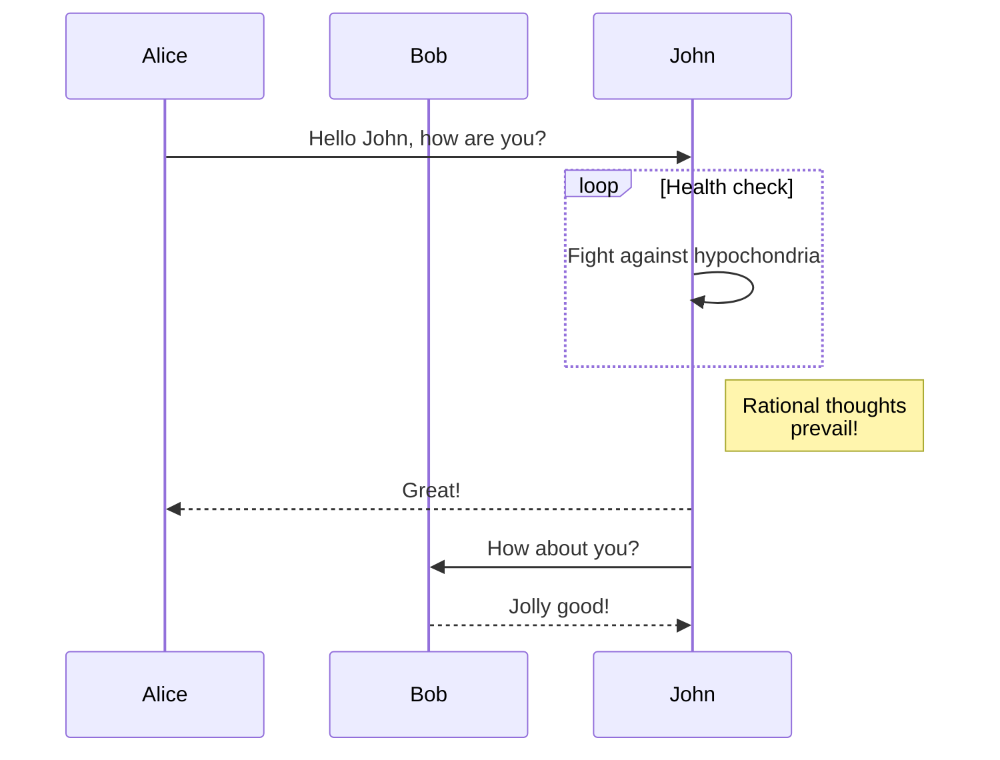

Nous sommes heureux d'annoncer **Docusaurus 2.2**.

La mise à jour devrait être facile : comme expliqué dans notre [documentation sur le processus de version](/community/release-process), les versions mineures respectent [le versionnement sémantique](https://semver.org/).


{/* truncate */}

## Points importants

### Diagrammes Mermaid

Dans le [#7490](https://github.com/facebook/docusaurus/pull/7490), nous avons ajouté le support des diagrammes de Mermaid. Cela comble le vide entre GitHub Flavored Markdown qui a également [ajouté la prise en charge récemment](https://github.blog/2022-02-14-include-diagrams-markdown-files-mermaid/). Vous pouvez créer des diagrammes Mermaid en utilisant des blocs de code Markdown :

````md

````

````mdx-code-block
import BrowserWindow from '@site/src/components/BrowserWindow';

<BrowserWindow>


</BrowserWindow>

````
Veillez à consulter la [documentation](/docs/markdown-features/diagrams), et les [exemples plus avancés](/tests/pages/diagrams)
### Config `headTags`
Dans le [#8151](https://github.com/facebook/docusaurus/pull/8151), nous avons ajouté la possibilité d'appliquer des balises HTML arbitraire `<head>` à toutes les pages de votre site.

```js title="docusaurus.config.js"
module.exports = {
  headTags: [
    {
      tagName: 'link',
      attributes: {
        rel: 'icon',
        href: '/img/docusaurus.png',
      },
    },
  ],
};
```

### Accessibilité

Nous avons fait plusieurs améliorations d'accessibilité :

- [#8207](https://github.com/facebook/docusaurus/pull/8207) : amélioration de la navigation au clavier pour le bouton de menu du hamburger mobile
- [#8161](https://github.com/facebook/docusaurus/pull/8161) : amélioration de la navigation au clavier pour les onglets
- [#8204](https://github.com/facebook/docusaurus/pull/8204) : permet au bouton "Aller au contenu principal" de prendre en charge les améliorations progressives
- [#8174](https://github.com/facebook/docusaurus/pull/8174): améliore l'annonce du lecteur d'écran en basculant entre les modes clair/sombre

### Expérience de développeur

Nous avons rendu la validation plus stricte et amélioré les messages d'erreur :

- [#8234](https://github.com/facebook/docusaurus/pull/8234) : en cas d'échec du traitement du doc, imprime le chemin du fichier markdown problématique dans le message d'erreur
- [#8192](https://github.com/facebook/docusaurus/pull/8192) et [#8159](https://github.com/facebook/docusaurus/pull/8159) : valide `siteConfig.url` plus strictement et avec un meilleur message d'erreur
- [#8066](https://github.com/facebook/docusaurus/pull/8066) : rend la config `url` et `baseUrl` plus sûrs et moins sensibles à la présence ou à l'absence d'un slash de début ou de fin

### Traductions

Nous avons ajouté la prise en charge de la traduction du thème par défaut pour plusieurs langues :

- 🇹🇷 [#8105](https://github.com/facebook/docusaurus/pull/8105) : traductions complètes en turc
- 🇷🇺 [#8253](https://github.com/facebook/docusaurus/pull/8253) : traductions complètes en russe
- 🇫🇷 [#8243](https://github.com/facebook/docusaurus/pull/8243) : traductions complètes en français
- 🇯🇵 [#8075](https://github.com/facebook/docusaurus/pull/8075) : traductions complètes en japonais

:::tip

Traduire les thèmes représente un [effort constant](https://github.com/facebook/docusaurus/issues/3526) et un moyen facile de contribuer à Docusaurus. Nous ajoutons régulièrement de nouvelles fonctionnalités de thème, pour lesquelles nous avons souvent [besoin de nouvelles traductions](https://github.com/facebook/docusaurus/issues/3526).

:::

## Autres modifications

Voici les autres changements notables :

- [#8210](https://github.com/facebook/docusaurus/pull/8210) : le CLI `docusaurus swizzle` a une nouvelle option `--config`
- [#8109](https://github.com/facebook/docusaurus/pull/8109) : optimisation des performances de navigation mobile, pré-chargement précoce des ressources
- [#8059](https://github.com/facebook/docusaurus/pull/8059) : les listes déroulantes de la barre de navigation versions/locales conservent le hachage et les paramètres de requête lors de la navigation
- [#8227](https://github.com/facebook/docusaurus/pull/8227) : le plugin de redirection du client conserve le hachage et les paramètres de requête lors de la redirection

Consultez **[l'entrée 2.2.0 du changelog](/changelog/2.2.0)** pour une liste exhaustive des changements.
