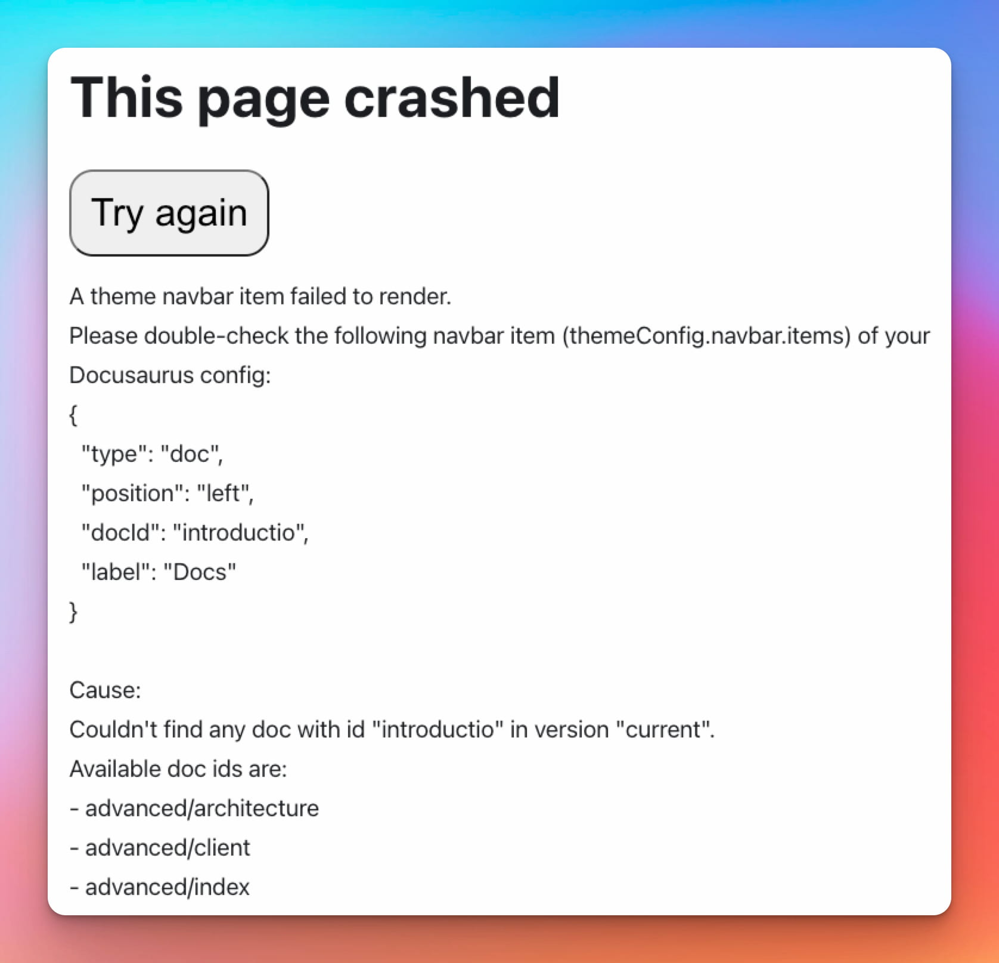

Nous sommes heureux d'annoncer **Docusaurus 2.4**.

La mise à jour devrait être facile : comme expliqué dans notre [documentation du processus de publication](/community/release-process), les versions mineures respectent [le versionnage sémantique](https://semver.org/).


<!--truncate-->

import BrowserWindow from '@site/src/components/BrowserWindow';
import IframeWindow from '@site/src/components/BrowserWindow/IframeWindow';
import ErrorBoundaryTestButton from '@site/src/components/ErrorBoundaryTestButton';

## Points importants

### Description des éléments de la barre latérale

Dans [#8236](https://github.com/facebook/docusaurus/pull/8236), nous avons ajouté la possibilité de fournir un nouvel attribut `description` pour les éléments de type `link` et `category` de la barre latérale de la documentation.

```tsx title="sidebars.js"
[
  {
    type: 'link',
    label: 'Lien avec description',
    href: 'https://docusaurus.io',
    // highlight-next-line
    description: 'Une descriptions pour le lien',
  },
  {
    type: 'category',
    label: 'Catégorie avec description',
    // highlight-next-line
    description: 'Une description de la catégorie',
    objets : [],
  },
];
```

Ces descriptions seront utilisées dans les pages d'index générées pour les catégories.


### Chaîne de requête du thème

Dans [#8708](https://github.com/facebook/docusaurus/pull/8708), nous avons ajouté la possibilité de forcer Docusaurus à s'initialiser en mode `light` (clair) ou `dark` (sombre) grâce à un nouveau paramètre `docusaurus-theme` de la chaîne de requête.

Ceci est utile pour assurer un thème cohérent lors de l'intégration d'une page Docusaurus existante dans une iframe ou WebView.

<IframeWindow url="/docs/?docusaurus-theme=light" />
<IframeWindow url="/docs/?docusaurus-theme=dark" />

### Mise à jour du plugin Remark-plugin-npm2yarn

Dans [#8690](https://github.com/facebook/docusaurus/pull/8690), nous avons mis à jour notre plugin Remark [@docusaurus/remark-plugin-npm2yarn](https://github.com/facebook/docusaurus/tree/main/packages/docusaurus-remark-plugin-npm2yarn) avec de nombreuses corrections de bugs de conversion, un support de première classe pour pnpm, et la possibilité d'enregistrer des convertisseurs personnalisés produisant de nouveaux onglets.

````markdown
Run these commands!

```bash npm2yarn
npm install
npm run build
npm run myCustomScript -- --some-arg
```
````

<BrowserWindow>

```bash npm2yarn
npm install
npm run build
npm run myCustomScript -- --some-arg
```

</BrowserWindow>

### Prise en charge de gtag pour plusieurs ID de suivi

Dans [#8620](https://github.com/facebook/docusaurus/pull/8620) nous avons ajouté le support du plugin [@docusaurus/plugin-google-gtag](/docs/api/plugins/@docusaurus/plugin-google-gtag) pour déclarer plusieurs ID de suivi.

```js title="docusaurus.config.js"
module.exports = {
  presets: [
    [
      '@docusaurus/preset-classic',
      {
        gtag: {
          trackingID: [
            // highlight-next-line
            'G-<YOUR-NEW-GA4-ID>',
            // highlight-next-line
            'UA-<YOUR-OLD-UA-ID>',
          ],
        },
      },
    ],
  ],
};
```

:::warning Google met progressivement fin à Universal Analytics

**[Google mettra fin à Universal Analytics](https://blog.google/products/marketingplatform/analytics/prepare-for-future-with-google-analytics-4/)** le **1ᵉʳ juillet 2023**.

Les utilisateurs de Docusaurus devraient par conséquent migrer vers Google Analytics 4. Google **ne permet pas de migrer vos données Universal Analytics existantes** vers votre nouveau domaine Google Analytics 4.

Pour préserver la continuité de vos statistiques, nous vous recommandons temporairement de rapporter les événements à deux identifiants de suivi simultanément : l'ancien (`UA-*`) et le nouveau (`G-*`). Reportez-vous au **[problème dédié](https://github.com/facebook/docusaurus/issues/7221)** pour plus de détails.

:::

### Expérience de développeur

Dans [#8736](https://github.com/facebook/docusaurus/pull/8736), nous avons amélioré la façon dont les messages d'erreur sont rendus et ajouté le support initial pour le rendu de la chaîne causale complète d'une erreur (voir [ES2022 Error Cause](https://h3manth.com/ES2022/#error-cause)).

:::tip

Pour le voir en action, cliquez ici : <ErrorBoundaryTestButton cause="Probably undefined is not a function 😄"/>

:::

Dans [#8735](https://github.com/facebook/docusaurus/pull/8735), nous avons également clarifié les messages d'erreur liés à la barre de navigation pour aider les utilisateurs à comprendre ce qu'ils ont fait de mal.



### Traductions

Nous avons rendu possible la traduction de quelques nouveaux éléments :

- [#8677](https://github.com/facebook/docusaurus/pull/8677) introduit un nouveau `process.env.DOCUSAURUS_CURRENT_LOCALE` (expérimental) vous permettant de localiser votre fichier de configuration, y compris le titre du site, le slogan, la barre d'annonce, baseUrl...
- [#8616](https://github.com/facebook/docusaurus/pull/8616) permet de traduire le texte alternatif de la barre de navigation et du logo du pied de page

Nous avons ajouté la prise en charge de la traduction du thème par défaut pour plusieurs langues :

- 🇭🇺 [#8668](https://github.com/facebook/docusaurus/pull/8668): Hongrois
- 🇳🇴 [#8631](https://github.com/facebook/docusaurus/pull/8631): Norvégien (Bokmål)

:::tip

Terminer les traductions du thème est un [effort en cours](https://github.com/facebook/docusaurus/issues/3526) et un moyen facile de contribuer à Docusaurus. Nous ajoutons régulièrement de nouvelles fonctionnalités de thème, pour lesquelles nous avons souvent [besoin de nouvelles traductions](https://github.com/facebook/docusaurus/issues/3526).

:::

## Autres modifications

Voici les autres changements notables :

- [#8674](https://github.com/facebook/docusaurus/pull/8674) : respect de la requête média `prefers-reduced-motion: reduce`
- [#8712](https://github.com/facebook/docusaurus/pull/8712) : utilisation d'un élément de la barre de navigation de type `docSidebar` dans le modèle
- [#8801](https://github.com/facebook/docusaurus/pull/8801) : permettre aux onglets enfants d'être faux
- [#8757](https://github.com/facebook/docusaurus/pull/8757) : faire que la page de recherche réagisse aux changements externes de chaîne de recherche
- [#8803](https://github.com/facebook/docusaurus/pull/8803) : correction de la position des boutons du bloc de code en DàG
- [#8615](https://github.com/facebook/docusaurus/pull/8615) : correction de la bascule du mode couleur lorsque la barre de navigation sombre est utilisée
- [#8699](https://github.com/facebook/docusaurus/pull/8699) : correction d'un bug de focalisation de l'onglet déroulant de la barre de navigation

Consultez **[l'entrée 2.4.0 du journal des modifications](/changelog/2.4.0)** pour une liste exhaustive des changements.
