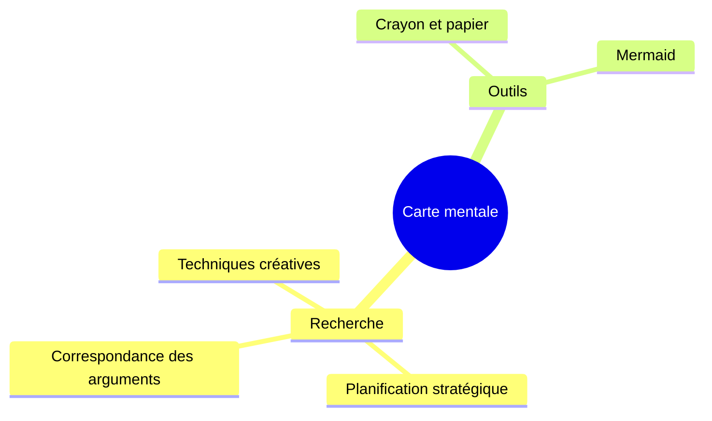
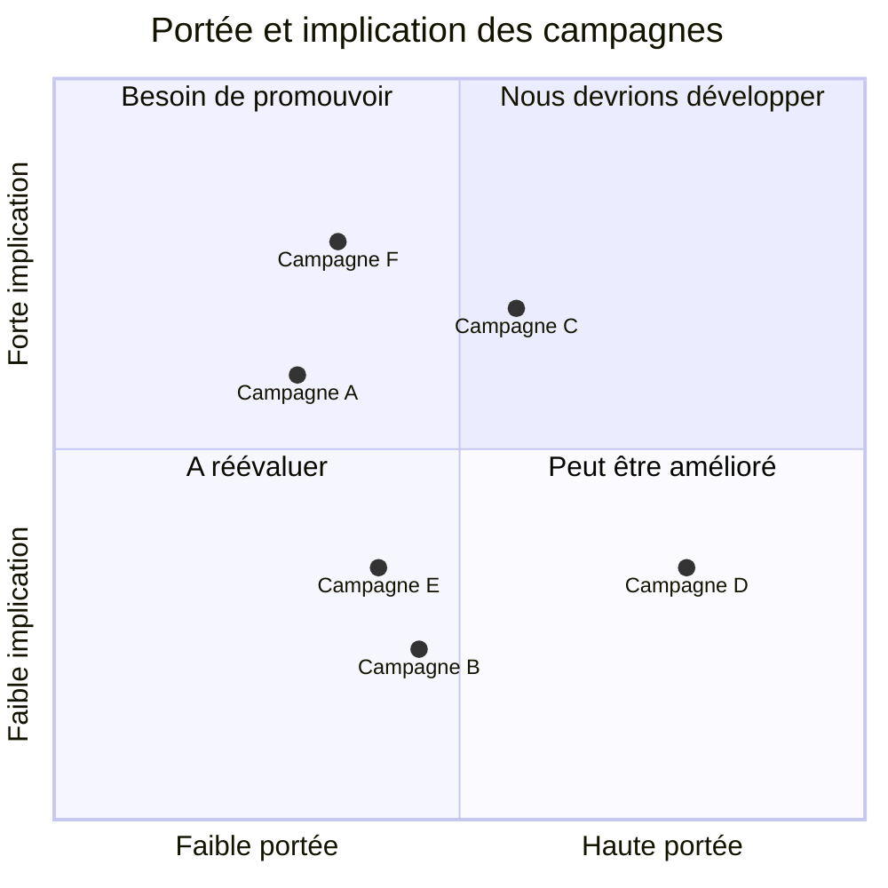

Aujourd'hui, nous sommes heureux d'**annoncer Docusaurus 3.0** ! 🥳

Chez [**Meta Open Source**](https://opensource.fb.com/), nous pensons que Docusaurus vous aidera à construire les **meilleurs sites web de documentation** avec **un minimum d'effort**, vous permettant de **vous concentrer sur ce qui compte vraiment** : l'écriture du contenu.

Il s'agit d'une nouvelle **version majeure** de Docusaurus, avec **de nouvelles fonctionnalités intéressantes** et des dépendances mises à jour.

Conformément aux principes du [**Semantic Versioning**](https://semver.org/), cette version inclut des **changements de rupture** que nous avons documentés en détail dans le [**guide de mise à jour de la version 3**](/docs/migration/v3/). Les changements de rupture peuvent être gênants, mais ils sont nécessaires pour préparer le terrain à une **nouvelle vague de fonctionnalités Docusaurus** que nous prévoyons d'implémenter.


{/_ truncate _/}

Nous avions initialement prévu de publier des versions majeures plus fréquemment, mais Docusaurus v3 a pris plus de temps que prévu. Parmi les changements de rupture que nous avons comptabilisés, **la montée de version vers MDX v3** est probablement le principal défi à l'adoption de cette nouvelle version. Nous avons fait un effort supplémentaire pour rendre cette montée de version aussi facile que possible, notamment en ajoutant des [options de compatibilité pour MDX v1](/docs/api/docusaurus-config#markdown).

Les sites les plus simples n'auront besoin de mettre à jour que quelques dépendances npm. Pour les sites plus complexes, nous avons élaboré quelques stratégies qui peuvent vous aider à effectuer une mise à niveau en toute confiance :

- [Préparez votre site](/blog/preparing-your-site-for-docusaurus-v3) à l'avance, progressivement, tout en restant sur Docusaurus v2
- [Mettez en place des tests de régression visuelle](/blog/upgrading-frontend-dependencies-with-confidence-using-visual-regression-testing) pour détecter les changements visuels inattendus survenant au cours de la mise à jour

:::info À propos de Docusaurus v2

According to our [release process](/community/release-process), Docusaurus v2 has now entered **maintenance mode**. Elle bénéficiera d'une assistance pour les problèmes de sécurité majeurs pendant trois mois seulement, jusqu'au 31 janvier 2024. Il est recommandé de passer à la version 3 dans ce laps de temps.

:::

import IframeWindow from '@site/src/components/BrowserWindow/IframeWindow';

## Changements de rupture

Cette section ne donne qu'un bref aperçu. Toutes les changements de rupture sont documentés en détail dans le [**guide de mise à jour de la version 3**](/docs/migration/v3).

Docusaurus v3 a mis à jour quelques dépendances vers de nouvelles versions majeures, chacune venant avec ses propres changements de rupture :

- Node.js v16 ➡️ v18
- React v17 ➡️ v18
- MDX v1 ➡️ v3
- TypeScript v4 ➡️ v5
- prism-react-renderer v1 ➡️ v2
- react-live v2 ➡️ v4
- Mermaid v9 ➡️ v10
- import-fresh v3 ➡️ jiti v1
- remark-emoji v2 ➡️ v4

Une mise à jour typique des dépendances de `package.json` ressemble à ceci :

```diff title="package.json"
 {
   "dependencies": {
     // upgrade to Docusaurus v3
-    "@docusaurus/core": "2.4.3",
-    "@docusaurus/preset-classic": "2.4.3",
+    "@docusaurus/core": "3.0.0",
+    "@docusaurus/preset-classic": "3.0.0",
     // upgrade to MDX v3
-    "@mdx-js/react": "^1.6.22",
+    "@mdx-js/react": "^3.0.0",
     // upgrade to prism-react-renderer v2.0+
-    "prism-react-renderer": "^1.3.5",
+    "prism-react-renderer": "^2.1.0",
     // upgrade to React v18.0+
-    "react": "^17.0.2",
-    "react-dom": "^17.0.2"
+    "react": "^18.2.0",
+    "react-dom": "^18.2.0"
   },
   "devDependencies": {
     // upgrade Docusaurus dev dependencies to v3
-    "@docusaurus/module-type-aliases": "2.4.3",
-    "@docusaurus/types": "2.4.3"
+    "@docusaurus/module-type-aliases": "3.0.0",
+    "@docusaurus/types": "3.0.0"
   }
   "engines": {
     // require Node.js 18.0+
-    "node": ">=16.14"
+    "node": ">=18.0"
   }
 }
```

A l'exception de MDX v3, la plupart des changements de rupture provenant de ces dépendances, qui ont été mises à jour, ont été gérés en interne pour vous : la plupart du temps, vous ne devriez pas avoir à faire quoi que ce soit. En dehors des dépendances, les seuls changements de rupture fonctionnels provenant explicitement de la base de code de Docusaurus sont les suivantes :

- [#9189](https://github.com/facebook/docusaurus/pull/9189) : nouveau flux RSS de blog par défaut limité à 20 entrées
- [#9308](https://github.com/facebook/docusaurus/pull/9308) : corrige et réintroduit l'admonition `:::warning`, supprime `:::caution`
- [#9310](https://github.com/facebook/docusaurus/pull/9310) : supprime l'ancien préfixe d'identification de la barre latérale, utilisé pour les sites dont la version est antérieure à `v2.0.0-beta.10` (décembre 2021)
- [#7966](https://github.com/facebook/docusaurus/pull/7966) : refactorise les composants du thème des docs, ce qui vous oblige éventuellement à les re-swizzler

## Points importants

Voici une liste non exhaustive des nouvelles fonctionnalités utiles de cette nouvelle version. Toutes les fonctionnalités sont listées dans les [**notes de version de Docusaurus v3.0.0**](https://github.com/facebook/docusaurus/releases/tag/v3.0.0).

### Markdown

Docusaurus v3 met à jour MDX v1 en MDX v3 :

- dans [#8288](https://github.com/facebook/docusaurus/pull/8288), nous avons mis à jour vers [**MDX v2**](https://mdxjs.com/blog/v2/) ([guide de migration](https://mdxjs.com/migrating/v2/))
- dans [#9451](https://github.com/facebook/docusaurus/pull/9451), nous avons mis à jour vers [**MDX v3**](https://mdxjs.com/blog/v3/) ([guide de migration](https://mdxjs.com/migrating/v3/))

Cette nouvelle version de MDX est **bien meilleure pour les rédacteurs de contenu et les auteurs de plugins**, et prépare le terrain pour l'implémentation de nouvelles fonctionnalités Markdown passionnantes.

:::warning MDX v3 - le principal défi

La transition de MDX v1 à MDX v3 est le **principal défi** pour le passage à Docusaurus v3.

Certains documents qui ont été compilés avec succès sous Docusaurus v2 peuvent maintenant **ne pas être compilés** sous Docusaurus v3, tandis que d'autres peuvent **s'afficher différemment**.

La plupart des changements de rupture proviennent de [MDX v2(https://mdxjs.com/blog/v2/), et [MDX v3(https://mdxjs.com/blog/v3/) qui est une version relativement petite. Le [guide de migration MDX v2](https://mdxjs.com/migrating/v2/) contient une section sur la façon de [mettre à jour les fichiers MDX](https://mdxjs.com/migrating/v2/#update-mdx-files) qui sera particulièrement pertinente pour nous. Assurez-vous également de lire la page [Troubleshooting MDX](https://mdxjs.com/docs/troubleshooting-mdx/) qui peut vous aider à interpréter les messages d'erreur MDX les plus courants.

**Ne soyez pas intimidé**. La plupart des problèmes sont **faciles à résoudre** et souvent liés aux caractères `{` et `<` que vous devez maintenant échapper. Cependant, en fonction de la taille de votre site, vous pourriez avoir besoin de modifier de nombreux fichiers et vous sentir submergé. Pour cette raison, nous fournissons une commande [`npx docusaurus-mdx-checker`](https://github.com/slorber/docusaurus-mdx-checker) pour vous aider à obtenir une estimation du travail à effectuer, et nous recommandons de [préparer votre site à l'avance](/blog/preparing-your-site-for-docusaurus-v3).

Si vous avez créé des [plugins MDX](/docs/markdown-features/plugins) (Remark/Rehype), l'AST est légèrement différent et vous devrez peut-être les refactoriser.

:::

Cela nous permet notamment d'ajouter un [mode CommonMark](/docs/markdown-features#mdx-vs-commonmark) qui devrait faciliter l'adoption de Docusaurus pour les documentations existantes. Elle est actuellement facultative, **expérimentale** et limitée ([certaines fonctionnalités de Docusaurus ne fonctionneront pas](https://github.com/facebook/docusaurus/issues/9092)). Dans Docusaurus v3, tous les fichiers sont encore interprétés en MDX, mais nous prévoyons d'interpréter les fichiers `.md` en CommonMark dans une prochaine version majeure, et nous recommandons d'utiliser l'extension `.mdx` pour tout fichier utilisant les modules JSX ou ES.

Nous avons également introduit une nouvelle façon de [configurer le Markdown globalement pour votre site](/docs/api/docusaurus-config#markdown), et nous prévoyons d'ajouter des options plus flexibles ultérieurement.

```js title="docusaurus.config.js"
export default {
  markdown: {
    format: 'mdx',
    mermaid: true,
    preprocessor: ({filePath, fileContent}) => {
      return fileContent.replaceAll('{{MY_VAR}}', 'MY_VALUE');
    },
    mdx1Compat: {
      comments: true,
      admonitions: true,
      headingIds: true,
    },
  },
};
```

Docusaurus utilise désormais le plugin [remark-directive](https://github.com/remarkjs/remark-directive) pour prendre en charge les admonitions. Cela vous offre également la possibilité de créer vos propres plugins Remark pour étendre Markdown avec vos propres [directives personnalisées](https://talk.commonmark.org/t/generic-directives-plugins-syntax/444) telles que `:textDirective`, `::leafDirective` ou `:::containerDirective`.

### Configs ESM et TypeScript {#esm-ts-configs}

Dans [#9317](https://github.com/facebook/docusaurus/pull/9317), nous avons ajouté la prise en charge des modules ES et des fichiers de config TypeScript, y compris la config du site, les barres latérales des docs, les plugins et les presets.

Voici 2 exemples TypeScript, vous donnant une expérience moderne avec l'autocomplétion de l'IDE :

```ts title="docusaurus.config.ts"
import type {Config} from '@docusaurus/types';
import type * as Preset from '@docusaurus/preset-classic';

const config: Config = {
  title: 'Mon Site',
  favicon: 'img/favicon.ico',
  // Votre config de site ...
  presets: [
    [
      'classic',
      {
        // Votre config de preset ...
      } satisfies Preset.Options,
    ],
  ],
  themeConfig: {
    // Votre config de thème ...
  } satisfies Preset.ThemeConfig,
};

export default config;
```

```ts title="sidebars.ts"
import type {SidebarsConfig} from '@docusaurus/plugin-content-docs';

const sidebars: SidebarsConfig = {
  docs: ['introduction'],
};

export default sidebars;
```

### Contenu non listé

Docusaurus prenait déjà en charge l'option `draft : true` dans nos 3 plugins de contenu (docs, blog, pages), ce qui vous permet de supprimer certaines pages de vos versions de production.

Dans [#8004](https://github.com/facebook/docusaurus/pull/8004), nous avons introduit une nouvelle option `unlisted : true`, qui gardera vos pages disponibles dans les constructions de production, tout en les « cachant » et en les rendant impossibles à découvrir à moins que vous n'ayez l'url. Cela permet de mettre en place des flux de travail utiles où vous pouvez facilement demander un avis sur un élément de contenu avant la publication finale.

Le contenu non listé sera :

- exclu de `sitemap.xml`
- exclu des résultats de référencement grâce à `<meta name="robots" content="noindex, nofollow" />`
- exclu des flux RSS du blog
- exclu des résultats d'Algolia DocSearch
- filtré à partir des éléments de la barre de navigation du site, des barres latérales des docs, de la barre latérale du blog, des archives du blog, des tags des pages...

Les contenus non listés affichent également une bannière afin que vous n'oubliiez pas de la désactiver une fois que votre contenu est prêt pour le grand jour. Voici un exemple d'[article du blog non listé](/tests/blog/unlisted-post) :

<IframeWindow url="/tests/blog/unlisted-post" />

### React 18

Dans [#8961](https://github.com/facebook/docusaurus/pull/8961), nous avons fait la mise à jour vers React 18. C'est important, notamment pour [l'adoption progressive des fonctionnalités Concurrent de React](https://react.dev/blog/2022/03/29/react-v18#gradually-adopting-concurrent-features), ainsi que pour les fonctionnalités prometteuses à venir telles que [les composants de serveur React à l'exécution de la construction](https://github.com/facebook/docusaurus/issues/9089).

Cette nouvelle version de React devrait pouvoir remplacer la plupart des sites Docusaurus. Elle s'accompagne de changements de rupture que nous avons gérés en interne dans la base de code de Docusaurus. Si votre site utilise beaucoup de code React personnalisé, nous vous recommandons de consulter l'article officiel sur [Comment passer à React 18](https://react.dev/blog/2022/03/08/react-18-upgrade-guide), notamment le nouveau comportement de [batching automatique](https://react.dev/blog/2022/03/08/react-18-upgrade-guide#automatic-batching).

:::danger Prise en charge expérimentale des fonctionnalités de React 18

React 18 est livré avec de nouvelles fonctionnalités :

- `<Suspense>`
- `React.lazy()`
- `startTransition()`

Leur prise en charge par Docusaurus est considérée comme **expérimentale**. Nous pourrions être amenés à ajuster l'intégration à l'avenir, ce qui entraînerait un comportement différent au niveau de l'exécution.

:::

### Exécution automatique du JSX

Docusaurus v3 utilise désormais le [runtime JSX « automatique »](https://legacy.reactjs.org/blog/2020/09/22/introducing-the-new-jsx-transform.html).

Il n'est plus nécessaire d'importer React dans les fichiers JSX qui n'utilisent aucune API React.

```diff title="src/components/MyComponent.js"
- import React from 'react';

  export default function MyComponent() {
    return <div>Hello</div>;
  }
```

### Débogage des constructions

Il est maintenant possible de construire votre site statique en mode dev.

```bash
docusaurus build --dev
```

:::tip Déboguer les problèmes liés à React

Docusaurus enregistrera plus d'erreurs dans la console, notamment les erreurs d'hydratation de React 18 grâce au nouveau callback [`onRecoverableError`](https://react.dev/reference/react-dom/client/hydrateRoot#parameters).

Ce nouveau mode de compilation est particulièrement utile pour **résoudre les problèmes de React**. Docusaurus utilisera la version de développement de React, produisant ainsi des messages d'erreur détaillés et lisibles au lieu de messages minifiés renvoyant à la [page du décodeur d'erreurs React](https://reactjs.org/docs/error-decoder.html/).

:::

### TypeScript

Docusaurus v3 nécessite maintenant une version minimale de TypeScript 5.0.

Nous avons réinternalisé la config TypeScript de base recommandée dans un nouveau package officiel :

```diff title="tsconfig.json"
 {
-  "extends": "@tsconfig/docusaurus/tsconfig.json",
+  "extends": "@docusaurus/tsconfig",
   "compilerOptions": {
     "baseUrl": "."
   }
 }
```

Nous avons également des exportations plus propres et normalisées pour le type du noyau de Docusaurus, les plugins et les options de preset, que vous pouvez utiliser dans les tous nouveaux [fichiers de configuration TypeScript](#esm-ts-configs) :

```ts title="docusaurus.config.ts"
import type {Config} from '@docusaurus/types';
import type {Options, ThemeConfig} from '@docusaurus/preset-classic';
import type {SidebarsConfig} from '@docusaurus/plugin-content-docs';
```

### Blocs de code

Dans [#9316](https://github.com/facebook/docusaurus/pull/9316), nous avons amélioré la coloration syntaxique grâce à la mise à jour de [prism-react-renderer](https://github.com/FormidableLabs/prism-react-renderer) v2. Par exemple, le paramètre bash `--save` est maintenant colorisé :

```bash
npm install --save some-package
```

L'[éditeur de code interactif](/docs/markdown-features/code-blocks#interactive-code-editor) passe également à [react-live](https://github.com/FormidableLabs/react-live) v4, avec un nouveau compilateur [sucrase](https://github.com/alangpierce/sucrase). Il est plus rapide, plus léger et prend en charge des fonctionnalités modernes, notamment les annotations de type TypeScript.

```js live
function Hello() {
  const name: string = 'World';
  return <div>Hello {name}</div>;
}
```

Dans [#8982](https://github.com/facebook/docusaurus/pull/8982) et [#8870](https://github.com/facebook/docusaurus/pull/8870), nous avons également ajouté la prise en charge des [commentaires magiques](/docs/markdown-features/code-blocks#custom-magic-comments) pour les syntaxes de commentaires de type TeX, Haskell et WebAssembly.

```haskell title="haskell.hs"
stringLength :: String -> Int
-- highlight-next-line
stringLength [] = 0
stringLength (x:xs) = 1 + stringLength xs
```

```matlab title="matlab.m"
% highlight-start
function result = times2(n)
  result = n * 2;
end
% highlight-end
x = 10;
% highlight-next-line
y = times2(x);
```

### Diagrammes Mermaid

Dans [#9305](https://github.com/facebook/docusaurus/pull/9305), nous avons mis à jour Mermaid v10.4 et ajouté la prise en charge du rendu asynchrone des diagrammes. Docusaurus est maintenant en mesure de rendre de nouveaux types de diagrammes.

<details>
  <summary>Carte mentale</summary>



</details>

<details>
  <summary>Graphique en quadrant</summary>



</details>

### Attributs de données de la chaîne de requête

Dans [#9028](https://github.com/facebook/docusaurus/pull/9028), nous avons rendu possible la définition d'[attributs de données](https://developer.mozilla.org/en-US/docs/Web/HTML/Global_attributes/data-*) HTML personnalisés à travers les paramètres de la chaîne de requête `docusaurus-data-x`. Cela facilite l'intégration d'un iframe Docusaurus sur un autre site et vous permet de personnaliser l'apparence de la version intégrée à l'aide de CSS.

```css title="/src/css/custom.css"
html[data-navbar='false'] .navbar {
  display: none;
}

html[data-red-border] div#__docusaurus {
  border: red solid thick;
}
```

<IframeWindow url="/docs/?docusaurus-data-navbar=false&docusaurus-data-red-border" />

### Autres fonctionnalités

Autres nouvelles fonctionnalités à mentionner :

- [#9189](https://github.com/facebook/docusaurus/pull/9189) : nouvelle option du blog `feedOptions.limit`
- [#9071](https://github.com/facebook/docusaurus/pull/9071) : ajout d'un support de référencement normalisé pour le plugin de pages
- [#9171](https://github.com/facebook/docusaurus/pull/9028) : le plugin client-redirects prend désormais en charge les urls qualifiés et query-string/hash dans l'url de destination
- [#9171](https://github.com/facebook/docusaurus/pull/9171) : nouvelle règle ESLint [`no-html-links`](/docs/api/misc/@docusaurus/eslint-plugin/no-html-links)
- [#8384](https://github.com/facebook/docusaurus/pull/8384) : nouvelle règle ESLint [`prefer-docusaurus-heading`](/docs/api/misc/@docusaurus/eslint-plugin/prefer-docusaurus-heading)

Consultez les [**notes de version de Docusaurus v3.0.0**](https://github.com/facebook/docusaurus/releases/tag/v3.0.0) pour une liste exhaustive des changements.

## Conclusion

Cette version est fournie avec quelques fonctionnalités, mais plus important encore, **met à jour de nombreuses pièces de l'infrastructure Docusaurus**.

La **mise à jour MDX** a consommé beaucoup de notre temps cette année, et nous avons travaillé dur pour rendre cette importante mise à jour moins difficile pour vous tous.

Maintenant que nous avons rattrapé notre retard en matière d'infrastructure, nous serons de retour pour **délivrer des fonctionnalités de documentation utiles** très bientôt, dans les prochaines versions mineures.

Nous vous remercions d'utiliser Docusaurus au fil des ans. Le marché des frameworks de documentation devient de plus en plus concurrentiel ces derniers temps, et nous ferons de notre mieux pour que Docusaurus reste une **solution compétitive** qui se distingue par sa grande **flexibilité**.
