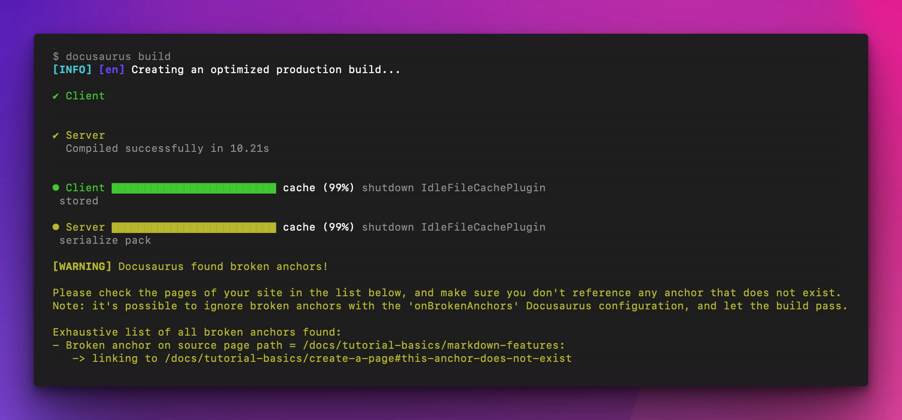

Nous sommes heureux d'annoncer **Docusaurus 3.1**.

La mise à jour devrait être facile : comme expliqué dans notre [documentation du processus de publication](/community/release-process), les versions mineures respectent [le versionnage sémantique](https://semver.org/).


<!--truncate-->

import BrowserWindow from '@site/src/components/BrowserWindow';
import IframeWindow from '@site/src/components/BrowserWindow/IframeWindow';
import ErrorBoundaryTestButton from '@site/src/components/ErrorBoundaryTestButton';

## Points importants

### Vérificateur d'ancrage défectueux

Dans le [#9528](https://github.com/facebook/docusaurus/pull/9528), nous avons amélioré le vérificateur intégré de liens défectueux pour qu'il détecte également les ancrages défectueux.



:::tip[Make ça échoue rapidement]

La nouvelle option [`onBrokenAnchors`](/docs/api/docusaurus-config#onBrokenAnchors) a la valeur par défaut `warn` pour des raisons de rétro-compatibilité.

Nous recommandons de le changer en `throw` et de faire échouer vos constructions CI au lieu de déployer des ancrages défectueux vers les productions.

:::

:::note

Pour les utilisateurs et les auteurs de plugins qui implémentent des composants `<Heading>` et `<Link>` personnalisés, nous fournissons une nouvelle API de hook React [`useBrokenLinks`](/docs/docusaurus-core#useBrokenLinks).

**La plupart des utilisateurs de Docusaurus n'ont pas besoin de s'en préoccuper**, les composants intégrés (`docusaurus/Link` et `@theme/Heading`) l'utilisent déjà en interne.

:::

### Hook `parseFrontMatter`

Dans le [#9624](https://github.com/facebook/docusaurus/pull/9624), nous avons ajouté une nouvelle [fonction hook `siteConfig.markdown.parseFrontMatter`](/docs/api/docusaurus-config#markdown).

Cela permet de mettre en œuvre des transformations pratiques du front matter, des raccourcis, ou de s'intégrer à des systèmes externes utilisant le front matter que les plugins de Docusaurus ne prennent pas en charge.

```js title="docusaurus.config.js"
export default {
  markdown: {
    // highlight-start
    parseFrontMatter: async (params) => {
      // Réutiliser l'analyseur par défaut
      const result = await params.defaultParseFrontMatter(params);

      // Traiter les placeholders de description de la page de garde
      result.frontMatter.description =
        result.frontMatter.description?.replaceAll('{{MY_VAR}}', 'MY_VALUE');

      // Créer votre propre raccourci pour les pages de garde
      if (result.frontMatter.i_do_not_want_docs_pagination) {
        result.frontMatter.pagination_prev = null;
        result.frontMatter.pagination_next = null;
      }

      // Renommer un front matter non supporté provenant d'un autre système
      if (result.frontMatter.cms_seo_summary) {
        result.frontMatter.description = result.frontMatter.cms_seo_summary;
        delete result.frontMatter.cms_seo_summary;
      }

      return result;
    },
    // highlight-end
  },
};
```

Lisez le [guide du front matter](/docs/markdown-features#front-matter) et la [référence de l'API `parseFrontMatter`](/docs/api/docusaurus-config#markdown) pour plus de détails.

## Autres modifications

Voici les autres changements notables :

- [#9674](https://github.com/facebook/docusaurus/pull/9674) : ajout de `siteConfig.markdown.remarkRehypeOptions` pour passer des options à `remark-rehype`, ce qui permet de personnaliser des choses comme le libellé de la note de bas de page MDX
- [#9671](https://github.com/facebook/docusaurus/pull/9671) : ajout d'un bloc de code MagicComments pour (Visual) Basic/Batch/Fortran/COBOL/ML
- [#9610](https://github.com/facebook/docusaurus/pull/9610) : active la configuration du port CLI via la variable d'environnement `PORT`
- [#9477](https://github.com/facebook/docusaurus/pull/9477) : traductions complètes en portugais brésilien (pt-BR)

Consultez **[l'entrée 3.1.0 du journal des modifications](/changelog/3.1.0)** pour une liste exhaustive des changements.
