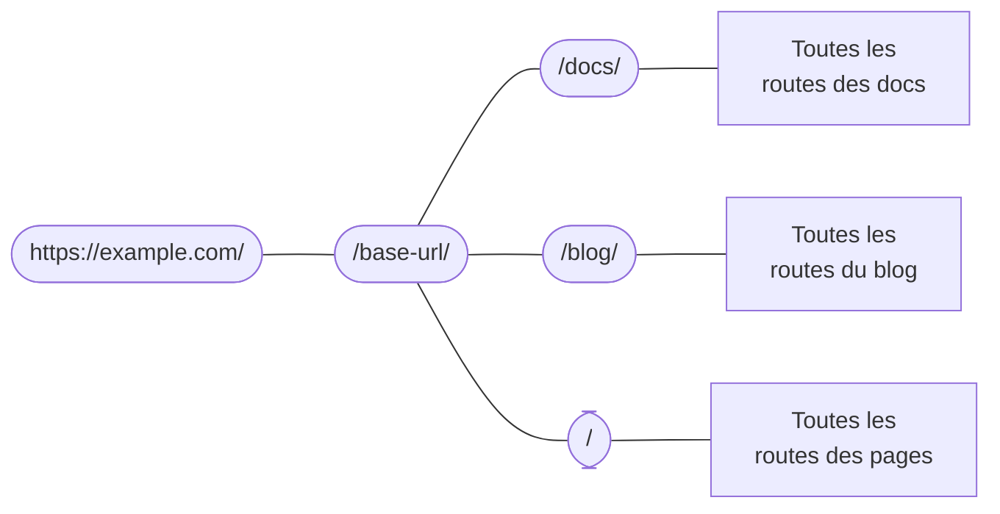

# Routage

```mdx-code-block
import Link from '@docusaurus/Link';
import {useLatestVersion, useActiveDocContext} from '@docusaurus/plugin-content-docs/client';
import {useLocation} from '@docusaurus/router';
import BrowserWindow from '@site/src/components/BrowserWindow';
```

Le système de routage de Docusaurus suit les conventions d'une application mono-page : une route, un composant. Dans cette section, nous commencerons par parler du routage dans les trois plugins de contenu (docs, blog et pages), puis nous irons plus loin pour parler du système de routage sous-jacent.

## Routage dans les plugins de contenu {#routing-in-content-plugins}

Chaque plugin de contenu fournit une option `routeBasePath`. Cela définit où les plugins ajoutent leurs routes. Par défaut, le plugin de docs met ses routes sous `/docs`; le plugin du blog, `/blog`; et le plugin de pages, `/`. Vous pouvez considérer la structure de la route comme suit :



Toute route sera comparée à cette configuration de route imbriquée jusqu'à ce qu'une bonne correspondance soit trouvée. Par exemple, lorsqu'on lui donne une route `/docs/configuration`, Docusaurus entre d'abord dans la branche `/docs`, puis cherche parmi les sous-routes créées par le plugin docs.

La modification du `routeBasePath` peut effectivement modifier la structure des routes de votre site. Par exemple, dans le [mode docs-uniquement](../guides/docs/docs-introduction.mdx#docs-only-mode), nous avons mentionné que la configuration `routeBasePath: '/'` pour docs, cela signifie que toutes les routes créées par le plugin docs ne seront pas préfixées par `/docs`, mais cela ne vous empêche pas d'avoir d'autres sous-routes comme `/blog` créées par d'autres plugins.

Voyons ensuite comment les trois plugins structurent leurs propres « boîtes de sous-routes ».

### Routage des pages {#pages-routing}

Le routage des pages est simple : les chemins de fichiers correspondent directement aux URL, sans autre possibilité de personnalisation. Consultez les [docs de pages](../guides/creating-pages.mdx#routing) pour plus d'informations.

Le composant utilisé pour les pages Markdown est `@theme/MDXPage`. Les pages React sont directement utilisées comme composant de la route.

### Routage du blog {#blog-routing}

Le blog crée les routes suivantes :

- **Pages de liste des articles** : `/`, `/page/2`, `/page/3`...
  - Le composant est `@theme/BlogListPage`.
- **Pages des articles** : `/2021/11/21/algolia-docsearch-migration`, `/2021/05/12/announcing-docusaurus-two-beta`...
  - Généré à partir de chaque article Markdown.
  - Les routes sont entièrement personnalisables à travers le `slug` du front matter.
  - Le composant est `@theme/BlogPostPage`.
- **Page de liste des tags** : `/tags`
  - La route est personnalisable via l'option `tagsBasePath`.
  - Le composant est `@theme/BlogTagsListPage`.
- **Pages de tag** : `/tags/adoption`, `/tags/beta`...
  - Généré à travers les tags définis dans chaque front matter des articles.
  - Les routes ont toujours la base définie dans `tagsBasePath`, mais les sous-routes sont personnalisables à travers le champ `permalink` du tag.
  - Le composant est `@theme/BlogTagsPostsPage`.
- **Page d'archive** : `/archive`
  - La route est personnalisable via l'option `archiveBasePath`.
  - Le composant est `@theme/BlogArchivePage`.

### Routage des docs {#docs-routing}

Docs est le seul plugin qui crée des **routes imbriquées**. En premier lieu, il enregistre des [**chemins de version**](../guides/docs/versioning.mdx) : `/`, `/next`, `/2.0.0-beta.13`... qui fournissent le contexte de la version, notamment la mise en page et la barre latérale. Ainsi, lorsque vous passez d'un document à l'autre, l'état de la barre latérale est préservé et vous pouvez passer d'une version à l'autre via la barre de navigation déroulante tout en restant sur le même document. Le composant utilisé est `@theme/DocPage`.

```mdx-code-block
export const URLPath = () => <code>{useLocation().pathname}</code>;

export const FilePath = () => {
  const currentVersion = useActiveDocContext('default').activeVersion.name;
  return <code>{currentVersion === 'current' ? './docs/' : `./versioned_docs/version-${currentVersion}/`}advanced/routing.md</code>;
}
```

Les documents individuels sont rendus dans l'espace restant après que la barre de navigation, le pied de page, la barre latérale, etc. aient tous été fournis par le composant `DocPage`. Par exemple, cette page, <URLPath />, est générée à partir du fichier <FilePath />. Le composant utilisé est `@theme/DocItem`.

Le slug du front matter du doc personnalise la dernière partie de la route, mais la route de base est toujours définie par `routeBasePath` du plugin et le `path` de la version.

### Chemins des fichiers et chemins des URL {#file-paths-and-url-paths}

Dans toute la documentation, nous essayons toujours d'être sans ambiguïté quant à savoir si nous parlons de chemins de fichiers ou de chemins d'URL. Les plugins de contenu mappent généralement les chemins de fichiers directement aux chemins d'URL, par exemple, `./docs/advanced/routing.md` deviendra `/docs/advanced/routing`. Cependant, avec `slug`, vous pouvez rendre les URL totalement désolidarisées de la structure du fichier.

Lorsque vous écrivez des liens en Markdown, il peut s'agir soit d'un _chemin d'accès à un fichier_, soit d'un _chemin d'accès à une URL_, que Docusaurus détermine à l'aide de plusieurs stratégies.

- Si le chemin a un préfixe `@site`, c'est _toujours_ un chemin de fichier de ressource.
- Si le chemin a un préfixe `http(s)://`, c'est _toujours_ un chemin d'URL.
- Si le chemin n'a pas d'extension, c'est un chemin d'URL. Par exemple, un lien `[page](../plugins)` sur une page avec l'URL `/docs/advanced/routing` sera lié à `/docs/plugins`. Docusaurus ne détectera les liens cassés que lors de la construction de votre site (lorsqu'il connaît la structure complète de la route), mais ne fera aucune supposition quant à l'existence d'un fichier. Cela revient exactement à écrire `<a href="../plugins">page</a>` dans un fichier JSX.
- Si le chemin comporte une extension `.md(x)`, Docusaurus essaiera de résoudre ce fichier Markdown en une URL et remplacera le chemin du fichier par un chemin d'URL.
- Si le chemin a une autre extension, Docusaurus le traiterait comme [une ressource](../guides/markdown-features/markdown-features-assets.mdx) et l'empaqueterait.

La structure de répertoire suivante peut vous aider à visualiser le mappage de ce fichier vers l'URL. En supposant qu'il n'y a pas de personnalisation de slug dans aucune page.

<details>

<summary>Un exemple de structure de site</summary>

```bash
.
├── blog                            # blog plugin has routeBasePath: '/blog'
│   ├── 2019-05-28-first-blog-post.md       # -> /blog/2019/05/28/first-blog-post
│   ├── 2019-05-29-long-blog-post.md        # -> /blog/2019/05/29/long-blog-post
│   ├── 2021-08-01-mdx-blog-post.mdx        # -> /blog/2021/08/01/mdx-blog-post
│   └── 2021-08-26-welcome
│       ├── docusaurus-plushie-banner.jpeg
│       └── index.md                        # -> /blog/2021/08/26/welcome
├── docs                            # docs plugin has routeBasePath: '/docs'; current version has base path '/'
│   ├── intro.md                            # -> /docs/intro
│   ├── tutorial-basics
│   │   ├── _category_.json
│   │   ├── congratulations.md              # -> /docs/tutorial-basics/congratulations
│   │   └── markdown-features.mdx           # -> /docs/tutorial-basics/markdown-features
│   └── tutorial-extras
│       ├── _category_.json
│       ├── manage-docs-versions.md         # -> /docs/tutorial-extras/manage-docs-versions
│       └── translate-your-site.md          # -> /docs/tutorial-extras/translate-your-site
├── src
│   └── pages                       # pages plugin has routeBasePath: '/'
│       ├── index.module.css
│       ├── index.tsx                       # -> /
│       └── markdown-page.md                # -> /markdown-page
└── versioned_docs
    └── version-1.0.0               # version has base path '/1.0.0'
        ├── intro.md                        # -> /docs/1.0.0/intro
        ├── tutorial-basics
        │   ├── _category_.json
        │   ├── congratulations.md          # -> /docs/1.0.0/tutorial-basics/congratulations
        │   └── markdown-features.mdx       # -> /docs/1.0.0/tutorial-basics/markdown-features
        └── tutorial-extras
            ├── _category_.json
            ├── manage-docs-versions.md     # -> /docs/1.0.0/tutorial-extras/manage-docs-versions
            └── translate-your-site.md      # -> /docs/1.0.0/tutorial-extras/translate-your-site
```

</details>

Voilà pour les plugins de contenu. Prenons un peu de recul et parlons de la façon dont le routage fonctionne dans une application Docusaurus en général.

## Les routes deviennent des fichiers HTML {#routes-become-html-files}

Comme Docusaurus est un framework de rendu côté serveur, toutes les routes générées seront affichées côté serveur en fichiers HTML statiques. Si vous êtes familier avec le comportement des serveurs HTTP comme [Apache2](https://httpd.apache.org/docs/trunk/getting-started.html), vous comprendrez comment cela se fait : quand le navigateur envoie une requête à la route `/docs/advanced/routing`, le serveur interprète cela comme une requête pour le fichier HTML `/docs/advanced/routing/index.html`, et retourne cela.

La route `/docs/advanced/routing` peut correspondre à `/docs/advanced/routing/index.html` ou `/docs/advanced/routing.html`. Certains hébergeurs font la différence entre eux en utilisant la présence d'un slash final et peuvent ou non tolérer l'autre. En savoir plus dans le [guide slash de fin](https://github.com/slorber/trailing-slash-guide).

Par exemple, le résultat de la construction du répertoire ci-dessus est (en ignorant les autres ressources et le bundle JS) :

<details>

<summary>Sortie de l'espace de travail ci-dessus</summary>

```bash
build
├── 404.html                      # /404/
├── blog
│   ├── archive
│   │   └── index.html            # /blog/archive/
│   ├── first-blog-post
│   │   └── index.html            # /blog/first-blog-post/
│   ├── index.html                # /blog/
│   ├── long-blog-post
│   │   └── index.html            # /blog/long-blog-post/
│   ├── mdx-blog-post
│   │   └── index.html            # /blog/mdx-blog-post/
│   ├── tags
│   │   ├── docusaurus
│   │   │   └── index.html        # /blog/tags/docusaurus/
│   │   ├── hola
│   │   │   └── index.html        # /blog/tags/hola/
│   │   └── index.html            # /blog/tags/
│   └── welcome
│       └── index.html            # /blog/welcome/
├── docs
│   ├── 1.0.0
│   │   ├── intro
│   │   │   └── index.html        # /docs/1.0.0/intro/
│   │   ├── tutorial-basics
│   │   │   ├── congratulations
│   │   │   │   └── index.html    # /docs/1.0.0/tutorial-basics/congratulations/
│   │   │   └── markdown-features
│   │   │       └── index.html    # /docs/1.0.0/tutorial-basics/markdown-features/
│   │   └── tutorial-extras
│   │       ├── manage-docs-versions
│   │       │   └── index.html    # /docs/1.0.0/tutorial-extras/manage-docs-versions/
│   │       └── translate-your-site
│   │           └── index.html    # /docs/1.0.0/tutorial-extras/translate-your-site/
│   ├── intro
│   │   └── index.html            # /docs/1.0.0/intro/
│   ├── tutorial-basics
│   │   ├── congratulations
│   │   │   └── index.html        # /docs/tutorial-basics/congratulations/
│   │   └── markdown-features
│   │       └── index.html        # /docs/tutorial-basics/markdown-features/
│   └── tutorial-extras
│       ├── manage-docs-versions
│       │   └── index.html        # /docs/tutorial-extras/manage-docs-versions/
│       └── translate-your-site
│           └── index.html        # /docs/tutorial-extras/translate-your-site/
├── index.html                    # /
└── markdown-page
    └── index.html                # /markdown-page/
```

</details>

Si `trailingSlash` est défini à `false`, la construction produira `intro.html` au lieu de `intro/index.html`.

Tous les fichiers HTML référenceront leurs ressources JS à l'aide d'URL absolues, donc pour que les ressources soient correctement localisées, vous devez configurer le champ `baseUrl`. Notez que `baseUrl` n'affecte pas la structure de fichiers du bundle émis : l'URL de base est un niveau au-dessus du système de routage de Docusaurus. Vous pouvez voir la combinaison de `url` et `baseUrl` comme l'emplacement réel de votre site Docusaurus.

Par exemple, le HTML émis contiendrait des liens tels que `<link rel="preload" href="/assets/js/runtime~main.7ed5108a.js" as="script">`. Comme les URL absolues sont résolues à partir de l'hôte, si le paquet est placé sous le chemin `https://example.com/base/`, le lien pointera vers `https://example.com/assets/js/runtime~main.7ed5108a.js`, qui n'existe pas. En spécifiant `/base/` comme URL de base, le lien pointera correctement vers `/base/assets/js/runtime~main.7ed5108a.js`.

Sur les sites localisés, la locale fait également partie de l'URL de base. Par exemple, `https://docusaurus.io/zh-CN/docs/advanced/routing/` a l'URL de base `/zh-CN/`.

## Générer et accéder aux routes {#generating-and-accessing-routes}

L'action `addRoute` du cycle de vie est utilisée pour générer des routes. Il enregistre un morceau de configuration de route dans l'arborescence des routes, en donnant une route, un composant et les props dont le composant a besoin. Les props et le composant sont tous deux fournis sous forme de chemins que le bundler doit `require`, car comme expliqué dans l'[aperçu de l'architecture](architecture.mdx), le serveur et le client ne communiquent que par le biais de fichiers temporaires.

Toutes les routes sont agrégées dans `.docusaurus/routes.js`, que vous pouvez visualiser avec le [panneau des routes](/__docusaurus/debug/routes) du plugin de débogage.

Du côté client, nous proposons `@docusaurus/router` pour accéder à la route de la page. `@docusaurus/router` est une ré-exportation du paquet [`react-router-dom`](https://www.npmjs.com/package/react-router-dom/v/5.3.0). Par exemple, vous pouvez utiliser `useLocation` pour obtenir [l'emplacement](https://developer.mozilla.org/fr/docs/Web/API/Location) de la page actuelle et `useHistory` pour accéder à l'[objet historique](https://developer.mozilla.org/fr/docs/Web/API/History). (Ils ne sont pas identiques à l'API du navigateur, bien que leur fonctionnalité soit similaire. Reportez-vous à la documentation de React Router pour les API spécifiques.)

Cette API est **sécurisée SSR**, par opposition à `window.location` qui est réservé aux navigateurs.

```jsx title="myComponent.js"
import React from 'react';
import {useLocation} from '@docusaurus/router';

export function PageRoute() {
  // Le routeur React fournit la route du composant courant, même en SSR
  const location = useLocation();
  return (
    <span>
      We are currently on <code>{location.pathname}</code>
    </span>
  );
}
```

```mdx-code-block
export function PageRoute() {
  const location = useLocation();
  return (
    <span>
      Nous sommes actuellement sur <code>{location.pathname}</code>
    </span>
  );
}

<BrowserWindow>

<PageRoute />

</BrowserWindow>
```

## Échapper aux redirections SPA {#escaping-from-spa-redirects}

Docusaurus construit une [application mono-page](https://developer.mozilla.org/en-US/docs/Glossary/SPA), où les transitions de route se font à travers la méthode `history.push()` du routeur React. Cette opération se fait du côté client. Cependant, la condition préalable pour qu'une transition de route se produise de cette manière est que l'URL cible soit connue de notre routeur. Sinon, le routeur intercepte ce chemin et affiche une page 404 à la place.

Si vous placez quelques pages HTML dans le dossier `static`, elles seront copiées dans la sortie de la construction et deviendront donc accessibles en tant que partie de votre site web, mais elles ne feront pas partie du système de route de Docusaurus. Nous fournissons un protocole `pathname://` qui vous permet une redirection vers une autre partie de votre domaine de manière non-SPA, comme si cette route était un lien externe.

```md
- [pathname:///pure-html](pathname:///pure-html)
```

<BrowserWindow>

- [`pathname:///pure-html`](pathname:///pure-html)

</BrowserWindow>

Le protocole `pathname://` est utile pour référencer n'importe quel contenu dans le dossier static. Par exemple, Docusaurus convertirait [toutes les ressources statiques Markdown en appels require()](../guides/markdown-features/markdown-features-assets.mdx#static-assets). Vous pouvez utiliser `pathname://` pour que ce soit un lien ordinaire au lieu d'être hashé par Webpack.

```md title="my-doc.md"


[Une ressource depuis static](pathname:///files/asset.pdf)
```

Docusaurus ne supprimera que le préfixe `pathname://` sans traiter le contenu.
