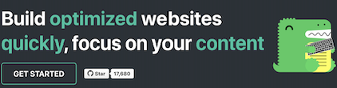

# Ressources

import BrowserWindow from '@site/src/components/BrowserWindow';
import Tabs from '@theme/Tabs';
import TabItem from '@theme/TabItem';

Parfois, vous souhaitez établir un lien vers des ressources (par exemple des fichiers docx, des images...) directement à partir de fichiers Markdown, et il est pratique de placer la ressource à côté du fichier Markdown qui l'utilise.

Imaginons la structure de fichier suivante :

```
# Votre doc
/website/docs/myFeature.mdx

# Quelques ressources que vous voulez utiliser
/website/docs/assets/docusaurus-asset-example-banner.png
/website/docs/assets/docusaurus-asset-example.docx
```

## Images {#images}

Vous pouvez afficher les images de trois manières différentes : la syntaxe Markdown, la syntaxe require de CJS ou la syntaxe ES imports.

```mdx-code-block
<Tabs>
<TabItem value="Syntaxe Markdown">
```

Affichez les images en utilisant la syntaxe simple de Markdown :

```md

```

```mdx-code-block
</TabItem>
<TabItem value="require CommonJS">
```

Affichez les images en utilisant en ligne le `require` de CommonJS dans la balise image de JSX :

```jsx

```

```mdx-code-block
</TabItem>
<TabItem value="Déclaration d'un import">
```

Affichez les images en utilisant la syntaxe `import` de ES et la balise image JSX :

```jsx
import myImageUrl from './assets/docusaurus-asset-example-banner.png';

;
```

```mdx-code-block
</TabItem>
</Tabs>
```

Toutes les méthodes ci-dessus permettent d'afficher l'image :

<BrowserWindow>



</BrowserWindow>

:::note

Si vous utilisez [@docusaurus/plugin-ideal-image](../../api/plugins/plugin-ideal-image.mdx), vous devez utiliser le composant d'image dédié, comme documenté.

:::

## Fichiers {#files}

De la même manière, vous pouvez créer des liens vers des ressources existantes en utilisant `require` et en utilisant l'URL renvoyée dans les liens `video`, `a`, etc.

```md
# Ma page Markdown

<a target="\_blank" href={require('./assets/docusaurus-asset-example.docx').default}> Télécharger ce docx </a>

ou

[Télécharger ce docx à l'aide de Markdown](./assets/docusaurus-asset-example.docx)
```

<BrowserWindow>

<a
  target="_blank"
  href={require('../../assets/docusaurus-asset-example.docx').default}>
  {'Télécharger ce docx'}
</a>

[Télécharger ce docx en utilisant Markdown](../../assets/docusaurus-asset-example.docx)

</BrowserWindow>

:::info Les liens Markdown sont toujours des chemins de fichiers

Si vous utilisez la syntaxe d'image ou de lien Markdown, tous les chemins de ressources seront résolus comme des chemins de fichiers par Docusaurus et automatiquement convertis en appels à `require()`. Vous n'avez pas besoin d'utiliser `require()` dans le Markdown à moins que vous n'utilisiez la syntaxe JSX, que vous devez gérer vous-même.

:::

## SVG en ligne {#inline-svgs}

Docusaurus prend en charge la mise en place de SVG.

```jsx
import DocusaurusSvg from './docusaurus.svg';

<DocusaurusSvg />;
```

<BrowserWindow>

import DocusaurusSvg from '@site/static/img/docusaurus.svg';

<DocusaurusSvg />

</BrowserWindow>

Cela peut être utile si vous voulez modifier la partie de l'image SVG via CSS. Par exemple, vous pouvez changer une des couleurs SVG en fonction du thème courant.

```jsx
import DocusaurusSvg from './docusaurus.svg';

<DocusaurusSvg className="themedDocusaurus" />;
```

```css
[data-theme='light'] .themedDocusaurus [fill='#FFFF50'] {
  fill: greenyellow;
}

[data-theme='dark'] .themedDocusaurus [fill='#FFFF50'] {
  fill: seagreen;
}
```

<BrowserWindow>
  <DocusaurusSvg className="themedDocusaurus" />
</BrowserWindow>

## Images thématiques {#themed-images}

Docusaurus prend en charge les images thématiques : le composant `ThemedImage` (inclus dans les thèmes) vous permet de basculer la source de l'image en fonction du thème actuel.

```jsx
import ThemedImage from '@theme/ThemedImage';

<ThemedImage
  alt="Docusaurus themed image"
  // highlight-start
  sources={{
    light: useBaseUrl('/img/docusaurus_light.svg'),
    dark: useBaseUrl('/img/docusaurus_dark.svg'),
  }}
  // highlight-end
/>;
```

```mdx-code-block
import useBaseUrl from '@docusaurus/useBaseUrl';
import ThemedImage from '@theme/ThemedImage';

<BrowserWindow>
<ThemedImage
  alt="Docusaurus themed image"
  sources={{
    light: useBaseUrl('/img/docusaurus_keytar.svg'),
    dark: useBaseUrl('/img/docusaurus_speed.svg'),
  }}
/>
</BrowserWindow>
```

### Images thématiques de style GitHub {#github-style-themed-images}

GitHub utilise sa propre[approche de thème d'images](https://github.blog/changelog/2021-11-24-specify-theme-context-for-images-in-markdown/) avec des fragments de chemins, que vous pouvez facilement implémenter vous-même.

Pour basculer la visibilité d'une image à l'aide du fragment de chemin (pour GitHub, il s'agit de `#gh-dark-mode-only` et `#gh-light-mode-only`), ajoutez ce qui suit à votre CSS personnalisé (vous pouvez également utiliser votre propre suffixe si vous ne souhaitez pas être relié à GitHub) :

```css title="src/css/custom.css"
[data-theme='light'] img[src$='#gh-dark-mode-only'],
[data-theme='dark'] img[src$='#gh-light-mode-only'] {
  display: none;
}
```

```md

```

<BrowserWindow>


</BrowserWindow>

## Ressources statiques {#static-assets}

Si un lien ou une image Markdown a un chemin absolu, le chemin sera considéré comme un chemin de fichier et sera déterminé à partir des répertoires statiques. Par exemple, si vous avez configuré les [répertoires statiques](../../static-assets.mdx) avec `['public', 'static']`, alors pour l'image suivante :

```md title="my-doc.md"

```

Docusaurus essayera de le rechercher dans `static/img/docusaurus.png` et `public/img/docusaurus.png`. Le lien sera ensuite converti en un appel `require()` au lieu de rester en tant qu'URL. C'est souhaitable à deux égards :

1. Vous n'avez pas à vous soucier de l'URL de base, dont Docusaurus se chargera au moment de diffuser la ressource;
2. L'image entre dans le pipeline de construction de Webpack et son nom sera complété par un hachage, ce qui permet aux navigateurs de mettre l'image en cache de manière agressive et améliore les performances de votre site.

Si vous avez l'intention d'écrire des URL, vous pouvez utiliser le protocole `pathname://` pour désactiver la liaison automatique des ressources.

```md

```

Ce lien sera généré en tant que ``, sans aucun traitement ou vérification de l'existence de fichiers.
