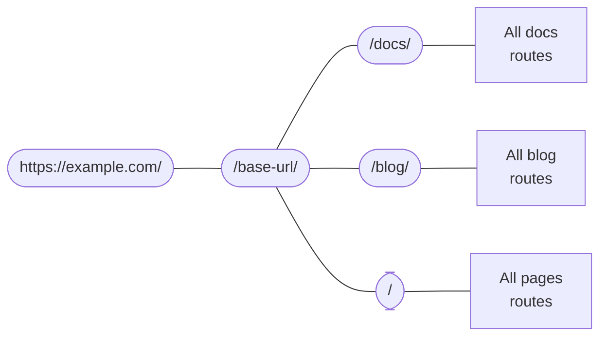

# ルーティング

```mdx-code-block
import Link from '@docusaurus/Link';
import {useLatestVersion, useActiveDocContext} from '@docusaurus/plugin-content-docs/client';
import {useLocation} from '@docusaurus/router';
import BrowserWindow from '@site/src/components/BrowserWindow';
```

Docusaurus のルーティングシステムは、1つのルートに1つのコンポーネントというシングルページアプリケーションの規約に従っています。 このセクションでは、ドキュメント、ブログ、ページといった3つのコンテンツプラグイン内のルーティングについて説明し、内部のルーティングシステムについて話を進めます。

## コンテンツプラグインのルーティング {#routing-in-content-plugins}

すべてのコンテンツプラグインは `routeBasePath` オプションを提供しています。 プラグインがどこのルートに追加されるかを定義するものです。 デフォルトでは、ドキュメントプラグインはルートを `/docs` に、ブログのプラグインは `/blog` に、ページプラグインは `/` になっています。 ルート構造は次のように考えることができます。



Any route will be matched against this nested route config until a good match is found. For example, when given a route `/docs/configuration`, Docusaurus first enters the `/docs` branch, and then searches among the subroutes created by the docs plugin.

Changing `routeBasePath` can effectively alter your site's route structure. For example, in [Docs-only mode](../guides/docs/docs-introduction.mdx#docs-only-mode), we mentioned that configuring `routeBasePath: '/'` for docs means that all routes that the docs plugin create would not have the `/docs` prefix, yet it doesn't prevent you from having more subroutes like `/blog` created by other plugins.

Next, let's look at how the three plugins structure their own "boxes of subroutes".

### ページのルーティング {#pages-routing}

Pages routing are straightforward: the file paths directly map to URLs, without any other way to customize. See the [pages docs](../guides/creating-pages.mdx#routing) for more information.

The component used for Markdown pages is `@theme/MDXPage`. React pages are directly used as the route's component.

### ブログのルーティング {#blog-routing}

The blog creates the following routes:

- **投稿一覧のページ**: `/`, `/page/2`, `/page/3`...
  - The route is customizable through the `pageBasePath` option.
  - コンポーネントは `@theme/BlogListPage` です。
- **投稿のページ**: `/2021/11/21/algolia-docsearch-migration`, `/2021/05/12/announcing-docusaurus-two-beta`...
  - Markdown で生成されます。
  - ルートは `slug` フロントマターで完全にカスタマイズできます。
  - コンポーネントは `@theme/BlogPostPage` です。
- **タグ一覧のページ**: `/tags`
  - ルートは `tagsBasePath` オプションでカスタマイズできます。
  - コンポーネントは `@theme/BlogTagsListPage` です。
- **タグのページ**: `/tags/adoption`, `/tags/beta`...
  - 各投稿のフロントマターで定義されたタグから生成されます。
  - ルートは常に `tagsBasePath`で定義されていますが、タグの `parmalink` フィールドでサブルートをカスタマイズできます。
  - コンポーネントは `@theme/BlogTagsPostsPage` です。
- **アーカイブページ**: `/archive`
  - ルートは `archiveBasePath` オプションでカスタマイズできます。
  - コンポーネントは `@theme/BlogArchivePage` です。

### ドキュメントのルーティング {#docs-routing}

The docs is the only plugin that creates **nested routes**. At the top, it registers [**version paths**](../guides/docs/versioning.mdx): `/`, `/next`, `/2.0.0-beta.13`... which provide the version context, including the layout and sidebar. This ensures that when switching between individual docs, the sidebar's state is preserved, and that you can switch between versions through the navbar dropdown while staying on the same doc. The component used is `@theme/DocPage`.

```mdx-code-block
export const URLPath = () => <code>{useLocation().pathname}</code>;

export const FilePath = () => {
  const currentVersion = useActiveDocContext('default').activeVersion.name;
  return <code>{currentVersion === 'current' ? './docs/' : `./versioned_docs/version-${currentVersion}/`}advanced/routing.md</code>;
}
```

The individual docs are rendered in the remaining space after the navbar, footer, sidebar, etc. have all been provided by the `DocPage` component. For example, this page, <URLPath />, is generated from the file at <FilePath />. The component used is `@theme/DocItem`.

The doc's `slug` front matter customizes the last part of the route, but the base route is always defined by the plugin's `routeBasePath` and the version's `path`.

### ファイルのパスと URL のパス {#file-paths-and-url-paths}

Throughout the documentation, we always try to be unambiguous about whether we are talking about file paths or URL paths. Content plugins usually map file paths directly to URL paths, for example, `./docs/advanced/routing.md` will become `/docs/advanced/routing`. However, with `slug`, you can make URLs totally decoupled from the file structure.

When writing links in Markdown, you could either mean a _file path_, or a _URL path_, which Docusaurus would use several heuristics to determine.

- パスに `@site` プレフィックスがある場合は_常に_アセットファイルパスになります。
- パスに `http(s)://` プレフィックスがある場合は_常に_ URL のパスになります。
- パスに拡張子がない場合は URL のパスになります。 例えば、URL が `/docs/advanced/routing` であるページ内での `[page](../plugins)` は `/docs/plugins` にリンクされます。 Docusaurus はサイトをビルドするときに (完全なルート構造を知っている場合) のみリンク切れを検出します。ファイルの存在は想定しません。 JSX ファイルで `<a href="../plugins">page</a>` を書くのと全く同じです。
- パスに `.md(x)` 拡張子がある場合、Docusaurus は Markdown ファイルのパスを URL に書き換えて解決しようとします。
- パスに他の拡張機能がある場合、Docusaurus はそれを[アセット](../guides/markdown-features/markdown-features-assets.mdx)として扱ってバンドルします。

The following directory structure may help you visualize this file → URL mapping. Assume that there's no slug customization in any page.

<details>

<summary>サンプルサイトの構造</summary>

```bash
.
├── blog                            # blog plugin has routeBasePath: '/blog'
│   ├── 2019-05-28-first-blog-post.md       # -> /blog/2019/05/28/first-blog-post
│   ├── 2019-05-29-long-blog-post.md        # -> /blog/2019/05/29/long-blog-post
│   ├── 2021-08-01-mdx-blog-post.mdx        # -> /blog/2021/08/01/mdx-blog-post
│   └── 2021-08-26-welcome
│       ├── docusaurus-plushie-banner.jpeg
│       └── index.md                        # -> /blog/2021/08/26/welcome
├── docs                            # docs plugin has routeBasePath: '/docs'; current version has base path '/'
│   ├── intro.md                            # -> /docs/intro
│   ├── tutorial-basics
│   │   ├── _category_.json
│   │   ├── congratulations.md              # -> /docs/tutorial-basics/congratulations
│   │   └── markdown-features.mdx           # -> /docs/tutorial-basics/markdown-features
│   └── tutorial-extras
│       ├── _category_.json
│       ├── manage-docs-versions.md         # -> /docs/tutorial-extras/manage-docs-versions
│       └── translate-your-site.md          # -> /docs/tutorial-extras/translate-your-site
├── src
│   └── pages                       # pages plugin has routeBasePath: '/'
│       ├── index.module.css
│       ├── index.tsx                       # -> /
│       └── markdown-page.md                # -> /markdown-page
└── versioned_docs
    └── version-1.0.0               # version has base path '/1.0.0'
        ├── intro.md                        # -> /docs/1.0.0/intro
        ├── tutorial-basics
        │   ├── _category_.json
        │   ├── congratulations.md          # -> /docs/1.0.0/tutorial-basics/congratulations
        │   └── markdown-features.mdx       # -> /docs/1.0.0/tutorial-basics/markdown-features
        └── tutorial-extras
            ├── _category_.json
            ├── manage-docs-versions.md     # -> /docs/1.0.0/tutorial-extras/manage-docs-versions
            └── translate-your-site.md      # -> /docs/1.0.0/tutorial-extras/translate-your-site
```

</details>

So much about content plugins. Let's take one step back and talk about how routing works in a Docusaurus app in general.

## ルートは HTML ファイルになります {#routes-become-html-files}

Because Docusaurus is a server-side rendering framework, all routes generated will be server-side rendered into static HTML files. If you are familiar with the behavior of HTTP servers like [Apache2](https://httpd.apache.org/docs/trunk/getting-started.html), you will understand how this is done: when the browser sends a request to the route `/docs/advanced/routing`, the server interprets that as request for the HTML file `/docs/advanced/routing/index.html`, and returns that.

The `/docs/advanced/routing` route can correspond to either `/docs/advanced/routing/index.html` or `/docs/advanced/routing.html`. Some hosting providers differentiate between them using the presence of a trailing slash, and may or may not tolerate the other. Read more in the [trailing slash guide](https://github.com/slorber/trailing-slash-guide).

For example, the build output of the directory above is (ignoring other assets and JS bundle):

<details>

<summary>前述のサンプルサイトの出力</summary>

```bash
build
├── 404.html                      # /404/
├── blog
│   ├── archive
│   │   └── index.html            # /blog/archive/
│   ├── first-blog-post
│   │   └── index.html            # /blog/first-blog-post/
│   ├── index.html                # /blog/
│   ├── long-blog-post
│   │   └── index.html            # /blog/long-blog-post/
│   ├── mdx-blog-post
│   │   └── index.html            # /blog/mdx-blog-post/
│   ├── tags
│   │   ├── docusaurus
│   │   │   └── index.html        # /blog/tags/docusaurus/
│   │   ├── hola
│   │   │   └── index.html        # /blog/tags/hola/
│   │   └── index.html            # /blog/tags/
│   └── welcome
│       └── index.html            # /blog/welcome/
├── docs
│   ├── 1.0.0
│   │   ├── intro
│   │   │   └── index.html        # /docs/1.0.0/intro/
│   │   ├── tutorial-basics
│   │   │   ├── congratulations
│   │   │   │   └── index.html    # /docs/1.0.0/tutorial-basics/congratulations/
│   │   │   └── markdown-features
│   │   │       └── index.html    # /docs/1.0.0/tutorial-basics/markdown-features/
│   │   └── tutorial-extras
│   │       ├── manage-docs-versions
│   │       │   └── index.html    # /docs/1.0.0/tutorial-extras/manage-docs-versions/
│   │       └── translate-your-site
│   │           └── index.html    # /docs/1.0.0/tutorial-extras/translate-your-site/
│   ├── intro
│   │   └── index.html            # /docs/1.0.0/intro/
│   ├── tutorial-basics
│   │   ├── congratulations
│   │   │   └── index.html        # /docs/tutorial-basics/congratulations/
│   │   └── markdown-features
│   │       └── index.html        # /docs/tutorial-basics/markdown-features/
│   └── tutorial-extras
│       ├── manage-docs-versions
│       │   └── index.html        # /docs/tutorial-extras/manage-docs-versions/
│       └── translate-your-site
│           └── index.html        # /docs/tutorial-extras/translate-your-site/
├── index.html                    # /
└── markdown-page
    └── index.html                # /markdown-page/
```

</details>

If `trailingSlash` is set to `false`, the build would emit `intro.html` instead of `intro/index.html`.

All HTML files will reference its JS assets using absolute URLs, so in order for the correct assets to be located, you have to configure the `baseUrl` field. Note that `baseUrl` doesn't affect the emitted bundle's file structure: the base URL is one level above the Docusaurus routing system. You can see the aggregate of `url` and `baseUrl` as the actual location of your Docusaurus site.

For example, the emitted HTML would contain links like `<link rel="preload" href="/assets/js/runtime~main.7ed5108a.js" as="script">`. Because absolute URLs are resolved from the host, if the bundle placed under the path `https://example.com/base/`, the link will point to `https://example.com/assets/js/runtime~main.7ed5108a.js`, which is, well, non-existent. By specifying `/base/` as base URL, the link will correctly point to `/base/assets/js/runtime~main.7ed5108a.js`.

Localized sites have the locale as part of the base URL as well. For example, `https://docusaurus.io/zh-CN/docs/advanced/routing/` has base URL `/zh-CN/`.

## ルートの生成とアクセス {#generating-and-accessing-routes}

The `addRoute` lifecycle action is used to generate routes. It registers a piece of route config to the route tree, giving a route, a component, and props that the component needs. The props and the component are both provided as paths for the bundler to `require`, because as explained in the [architecture overview](architecture.mdx), server and client only communicate through temp files.

All routes are aggregated in `.docusaurus/routes.js`, which you can view with the debug plugin's [routes panel](/__docusaurus/debug/routes).

On the client side, we offer `@docusaurus/router` to access the page's route. `@docusaurus/router` is a re-export of the [`react-router-dom`](https://www.npmjs.com/package/react-router-dom/v/5.3.0) package. For example, you can use `useLocation` to get the current page's [location](https://developer.mozilla.org/en-US/docs/Web/API/Location), and `useHistory` to access the [history object](https://developer.mozilla.org/en-US/docs/Web/API/History). (They are not the same as the browser API, although similar in functionality. Refer to the React Router documentation for specific APIs.)

This API is **SSR safe**, as opposed to the browser-only `window.location`.

```jsx title="myComponent.js"
import React from 'react';
import {useLocation} from '@docusaurus/router';

export function PageRoute() {
  // React router provides the current component's route, even in SSR
  const location = useLocation();
  return (
    <span>
      We are currently on <code>{location.pathname}</code>
    </span>
  );
}
```

```mdx-code-block
export function PageRoute() {
  const location = useLocation();
  return (
    <span>
      We are currently on <code>{location.pathname}</code>
    </span>
  );
}

<BrowserWindow>

<PageRoute />

</BrowserWindow>
```

## SPA のリダイレクトを回避する {#escaping-from-spa-redirects}

Docusaurus builds a [single-page application](https://developer.mozilla.org/en-US/docs/Glossary/SPA), where route transitions are done through the `history.push()` method of React router. This operation is done on the client side. However, the prerequisite for a route transition to happen this way is that the target URL is known to our router. Otherwise, the router catches this path and displays a 404 page instead.

If you put some HTML pages under the `static` folder, they will be copied to the build output and therefore become accessible as part of your website, yet it's not part of the Docusaurus route system. We provide a `pathname://` protocol that allows you to redirect to another part of your domain in a non-SPA fashion, as if this route is an external link.

```md
- [pathname:///pure-html](pathname:///pure-html)
```

<BrowserWindow>

- [`pathname:///pure-html`](pathname:///pure-html)

</BrowserWindow>

The `pathname://` protocol is useful for referencing any content in the static folder. For example, Docusaurus would convert [all Markdown static assets to require() calls](../guides/markdown-features/markdown-features-assets.mdx#static-assets). You can use `pathname://` to keep it a regular link instead of being hashed by Webpack.

```md title="my-doc.md"


[An asset from the static](pathname:///files/asset.pdf)
```

Docusaurus will only strip the `pathname://` prefix without processing the content.
