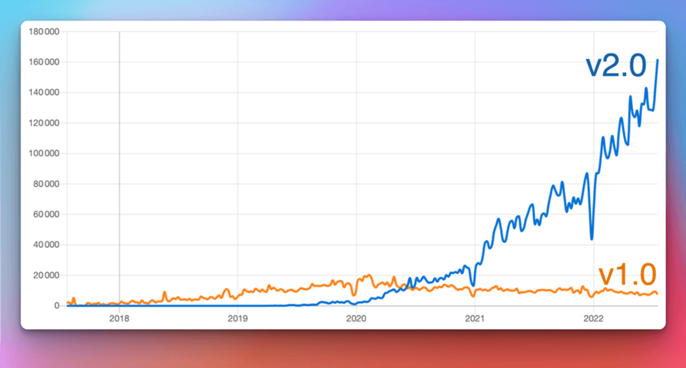
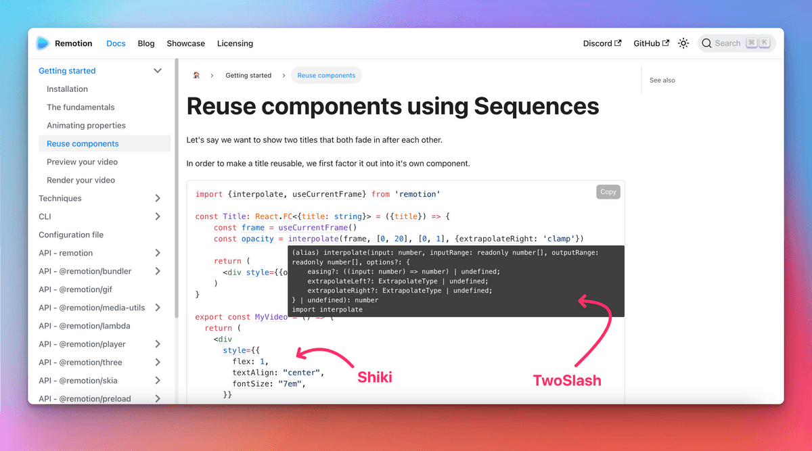

```mdx-code-block
import LiteYouTubeEmbed from 'react-lite-youtube-embed';
import 'react-lite-youtube-embed/dist/LiteYouTubeEmbed.css';
import BrowserWindow from '@site/src/components/BrowserWindow';
import ProductHuntCard from '@site/src/components/ProductHuntCard';
import HackerNewsIcon from '@site/src/components/HackerNewsIcon';
import ColorModeToggle from '@theme/Navbar/ColorModeToggle';
import useBaseUrl from '@docusaurus/useBaseUrl';
import ThemedImage from '@theme/ThemedImage';
import {ShowcaseCarouselV1, ShowcaseCarouselV2, ShowcaseCarouselV2Theming} from './ShowcaseCarousel';
```

Today we are extremely happy to finally **announce Docusaurus 2.0**! 🥳️

At [**Meta Open Source**](https://opensource.fb.com/), we believe Docusaurus will help you build the **best documentation websites** with **minimal effort**, letting you **focus on what really matters**: writing the content.

After **4 years of work, [75 alphas](https://github.com/facebook/docusaurus/releases/tag/v2.0.0-alpha.75) and [22 betas](https://github.com/facebook/docusaurus/releases/tag/v2.0.0-beta.22)**, the next generation of Docusaurus is **ready for prime time**. From now on, we now plan to **respect [Semantic Versioning](https://semver.org/)** and will release **major versions more frequently**.


{/_ truncate _/}

:::info We are on [ProductHunt](https://www.producthunt.com/posts/docusaurus-2-0) and [Hacker News](https://news.ycombinator.com/item?id=32303052)!

**Now** is the best time to show your love for Docusaurus!

<div style={{display: 'flex'}}>
  <ProductHuntCard />
  <HackerNewsIcon />
</div>

:::

:::tip

빨리 만나보고 싶나요? Check [what's new in Docusaurus 2.0](#whats-new-in-20)!

:::

## 도큐사우루스는 정확하게 뭔가요?

Docusaurus is a **static site generator** that helps you ship **beautiful documentation websites** in **no time**.

Focus on your content: just write **Markdown files**. Docusaurus will generate an optimized **website** for you that's easy to **host anywhere**.

Docusaurus is **full-featured** and very **flexible**: we ship with well-designed docs and blog layout, as well as out-of-the-box versioning, search, and internationalization functionalities, with a call to accessibility and search engine optimizations. Its flexible theming system permits to **adapt the UI to match your branding** so that it integrates nicely with your main website or documentation portal. Its usage of **React** enables a **modern client-side navigation**, and the ability to build an **interactive documentation**.


The Docusaurus philosophy is akin to the **Pareto principle**: you can get **80% of the results** for **20% of the effort**. This enables you to compete with top-notch documentation sites with **minimal effort**.

<TweetQuote
  url="https://x.com/rachelnabors/status/1452697991039660038"
  handle="rachelnabors"
  name="Rachel Nabors"
  job="Former ReactJS & React-Native docs manager">
  Unless you're spinning up a documentation team with engineering resources, you
  probably want Docusaurus!
</TweetQuote>

Docusaurus aims to be the **best documentation tool**, but you can use it for **other use-cases** as well: a blog, a knowledge base, a developer portfolio, a second brain, or even to scaffold landing pages!

<TweetQuote
  url="https://x.com/johnny_reilly/status/1551861926334025728"
  handle="johnny_reilly"
  name="Johnny Reilly"
  job="Group Principal Engineer at Investec">
  Using Docusaurus for my tech blog has been a fantastic choice. It looks
  tremendous out-of-the-box and the awesome DX means I write way more
</TweetQuote>

:::tip

Try Docusaurus now with our [online playgrounds](/docs/playground) and [5 minutes tutorial](https://tutorial.docusaurus.io/) ⏱️

:::

## 도큐사우루스 비하인드 스토리

Docusaurus was created at **Facebook Open Source** in **2017** (now [Meta Open Source](https://opensource.fb.com/)). 우리는 문서화가 필요한 수많은 내부, 오픈 소스 프로젝트를 가지고 있었습니다. It's **complicated enough to write good documentation**, let alone to create the HTML, CSS, and JavaScript for a good-looking website. We wanted project leaders to be able to **focus on the content**, and **Markdown** is great for that.

At that time, our solution was to **copy/paste a Jekyll template** over and over again. This naturally became **hard to maintain**, so we created a tool to **solve our own pain** once for all.

**[Docusaurus v1 was born](/blog/2017/12-14-introducing-docusaurus.mdx)!**


It quickly built momentum at Facebook and in the frontend ecosystem, adopted by many popular projects such as [Prettier](https://prettier.io/), [Babel](https://babeljs.io/), [React-Native](https://archive.reactnative.dev/), [KaTeX](https://katex.org/docs/), and of course [Docusaurus v1](http://v1.docusaurus.io/) itself.

<ShowcaseCarouselV1 />

<br />

:::note

위의 샘플 사이트는 다른 색상을 사용하긴 하지만 서로 비슷하게 보이는 것을 주의 깊게 살펴봐주세요.

:::

## 도큐사우루스 2.0를 향해

[**Docusaurus v1**](http://v1.docusaurus.io/) has been very successful, but we started to **question some architectural choices**:

- React was only used as a **server-side templating language**, and not used on the client
- **Theming system was pretty limited**, and apart from changing a few colors with CSS, it was difficult to do more advanced customizations
- The **docs versioning system was confusing**, since it was based on a diff algorithm
- The codebase was **monolithic**, neither well-tested nor easy to extend

[**Docusaurus v2**](https://docusaurus.io/) was **rebuilt** from the ground up with a new **modular architecture**:

- React is now also used on the client, enabling a **modern Single Page Application navigation**
- **Plugins** empower the community to contribute useful features as third-party packages
- **Theming** is more **flexible** than ever
- 문서 버전 관리는 스냅샷 사본을 기반으로 동작하며 훨씬 더 이해하기 쉬워졌습니다.
- We kept **everything good from v1**: docs, blog, pages, versioning, i18n...
- We implemented **several new features**

More details in the [Docusaurus 2 project announcement](/blog/2018/09-11-Towards-Docusaurus-2.mdx) and [v1 to v2 migration guide](https://docusaurus.io/docs/migration)

## 누가 도큐사우루스 2.0을 사용하고 있나요?

Despite being in pre-release, it didn't take long for **Docusaurus v2 to outgrow Docusaurus v1** in terms of NPM downloads:

[](https://npmtrends.com/docusaurus-vs-@docusaurus/core)

비슷한 주요 프레임워크와 비교해서 깃허브 스타 트렌드도 매우 긍정적입니다.

[](https://star-history.com/#facebook/docusaurus&vercel/next.js&gatsbyjs/gatsby&hexojs/hexo&nuxt/nuxt.js&vuejs/vuepress&11ty/eleventy&gohugoio/hugo&remix-run/remix&mkdocs/mkdocs&Timeline)

도큐사우루스 v2는 출시 전부터 이미 큰 성공을 거두고 있습니다.

- We received so many [lovely testimonials](https://x.com/sebastienlorber/timelines/1392048416872706049)
- Companies like [1Password](https://blog.1password.com/docusaurus-documentation-framework/) and [Courier](https://www.courier.com/blog/how-we-built-our-documentation/) are writing down their positive experience
- Our [site showcase](/showcase) references hundreds of sites, and this is only the tip of the iceberg.

<ShowcaseCarouselV2 />

<br />

:::tip

Please add your site to our [site showcase](/showcase)! It only takes a few seconds: just [post a comment here](https://github.com/facebook/docusaurus/discussions/7826).

:::

<TweetQuote
  url="https://x.com/maxlynch/status/1549415692704825346"
  handle="maxlynch"
  name="Max Lynch"
  job="Ionic co-founder and CEO">
  We use Docusaurus everywhere now and love it
</TweetQuote>

<TweetQuote
  url="https://x.com/supabase/status/1328960757149671425"
  handle="supabase"
  name="Supabase"
  job="Open Source Firebase alternative">
  We've been using V2 since January and it has been great
</TweetQuote>

<TweetQuote
  url="https://x.com/gabrielcsapo/status/1415061312917233665"
  handle="gabrielcsapo"
  name="Gabriel Csapo"
  job="Staff Software Engineer at LinkedIn">
  Docusaurus is next level easy for literally everything you would need for
  documentation in your project.
</TweetQuote>

<TweetQuote
  url="https://x.com/ItWasMattGregg/status/1526682295075102721"
  handle="ItWasMattGregg"
  name="Matt Gregg"
  job="Senior Front End Developer at Shopify">
  Docusaurus is awesome. We use it
</TweetQuote>

## 2.0의 새로운 기능은 무엇인가요?

도큐사우루스 v2에서 제공하는 모든 새로운 기능을 다 설명하는 것은 무리입니다. Let's focus on the features we believe are the **most impactful**.

### MDX

[MDX](https://github.com/mdx-js/mdx) allows you to **interleave React components** in Markdown. This enables you to build top-notch **interactive documentation experiences** very easily.

데모로 먼저 확인해보시죠.

```md title="docs/my-document.mdx"
### Give it a try: press that button!

import ColorModeToggle from '@theme/ColorModeToggle';

<ColorModeToggle/>
```

```mdx-code-block
<BrowserWindow>

<h3>Give it a try: press that button!</h3>

<ColorModeToggle/>

</BrowserWindow>
```

:::info

MDX has its own [plugin system](https://mdxjs.com/docs/extending-mdx/). 원하는 대로 마크다운 작성 경험을 사용자 지정하고 여러분만의 마크다운 구문을 만들 수도 있습니다.

:::

<TweetQuote
  url="https://x.com/HamelHusain/status/1551962275250053123"
  handle="HamelHusain"
  name="Hamel Husain"
  job="Head Of Data Science at Outerbounds">
  Docusaurus + MDX is great: we were able to implement a beautiful two-pane
  layout and give the author fine-grained control on the placement of code and
  corresponding prose.
</TweetQuote>

### 파일 시스템 규칙

Our goal is to make Docusaurus very **intuitive** to use. 이를 파일 시스템 규칙에 반영해 마크다운 파일 하나를 만드는 것만큼 간단하게 문서 페이지를 추가할 수 있습니다.

<LiteYouTubeEmbed
  id="T3S8GyFIXjo"
  params="autoplay=1&autohide=1&showinfo=0&rel=0"
  title="Explain Like I'm 5: Docusaurus"
  poster="maxresdefault"
  webp
/>

<br />

<TweetQuote
  url="https://x.com/paularmstrong/status/1552005085168865281"
  handle="paularmstrong"
  name="Paul Armstrong"
  job="Principal Engineer at Microsoft">
  Using the auto-generated sidebars makes it so simple to just create a page and
  not worry about any other configuration.
</TweetQuote>

### 플러그인

Docusaurus now has a **modular architecture** with a plugin system — our **core features** like docs, blog, pages, and search are all powered by individual plugins.

More importantly, it enables our community to **enhance Docusaurus** with additional features.

몇 가지 사례를 살펴보죠.

- [redocusaurus](https://github.com/rohit-gohri/redocusaurus): seamless integration with [OpenAPI](https://www.openapis.org/) and [Redoc](https://github.com/Redocly/redoc)


- [docusaurus-preset-shiki-twoslash](https://www.npmjs.com/package/docusaurus-preset-shiki-twoslash): use [Shiki](https://github.com/shikijs/shiki) code block syntax highlighting with [TwoSlash](https://shikijs.github.io/twoslash/) TypeScript compiler hints



<TweetQuote
  url="https://x.com/orta"
  handle="orta"
  name="Orta Therox"
  job="Former TypeScript core team at Microsoft">
  The plugin API was a breeze to use, and powerful enough that I could port the
  code sample renderer from the TypeScript website site in a couple of hours.
</TweetQuote>

- [docusaurus-search-local](https://github.com/easyops-cn/docusaurus-search-local): one of the various local search alternatives to the built-in Algolia plugin


:::tip

We have a curated list of outstanding plugins in our [community resources](/community/resources) page.

:::

<TweetQuote
  url="https://x.com/jodyheavener/status/1551974535452311552"
  handle="jodyheavener"
  name="Jody Heavener"
  job="Senior Developer at 1Password">
  The plugin system in Docusaurus v2 has made expanding 1Password's developer
  portal so easy and fun. 저희가 준비한 새로운 기능을 선보이게 되어 무척 기쁩니다.
</TweetQuote>

### 테마

Theming is one of the most important features of Docusaurus: we believe a professional documentation site should **respect your company's branding** and create a consistent experience.

Docusaurus theming gives a lot of **flexibility** on multiple levels:

- 색상, 글꼴 등을 조정하기 위한 사용자 지정 CSS 변수
- 나만의 CSS 스타일시트 제공
- 바닥부터 나만의 테마 구현
- **Override any React component** provided by our default theme: we call this [swizzling](https://docusaurus.io/docs/swizzling)

<TweetQuote
  url="https://x.com/hung_dev/status/1546918275065741312"
  handle="hung_dev"
  name="
Hung Viet Nguyen"
  job="Creator of JestPreview">
  I love Docusaurus Swizzling feature. 고집이 세 보이지만 동시에 유연합니다. 프레임워크는 일반적으로 무언가를 희생해야 하기 때문에 이것은 매우 멋진 기능입니다.
</TweetQuote>

This enables users willing to invest a bit more time on **customizations** to build sites that **look different** from others.

<ShowcaseCarouselV2Theming />

<TweetQuote
  url="https://x.com/dabit3/status/1382855449813389315"
  handle="dabit3"
  name="Nader Dabit"
  job="Web3 developer, Developer DAO founder">
  So far it’s working out really nicely. 우리가 원하는 스타일로 구현하는 것은 정말 간단합니다. 어떤 장벽도 없습니다.
</TweetQuote>

### 기타 기능

도큐사우루스 2에는 다음과 같이 다양하고 유용한 기능이 포함되어 있습니다.

- Theme: dark mode, better UI and UX, flexible `themeConfig` options...
- 문서 버전 관리: 워크플로우에 맞게 조정할 수 있는 유연한 플러그인 옵션
- 문서 사이드바: 접을 수 있는 카테고리, 카테고리 인덱스 페이지...
- 블로그: 여러 명의 저자 표시, 저자 맵, 아카이브 페이지...
- 마크다운: 탭, 수식, 라이브 코드 블록, 링크, 유연한 프런트매터...
- 검색: 새로운 알골리아 DocSearch 3 적용
- 애셋: 이미지나 기타 파일을 쉽게 통합할 수 있습니다.
- 국제화: 구성 옵션, 기본 테마 번역...
- 접근성: aria 라벨, 색상 대비, 콘텐츠로 건너뛰기, 키보드로 탐색하기, 점진적 향상...
- SEO: 유용한 기본 설정, 쉬운 사용자 지정, 캐노니컬 url, 소셜 카드, 검색색인차단, 사이트맵, 마이크로데이터, hreflang...
- PWA: 오프라인에서 사이트를 설치해 사용할 수 있습니다.
- 빠른 실패: 엄격한 설정 유효성 체크, 끊어진 링크 탐지 등을 통해 잘못된 제품이 배포되는 것을 방지합니다.
- 구성 파일, 플로그인, 사용자 지정 페이지, 테마 작성자를 위한 타입스크립트 지원
- Playgrounds: assess Docusaurus easily from your browser with [docusaurus.new](https://docusaurus.new)
- 카나리(Canary) 릴리스: @canary npm 태그를 사용하면 좀 더 일찍 새로운 릴리스를 사용할 수 있습니다.
- 테스트: 도큐사우루스는 적절하게 테스트되고 있으며 우리 사이트에 적용해 문제가 없는지 지속적으로 확인합니다.

<TweetQuote
  url="https://x.com/alexbdebrie/status/1540010328335032320"
  handle="alexbdebrie"
  name="Alex DeBrie"
  job="AWS Data Hero, author of The DynamoDB Book">
  Recently, I was shocked at how good Docusaurus is out of the box. 매우 견고하면서도 유연한 구성을 통해 저보다 좀 더 과감하게 다가선다면 원하는 스타일로 사용자 지정하는 능력도 가지고 있습니다.
</TweetQuote>

## 왜 2.0이 이제야 나왔나요?

Many enthusiastic followers of ours have been curious **why it took us 4 years to release Docusaurus 2.0**, considering the beta is already successful and **widely used in production**.

The reason is that we aim to **respect [Semantic Versioning](https://semver.org/)**, which means we will be incrementing the major version number whenever we release a **breaking change**.

이것은 여러 이유로 중요합니다.

- It **guarantees simple minor version upgrades**, as long as you only use the [public API](/community/release-process#public-api-surface)
- 프론트엔드 생태계 규칙을 따릅니다.
- 새로운 메이저 버전은 주요 변경 사항을 완벽하게 문서화할 수 있는 기회입니다.
- 새로운 메이저/마이너 버전은 블로그 게시물을 통해 새로운 기능을 전달할 수 있는 기회입니다.

The problem is that our flexible theming system inherently creates a very **implicit API surface** on which it is **hard to know what is a breaking change** in the first place. 고도로 사용자 정의된 도큐사우루스 사이트는 내부 API를 사용해 사용자 정의를 구현하기 때문에 때로는 도큐사우루스를 업그레이드하는데 어려움을 겪을 수 있습니다. We dedicated time to extensive theme refactors and clearly defining our [public API](/community/release-process#public-api-surface), so that future code changes can be made more safely. 일반적인 사이트 사용자 정의 시에는 내부 API를 사용하지 않을 수 있게 공개된 테마 API를 계속 확장할 겁니다.

:::info

From now on, Docusaurus will **release new major versions more frequently**. In practice, you can expect a **new major version every 2 to 4 months**.

[Major version numbers are not sacred](https://tom.preston-werner.com/2022/05/23/major-version-numbers-are-not-sacred.html), but we still group breaking changes together and avoid releasing major versions too often.

Check our [release process](/community/release-process) documentation for details.

:::

## 다음 단계는 뭔가요?


도큐사우루스 3.0에 대한 작업이 시작됐으며 다음 버전은 몇 개월 안에 릴리스 될 예정입니다. We will **backport retro-compatible changes in Docusaurus 2.x** minor versions to make them available as soon as possible to the community on a stable channel.

도큐사우루스의 향후 메이저 버전 로드맵에 포함된 기능은 아래와 같습니다.

- [Upgrade to MDX 2.0](https://github.com/facebook/docusaurus/issues/4029)
- [Improve Markdown infrastructure](https://github.com/facebook/docusaurus/issues/4625)
- [Improve theming and swizzle](https://github.com/facebook/docusaurus/issues/6114)
- [TailwindCSS theme](https://github.com/facebook/docusaurus/issues/2961)
- [Theme; support custom item types for navbar, doc sidebar, blog sidebar, footer](https://github.com/facebook/docusaurus/issues/7227)
- [Dynamic navbar: navbar item activation strategies](https://github.com/facebook/docusaurus/issues/4389)
- [Custom Social Cards](https://github.com/facebook/docusaurus/issues/2968)
- [CSS-in-JS support](https://github.com/facebook/docusaurus/issues/3236)
- [Use Node.js ES Modules](https://github.com/facebook/docusaurus/issues/6520)
- [Improve build time performance](https://github.com/facebook/docusaurus/issues/4765)
- [Extend Docusaurus plugins, CMS integration](https://github.com/facebook/docusaurus/issues/4138)

## 감사합니다

We'd like to express our gratitude to [all our contributors](https://github.com/facebook/docusaurus/graphs/contributors), including:

- The Docusaurus core team: [Alexey Pyltsyn](https://github.com/lex111), [Joshua Chen](https://github.com/Josh-Cena), [Sébastien Lorber](https://github.com/slorber), [Yangshun Tay](https://github.com/yangshun) and all our [former team members](https://docusaurus.io/community/team)
- [Joel Marcey](https://github.com/JoelMarcey) for creating Docusaurus 1.0 and supporting the Docusaurus 2.0 project at Meta Open Source
- [Paul O’Shannessy](https://github.com/zpao) for supporting the development of all the next versions of Docusaurus at Meta Open Source
- [Eric Nakagawa](https://github.com/ericnakagawa) for creating our cutest mascot Slash
- [Endilie Yacop Sucipto](https://github.com/endiliey) for his significant [initial work on Docusaurus v2](/blog/2020/01-07-tribute-to-endi.mdx)
- [Clément Vannicatte](https://github.com/shortcuts), [Kevin Granger](https://github.com/Shipow) and the whole Algolia team for their support
- All the community members for making valuable code contributions, improving our documentation, and answering questions on [Discord](https://discordapp.com/invite/docusaurus)

We'd like to thank in particular all our **Docusaurus 2.0 early adopters** for assessing its alpha, beta and canary releases, providing a ton of **invaluable feedback**. 좋은 경험이 되셨기를 진심으로 바라며 곧 공개될 도큐사우루스 3.0 시험판에 대한 피드백도 계속 제공해주시기 바랍니다.

At [Meta Open Source](https://opensource.fb.com/), Docusaurus is one of our **most successful projects**. 여러분이 만들 모든 뛰어난 문서 웹 사이트를 만나보고 싶습니다! Don't forget to **submit them to our [site showcase](/showcase)**!

**Now, let your imagination run wild 🤪!**

— 슬래시

:::info We are on [ProductHunt](https://www.producthunt.com/posts/docusaurus-2-0) and [Hacker News](https://news.ycombinator.com/item?id=32303052)!

🙏 여러분의 커뮤니티에서 도큐사우루스의 사용 경험을 공유해주세요!

<div style={{display: 'flex'}}>
  <ProductHuntCard />
  <HackerNewsIcon />
</div>

:::


