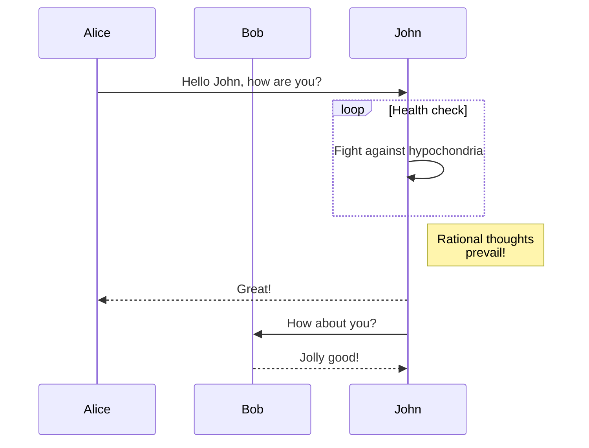

**도큐사우루스 2.2**를 소개하게 되어 무척 기쁩니다.

업그레이드 과정은 간단합니다. 도큐사우루스는 [릴리스 프로세스 문서](/community/release-process)에 설명된 대로 [시맨틱 버전](https://semver.org/) 체계를 준수해 마이너 버전은 하위 호환성을 유지합니다.


{/* truncate */}

## 새로 추가된 기능

### 머메이드 다이어그램

[#7490](https://github.com/facebook/docusaurus/pull/7490)에서 우리는 머메이드 다이어그램 지원을 추가했습니다. GitHub Flavored Markdown에서 [최근 추가한 기능](https://github.blog/2022-02-14-include-diagrams-markdown-files-mermaid/)과의 차이를 보완하는 작업입니다. 이제 여러분은 마크다운 코드 블록을 사용해 머메이드 다이어그램을 작성할 수 있습니다.

````md

````

````mdx-code-block
import BrowserWindow from '@site/src/components/BrowserWindow';

<BrowserWindow>


</BrowserWindow>

````
좀 더 자세한 내용은 [관련 문서](/docs/markdown-features/diagrams)와 [예시](/tests/pages/diagrams)를 참고하세요.
### Config `headTags`
[#8151](https://github.com/facebook/docusaurus/pull/8151)에서 여러분의 사이트의 모든 페이지에 임의의 HTML `<head>` 태그를 적용하는 기능을 추가했습니다.

```js title="docusaurus.config.js"
module.exports = {
  headTags: [
    {
      tagName: 'link',
      attributes: {
        rel: 'icon',
        href: '/img/docusaurus.png',
      },
    },
  ],
};
```

### 접근성

접근성 관련 몇 가지 기능을 개선했습니다.

- [#8207](https://github.com/facebook/docusaurus/pull/8207): 모바일 햄버거 메뉴 버튼에 대한 키보드 탐색 개선
- [#8161](https://github.com/facebook/docusaurus/pull/8161): 탭에 대한 키보드 탐색 개선
- [#8204](https://github.com/facebook/docusaurus/pull/8204): 콘텐츠로 건너뛰기 버튼에서 단계적 기능 향상을 지원
- [#8174](https://github.com/facebook/docusaurus/pull/8174): 밝은/어두운 모드 전환 시 스크린 리더 알림 개선

### 개발자 경험

유효성 검사를 더 엄격하게 만들고 오류 메시지를 개선했습니다.

- [#8234](https://github.com/facebook/docusaurus/pull/8234): 문서 처리 실패 시 오류 메시지에 문제가 되는 마크다운 파일 경로를 출력합니다.
- [#8192](https://github.com/facebook/docusaurus/pull/8192), [#8159](https://github.com/facebook/docusaurus/pull/8159): `siteConfig.url`의 유효성을 더 엄격하게 검사하고 더 나은 오류 메시지를 표시합니다.
- [#8066](https://github.com/facebook/docusaurus/pull/8066): `url`, `baseUrl` 설정이 안전하게 동작하도록 만들고 선행 또는 후행 슬래시 여부에 덜 민감하게 처리합니다.

### 번역

여러 언어에 대한 기본 테마 번역을 완료했습니다.

- 🇹🇷 [#8105](https://github.com/facebook/docusaurus/pull/8105): 터키어 번역 완료
- 🇷🇺 [#8253](https://github.com/facebook/docusaurus/pull/8253): 러시아어 번역 완료
- 🇫🇷 [#8243](https://github.com/facebook/docusaurus/pull/8243): 프랑스어 번역 완료
- 🇯🇵 [#8075](https://github.com/facebook/docusaurus/pull/8075): 일본어 번역 완료

:::tip

테마 번역의 완료는 [계속 관심이 필요한 요소](https://github.com/facebook/docusaurus/issues/3526)이며 도큐사우루스에 기여할 수 있는 쉬운 방법입니다. 우리는 [새로운 번역이 필요한](https://github.com/facebook/docusaurus/issues/3526) 새로운 테마 기능을 정기적으로 추가하고 있습니다.

:::

## 기타 변경

기타 주목할만한 변경 사항은 다음과 같습니다.

- [#8210](https://github.com/facebook/docusaurus/pull/8210): `docusaurus swizzle` CLI에 새로운 `--config` 옵션 추가
- [#8109](https://github.com/facebook/docusaurus/pull/8109): 리소스 프리페치를 통한 모바일 탐색 성능 최적화
- [#8059](https://github.com/facebook/docusaurus/pull/8059): 탐색바에서 버전이나 언어 변경 시 hash와 querystring을 유지
- [#8227](https://github.com/facebook/docusaurus/pull/8227): 클라이언트 리디렉션 플러그인에서 리디렉션 시 hash와 querystring을 유지

전체 변경 목록은 **[2.2.0 changelog entry](/changelog/2.2.0)**를 확인하세요.
