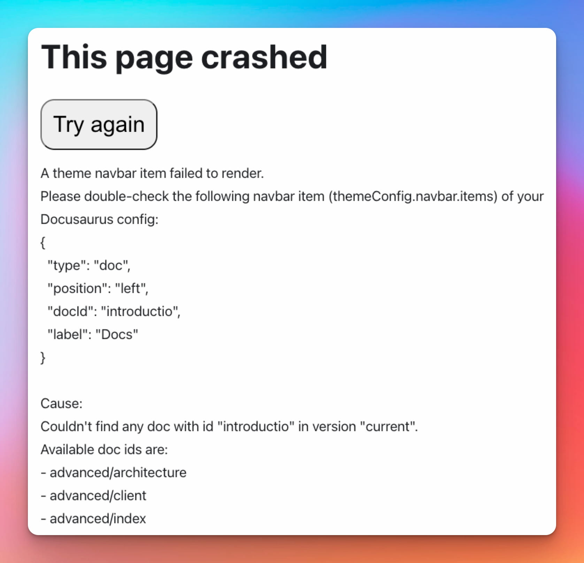

**도큐사우루스 2.4**를 소개하게 되어 무척 기쁩니다.

업그레이드 과정은 간단합니다. 도큐사우루스는 [릴리스 프로세스 문서](/community/release-process)에 설명된 대로 [시맨틱 버전 체계](https://semver.org/)를 준수해 마이너 버전은 하위 호환성을 유지합니다.


<!--truncate-->

import BrowserWindow from '@site/src/components/BrowserWindow';
import IframeWindow from '@site/src/components/BrowserWindow/IframeWindow';
import ErrorBoundaryTestButton from '@site/src/components/ErrorBoundaryTestButton';

## 새로 추가된 기능

### 사이드바 아이템 설명

[#8236](https://github.com/facebook/docusaurus/pull/8236) 요구사항을 처리하면서 `link`와 `category` 타입의 문서 사이드바 아이템에 `description` 속성을 추가했습니다.

```tsx title="sidebars.js"
[
  {
    type: 'link',
    label: 'Link with description',
    href: 'https://docusaurus.io',
    // highlight-next-line
    description: 'Some link description',
  },
  {
    type: 'category',
    label: 'Category with description',
    // highlight-next-line
    description: 'Some category description',
    items: [],
  },
];
```

description 속성으로 추가한 문구는 카테고리에서 생성하는 인덱스 페이지에 표시됩니다.


### 테마 쿼리 문자열

[#8708](https://github.com/facebook/docusaurus/pull/8708) 요구사항을 처리하면서 `docusaurus-theme` 쿼리 문자열을 추가하고 도큐사우루스가 `light` 또는 `dark` 모드를 지정해서 시작할 수 있도록 기능을 개선했습니다.

작성된 도큐사우루스 페이지를 iframe이나 WebView에 임베드할 때 일관된 테마를 유지하는 데 유용합니다.

<IframeWindow url="/docs/?docusaurus-theme=light" />
<IframeWindow url="/docs/?docusaurus-theme=dark" />

### Remark 플러그인 npm2yarn 업그레이드

[#8690](https://github.com/facebook/docusaurus/pull/8690) 요구사항을 처리하면서 Remark 플러그인 [@docusaurus/remark-plugin-npm2yarn](https://github.com/facebook/docusaurus/tree/main/packages/docusaurus-remark-plugin-npm2yarn)이 가지고 있던 여러 변환 처리 관련 버그를 수정하고 pnpm에 대한 지원을 강화했으며 새 탭을 만드는 사용자 지정 컨버터를 등록할 수 있도록 기능을 개선했습니다.

````markdown
Run these commands!

```bash npm2yarn
npm install
npm run build
npm run myCustomScript -- --some-arg
```
````

<BrowserWindow>

```bash npm2yarn
npm install
npm run build
npm run myCustomScript -- --some-arg
```

</BrowserWindow>

### gtag에서 여러 개의 트래킹 ID 사용 지원

[#8620](https://github.com/facebook/docusaurus/pull/8620) 요구사항을 처리하면서 여러 개의 트래킹 ID를 선언할 수 있도록 [@docusaurus/plugin-google-gtag](/docs/api/plugins/@docusaurus/plugin-google-gtag) 플러그인 기능을 개선했습니다.

```js title="docusaurus.config.js"
module.exports = {
  presets: [
    [
      '@docusaurus/preset-classic',
      {
        gtag: {
          trackingID: [
            // highlight-next-line
            'G-<YOUR-NEW-GA4-ID>',
            // highlight-next-line
            'UA-<YOUR-OLD-UA-ID>',
          ],
        },
      },
    ],
  ],
};
```

:::warning 구글은 유니버설 애널리틱스 기능 지원을 종료합니다.

**[구글은 유니버설 애널리틱스 기능을 2023년 7월 1일 종료할 예정입니다](https://blog.google/products/marketingplatform/analytics/prepare-for-future-with-google-analytics-4/)**.

도큐사우루스 사용자는 구글 애널리틱스 4로 마이그레이션해야 합니다. 구글은 새로운 구글 애널리틱스 4 자산으로 **여러분의 기존 유니버설 애널리틱스 데이터를 마이그레이션하는 것을 허용하지 않습니다**.

기존 통계 분석 작업이 중단되지 않도록 일시적으로 이전 추적 ID(`UA-*`)와 새로운 추적 ID(`G-*`) 두 개를 모두 처리하도록 설정하는 것을 권장합니다. 자세한 내용은 **[관련 이슈](https://github.com/facebook/docusaurus/issues/7221)** 정보를 참고하세요.

:::

### 개발자 경험

[#8736](https://github.com/facebook/docusaurus/pull/8736) 요구사항을 처리하면서 오류 메시지를 렌더링하는 방식을 개선하고 오류의 전체 원인 체인에서 초기값을 처리할 수 있도록 기능을 추가했습니다([ES2022 Error Cause](https://h3manth.com/ES2022/#error-cause) 문서를 참고하세요).

:::tip

실제 동작을 확인하려면 옆에 있는 버튼을 클릭하세요. <ErrorBoundaryTestButton cause="Probably undefined is not a function 😄"/>

:::

[#8735](https://github.com/facebook/docusaurus/pull/8735) 요구사항을 처리하면서 사용자가 무엇을 잘못했는지 이해할 수 있게 탐색창 관련 오류 메시지를 좀 더 명확하게 만들었습니다.



### 번역

몇 가지 새로운 요소를 번역할 수 있게 기능을 개선했습니다.

- [#8677](https://github.com/facebook/docusaurus/pull/8677) 사이트 제목, 태그 라인, 공지 표시줄, baseUrl 등 config 파일을 지역화할 수 있게 새로운 `process.env.DOCUSAURUS_CURRENT_LOCALE` (아직 실험적인 기능입니다)을 추가했습니다.
- [#8616](https://github.com/facebook/docusaurus/pull/8616) 메뉴바와 바닥글 로고의 대체 텍스트를 번역할 수 있습니다.

여러 언어에 대한 기본 테마 번역을 추가했습니다.

- 🇭🇺 [#8668](https://github.com/facebook/docusaurus/pull/8668): 헝가리어
- 🇳🇴 [#8631](https://github.com/facebook/docusaurus/pull/8631): 노르웨이어(보크몰)

:::tip

테마 번역의 완료는 [계속 관심이 필요한 요소](https://github.com/facebook/docusaurus/issues/3526)이며 도큐사우루스에 기여할 수 있는 쉬운 방법입니다. 새로운 테마 기능을 계속 추가하고 있으며 이에 따라 [새로운 번역이 필요한 경우가 많습니다](https://github.com/facebook/docusaurus/issues/3526).

:::

## 기타 변경

기타 주목할만한 변경 사항은 다음과 같습니다.

- [#8674](https://github.com/facebook/docusaurus/pull/8674) `prefers-reduced-motion: reduce` 미디어 쿼리 준수
- [#8712](https://github.com/facebook/docusaurus/pull/8712) 템플릿에서 `docSidebar` 유형의 메뉴바 아이템 사용
- [#8801](https://github.com/facebook/docusaurus/pull/8801): 조건에 따라 탭 자식 항목을 허용
- [#8757](https://github.com/facebook/docusaurus/pull/8757) 검색 페이지가 외부 쿼리 문자열 변경 시 대응
- [#8803](https://github.com/facebook/docusaurus/pull/8803) RTL에서 코드 블록 버튼 위치 수정
- [#8615](https://github.com/facebook/docusaurus/pull/8615) 어두운 메뉴바 사용 시 색상 모드 토글 수정
- [#8699](https://github.com/facebook/docusaurus/pull/8699) 메뉴바 드롭 다운 탭에 포커스 이동 시 버그 수정

전체 변경 목록은 **[2.4.0 changelog entry](/changelog/2.4.0)** 를 확인하세요.
