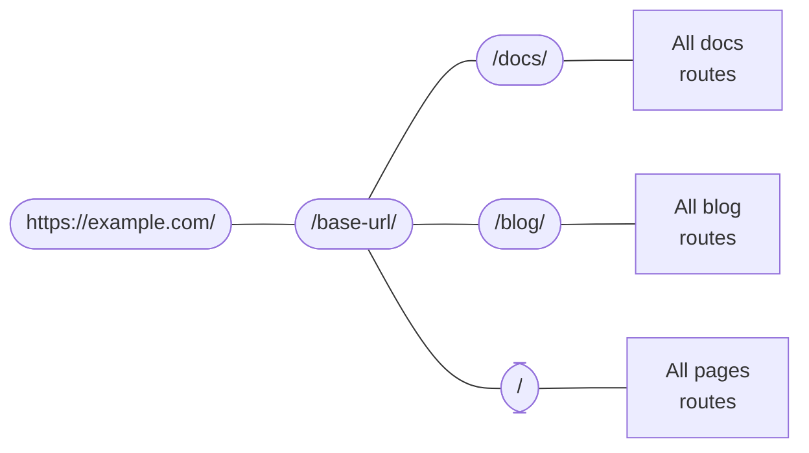

# 라우팅

```mdx-code-block
import Link from '@docusaurus/Link';
import {useLatestVersion, useActiveDocContext} from '@docusaurus/plugin-content-docs/client';
import {useLocation} from '@docusaurus/router';
import BrowserWindow from '@site/src/components/BrowserWindow';
```

도큐사우루스의 라우팅 시스템은 단일 페이지 애플리케이션 규칙을 따릅니다. 하나의 경로, 하나의 컴포넌트. 세 가지 콘텐츠 플러그인(문서, 블로그, 페이지) 내에서 라우팅에 대해 설명한 다음 기본 라우팅 시스템에 대해 설명합니다.

## 콘텐츠 플러그인 라우팅 {#routing-in-content-plugins}

모든 콘텐츠 플러그인은 `routeBasePath` 옵션을 제공합니다. 해당 옵션에서는 플러그인이 경로를 추가하는 위치를 정의합니다. 기본적으로 문서 플러그인은 `/docs`, 블로그 플러그인은 `/blog`, 페이지 플러그인은 `/` 경로 아래에 넣습니다. 다음과 같이 경로 구조에 대해 생각할 수 있습니다.



모든 경로는 일치하는 항목이 발견될 때까지 중첩된 경로 설정을 탐색합니다. 예를 들어 `/docs/configuration`와 같은 경로가 주어지면 도큐사우루스는 먼저 `/docs` 브랜치로 들어가서 문서 플러그인에 의해 생성된 하위 경로를 검색합니다.

`routeBasePath`를 변경하면 사이트의 경로 구조를 효과적으로 변경할 수 있습니다. 예를 들어 [문서 전용 모드](../guides/docs/docs-introduction.mdx#docs-only-mode)에서 문서에 대해 `routeBasePath: '/'`를 설정하면 문서 플러그인에서 만든 모든 경로 앞에 `/docs`을 가지는 것은 아니지만 다른 플러그인에서 만든 `/blog` 같은 하위 경로를 가지는 것을 막지는 않습니다.

다음은 세 가지 플러그인이 자체 "서브라우트 박스"를 구성하는 방법을 살펴보겠습니다.

### 페이지 라우팅 {#pages-routing}

페이지 라우팅은 간단합니다. 별도의 사용자 정의 없이 파일 경로가 URL에 직접 연결됩니다. 자세한 내용은 [페이지 문서](../guides/creating-pages.mdx#routing) 항목을 참고하세요.

마크다운 페이지에서 사용하는 컴포넌트는 `@theme/MDXPage`입니다. 리액트 페이지는 라우트 컴포넌트처럼 직접 사용됩니다.

### 블로그 라우팅 {#blog-routing}

블로그는 다음과 같은 경로를 만듭니다.

- **게시물 목록 페이지**: `/`, `/page/2`, `/page/3`...
  - The route is customizable through the `pageBasePath` option.
  - 사용한 컴포넌트는 `@theme/BlogListPage`입니다.
- **게시물 페이지**: `/2021/11/21/algolia-docsearch-migration`, `/2021/05/12/announcing-docusaurus-two-beta`...
  - 각 마크다운 게시물에서 만듭니다.
  - 경로는 `slug` 프런트매터를 통해 사용자가 원하는 형태로 설정할 수 있습니다.
  - 사용한 컴포넌트는 `@theme/BlogPostPage`입니다.
- **태그 목록 페이지**: `/tags`
  - 경로는 `tagsBasePath` 옵션을 통해 사용자가 원하는 형태로 설정할 수 있습니다.
  - 사용한 컴포넌트는 `@theme/BlogTagsListPage`입니다.
- **태그 페이지**: `/tags/adoption`, `/tags/beta`...
  - 각 게시물 프런트매터에 정의된 태그를 통해 만듭니다.
  - 경로는 항상 `tagsBasePath` 안에 정의되지만 하위 경로는 태그의 `permalink` 필드를 통해 사용자 지정할 수 있습니다.
  - 사용한 컴포넌트는 `@theme/BlogTagsPostsPage`입니다.
- **아카이브 페이지**: `/archive`
  - 경로는 `archiveBasePath` 옵션을 통해 사용자가 원하는 형태로 설정할 수 있습니다.
  - 사용한 컴포넌트는 `@theme/BlogArchivePage`입니다.

### 문서 라우팅 {#docs-routing}

문서는 **중첩 경로**를 만드는 유일한 플러그인입니다. 상단에 [**version paths**](../guides/docs/versioning.mdx): `/`, `/next`, `/2.0.0-beta.13`를 등록해 버전에 맞는 컨텍스트를 레이아웃, 사이드바를 포함해 제공합니다. 이렇게 하면 개별 문서 간 전환 시 사이드바 상태가 유지되고 같은 문서에 머무르면서 메뉴바에서 버전 드롭다운 목록을 선택해 다른 버전으로 전환할 수 있습니다. 사용한 컴포넌트는 `@theme/DocPage`입니다.

```mdx-code-block
export const URLPath = () => <code>{useLocation().pathname}</code>;

export const FilePath = () => {
  const currentVersion = useActiveDocContext('default').activeVersion.name;
  return <code>{currentVersion === 'current' ? './docs/' : `./versioned_docs/version-${currentVersion}/`}advanced/routing.md</code>;
}
```

개별 문서는 `DocPage` 컴포넌트에서 메뉴바, 푸터, 사이드바 등을 모두 제공한 후 나머지 공간에 표시됩니다. 예를 들어 이 페이지, <URLPath />, 는 <FilePath />에 있는 파일에서 만들어졌습니다. 사용한 컴포넌트는 `@theme/DocItem`입니다.

문서의 `slug` 프런트매터에서 경로의 마지막 부분을 사용자 지정하지만 기본 경로는 항상 플러그인의 `routeBasePath`와 버전의 `path`에 의해 설정됩니다.

### 파일 경로와 URL 경로 {#file-paths-and-url-paths}

문서 전체에서 우리는 항상 파일 경로 또는 URL 경로에 대해 모호하지 않게 표현하려고 노력하고 있습니다. 콘텐츠 플러그인은 일반적으로 파일 경로를 URL 경로에 직접 매핑합니다. 예를 들어 `./docs/advanced/routing.md`는 `/docs/advanced/routing`이 됩니다. 하지만 `slug`를 사용하면 파일 구조에서 URL을 완전히 분리할 수 있습니다.

마크다운에서 링크를 작성할 때 여러분이 _파일 경로_ 또는 _URL 경로_ 중 어떤 의도로 사용하고 있는지 도큐사우루스는 몇 가지 휴리스틱을 사용해 판단합니다.

- 경로에 `@site` 접두사가 있다면 _항상_ 애셋 파일 경로입니다.
- 경로에 `http(s)://` 접두사가 있다면 _항상_ URL 경로입니다.
- 경로에 확장자가 없다면 URL 경로입니다. 예를 들어 URL이 `/docs/advanced/routing`인 페이지에서 `[page](../plugins)` 링크는 `/docs/plugins` 형태가 됩니다. 도큐사우루스는 사이트 구축 시(전체 경로 구조를 알고 있을 때) 끊어진 링크만 감지하고 파일의 존재 여부에 대해서는 가정하지 않습니다. 이것은 JSX 파일에 `<a href="../plugins">page</a>`를 작성하는 것과 정확히 같습니다.
- 경로에 `.md(x)` 확장자가 있으면 도큐사우루스는 해당 마크다운 파일을 URL로 해석하고 파일 경로를 URL 경로로 바꾸려고 시도합니다.
- 경로에 다른 확장자가 있는 경우 도큐사우루스는 이를 [애셋](../guides/markdown-features/markdown-features-assets.mdx)으로 취급하고 번들링합니다.

다음 디렉터리 구조는 파일 → URL mapping 을 시각화하는데 도움을 줍니다. 어떤 페이지도 사용자 정의 슬러그가 없다고 가정합니다.

<details>

<summary>예시 사이트 구조</summary>

```bash
.
├── blog                            # blog plugin has routeBasePath: '/blog'
│   ├── 2019-05-28-first-blog-post.md       # -> /blog/2019/05/28/first-blog-post
│   ├── 2019-05-29-long-blog-post.md        # -> /blog/2019/05/29/long-blog-post
│   ├── 2021-08-01-mdx-blog-post.mdx        # -> /blog/2021/08/01/mdx-blog-post
│   └── 2021-08-26-welcome
│       ├── docusaurus-plushie-banner.jpeg
│       └── index.md                        # -> /blog/2021/08/26/welcome
├── docs                            # docs plugin has routeBasePath: '/docs'; current version has base path '/'
│   ├── intro.md                            # -> /docs/intro
│   ├── tutorial-basics
│   │   ├── _category_.json
│   │   ├── congratulations.md              # -> /docs/tutorial-basics/congratulations
│   │   └── markdown-features.mdx           # -> /docs/tutorial-basics/markdown-features
│   └── tutorial-extras
│       ├── _category_.json
│       ├── manage-docs-versions.md         # -> /docs/tutorial-extras/manage-docs-versions
│       └── translate-your-site.md          # -> /docs/tutorial-extras/translate-your-site
├── src
│   └── pages                       # pages plugin has routeBasePath: '/'
│       ├── index.module.css
│       ├── index.tsx                       # -> /
│       └── markdown-page.md                # -> /markdown-page
└── versioned_docs
    └── version-1.0.0               # version has base path '/1.0.0'
        ├── intro.md                        # -> /docs/1.0.0/intro
        ├── tutorial-basics
        │   ├── _category_.json
        │   ├── congratulations.md          # -> /docs/1.0.0/tutorial-basics/congratulations
        │   └── markdown-features.mdx       # -> /docs/1.0.0/tutorial-basics/markdown-features
        └── tutorial-extras
            ├── _category_.json
            ├── manage-docs-versions.md     # -> /docs/1.0.0/tutorial-extras/manage-docs-versions
            └── translate-your-site.md      # -> /docs/1.0.0/tutorial-extras/translate-your-site
```

</details>

콘텐츠 플러그인에 대한 많은 정보. 한 발 떨어져서 도큐사우루스 앱에서 일반적으로 라우팅이 동작하는 방식에 대해 이야기해보겠습니다.

## 경로와 대응하는 HTML 파일 {#routes-become-html-files}

도큐사우루스는 서버측 측 렌더링 프레임워크이기 때문에 생성된 모든 경로는 서버 측에서 정적 HTML 파일로 렌더링됩니다. [Apache2](https://httpd.apache.org/docs/trunk/getting-started.html)와 같은 HTTP 서버 동작 방식에 익숙하다면 어떤 식으로 동작한다는 건지 이해할 수 잇을 겁니다. 브라우저에서 `/docs/advanced/routing` 경로로 요청을 보내면 서버에서는 이를 `/docs/advanced/routing/index.html`이라는 HTML 파일에 대한 요청으로 해석하고 이를 반환합니다.

`/docs/advanced/routing` 경로는 `/docs/advanced/routing/index.html` 또는 `/docs/advanced/routing.html`에 대응합니다. 일부 호스팅 제공업체에서는 트레일링 슬래시를 사용해 이를 구분하고 다른 업체에서는 이런 기능을 허용하거나 그렇지 않을 수 있습니다. 좀 더 자세한 내용은 [트레일링 슬래시 가이드](https://github.com/slorber/trailing-slash-guide)를 참고하세요.

예를 들어 위의 디렉토리에서 빌드 출력은 다음과 같습니다(다른 애셋과 JS 번들은 제외).

<details>

<summary>위의 워크스페이스 출력 예시</summary>

```bash
build
├── 404.html                      # /404/
├── blog
│   ├── archive
│   │   └── index.html            # /blog/archive/
│   ├── first-blog-post
│   │   └── index.html            # /blog/first-blog-post/
│   ├── index.html                # /blog/
│   ├── long-blog-post
│   │   └── index.html            # /blog/long-blog-post/
│   ├── mdx-blog-post
│   │   └── index.html            # /blog/mdx-blog-post/
│   ├── tags
│   │   ├── docusaurus
│   │   │   └── index.html        # /blog/tags/docusaurus/
│   │   ├── hola
│   │   │   └── index.html        # /blog/tags/hola/
│   │   └── index.html            # /blog/tags/
│   └── welcome
│       └── index.html            # /blog/welcome/
├── docs
│   ├── 1.0.0
│   │   ├── intro
│   │   │   └── index.html        # /docs/1.0.0/intro/
│   │   ├── tutorial-basics
│   │   │   ├── congratulations
│   │   │   │   └── index.html    # /docs/1.0.0/tutorial-basics/congratulations/
│   │   │   └── markdown-features
│   │   │       └── index.html    # /docs/1.0.0/tutorial-basics/markdown-features/
│   │   └── tutorial-extras
│   │       ├── manage-docs-versions
│   │       │   └── index.html    # /docs/1.0.0/tutorial-extras/manage-docs-versions/
│   │       └── translate-your-site
│   │           └── index.html    # /docs/1.0.0/tutorial-extras/translate-your-site/
│   ├── intro
│   │   └── index.html            # /docs/1.0.0/intro/
│   ├── tutorial-basics
│   │   ├── congratulations
│   │   │   └── index.html        # /docs/tutorial-basics/congratulations/
│   │   └── markdown-features
│   │       └── index.html        # /docs/tutorial-basics/markdown-features/
│   └── tutorial-extras
│       ├── manage-docs-versions
│       │   └── index.html        # /docs/tutorial-extras/manage-docs-versions/
│       └── translate-your-site
│           └── index.html        # /docs/tutorial-extras/translate-your-site/
├── index.html                    # /
└── markdown-page
    └── index.html                # /markdown-page/
```

</details>

`trailingSlash` 설정값이 `false`인 경우 빌드 시 `intro.html` 파일이 `intro/index.html` 파일 대신 생성됩니다.

모든 HTML 파일은 절대 URL을 사용해 JS 애셋을 참조하고 있어 올바른 애셋을 연결하려면 `baseUrl` 필드를 설정해야 합니다. `baseUrl`은 내보낸 번들 파일 구조에 영향을 주지 않습니다. base URL은 도큐사우루스 라우팅 시스템보다 한 수준 위입니다. `url`과 `baseUrl`이 합쳐진 형태는 여러분의 도큐사우루스 사이트 실제 위치에서 확인할 수 있습니다.

예를 들어 생성된 HTML에는 `<link rel="preload" href="/assets/js/runtime~main.7ed5108a.js" as="script">`와 같은 링크가 포함됩니다. 절대 URL은 호스트에서 처리하기 때문에 번들이 `https://example.com/base/` 경로 아래에 있는 경우 링크는 실제로는 존재하지 않는 `https://example.com/assets/js/runtime~main.7ed5108a.js`를 가리킵니다. `/base/`를 base URL로 설정하면 적절한 링크인 `/base/assets/js/runtime~main.7ed5108a.js`를 가리킵니다.

현지화를 적용한 사이트는 base URL의 일부로 로케일 표시가 포함될 수 있습니다. 예를 들어 `https://docusaurus.io/zh-CN/docs/advanced/routing/`의 base URL은 `/zh-CN/`이 됩니다.

## 경로 생성 및 접근 {#generating-and-accessing-routes}

경로 생성 시 `addRoute` lifecycle action이 사용됩니다. 경로 트리에 경로 설정을 등록하고 컴포넌트에서 필요한 경로, 컴포넌트, 속성을 제공합니다. 속성과 컴포넌트는 번들러가 `require`하기 위한 경로로 제공됩니다. [아키텍처 개요](architecture.mdx)에서 설명한 것처럼 서버와 클라이언트는 임시 파일을 통해서만 통신합니다.

모든 경로는 `.docusaurus/routes.js` 형태로 처리되며 디버그 플러그인의 [routes panel](/__docusaurus/debug/routes)에서 볼 수 있습니다.

클라이언트 측에서는 페이지 경로에 접근하기 위해 `@docusaurus/router`를 제공합니다. `@docusaurus/router`는 [`react-router-dom`](https://www.npmjs.com/package/react-router-dom/v/5.3.0) 패키지의 re-export입니다. 예를 들어 `useLocation`을 사용해 현재 페이지의 [location](https://developer.mozilla.org/en-US/docs/Web/API/Location)을 가져올 수 있고 `useHistory`을 사용해 [history object](https://developer.mozilla.org/en-US/docs/Web/API/History)에 접근할 수 있습니다. (기능은 비슷하지만 브라우저 API와 같지는 않습니다. 특정 API에 대해서는 리액트 라우터 문서를 참고하세요).

이 API는 브라우저 전용 `window.location`과 다르게 **SSR safe**입니다.

```jsx title="myComponent.js"
import React from 'react';
import {useLocation} from '@docusaurus/router';

export function PageRoute() {
  // 리액트 라우터는 SSR에서도 현재 컴포넌트의 경로를 제공합니다.
  const location = useLocation();
  return (
    <span>
      We are currently on <code>{location.pathname}</code>
    </span>
  );
}
```

```mdx-code-block
export function PageRoute() {
  const location = useLocation();
  return (
    <span>
      We are currently on <code>{location.pathname}</code>
    </span>
  );
}

<BrowserWindow>

<PageRoute />

</BrowserWindow>
```

## SPA 리다이렉트 회피하기 {#escaping-from-spa-redirects}

도큐사우루스는 리액트 라우터 메소드인 `history.push()`를 사용해 경로 전환을 처리하는 [단일 페이지 애플리케이션](https://developer.mozilla.org/en-US/docs/Glossary/SPA)를 만듭니다. 이 작업은 클라이언트 측에서 수행됩니다. 하지만 이런 방식으로 경로 전환이 발생하기 위한 전제 조건은 대상 URL을 라우터가 알고 있어야 한다는 겁니다. 그렇지 않으면 라우터가 이 경로를 만났을 때 404 페이지를 표시합니다.

일부 HTML 페이지를 `static` 폴더 아래에 가져다놓으면 빌드 출력 결과가 복사되어 웹사이트 일부로 접근할 수 있지만 도큐사우르스 경로 시스템의 일부가 되지는 않습니다. 그래서 해당 경로가 외부 링크로 처리해 SPA가 아닌것처럼 도메인의 다른 부분으로 리다이렉트할 수 있게 `pathname://` 프로토콜을 지원합니다.

```md
- [pathname:///pure-html](pathname:///pure-html)
```

<BrowserWindow>

- [`pathname:///pure-html`](pathname:///pure-html)

</BrowserWindow>

`pathname://` 프로토콜은 정적 폴더의 콘텐츠를 참조할 때 유용합니다. 예를 들어 도큐사우르스에서는 [모든 마크다운 정적 애셋은 require()를 호출해서](../guides/markdown-features/markdown-features-assets.mdx#static-assets) 변환합니다. `pathname://`을 사용해 웹팩에 의해 해시되는 대신 일반 링크를 유지하도록 할 수 있습니다.

```md title="my-doc.md"


[An asset from the static](pathname:///files/asset.pdf)
```

도큐사우루스에서 콘텐츠를 처리하지 않고 `pathname://` 접두사만 제거합니다.
