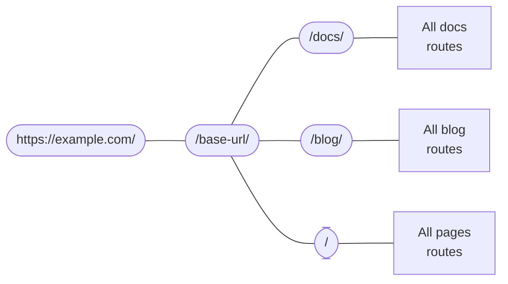

# 라우팅

```mdx-code-block
import Link from '@docusaurus/Link';
import {useLatestVersion, useActiveDocContext} from '@docusaurus/plugin-content-docs/client';
import {useLocation} from '@docusaurus/router';
import BrowserWindow from '@site/src/components/BrowserWindow';
```

도큐사우루스의 라우팅 시스템은 단일 페이지 애플리케이션 규칙을 따릅니다. 하나의 경로, 하나의 컴포넌트. 세 가지 콘텐츠 플러그인(문서, 블로그, 페이지) 내에서 라우팅에 대해 설명한 다음 기본 라우팅 시스템에 대해 설명합니다.

## Routing in content plugins {#routing-in-content-plugins}

Every content plugin provides a `routeBasePath` option. 해당 옵션에서는 플러그인이 경로를 추가하는 위치를 정의합니다. By default, the docs plugin puts its routes under `/docs`; the blog plugin, `/blog`; and the pages plugin, `/`. 다음과 같이 경로 구조에 대해 생각할 수 있습니다.



모든 경로는 일치하는 항목이 발견될 때까지 중첩된 경로 설정을 탐색합니다. For example, when given a route `/docs/configuration`, Docusaurus first enters the `/docs` branch, and then searches among the subroutes created by the docs plugin.

Changing `routeBasePath` can effectively alter your site's route structure. For example, in [Docs-only mode](../guides/docs/docs-introduction.mdx#docs-only-mode), we mentioned that configuring `routeBasePath: '/'` for docs means that all routes that the docs plugin create would not have the `/docs` prefix, yet it doesn't prevent you from having more subroutes like `/blog` created by other plugins.

다음은 세 가지 플러그인이 자체 "서브라우트 박스"를 구성하는 방법을 살펴보겠습니다.

### Pages routing {#pages-routing}

페이지 라우팅은 간단합니다. 별도의 사용자 정의 없이 파일 경로가 URL에 직접 연결됩니다. See the [pages docs](../guides/creating-pages.mdx#routing) for more information.

The component used for Markdown pages is `@theme/MDXPage`. 리액트 페이지는 라우트 컴포넌트처럼 직접 사용됩니다.

### Blog routing {#blog-routing}

블로그는 다음과 같은 경로를 만듭니다.

- **Posts list pages**: `/`, `/page/2`, `/page/3`...
  - The component is `@theme/BlogListPage`.
- **Post pages**: `/2021/11/21/algolia-docsearch-migration`, `/2021/05/12/announcing-docusaurus-two-beta`...
  - 각 마크다운 게시물에서 만듭니다.
  - The routes are fully customizable through the `slug` front matter.
  - The component is `@theme/BlogPostPage`.
- **Tags list page**: `/tags`
  - The route is customizable through the `tagsBasePath` option.
  - The component is `@theme/BlogTagsListPage`.
- **Tag pages**: `/tags/adoption`, `/tags/beta`...
  - 각 게시물 프런트매터에 정의된 태그를 통해 만듭니다.
  - The routes always have base defined in `tagsBasePath`, but the subroutes are customizable through the tag's `permalink` field.
  - The component is `@theme/BlogTagsPostsPage`.
- **Archive page**: `/archive`
  - The route is customizable through the `archiveBasePath` option.
  - The component is `@theme/BlogArchivePage`.

### Docs routing {#docs-routing}

The docs is the only plugin that creates **nested routes**. At the top, it registers [**version paths**](../guides/docs/versioning.mdx): `/`, `/next`, `/2.0.0-beta.13`... which provide the version context, including the layout and sidebar. 이렇게 하면 개별 문서 간 전환 시 사이드바 상태가 유지되고 같은 문서에 머무르면서 메뉴바에서 버전 드롭다운 목록을 선택해 다른 버전으로 전환할 수 있습니다. The component used is `@theme/DocPage`.

```mdx-code-block
export const URLPath = () => <code>{useLocation().pathname}</code>;

export const FilePath = () => {
  const currentVersion = useActiveDocContext('default').activeVersion.name;
  return <code>{currentVersion === 'current' ? './docs/' : `./versioned_docs/version-${currentVersion}/`}advanced/routing.md</code>;
}
```

The individual docs are rendered in the remaining space after the navbar, footer, sidebar, etc. have all been provided by the `DocPage` component. 예를 들어 이 페이지, <URLPath />, 는 <FilePath />에 있는 파일에서 만들어졌습니다. The component used is `@theme/DocItem`.

The doc's `slug` front matter customizes the last part of the route, but the base route is always defined by the plugin's `routeBasePath` and the version's `path`.

### File paths and URL paths {#file-paths-and-url-paths}

문서 전체에서 우리는 항상 파일 경로 또는 URL 경로에 대해 모호하지 않게 표현하려고 노력하고 있습니다. Content plugins usually map file paths directly to URL paths, for example, `./docs/advanced/routing.md` will become `/docs/advanced/routing`. However, with `slug`, you can make URLs totally decoupled from the file structure.

When writing links in Markdown, you could either mean a _file path_, or a _URL path_, which Docusaurus would use several heuristics to determine.

- If the path has a `@site` prefix, it is _always_ an asset file path.
- If the path has an `http(s)://` prefix, it is _always_ a URL path.
- 경로에 확장자가 없다면 URL 경로입니다. For example, a link `[page](../plugins)` on a page with URL `/docs/advanced/routing` will link to `/docs/plugins`. 도큐사우루스는 사이트 구축 시(전체 경로 구조를 알고 있을 때) 끊어진 링크만 감지하고 파일의 존재 여부에 대해서는 가정하지 않습니다. It is exactly equivalent to writing `<a href="../plugins">page</a>` in a JSX file.
- If the path has an `.md(x)` extension, Docusaurus would try to resolve that Markdown file to a URL, and replace the file path with a URL path.
- If the path has any other extension, Docusaurus would treat it as [an asset](../guides/markdown-features/markdown-features-assets.mdx) and bundle it.

다음 디렉터리 구조는 파일 → URL mapping 을 시각화하는데 도움을 줍니다. 어떤 페이지도 사용자 정의 슬러그가 없다고 가정합니다.

<details>

<summary>A sample site structure</summary>

```bash
.
├── blog                            # blog plugin has routeBasePath: '/blog'
│   ├── 2019-05-28-first-blog-post.md       # -> /blog/2019/05/28/first-blog-post
│   ├── 2019-05-29-long-blog-post.md        # -> /blog/2019/05/29/long-blog-post
│   ├── 2021-08-01-mdx-blog-post.mdx        # -> /blog/2021/08/01/mdx-blog-post
│   └── 2021-08-26-welcome
│       ├── docusaurus-plushie-banner.jpeg
│       └── index.md                        # -> /blog/2021/08/26/welcome
├── docs                            # docs plugin has routeBasePath: '/docs'; current version has base path '/'
│   ├── intro.md                            # -> /docs/intro
│   ├── tutorial-basics
│   │   ├── _category_.json
│   │   ├── congratulations.md              # -> /docs/tutorial-basics/congratulations
│   │   └── markdown-features.mdx           # -> /docs/tutorial-basics/markdown-features
│   └── tutorial-extras
│       ├── _category_.json
│       ├── manage-docs-versions.md         # -> /docs/tutorial-extras/manage-docs-versions
│       └── translate-your-site.md          # -> /docs/tutorial-extras/translate-your-site
├── src
│   └── pages                       # pages plugin has routeBasePath: '/'
│       ├── index.module.css
│       ├── index.tsx                       # -> /
│       └── markdown-page.md                # -> /markdown-page
└── versioned_docs
    └── version-1.0.0               # version has base path '/1.0.0'
        ├── intro.md                        # -> /docs/1.0.0/intro
        ├── tutorial-basics
        │   ├── _category_.json
        │   ├── congratulations.md          # -> /docs/1.0.0/tutorial-basics/congratulations
        │   └── markdown-features.mdx       # -> /docs/1.0.0/tutorial-basics/markdown-features
        └── tutorial-extras
            ├── _category_.json
            ├── manage-docs-versions.md     # -> /docs/1.0.0/tutorial-extras/manage-docs-versions
            └── translate-your-site.md      # -> /docs/1.0.0/tutorial-extras/translate-your-site
```

</details>

콘텐츠 플러그인에 대한 많은 정보. 한 발 떨어져서 도큐사우루스 앱에서 일반적으로 라우팅이 동작하는 방식에 대해 이야기해보겠습니다.

## Routes become HTML files {#routes-become-html-files}

도큐사우루스는 서버측 측 렌더링 프레임워크이기 때문에 생성된 모든 경로는 서버 측에서 정적 HTML 파일로 렌더링됩니다. If you are familiar with the behavior of HTTP servers like [Apache2](https://httpd.apache.org/docs/trunk/getting-started.html), you will understand how this is done: when the browser sends a request to the route `/docs/advanced/routing`, the server interprets that as request for the HTML file `/docs/advanced/routing/index.html`, and returns that.

The `/docs/advanced/routing` route can correspond to either `/docs/advanced/routing/index.html` or `/docs/advanced/routing.html`. 일부 호스팅 제공업체에서는 트레일링 슬래시를 사용해 이를 구분하고 다른 업체에서는 이런 기능을 허용하거나 그렇지 않을 수 있습니다. Read more in the [trailing slash guide](https://github.com/slorber/trailing-slash-guide).

예를 들어 위의 디렉토리에서 빌드 출력은 다음과 같습니다(다른 애셋과 JS 번들은 제외).

<details>

<summary>Output of the above workspace</summary>

```bash
build
├── 404.html                      # /404/
├── blog
│   ├── archive
│   │   └── index.html            # /blog/archive/
│   ├── first-blog-post
│   │   └── index.html            # /blog/first-blog-post/
│   ├── index.html                # /blog/
│   ├── long-blog-post
│   │   └── index.html            # /blog/long-blog-post/
│   ├── mdx-blog-post
│   │   └── index.html            # /blog/mdx-blog-post/
│   ├── tags
│   │   ├── docusaurus
│   │   │   └── index.html        # /blog/tags/docusaurus/
│   │   ├── hola
│   │   │   └── index.html        # /blog/tags/hola/
│   │   └── index.html            # /blog/tags/
│   └── welcome
│       └── index.html            # /blog/welcome/
├── docs
│   ├── 1.0.0
│   │   ├── intro
│   │   │   └── index.html        # /docs/1.0.0/intro/
│   │   ├── tutorial-basics
│   │   │   ├── congratulations
│   │   │   │   └── index.html    # /docs/1.0.0/tutorial-basics/congratulations/
│   │   │   └── markdown-features
│   │   │       └── index.html    # /docs/1.0.0/tutorial-basics/markdown-features/
│   │   └── tutorial-extras
│   │       ├── manage-docs-versions
│   │       │   └── index.html    # /docs/1.0.0/tutorial-extras/manage-docs-versions/
│   │       └── translate-your-site
│   │           └── index.html    # /docs/1.0.0/tutorial-extras/translate-your-site/
│   ├── intro
│   │   └── index.html            # /docs/1.0.0/intro/
│   ├── tutorial-basics
│   │   ├── congratulations
│   │   │   └── index.html        # /docs/tutorial-basics/congratulations/
│   │   └── markdown-features
│   │       └── index.html        # /docs/tutorial-basics/markdown-features/
│   └── tutorial-extras
│       ├── manage-docs-versions
│       │   └── index.html        # /docs/tutorial-extras/manage-docs-versions/
│       └── translate-your-site
│           └── index.html        # /docs/tutorial-extras/translate-your-site/
├── index.html                    # /
└── markdown-page
    └── index.html                # /markdown-page/
```

</details>

If `trailingSlash` is set to `false`, the build would emit `intro.html` instead of `intro/index.html`.

All HTML files will reference its JS assets using absolute URLs, so in order for the correct assets to be located, you have to configure the `baseUrl` field. Note that `baseUrl` doesn't affect the emitted bundle's file structure: the base URL is one level above the Docusaurus routing system. You can see the aggregate of `url` and `baseUrl` as the actual location of your Docusaurus site.

For example, the emitted HTML would contain links like `<link rel="preload" href="/assets/js/runtime~main.7ed5108a.js" as="script">`. Because absolute URLs are resolved from the host, if the bundle placed under the path `https://example.com/base/`, the link will point to `https://example.com/assets/js/runtime~main.7ed5108a.js`, which is, well, non-existent. By specifying `/base/` as base URL, the link will correctly point to `/base/assets/js/runtime~main.7ed5108a.js`.

현지화를 적용한 사이트는 base URL의 일부로 로케일 표시가 포함될 수 있습니다. For example, `https://docusaurus.io/zh-CN/docs/advanced/routing/` has base URL `/zh-CN/`.

## Generating and accessing routes {#generating-and-accessing-routes}

The `addRoute` lifecycle action is used to generate routes. 경로 트리에 경로 설정을 등록하고 컴포넌트에서 필요한 경로, 컴포넌트, 속성을 제공합니다. The props and the component are both provided as paths for the bundler to `require`, because as explained in the [architecture overview](architecture.mdx), server and client only communicate through temp files.

All routes are aggregated in `.docusaurus/routes.js`, which you can view with the debug plugin's [routes panel](/__docusaurus/debug/routes).

On the client side, we offer `@docusaurus/router` to access the page's route. `@docusaurus/router` is a re-export of the [`react-router-dom`](https://www.npmjs.com/package/react-router-dom/v/5.3.0) package. For example, you can use `useLocation` to get the current page's [location](https://developer.mozilla.org/en-US/docs/Web/API/Location), and `useHistory` to access the [history object](https://developer.mozilla.org/en-US/docs/Web/API/History). (기능은 비슷하지만 브라우저 API와 같지는 않습니다. 특정 API에 대해서는 리액트 라우터 문서를 참고하세요).

This API is **SSR safe**, as opposed to the browser-only `window.location`.

```jsx title="myComponent.js"
import React from 'react';
import {useLocation} from '@docusaurus/router';

export function PageRoute() {
  // React router provides the current component's route, even in SSR
  const location = useLocation();
  return (
    <span>
      We are currently on <code>{location.pathname}</code>
    </span>
  );
}
```

```mdx-code-block
export function PageRoute() {
  const location = useLocation();
  return (
    <span>
      We are currently on <code>{location.pathname}</code>
    </span>
  );
}

<BrowserWindow>

<PageRoute />

</BrowserWindow>
```

## Escaping from SPA redirects {#escaping-from-spa-redirects}

Docusaurus builds a [single-page application](https://developer.mozilla.org/en-US/docs/Glossary/SPA), where route transitions are done through the `history.push()` method of React router. 이 작업은 클라이언트 측에서 수행됩니다. 하지만 이런 방식으로 경로 전환이 발생하기 위한 전제 조건은 대상 URL을 라우터가 알고 있어야 한다는 겁니다. 그렇지 않으면 라우터가 이 경로를 만났을 때 404 페이지를 표시합니다.

If you put some HTML pages under the `static` folder, they will be copied to the build output and therefore become accessible as part of your website, yet it's not part of the Docusaurus route system. We provide a `pathname://` protocol that allows you to redirect to another part of your domain in a non-SPA fashion, as if this route is an external link.

```md
- [pathname:///pure-html](pathname:///pure-html)
```

<BrowserWindow>

- [`pathname:///pure-html`](pathname:///pure-html)

</BrowserWindow>

The `pathname://` protocol is useful for referencing any content in the static folder. For example, Docusaurus would convert [all Markdown static assets to require() calls](../guides/markdown-features/markdown-features-assets.mdx#static-assets). You can use `pathname://` to keep it a regular link instead of being hashed by Webpack.

```md title="my-doc.md"


[An asset from the static](pathname:///files/asset.pdf)
```

Docusaurus will only strip the `pathname://` prefix without processing the content.
