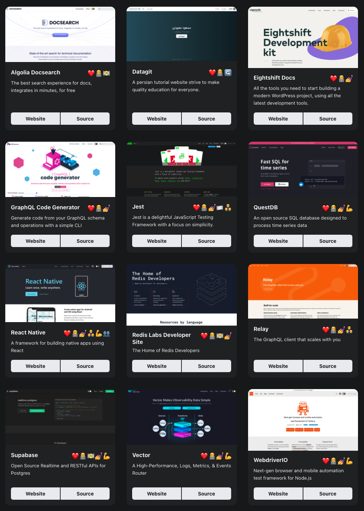

After a lengthy alpha stage in order to ensure feature parity and quality, we are excited to officially release the first **[Docusaurus 2 beta](https://github.com/facebook/docusaurus/releases/tag/v2.0.0-beta.0)**.

With the announcement of this beta, the team is even more confident that Docusaurus 2 is **ready for mainstream adoption**!

<!--truncate-->

## Adopção do Docusaurus

**Don't fear the beta tag!**

O Docusaurus 2 é amplamente adotado e está crescendo rapidamente:

To get a fuller understanding of the quality of current Docusaurus 2 sites, our new [showcase](https://docusaurus.io/showcase) page allows you to filter Docusaurus sites by features, so you may get inspired by real-world production sites with a similar use-case as yours!

Don't miss our [favorite](https://docusaurus.io/showcase?tags=favorite) sites; they all stand out with something unique:

## Por que o Docusaurus v2 estava em alfa por tanto tempo?

It's hard to believe that the first alpha release [v2.0.0-alpha.0](https://github.com/facebook/docusaurus/releases/tag/v2.0.0-alpha.0) was 2 years ago 😳 , unusually long for a software alpha.

Como esta foi uma re-arquitetura substancial da base de código, queríamos ter certeza de que tínhamos confiança na estabilidade e nos recursos do Docusaurus 2 antes de passar para o estágio beta, já que o beta sugere um alto nível de qualidade. We are happy to say that Docusaurus 2 has reached **feature parity** with Docusaurus 1 with **[i18n](https://docusaurus.io/blog/2021/03/09/releasing-docusaurus-i18n)**, and it has been **successfully adopted** by many Docusaurus sites (see [i18n showcase](https://docusaurus.io/showcase?tags=i18n)).

Agora estamos confiantes de que os principais recursos do Docusaurus 2 são estáveis o suficiente para estar no beta.

## Quais são os objetivos da beta?

Agora que o Docusaurus 2 está estável e os principais recursos completos, o objetivo do beta é inspirar confiança nos novos usuários sobre a prontidão de produção do Docusaurus 2, migrar mais usuários do Docusaurus 1 para a versão 2 e oficialmente descontinuar o Docusaurus 1. Obviamente, continuaremos a resolver quaisquer problemas e bugs que possam ser descobertos.

In addition, we will use the beta phase to **improve our theming system**.

Queremos fazer:

- **easier to implement a custom theme**, including for ourselves. We want to provide [multiple official themes](https://github.com/facebook/docusaurus/issues/3522) (including [Tailwind CSS](https://github.com/facebook/docusaurus/issues/2961)) for a long time.

- **safer to extend an existing theme**: it can be painful to upgrade a highly customized Docusaurus site, as customizations can conflict with internal changes. Precisamos tornar a superfície da API pública do tema mais explícita e deixar claro o que é seguro personalizar.

We will build a better **theming infrastructure** and refactor the classic theme to use it.

Se você personalizar seu site, poderá achar essas melhorias planejadas muito valiosas.

## Quais as novidades?

Caso você tenha perdido, recentemente enviamos duas melhorias importantes:

- [Auto-generated sidebars](https://docusaurus.io/docs/sidebar#sidebar-item-autogenerated): no need to maintain a `sidebars.js` file anymore!
- [Webpack 5 / PostCSS 8](https://github.com/facebook/docusaurus/issues/4027): persistent caching significantly speeds up **rebuild time**!

## O que vem a seguir?

Enviando a versão 2.0 oficial!

To get there, we will continue to **fix bugs** and implement the **most wanted features**, including:

- [Sidebar category index pages](https://github.com/facebook/docusaurus/issues/2643)
- [Better mobile navigation UX](https://github.com/facebook/docusaurus/issues/2220)
- [Better admonition design](https://github.com/facebookincubator/infima/issues/55)
- [CSS-in-JS support](https://github.com/facebook/docusaurus/issues/3236)
- [Improve build time performance](https://github.com/facebook/docusaurus/issues/4765)
- [Extend Docusaurus plugins, CMS integration](https://github.com/facebook/docusaurus/issues/4138)
- [Fix trailing slashes and relative link issues](https://github.com/facebook/docusaurus/issues/3372)
- [Better compatibility with CommonMark](https://github.com/facebook/docusaurus/issues/3018)
- [Upgrade to MDX 2.0](https://github.com/facebook/docusaurus/issues/4029)

## Conclusão

Este é um momento emocionante para o Docusaurus.

We are inspired by the [positive feedback](https://x.com/sebastienlorber/timelines/1392048416872706049) about Docusaurus, and discover new sites online every single day.

Estamos muito animados com este lançamento beta. Buscamos qualidade e estabilidade enquanto continuamos a tentar aumentar a adoção do Docusaurus. Para aqueles que estão em dúvida quanto à migração de um site existente do Docusaurus para o Docusaurus 2, é um ótimo momento para atualizar. Queremos que você execute a infraestrutura mais recente quando descontinuarmos o Docusaurus 1 no final deste período beta. Nos diga como podemos ajudar.

Obrigado a todos pela leitura e a toda a comunidade que apoia o Docusaurus. 🤗
