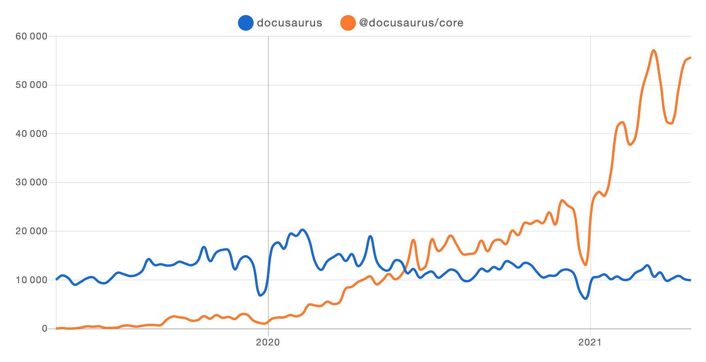

After a lengthy alpha stage in order to ensure feature parity and quality, we are excited to officially release the first **[Docusaurus 2 beta](https://github.com/facebook/docusaurus/releases/tag/v2.0.0-beta.0)**.

With the announcement of this beta, the team is even more confident that Docusaurus 2 is **ready for mainstream adoption**!

<!--truncate-->

## 使用 Docusaurus

**Don't fear the beta tag!**

Docusaurus 2 被广泛使用，用户数量飞增：

To get a fuller understanding of the quality of current Docusaurus 2 sites, our new [showcase](https://docusaurus.io/showcase) page allows you to filter Docusaurus sites by features, so you may get inspired by real-world production sites with a similar use-case as yours!

Don't miss our [favorite](https://docusaurus.io/showcase?tags=favorite) sites; they all stand out with something unique:

## 为何 Docusaurus v2 的 Alpha 开发阶段如此之长？

It's hard to believe that the first alpha release [v2.0.0-alpha.0](https://github.com/facebook/docusaurus/releases/tag/v2.0.0-alpha.0) was 2 years ago 😳 , unusually long for a software alpha.

但因为我们对软件代码进行了大量重构，我们希望 Beta 版能更加稳定，功能也更为完善。 We are happy to say that Docusaurus 2 has reached **feature parity** with Docusaurus 1 with **[i18n](https://docusaurus.io/blog/2021/03/09/releasing-docusaurus-i18n)**, and it has been **successfully adopted** by many Docusaurus sites (see [i18n showcase](https://docusaurus.io/showcase?tags=i18n)).

我们现在十分确定，Docusaurus 2 的核心功能已趋为完善，足以进入 Beta 阶段。

## Beta 阶段的目标有哪些？

目前，Docusaurus 2 已趋于稳定，主要功能也已完成。Beta 版本的目标是激励新用户在生产环境中使用 Docusaurus 2、迁移剩余的 Docusaurus 1 用户至新版，随后正式废弃 Docusaurus 1。 当然，我们也会不断解决任何新问题和漏洞。

In addition, we will use the beta phase to **improve our theming system**.

这是我们想要实现的：

- **easier to implement a custom theme**, including for ourselves. We want to provide [multiple official themes](https://github.com/facebook/docusaurus/issues/3522) (including [Tailwind CSS](https://github.com/facebook/docusaurus/issues/2961)) for a long time.

- **safer to extend an existing theme**: it can be painful to upgrade a highly customized Docusaurus site, as customizations can conflict with internal changes. 我们需要使主题功能的公开API表层更明确，并弄清楚什么是安全的自定义。

We will build a better **theming infrastructure** and refactor the classic theme to use it.

如果您自定义您的网站，您可能会发现这些计划的改进非常有价值。

## What's new?

以防万一你错过了它，我们最近发布了两个主要改进：

- [Auto-generated sidebars](https://docusaurus.io/docs/sidebar#sidebar-item-autogenerated): no need to maintain a `sidebars.js` file anymore!
- [Webpack 5 / PostCSS 8](https://github.com/facebook/docusaurus/issues/4027): persistent caching significantly speeds up **rebuild time**!

## 何去何从？

发布 2.0 正式版本！

To get there, we will continue to **fix bugs** and implement the **most wanted features**, including:

- [Sidebar category index pages](https://github.com/facebook/docusaurus/issues/2643)
- [Better mobile navigation UX](https://github.com/facebook/docusaurus/issues/2220)
- [Better admonition design](https://github.com/facebookincubator/infima/issues/55)
- [CSS-in-JS support](https://github.com/facebook/docusaurus/issues/3236)
- [Improve build time performance](https://github.com/facebook/docusaurus/issues/4765)
- [Extend Docusaurus plugins, CMS integration](https://github.com/facebook/docusaurus/issues/4138)
- [Fix trailing slashes and relative link issues](https://github.com/facebook/docusaurus/issues/3372)
- [Better compatibility with CommonMark](https://github.com/facebook/docusaurus/issues/3018)
- [Upgrade to MDX 2.0](https://github.com/facebook/docusaurus/issues/4029)

## 结语

对Docusaurus来说，这是一个令人激动的时刻。

We are inspired by the [positive feedback](https://x.com/sebastienlorber/timelines/1392048416872706049) about Docusaurus, and discover new sites online every single day.

我们对这个测试版感到非常兴奋。 我们努力提高质量和稳定性，同时继续努力提高Docusaurus的使用率。 对于那些一直在犹豫是否要将现有的Docusaurus站点迁移到Docusaurus 2的人来说，现在是升级的好时机。 当我们在这个测试版结束时弃用Docusaurus 1时，我们希望你能在最新的基础设施上运行。 请告诉我们有什么可以帮忙的。

感谢大家的阅读和整个支持Docusaurus的社区。 🤗
