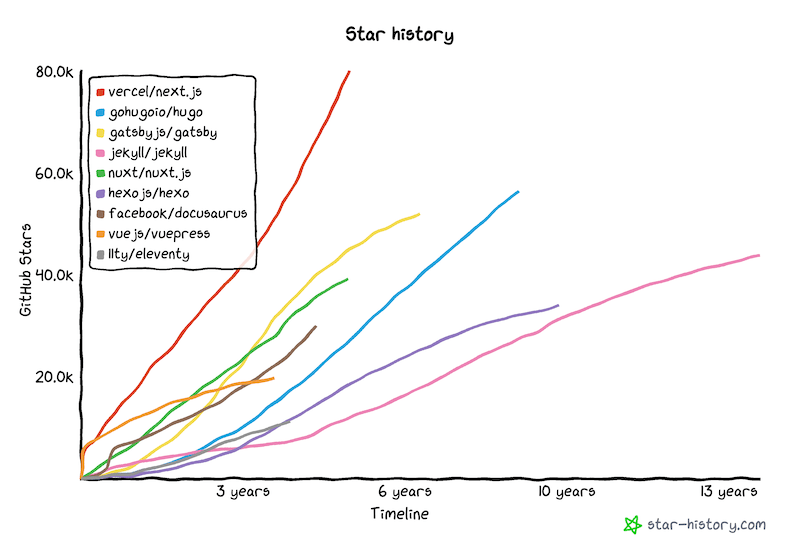

Docusaurus 在 2021 一年中进展神速！ We've seen a lot of traction and just crossed **30k stars on GitHub**!

We've **reached full feature parity** with v1 after [the release of internationalization](/blog/2021/03-09-releasing-docusaurus-i18n.mdx), [announced our **first beta**](/blog/2021/05-12-announcing-docusaurus-two-beta/index.mdx), and welcomed **significantly more users** this year.

The **official v2 release** is just around the corner! Follow the [roadmap issue](https://github.com/facebook/docusaurus/issues/6113) for any latest news.

<!--truncate-->

## 精彩内容

我们首先回顾一下今年的几个亮点时刻。 Remember the [todo-list](/blog/2021/05-12-announcing-docusaurus-two-beta/index.mdx#whats-next) from half a year ago? 是时候再把它拿出来了，看看我们走了多远！

- **Internationalization**: officially released four months after its initial landing in late 2020. Seen great success in [many projects](/showcase?tags=i18n)
- **Autogenerated sidebars**: no need to maintain a big `sidebars.js` anymore
- **Webpack 5**: significantly improved build performance
- **Trailing slash config**: seamless integration with any content hosting provider
- **Redesigned mobile navigation**: mobile users now enjoy all navigation features as on desktop
- **UI improvements**: more accessible quotes, better admonitions, back-to-top button...
- **Blog multi-authors**: credit all the amazing contributors that collaborated on one blog post!
- **More blog features**: archive page, structured data for SEO, full post content in feeds – empowering you to ship a fully-featured blog in no time
- **Asset collocation**: no need for a bloated static folder anymore: colocate your images with Markdown files
- **Sidebar category index pages**: category labels can now be associated with pages, enabling better doc organization

我们的代码库也在今年被逐渐打磨完善。 我们提高了测试覆盖率，把所有包都迁移到了 TypeScript，并把我们发布的包的大小减少了最多 60%！

## 趋势

### npm

Docusaurus v2 继续稳步增长。 V2 的安装量已经达到了 v1 的 8 倍。 就每周下载量而言，增长又翻了三番（+209.4%），从 1 月初的 28,066 次增加到了 12 月中旬的 86,846 次。

（啊，这经典的圣诞节骤降啊……）

We released 18 versions, going from `2.0.0-alpha.71` to `2.0.0-beta.14`. 那就是每 20 天发布一个版本！

### GitHub

- **Stars**: 20,460 → 29,679 (+45.1% y/y). 并且，就在这篇文章发布之前，我们刚刚达到了 3 万星！
- **Total contributors**: 512 → 773 (+51.0% y/y)
- **Dependents**: 5,039 → 14,579 (+189.3% y/y) for v2, and 6,311 → 7,581 (+20.1% y/y) for v1
- **Commits**: 1,187 commits in the past year, averaging 23 commits every week
- **Issues**: 619 issues opened, 505 of them eventually resolved
- A [**new core team member**](https://github.com/Josh-Cena) (yep, that's me 😝)

我们的星星趋势也很乐观。 Compared to similar projects, we are **growing at a faster rate**:

With an 8.4k increase in stars, we are ranked number 3 in this year's [JavaScript rising stars of static site generators](https://risingstars.js.org/2021/en#section-ssg), preceded only by Next.js and Astro.

## 亮眼用户

Our showcase has welcomed a few new ["favorite" sites](/showcase?tags=favorite) that showcase the true potential of Docusaurus 2's pluggable architecture.

- [**IOTA-wiki**](https://wiki.iota.org/)

- [**Dyte**](https://docs.dyte.io/docs/home/introduction/)

- [**Ionic**](https://ionicframework.com/docs)

- [**Courier**](https://www.courier.com/docs/)

Docusaurus 用户的创造力远超我们所想 🤩 我们期待着越来越多的使用者在利用 Docusaurus 的内容功能时，积极探索独创的主题设计！ If your site uses Docusaurus, we would love to [have it in our showcase](https://github.com/facebook/docusaurus/edit/main/website/src/data/users.tsx).

## 社区

As an active moderator on [Discord](https://discord.gg/docusaurus), I can clearly see the community thriving. 许多常见问题现在已经被纳入了文档，一些功能建议也已被实现。 项目和社区之间始终保持互惠互利的关系——我自己在成为维护者之前，就曾是社区贡献者。

We are constantly mentioned on X with inspirational feedback:

> **@docusaurus** is amazing! 难以想象它用起来这么简单。
>
> 没有额外的插件、工具或者编译步骤。 它安装完就能工作了。
>
> I love **@docusaurus**. 没有 Docusaurus，我完全没法如此高效而漂亮地搭建我网站上的 API、教程和博客。

And we keep every one of them in [our little box](https://x.com/sebastienlorber/timelines/1392048416872706049) 😄 If you enjoy Docusaurus yourself, keep tagging us with your comments!

As we approach the official release, we are interested in knowing more about what people are doing out there: [plugin authors](https://github.com/facebook/docusaurus/discussions/4025), [creators of customized sites](https://github.com/facebook/docusaurus/discussions/5468), and [all new users](https://github.com/facebook/docusaurus/discussions/4610) – please keep us posted about your achievements so we can steer our development to better serve your needs.

## 前瞻

在过去几个月里，我们一直不断提及 Docusaurus 的发布候选阶段——是的，马上就到了。 We have created a dedicated [milestone](https://github.com/facebook/docusaurus/milestone/15) to keep track of all issues to solve before we can confidently progress to the next stage. In short, we want to build a **more robust theming workflow**, empowering creative site creators to customize our default theme without fearing breaking changes as they upgrade. 这将包括：

- Guidelines on **component organization**. 我们希望主题组件具有适当的粒度，最好是当你想要自定义你的网站的某部分时，总是能找到一个正好负责那个部分的组件。
- Improvements to the **swizzle CLI**. 我们希望用户能快乐地使用它，让它引导你完成所有的 swizzle 场景。
- Refactoring our **theme APIs**. 我们希望所有可以被 swizzle 的组件都真的适合被 swizzle，所以我们会移走所有非 UI 的组件。
- **Docs**. 我们希望我们的文档对所有用户都同样可读——无论是初次接触编程还是有经验的 web 开发者。 我们会把它组织成一个渐进式的教程，使得各种技术水平的读者都可以从中受益。

Read more about plans for Docusaurus 2.0 in this [roadmap issue](https://github.com/facebook/docusaurus/issues/6113). 有了社区的帮助，2.0 版本才能变得更好，所以请在任何里程碑 issue 下面畅所欲言，分享你的意见与建议！

因为核心团队正忙于完成正式版本发布，所以我们会在 2.0 之后的小版本中发布其他有用的功能。 We have even made further plans for [architectural changes in 3.0](https://github.com/facebook/docusaurus/milestone/16)!

Docusaurus 2.0 正式版发布之后，我们有信心看到更多的用户加入，以及从 v1 迁移而来。

We'd like to express our gratitude to [all the contributors in 2021](https://github.com/facebook/docusaurus/graphs/contributors?from=2021-01-01&to=2022-01-01&type=c), including:

- The core team: [Alexey Pyltsyn](https://github.com/lex111), [Sébastien Lorber](https://github.com/slorber), [Joshua Chen](https://github.com/Josh-Cena), and [Yangshun Tay](https://github.com/yangshun) for moderating the community, publicizing Docusaurus, triaging issues, and implementing new features
- [Joel Marcey](https://github.com/JoelMarcey) for creating Docusaurus and supporting its development all along
- The Algolia team for helping Docusaurus users [migrate to the new DocSearch](/blog/2021/11-21-algolia-docsearch-migration/index.mdx) and answering search-related questions
- 所有活跃的社区成员，感谢他们所做的代码贡献、文档改进，以及在 Discord 上回答问题

别了，2021，让我们向光明的 2022 年问好吧！
