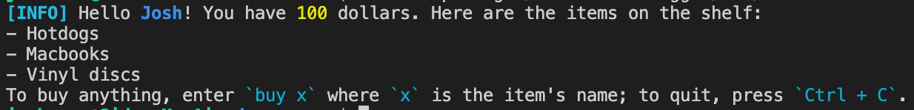

# 📦 logger

一个封装好的记录器，用于输出根据语义格式化的控制台信息。

我们鼓励 Docusaurus 生态系统中的包作者用这个包提供统一的日志格式。

## API

它导出单个对象作为默认导出：`logger`。 `logger` 具有如下属性：

- 一些有用的颜色。
  - `红色`
  - `黄色`
  - `绿色`
  - `粗体`
  - `调暗`
- 格式化器。 所有这些函数都有形如 `(msg: unknown) => string` 的签名。 请注意，我们不对它们的具体实现作保证。 你只应关心它们的语义。
  - `path`: 格式化文件路径。
  - `url`: 格式化 URL。
  - `name`: 格式化标识符。
  - `code`: 格式化小代码片段。
  - `subdue`: 让文本变得不显眼。
  - `num`: 格式化数字。
- `interpolate` 函数。 这是一个模板字符串标签。 具体语法请见后文。
- 输出函数。 所有的输出函数都既可以当作正常函数调用（类似于 `console.log`，但只接受一个参数），也可以作为模板字符串标签。
  - `info`: 打印信息。
  - `warn`: 打印一个应引起注意的警告。
  - `error`: 打印一个错误（不一定会停止程序），表明存在重大问题。
  - `success`: 打印成功消息。
- `report` 函数。 它需要 `ReportingSeverity` 值(`value `, `log`, `warn`, `throw`) 并根据严重程度报告消息。

:::warning 关于 `error` 格式化器的说明

请注意，即使程序没有中断，`error` 信息也很可能让人迷惑。 当用户检查日志，并找到一行 `[ERROR]` 时，即使构建成功了，他们也会假定出现了错误。 尽量少使用它。

Docusaurus 只会在抛出错误之前用 `logger.error` 打印信息，或者当用户把 `onBrokenLink` 等选项设置成 `"error"` 时。

此外， `warn` 和 `error` 会给**整个**信息添加颜色，以吸引人的注意。 如果你正在打印关于某个错误的大块帮助提示，最好用 `logger.info`。

:::

### 使用模板字符串标签

模板字符串标签会解析模板和其中嵌入的表达式。 `interpolate` 会返回一个新字符串，而其他日志函数则会把结果打印出来。 以下是一个典型用例：

```js
import logger from '@docusaurus/logger';

logger.info`Hello name=${name}! You have number=${money} dollars. Here are the ${
  items.length > 1 ? 'items' : 'item'
} on the shelf: ${items}
To buy anything, enter code=${'buy x'} where code=${'x'} is the item's name; to quit, press code=${'Ctrl + C'}.`;
```

嵌入的表达式可以在前面包含一个标志，形式是 `[a-z]+=`（若干小写字母，随后是一个等于符号）。 如果表达式前面没有任何标志，它会按原样打印。 否则，它会被用下列的格式化器之一格式化：

- `path=`: `path`
- `url=`: `url`
- `name=`: `name`
- `code=`: `code`
- `subdue=`: `subdue`
- `number=`: `num`

如果表达式是一个数组，它会被以 `` "\n- ${array.join('\n- ')}\n` `` 的形式被格式化（注意它会自动有一个开头的换行）。 列表的每个元素都会被独立格式化，开头的横杠不会被格式化。 所以上面的消息会被打印成：


