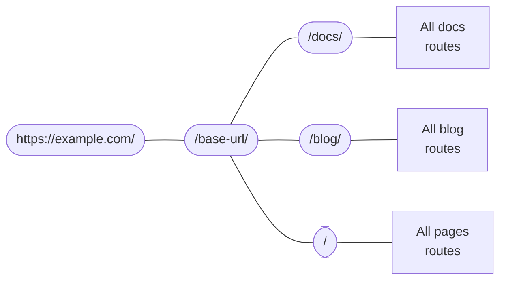

# 路由

```mdx-code-block
import Link from '@docusaurus/Link';
import {useLatestVersion, useActiveDocContext} from '@docusaurus/plugin-content-docs/client';
import {useLocation} from '@docusaurus/router';
import BrowserWindow from '@site/src/components/BrowserWindow';
```

Docusaurus 的路由系统遵循单页应用的传统：一个路由对应一个组件。 在本节中，我们会首先讨论三个内容插件（文档、博客和页面）所创建的路由，然后再讨论底层的路由系统。

## Routing in content plugins {#routing-in-content-plugins}

Every content plugin provides a `routeBasePath` option. 它定义了插件创造的路径的公共前缀。 By default, the docs plugin puts its routes under `/docs`; the blog plugin, `/blog`; and the pages plugin, `/`. 你可以想象这样的路由结构：



所有路径都会与这个嵌套路由配置匹配，直到找到一个恰当的匹配。 For example, when given a route `/docs/configuration`, Docusaurus first enters the `/docs` branch, and then searches among the subroutes created by the docs plugin.

Changing `routeBasePath` can effectively alter your site's route structure. For example, in [Docs-only mode](../guides/docs/docs-introduction.mdx#docs-only-mode), we mentioned that configuring `routeBasePath: '/'` for docs means that all routes that the docs plugin create would not have the `/docs` prefix, yet it doesn't prevent you from having more subroutes like `/blog` created by other plugins.

接下来，让我们看看这三个插件是如何构建它们自己的「子路由盒子」的。

### Pages routing {#pages-routing}

页面路由非常简单：文件路径直接映射到 URL，没有其他方法自定义。 See the [pages docs](../guides/creating-pages.mdx#routing) for more information.

The component used for Markdown pages is `@theme/MDXPage`. React 页面会被直接用作路由组件。

### Blog routing {#blog-routing}

博客会创建以下路径：

- **Posts list pages**: `/`, `/page/2`, `/page/3`...
  - The component is `@theme/BlogListPage`.
- **Post pages**: `/2021/11/21/algolia-docsearch-migration`, `/2021/05/12/announcing-docusaurus-two-beta`...
  - 通过每个 Markdown 文件生成。
  - The routes are fully customizable through the `slug` front matter.
  - The component is `@theme/BlogPostPage`.
- **Tags list page**: `/tags`
  - The route is customizable through the `tagsBasePath` option.
  - The component is `@theme/BlogTagsListPage`.
- **Tag pages**: `/tags/adoption`, `/tags/beta`...
  - 通过每个帖子的 <code>tags</code> 前言定义的标签生成。
  - The routes always have base defined in `tagsBasePath`, but the subroutes are customizable through the tag's `permalink` field.
  - The component is `@theme/BlogTagsPostsPage`.
- **Archive page**: `/archive`
  - The route is customizable through the `archiveBasePath` option.
  - The component is `@theme/BlogArchivePage`.

### Docs routing {#docs-routing}

The docs is the only plugin that creates **nested routes**. At the top, it registers [**version paths**](../guides/docs/versioning.mdx): `/`, `/next`, `/2.0.0-beta.13`... which provide the version context, including the layout and sidebar. 这确保了在切换文档时，侧边栏的状态能够保持，并且你可以通过导航栏下拉菜单切换版本，同时保持在同一篇文档上。 The component used is `@theme/DocPage`.

```mdx-code-block
export const URLPath = () => <code>{useLocation().pathname}</code>;

export const FilePath = () => {
  const currentVersion = useActiveDocContext('default').activeVersion.name;
  return <code>{currentVersion === 'current' ? './docs/' : `./versioned_docs/version-${currentVersion}/`}advanced/routing.md</code>;
}
```

The individual docs are rendered in the remaining space after the navbar, footer, sidebar, etc. have all been provided by the `DocPage` component. 比如这个页面，<URLPath />，就是通过位于 <FilePath /> 的文件生成的。 The component used is `@theme/DocItem`.

The doc's `slug` front matter customizes the last part of the route, but the base route is always defined by the plugin's `routeBasePath` and the version's `path`.

### File paths and URL paths {#file-paths-and-url-paths}

在所有文档中，我们一直在试图明确当前讨论的是文件路径还是 URL 路径。 Content plugins usually map file paths directly to URL paths, for example, `./docs/advanced/routing.md` will become `/docs/advanced/routing`. However, with `slug`, you can make URLs totally decoupled from the file structure.

When writing links in Markdown, you could either mean a _file path_, or a _URL path_, which Docusaurus would use several heuristics to determine.

- If the path has a `@site` prefix, it is _always_ an asset file path.
- If the path has an `http(s)://` prefix, it is _always_ a URL path.
- 如果路径没有扩展名，它会被当做 URL 路径。 For example, a link `[page](../plugins)` on a page with URL `/docs/advanced/routing` will link to `/docs/plugins`. Docusaurus 只会在构建网站时做无效链接检测（因为这时候它知道所有的路由架构），但它不会假设有对应文件的存在。 It is exactly equivalent to writing `<a href="../plugins">page</a>` in a JSX file.
- If the path has an `.md(x)` extension, Docusaurus would try to resolve that Markdown file to a URL, and replace the file path with a URL path.
- If the path has any other extension, Docusaurus would treat it as [an asset](../guides/markdown-features/markdown-features-assets.mdx) and bundle it.

下面这个文件目录可能能帮你可视化这种文件 → URL 的映射。 假设所有页面都没有自定义的 Slug。

<details>

<summary>A sample site structure</summary>

```bash
.
├── blog                            # blog plugin has routeBasePath: '/blog'
│   ├── 2019-05-28-first-blog-post.md       # -> /blog/2019/05/28/first-blog-post
│   ├── 2019-05-29-long-blog-post.md        # -> /blog/2019/05/29/long-blog-post
│   ├── 2021-08-01-mdx-blog-post.mdx        # -> /blog/2021/08/01/mdx-blog-post
│   └── 2021-08-26-welcome
│       ├── docusaurus-plushie-banner.jpeg
│       └── index.md                        # -> /blog/2021/08/26/welcome
├── docs                            # docs plugin has routeBasePath: '/docs'; current version has base path '/'
│   ├── intro.md                            # -> /docs/intro
│   ├── tutorial-basics
│   │   ├── _category_.json
│   │   ├── congratulations.md              # -> /docs/tutorial-basics/congratulations
│   │   └── markdown-features.mdx           # -> /docs/tutorial-basics/markdown-features
│   └── tutorial-extras
│       ├── _category_.json
│       ├── manage-docs-versions.md         # -> /docs/tutorial-extras/manage-docs-versions
│       └── translate-your-site.md          # -> /docs/tutorial-extras/translate-your-site
├── src
│   └── pages                       # pages plugin has routeBasePath: '/'
│       ├── index.module.css
│       ├── index.tsx                       # -> /
│       └── markdown-page.md                # -> /markdown-page
└── versioned_docs
    └── version-1.0.0               # version has base path '/1.0.0'
        ├── intro.md                        # -> /docs/1.0.0/intro
        ├── tutorial-basics
        │   ├── _category_.json
        │   ├── congratulations.md          # -> /docs/1.0.0/tutorial-basics/congratulations
        │   └── markdown-features.mdx       # -> /docs/1.0.0/tutorial-basics/markdown-features
        └── tutorial-extras
            ├── _category_.json
            ├── manage-docs-versions.md     # -> /docs/1.0.0/tutorial-extras/manage-docs-versions
            └── translate-your-site.md      # -> /docs/1.0.0/tutorial-extras/translate-your-site
```

</details>

关于内容插件，就讲这么多。 让我们后退一步，总地谈谈 Docusaurus 应用中路由是怎么工作的。

## Routes become HTML files {#routes-become-html-files}

因为 Docusaurus 是一个服务端渲染的框架，所以生成的所有路由都将被渲染为静态 HTML 文件。 If you are familiar with the behavior of HTTP servers like [Apache2](https://httpd.apache.org/docs/trunk/getting-started.html), you will understand how this is done: when the browser sends a request to the route `/docs/advanced/routing`, the server interprets that as request for the HTML file `/docs/advanced/routing/index.html`, and returns that.

The `/docs/advanced/routing` route can correspond to either `/docs/advanced/routing/index.html` or `/docs/advanced/routing.html`. 有些网站托管服务会通过 URL 是否在末尾有一个斜杠对它们加以区分，然后既可能接受另一种 URL，也可能不接受。 Read more in the [trailing slash guide](https://github.com/slorber/trailing-slash-guide).

比如，上面的文件目录的会有以下构建输出（略去其他资源和 JS 文件）：

<details>

<summary>Output of the above workspace</summary>

```bash
build
├── 404.html                      # /404/
├── blog
│   ├── archive
│   │   └── index.html            # /blog/archive/
│   ├── first-blog-post
│   │   └── index.html            # /blog/first-blog-post/
│   ├── index.html                # /blog/
│   ├── long-blog-post
│   │   └── index.html            # /blog/long-blog-post/
│   ├── mdx-blog-post
│   │   └── index.html            # /blog/mdx-blog-post/
│   ├── tags
│   │   ├── docusaurus
│   │   │   └── index.html        # /blog/tags/docusaurus/
│   │   ├── hola
│   │   │   └── index.html        # /blog/tags/hola/
│   │   └── index.html            # /blog/tags/
│   └── welcome
│       └── index.html            # /blog/welcome/
├── docs
│   ├── 1.0.0
│   │   ├── intro
│   │   │   └── index.html        # /docs/1.0.0/intro/
│   │   ├── tutorial-basics
│   │   │   ├── congratulations
│   │   │   │   └── index.html    # /docs/1.0.0/tutorial-basics/congratulations/
│   │   │   └── markdown-features
│   │   │       └── index.html    # /docs/1.0.0/tutorial-basics/markdown-features/
│   │   └── tutorial-extras
│   │       ├── manage-docs-versions
│   │       │   └── index.html    # /docs/1.0.0/tutorial-extras/manage-docs-versions/
│   │       └── translate-your-site
│   │           └── index.html    # /docs/1.0.0/tutorial-extras/translate-your-site/
│   ├── intro
│   │   └── index.html            # /docs/1.0.0/intro/
│   ├── tutorial-basics
│   │   ├── congratulations
│   │   │   └── index.html        # /docs/tutorial-basics/congratulations/
│   │   └── markdown-features
│   │       └── index.html        # /docs/tutorial-basics/markdown-features/
│   └── tutorial-extras
│       ├── manage-docs-versions
│       │   └── index.html        # /docs/tutorial-extras/manage-docs-versions/
│       └── translate-your-site
│           └── index.html        # /docs/tutorial-extras/translate-your-site/
├── index.html                    # /
└── markdown-page
    └── index.html                # /markdown-page/
```

</details>

If `trailingSlash` is set to `false`, the build would emit `intro.html` instead of `intro/index.html`.

All HTML files will reference its JS assets using absolute URLs, so in order for the correct assets to be located, you have to configure the `baseUrl` field. Note that `baseUrl` doesn't affect the emitted bundle's file structure: the base URL is one level above the Docusaurus routing system. You can see the aggregate of `url` and `baseUrl` as the actual location of your Docusaurus site.

For example, the emitted HTML would contain links like `<link rel="preload" href="/assets/js/runtime~main.7ed5108a.js" as="script">`. Because absolute URLs are resolved from the host, if the bundle placed under the path `https://example.com/base/`, the link will point to `https://example.com/assets/js/runtime~main.7ed5108a.js`, which is, well, non-existent. By specifying `/base/` as base URL, the link will correctly point to `/base/assets/js/runtime~main.7ed5108a.js`.

本地化的网站会将语言名作为 base URL 的一部分。 For example, `https://docusaurus.io/zh-CN/docs/advanced/routing/` has base URL `/zh-CN/`.

## Generating and accessing routes {#generating-and-accessing-routes}

The `addRoute` lifecycle action is used to generate routes. 它会在路由树上注册一条路由，其中包含一个路径、一个组件，以及组件所需要的 props。 The props and the component are both provided as paths for the bundler to `require`, because as explained in the [architecture overview](architecture.mdx), server and client only communicate through temp files.

All routes are aggregated in `.docusaurus/routes.js`, which you can view with the debug plugin's [routes panel](/__docusaurus/debug/routes).

On the client side, we offer `@docusaurus/router` to access the page's route. `@docusaurus/router` is a re-export of the [`react-router-dom`](https://www.npmjs.com/package/react-router-dom/v/5.3.0) package. For example, you can use `useLocation` to get the current page's [location](https://developer.mozilla.org/en-US/docs/Web/API/Location), and `useHistory` to access the [history object](https://developer.mozilla.org/en-US/docs/Web/API/History). （它们与浏览器的 API 不大一样，虽然功能类似。 要了解特定的 API，请参考 React Router 的文档。）

This API is **SSR safe**, as opposed to the browser-only `window.location`.

```jsx title="myComponent.js"
import React from 'react';
import {useLocation} from '@docusaurus/router';

export function PageRoute() {
  // React router provides the current component's route, even in SSR
  const location = useLocation();
  return (
    <span>
      We are currently on <code>{location.pathname}</code>
    </span>
  );
}
```

```mdx-code-block
export function PageRoute() {
  const location = useLocation();
  return (
    <span>
      We are currently on <code>{location.pathname}</code>
    </span>
  );
}

<BrowserWindow>

<PageRoute />

</BrowserWindow>
```

## Escaping from SPA redirects {#escaping-from-spa-redirects}

Docusaurus builds a [single-page application](https://developer.mozilla.org/en-US/docs/Glossary/SPA), where route transitions are done through the `history.push()` method of React router. 这个操作在客户端进行。 然而，这种路由转换能发生的前提条件是我们的路由器知道目标 URL 的存在。 否则，路由器会捕捉这个路径，然后显示 404。

If you put some HTML pages under the `static` folder, they will be copied to the build output and therefore become accessible as part of your website, yet it's not part of the Docusaurus route system. We provide a `pathname://` protocol that allows you to redirect to another part of your domain in a non-SPA fashion, as if this route is an external link.

```md
- [pathname:///pure-html](pathname:///pure-html)
```

<BrowserWindow>

- [`pathname:///pure-html`](pathname:///pure-html)

</BrowserWindow>

The `pathname://` protocol is useful for referencing any content in the static folder. For example, Docusaurus would convert [all Markdown static assets to require() calls](../guides/markdown-features/markdown-features-assets.mdx#static-assets). You can use `pathname://` to keep it a regular link instead of being hashed by Webpack.

```md title="my-doc.md"


[static 文件夹里的其他资源](pathname:///files/asset.pdf)
```

Docusaurus will only strip the `pathname://` prefix without processing the content.
